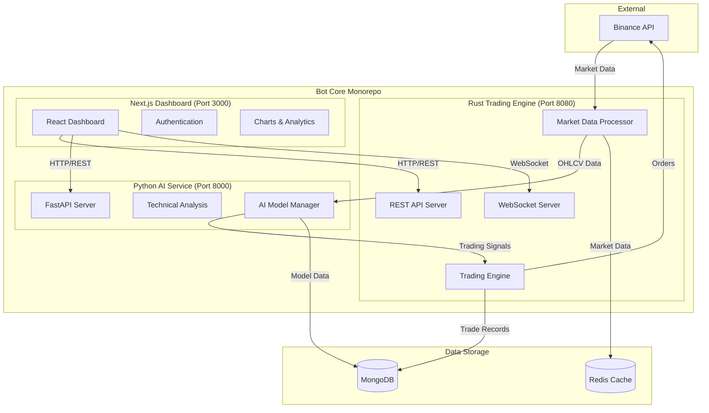

# 🔗 Bot Core - Integration Architecture

This document defines the complete integration structure between the three core services: **Rust Binance Trading Engine**, **Python AI Chart Analyzer**, and **Next.js UI Dashboard**.

## 🏗️ **System Architecture Overview**



## 📊 **Data Flow Architecture**

### **1. Market Data Collection → AI Analysis → Trading Execution**

```
┌─────────────┐    ┌─────────────┐    ┌─────────────┐    ┌─────────────┐
│   Binance   │───▶│    Rust     │───▶│   Python    │───▶│    Rust     │
│     API     │    │ Market Data │    │ AI Analyzer │    │ Trading Bot │
└─────────────┘    └─────────────┘    └─────────────┘    └─────────────┘
      │                    │                    │                    │
      ▼                    ▼                    ▼                    ▼
  Real-time           OHLCV Candles      Trading Signals      Order Execution
  Price Updates       Technical Data     (Long/Short/Hold)    Position Management
```

### **2. Dashboard Monitoring & Configuration**

```
┌─────────────┐    ┌─────────────┐    ┌─────────────┐
│   Next.js   │◄──▶│    Rust     │◄──▶│   Python    │
│  Dashboard  │    │ Trading API │    │  AI Service │
└─────────────┘    └─────────────┘    └─────────────┘
      │                    │                    │
      ▼                    ▼                    ▼
  User Interface      Bot Configuration     Model Training
  Real-time Updates   Trade History         AI Insights
  Settings Control    Position Status       Signal Analysis
```

## 🔌 **Service Communication Contracts**

### **Rust Trading Engine ↔ Python AI Service**

#### **Request: Market Analysis**

```rust
// Rust sends to Python AI Service
POST http://python-ai-service:8000/analyze

{
    "symbol": "BTCUSDT",
    "timeframe": "1h",
    "candles": [
        {
            "timestamp": 1640995200000,
            "open": 47000.0,
            "high": 47500.0,
            "low": 46800.0,
            "close": 47200.0,
            "volume": 1234.56
        }
        // ... more candles (minimum 100)
    ]
}
```

#### **Response: Trading Signal**

```json
{
  "signal": "long", // "long" | "short" | "neutral"
  "confidence": 75.8, // 0-100 percentage
  "probability": 0.758, // 0-1 raw probability
  "timestamp": "2024-01-15T10:30:00Z",
  "model_type": "lstm",
  "symbol": "BTCUSDT",
  "timeframe": "1h"
}
```

### **Next.js Dashboard ↔ Rust Trading Engine**

#### **Bot Status & Control**

```typescript
// Get current bot status
GET http://rust-core-engine:8080/api/status
Response: {
    "status": "running" | "stopped" | "error",
    "uptime": 3600,
    "active_positions": 3,
    "total_trades": 47,
    "total_pnl": 1250.50
}

// Get current positions
GET http://rust-core-engine:8080/api/positions
Response: [{
    "symbol": "BTCUSDT",
    "side": "BUY",
    "size": 0.01,
    "entry_price": 47000.0,
    "current_price": 47200.0,
    "unrealized_pnl": 2.0,
    "timestamp": "2024-01-15T10:30:00Z"
}]

// Force close position
POST http://rust-core-engine:8080/api/positions/BTCUSDT/close
Response: {
    "message": "Position closed",
    "exit_price": 47150.0,
    "pnl": 1.5
}
```

### **Next.js Dashboard ↔ Python AI Service**

#### **AI Model Management**

```typescript
// Get model status
GET http://python-ai-service:8000/model/info
Response: {
    "model_type": "lstm",
    "model_loaded": true,
    "training_samples": 5000,
    "validation_samples": 1000,
    "feature_count": 15,
    "training_accuracy": 0.87
}

// Train new model
POST http://python-ai-service:8000/train
{
    "symbol": "BTCUSDT",
    "model_type": "lstm",
    "retrain": false,
    "candles": [/* historical data */]
}
```

## ⚙️ **Configuration & Environment Variables**

### **Rust Trading Engine Configuration**

Create `rust-core-engine/config.toml`:

```toml
[market_data]
# Python AI Service Configuration
python_ai_service_url = "http://python-ai-service:8000"
update_interval_ms = 60000  # Request analysis every minute
confidence_threshold = 0.65  # Minimum confidence for trading

[api]
# Dashboard API Configuration
host = "0.0.0.0"
port = 8080
cors_origins = ["http://nextjs-ui-dashboard:3000", "http://localhost:3000"]

[trading]
# AI Trading Integration
enabled = true
use_ai_signals = true
signal_timeout_seconds = 30
```

### **Python AI Service Configuration**

Update `python-ai-service/config.yaml`:

```yaml
server:
  host: "0.0.0.0"
  port: 8000
  cors_origins:
    - "http://nextjs-ui-dashboard:3000"
    - "http://rust-core-engine:8080"
    - "http://localhost:3000"

trading:
  # Signal thresholds for Rust integration
  long_threshold: 0.6
  short_threshold: 0.4
  confidence_threshold: 0.55

api_integration:
  # Response format for Rust consumption
  signal_format: "simple" # "simple" | "detailed"
  include_indicators: true
  cache_predictions: true
  cache_ttl_seconds: 300
```

### **Next.js Dashboard Configuration**

Update `nextjs-ui-dashboard/.env`:

```env
# Backend Service URLs
VITE_RUST_API_URL=http://rust-core-engine:8080
VITE_PYTHON_AI_URL=http://python-ai-service:8000
VITE_WS_URL=ws://rust-core-engine:8080/ws

# API Configuration
VITE_API_TIMEOUT=10000
VITE_REFRESH_INTERVAL=5000
VITE_ENABLE_REALTIME=true
```

## 🔄 **Real-time Communication Patterns**

### **WebSocket Integration**

#### **Rust Trading Engine WebSocket Server**

```rust
// rust-core-engine/src/api/websocket.rs
pub enum WebSocketMessage {
    PositionUpdate {
        symbol: String,
        side: String,
        pnl: f64,
        timestamp: i64,
    },
    TradeExecuted {
        symbol: String,
        side: String,
        quantity: f64,
        price: f64,
        timestamp: i64,
    },
    AISignalReceived {
        symbol: String,
        signal: String,
        confidence: f64,
        timestamp: i64,
    },
    BotStatusUpdate {
        status: String,
        active_positions: usize,
        total_pnl: f64,
    },
}
```

#### **Next.js Dashboard WebSocket Client**

```typescript
// nextjs-ui-dashboard/src/hooks/useWebSocket.ts
export const useWebSocket = () => {
  const [socket, setSocket] = useState<WebSocket | null>(null);
  const [botStatus, setBotStatus] = useState<BotStatus>();
  const [positions, setPositions] = useState<Position[]>([]);
  const [aiSignals, setAISignals] = useState<AISignal[]>([]);

  useEffect(() => {
    const ws = new WebSocket(import.meta.env.VITE_WS_URL);

    ws.onmessage = (event) => {
      const message = JSON.parse(event.data);

      switch (message.type) {
        case "PositionUpdate":
          updatePosition(message.data);
          break;
        case "TradeExecuted":
          addTradeToHistory(message.data);
          break;
        case "AISignalReceived":
          setAISignals((prev) => [message.data, ...prev.slice(0, 9)]);
          break;
        case "BotStatusUpdate":
          setBotStatus(message.data);
          break;
      }
    };

    setSocket(ws);
    return () => ws.close();
  }, []);

  return { botStatus, positions, aiSignals };
};
```

## 🔒 **Authentication & Security**

### **API Key Management**

```yaml
# docker-compose.yml environment section
environment:
  # Shared authentication token
  - INTER_SERVICE_TOKEN=${INTER_SERVICE_TOKEN}

  # Service-specific keys
  - RUST_API_KEY=${RUST_API_KEY}
  - PYTHON_API_KEY=${PYTHON_API_KEY}
  - DASHBOARD_SESSION_SECRET=${DASHBOARD_SESSION_SECRET}
```

### **Request Authentication**

```rust
// Rust → Python AI Service
headers: {
    "Content-Type": "application/json",
    "Authorization": f"Bearer {INTER_SERVICE_TOKEN}",
    "User-Agent": "RustTradingBot/1.0",
}
```

```typescript
// Dashboard → Backend Services
const apiClient = axios.create({
  headers: {
    Authorization: `Bearer ${API_TOKEN}`,
    "Content-Type": "application/json",
  },
  timeout: 10000,
});
```

## 🔄 **Error Handling & Retry Logic**

### **Rust → Python AI Communication**

```rust
impl MarketDataAnalyzer {
    async fn analyze_with_retry(&self, data: &AnalysisRequest) -> Result<AnalysisResponse> {
        let mut retry_count = 0;
        const MAX_RETRIES: u32 = 3;
        const RETRY_DELAY: Duration = Duration::from_secs(5);

        loop {
            match self.analyze_single_timeframe(data).await {
                Ok(response) => return Ok(response),
                Err(e) if retry_count < MAX_RETRIES => {
                    warn!("AI service request failed (attempt {}/{}): {}",
                          retry_count + 1, MAX_RETRIES, e);
                    retry_count += 1;
                    tokio::time::sleep(RETRY_DELAY).await;
                }
                Err(e) => {
                    error!("AI service request failed after {} retries: {}", MAX_RETRIES, e);
                    return Err(e);
                }
            }
        }
    }
}
```

### **Dashboard → Backend Communication**

```typescript
// nextjs-ui-dashboard/src/services/apiClient.ts
export class ApiClient {
  private async requestWithRetry<T>(
    request: () => Promise<T>,
    maxRetries: number = 3
  ): Promise<T> {
    for (let attempt = 1; attempt <= maxRetries; attempt++) {
      try {
        return await request();
      } catch (error) {
        if (attempt === maxRetries) throw error;

        const delay = Math.pow(2, attempt) * 1000; // Exponential backoff
        await new Promise((resolve) => setTimeout(resolve, delay));
      }
    }
    throw new Error("Max retries exceeded");
  }
}
```

## 📋 **Health Checks & Monitoring**

### **Service Health Endpoints**

```bash
# Check all services
curl http://rust-core-engine:8080/health
curl http://python-ai-service:8000/health
curl http://nextjs-ui-dashboard:3000/health
```

### **Inter-service Health Monitoring**

```rust
// Rust checks Python AI Service health
pub async fn check_ai_service_health(&self) -> bool {
    match self.client.get(&format!("{}/health", self.ai_service_url)).send().await {
        Ok(response) => response.status().is_success(),
        Err(_) => false,
    }
}
```

## 🚀 **Deployment Integration**

### **Docker Compose Service Dependencies**

```yaml
# Updated docker-compose.yml
services:
  python-ai-service:
    # ... configuration
    healthcheck:
      test: ["CMD", "curl", "-f", "http://localhost:8000/health"]
      interval: 30s
      timeout: 10s
      retries: 3

  rust-core-engine:
    depends_on:
      python-ai-service:
        condition: service_healthy
    environment:
      - PYTHON_AI_SERVICE_URL=http://python-ai-service:8000
    # ... configuration

  nextjs-ui-dashboard:
    depends_on:
      rust-core-engine:
        condition: service_healthy
      python-ai-service:
        condition: service_healthy
    environment:
      - VITE_RUST_API_URL=http://rust-core-engine:8080
      - VITE_PYTHON_AI_URL=http://python-ai-service:8000
    # ... configuration
```

## 🔧 **Development & Testing**

### **Integration Test Commands**

```bash
# Test complete integration flow
make test-integration

# Test individual service communication
make test-rust-python     # Test Rust → Python AI
make test-dashboard-rust   # Test Dashboard → Rust API
make test-dashboard-python # Test Dashboard → Python AI

# Test WebSocket communication
make test-websocket
```

### **Mock Data for Testing**

```bash
# Generate test data for all services
make generate-test-data

# Test with mock Binance data
make test-with-mock-data
```

This integration architecture ensures:

- 🔄 **Clear Data Flow**: Unambiguous communication patterns
- 🛡️ **Robust Error Handling**: Retry logic and graceful failures
- 📊 **Real-time Updates**: WebSocket for live dashboard updates
- 🔒 **Secure Communication**: Authentication and request validation
- 📈 **Scalable Design**: Easy to extend and modify
- 🧪 **Testable Integration**: Comprehensive testing capabilities
