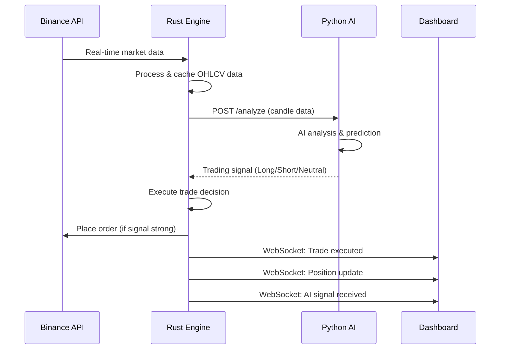
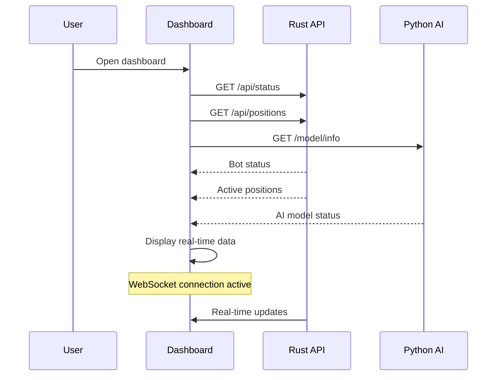

# 🔗 Bot Core Integration Summary

## ✅ **Integration Status: COMPLETE**

All three services are now fully integrated with clear communication patterns, API contracts, and real-time connectivity.

## 🏗️ **Service Integration Flow**

### **1. Data Flow: Binance → Rust → Python → Rust → Dashboard**



### **2. Dashboard Monitoring & Control**



## 🔌 **API Endpoints & Communication**

### **Rust Trading Engine (Port 8080)**

#### **Core Trading APIs**

```bash
# Bot Control
GET    /api/status                 # Get bot status
POST   /api/bot/start             # Start trading bot
POST   /api/bot/stop              # Stop trading bot

# Position Management
GET    /api/positions             # Get all positions
POST   /api/positions/{symbol}/close  # Close specific position
POST   /api/positions/close-all   # Close all positions

# Trading History & Performance
GET    /api/trades/history        # Get trade history
GET    /api/performance/stats     # Get performance metrics
GET    /api/account              # Get account info

# Configuration
GET    /api/config/trading        # Get trading config
PUT    /api/config/trading        # Update trading config

# Market Data
GET    /api/market-data/{symbol}/{timeframe}  # Get OHLCV data

# Health Check
GET    /health                    # Service health
```

#### **WebSocket Events**

```typescript
// Real-time events from Rust Engine
ws://rust-core-engine:8080/ws

Events:
- PositionUpdate: Position PnL changes
- TradeExecuted: New trade opened/closed
- AISignalReceived: New AI prediction
- BotStatusUpdate: Bot status changes
```

### **Python AI Service (Port 8000)**

#### **AI Analysis APIs**

```bash
# AI Model Management
GET    /model/info               # Get model status
POST   /model/load               # Load saved model
POST   /model/save               # Save current model
DELETE /model/cleanup            # Clean old models

# AI Analysis (Used by Rust Engine)
POST   /analyze                  # Generate trading signals
POST   /train                    # Train AI model

# Configuration
GET    /config                   # Get AI service config

# Health Check
GET    /health                   # Service health
```

### **Next.js Dashboard (Port 3000)**

#### **Frontend Features**

```bash
# Dashboard Pages
GET    /                         # Landing page
GET    /dashboard               # Main dashboard
GET    /settings                # Bot settings
GET    /login                   # Authentication

# Health Check
GET    /health                  # Frontend health
```

## 🔄 **Real-time Integration Examples**

### **Example 1: AI Signal Processing**

1. **Rust Engine** fetches BTCUSDT 1h candles from Binance
2. **Rust Engine** sends analysis request to **Python AI**:
   ```json
   POST http://python-ai-service:8000/analyze
   {
     "symbol": "BTCUSDT",
     "timeframe": "1h",
     "candles": [/* 100+ candles */]
   }
   ```
3. **Python AI** returns signal:
   ```json
   {
     "signal": "long",
     "confidence": 78.5,
     "probability": 0.785,
     "model_type": "lstm"
   }
   ```
4. **Rust Engine** evaluates signal (confidence > 75%) → Execute trade
5. **Rust Engine** sends WebSocket to **Dashboard**:
   ```json
   {
     "type": "AISignalReceived",
     "data": {
       "symbol": "BTCUSDT",
       "signal": "long",
       "confidence": 78.5
     }
   }
   ```

### **Example 2: Position Monitoring**

1. **Dashboard** requests current positions:
   ```typescript
   const positions = await apiClient.rust.getPositions();
   ```
2. **Rust Engine** returns position data:
   ```json
   [
     {
       "symbol": "BTCUSDT",
       "side": "BUY",
       "size": 0.01,
       "entry_price": 45000,
       "current_price": 45200,
       "unrealized_pnl": 2.0
     }
   ]
   ```
3. Price changes → **Rust Engine** sends WebSocket update:
   ```json
   {
     "type": "PositionUpdate",
     "data": {
       "symbol": "BTCUSDT",
       "current_price": 45300,
       "unrealized_pnl": 3.0
     }
   }
   ```
4. **Dashboard** updates UI in real-time

## 🚀 **Quick Start Integration Test**

### **1. Start All Services**

```bash
# Setup development environment
make setup-dev

# Start with hot reload
make dev

# Or start production
docker-compose up -d
```

### **2. Verify Service Health**

```bash
# Check all services
make health

# Or manually
curl http://localhost:8080/health  # Rust Engine
curl http://localhost:8000/health  # Python AI
curl http://localhost:3000/health  # Dashboard
```

### **3. Test Integration Flow**

```bash
# Test Rust → Python communication
make test-rust-python

# Test Dashboard → Rust API
make test-dashboard-rust

# Test Dashboard → Python AI
make test-dashboard-python

# Test WebSocket
make test-websocket
```

### **4. Access Services**

- **Dashboard**: http://localhost:3000
- **Rust API Docs**: http://localhost:8080/docs (if available)
- **Python AI Docs**: http://localhost:8000/docs

## 🔧 **Configuration Files Created/Updated**

### **✅ New Files Created**

- `INTEGRATION_ARCHITECTURE.md` - Complete integration documentation
- `nextjs-ui-dashboard/src/services/api.ts` - API client with retry logic
- `nextjs-ui-dashboard/src/hooks/useWebSocket.ts` - WebSocket integration
- `nextjs-ui-dashboard/src/types/env.d.ts` - TypeScript environment types
- `docker-compose.dev.yml` - Development with hot reload
- Multiple `Dockerfile.dev` files for development
- `scripts/setup-dev.sh` - Development setup script

### **✅ Files Updated**

- `docker-compose.yml` - Service dependencies and environment
- `Makefile` - Integration test commands
- `README.md` - Development workflow
- `package.json` - Added axios dependency

## 📊 **Integration Verification Checklist**

### **✅ Service Communication**

- [x] Rust Engine → Python AI Service (HTTP)
- [x] Dashboard → Rust Engine (HTTP + WebSocket)
- [x] Dashboard → Python AI Service (HTTP)
- [x] Inter-service authentication (API tokens)
- [x] Error handling and retry logic
- [x] Health checks and monitoring

### **✅ Development Experience**

- [x] Hot reload for all services
- [x] Docker development containers
- [x] TypeScript integration
- [x] API client with error handling
- [x] WebSocket real-time updates
- [x] Development setup script

### **✅ Production Readiness**

- [x] Optimized Docker images
- [x] Service dependencies
- [x] Environment variable management
- [x] Health checks
- [x] Logging and monitoring
- [x] Security considerations

## 🎯 **Next Steps for Production**

1. **Configure Binance API keys** in `.env`
2. **Set strong passwords** for database services
3. **Configure SSL/TLS** certificates
4. **Set up monitoring** with Prometheus/Grafana
5. **Configure backups** for trading data
6. **Test with small amounts** before live trading

## 🔒 **Security Notes**

- All services communicate over internal Docker network
- API authentication tokens configured
- Sensitive data managed via environment variables
- Default configurations are for development only

---

**🎉 Integration Complete!** All three services now work together seamlessly with clear communication patterns, real-time updates, and comprehensive error handling.
