# Security Architecture

## Overview

This document outlines the security measures, protocols, and best practices implemented in the Bot Core trading platform to protect user data, financial transactions, and system integrity.

## Security Layers

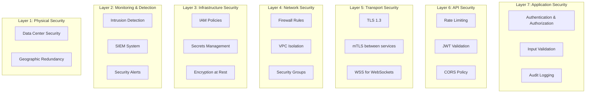

## Authentication & Authorization

### JWT-Based Authentication

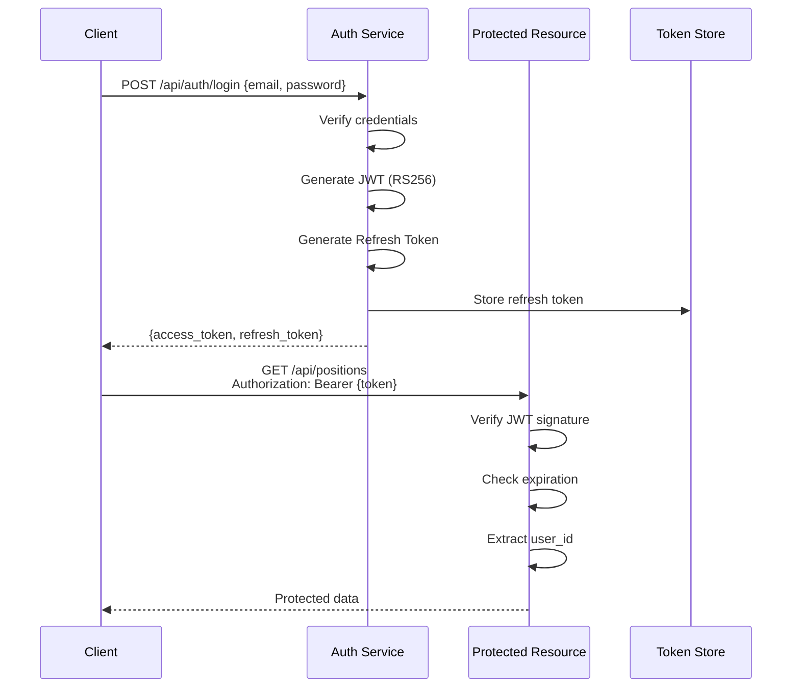

**JWT Structure**:
```json
{
  "header": {
    "alg": "RS256",
    "typ": "JWT"
  },
  "payload": {
    "sub": "user_123",
    "email": "user@example.com",
    "role": "trader",
    "permissions": ["trade", "view_positions", "view_history"],
    "iat": 1701234567,
    "exp": 1701320967,
    "iss": "bot-core-auth",
    "aud": "bot-core-api"
  }
}
```

**Token Lifetimes**:
- Access Token: 24 hours
- Refresh Token: 7 days
- Session Token: 30 days (remember me)

### Role-Based Access Control (RBAC)

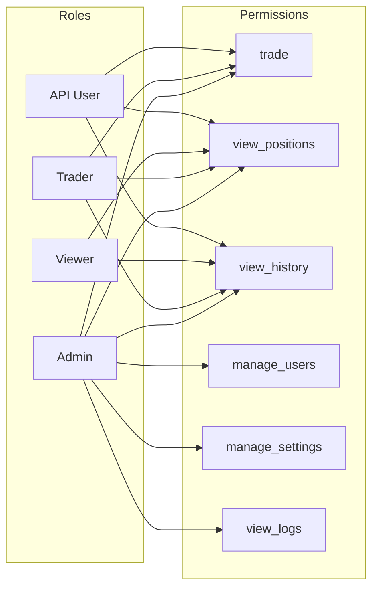

**Permission Matrix**:

| Resource | Admin | Trader | Viewer | API User |
|----------|-------|--------|--------|----------|
| Execute Trades | ✓ | ✓ | ✗ | ✓ |
| View Positions | ✓ | ✓ | ✓ | ✓ |
| View History | ✓ | ✓ | ✓ | ✓ |
| Modify Settings | ✓ | ✓ | ✗ | ✗ |
| Manage Users | ✓ | ✗ | ✗ | ✗ |
| View Audit Logs | ✓ | ✗ | ✗ | ✗ |

### Multi-Factor Authentication (2FA)

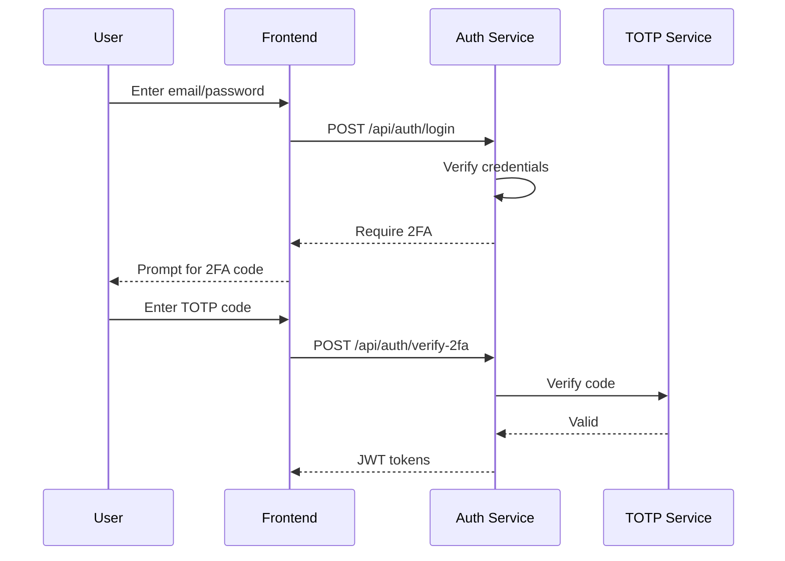

**2FA Requirements**:
- Required for: Withdrawals, settings changes, API key generation
- Optional for: Regular trading (recommended)
- Methods: TOTP (Google Authenticator), SMS (backup)

## API Security

### Rate Limiting

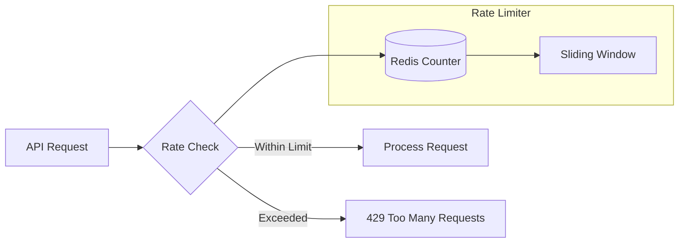

**Rate Limit Tiers**:

| Endpoint Category | Limit | Window | Per |
|------------------|-------|--------|-----|
| Authentication | 5 | 15 min | IP |
| Trade Execution | 10 | 1 sec | User |
| Market Data | 100 | 1 min | User |
| AI Analysis | 10 | 1 min | User |
| General API | 1000 | 1 min | User |

**Response Headers**:
```http
X-RateLimit-Limit: 100
X-RateLimit-Remaining: 45
X-RateLimit-Reset: 1701234567
Retry-After: 60
```

### Input Validation

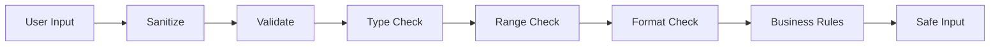

**Validation Rules**:

```rust
// Rust example
pub struct OrderRequest {
    #[validate(length(equal = 6))]
    pub symbol: String,  // Must be 6 chars, e.g., "BTCUSDT"

    #[validate(custom = "validate_side")]
    pub side: OrderSide,  // Must be BUY or SELL

    #[validate(range(min = 0.00001, max = 1000000.0))]
    pub quantity: f64,  // Must be positive, reasonable

    #[validate(range(min = 0.01))]
    pub price: Option<f64>,  // If provided, must be positive
}
```

**Sanitization**:
- HTML encoding for display
- SQL parameter binding (no raw SQL)
- JSON schema validation
- Whitelist-based input filtering

### CORS Policy

```javascript
// Allowed origins
const allowedOrigins = [
  'https://app.botcore.com',
  'https://dashboard.botcore.com',
  'http://localhost:3000'  // Development only
];

// CORS headers
{
  'Access-Control-Allow-Origin': origin,
  'Access-Control-Allow-Methods': 'GET, POST, PUT, DELETE, OPTIONS',
  'Access-Control-Allow-Headers': 'Authorization, Content-Type',
  'Access-Control-Max-Age': '86400',
  'Access-Control-Allow-Credentials': 'true'
}
```

## Transport Security

### TLS/SSL Configuration

```yaml
tls_config:
  min_version: "TLS 1.3"
  cipher_suites:
    - TLS_AES_256_GCM_SHA384
    - TLS_AES_128_GCM_SHA256
    - TLS_CHACHA20_POLY1305_SHA256
  certificate: "/etc/ssl/certs/botcore.crt"
  private_key: "/etc/ssl/private/botcore.key"
  client_auth: "request"  # For mTLS
```

**Certificate Management**:
- Auto-renewal with Let's Encrypt
- 90-day rotation schedule
- Certificate pinning for mobile apps
- OCSP stapling enabled

### Mutual TLS (mTLS) for Inter-Service Communication

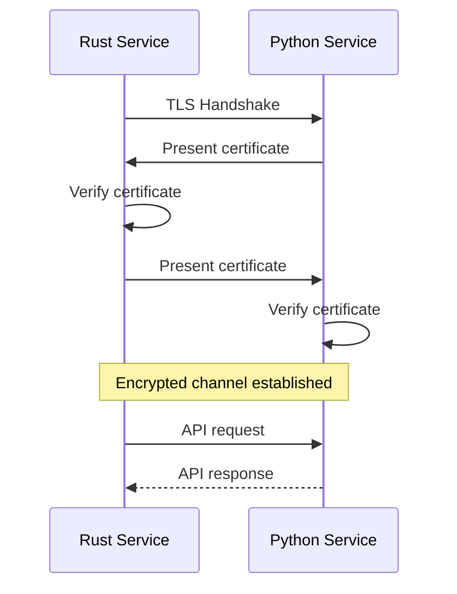

**Certificate Attributes**:
```
Subject: CN=rust-core-engine.bot-core.svc.cluster.local
Issuer: CN=Bot Core Internal CA
Valid: 2025-01-01 to 2025-12-31
Key Usage: Digital Signature, Key Encipherment
Extended Key Usage: Server Auth, Client Auth
```

## Data Security

### Encryption at Rest

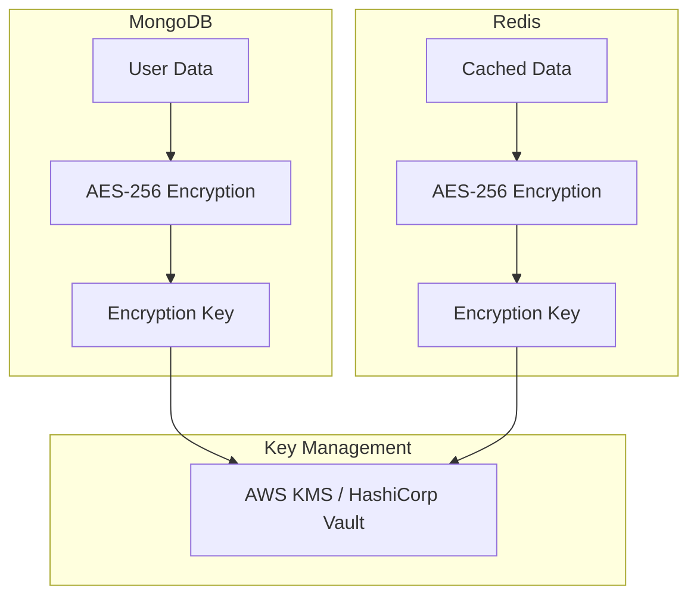

**Encrypted Fields**:
- User credentials (bcrypt for passwords)
- API keys (AES-256)
- Sensitive personal information
- Financial data
- Trading strategies

### Secrets Management

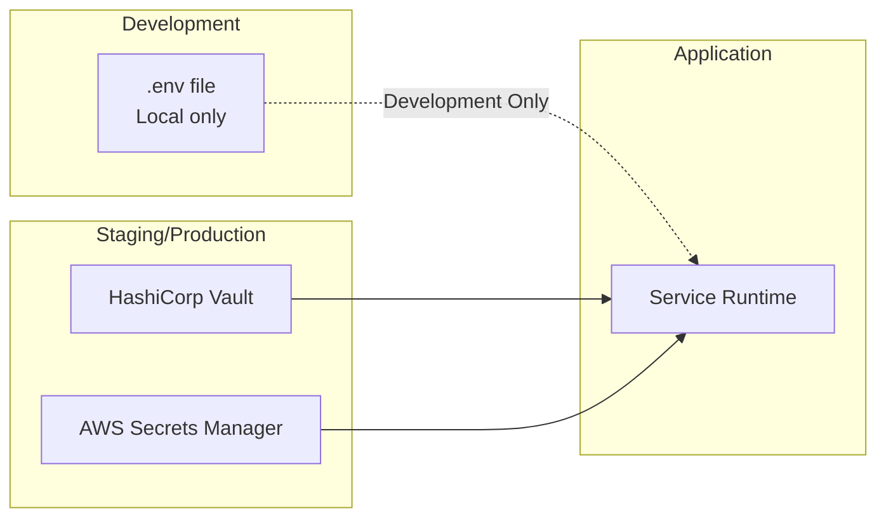

**Secret Rotation**:
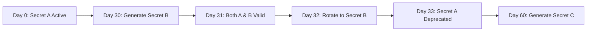

**Rotation Schedule**:
- Database passwords: 90 days
- API keys: 90 days
- JWT signing keys: 180 days
- TLS certificates: 90 days (auto-renewal)
- Admin passwords: 60 days (forced)

## Network Security

### VPC Architecture

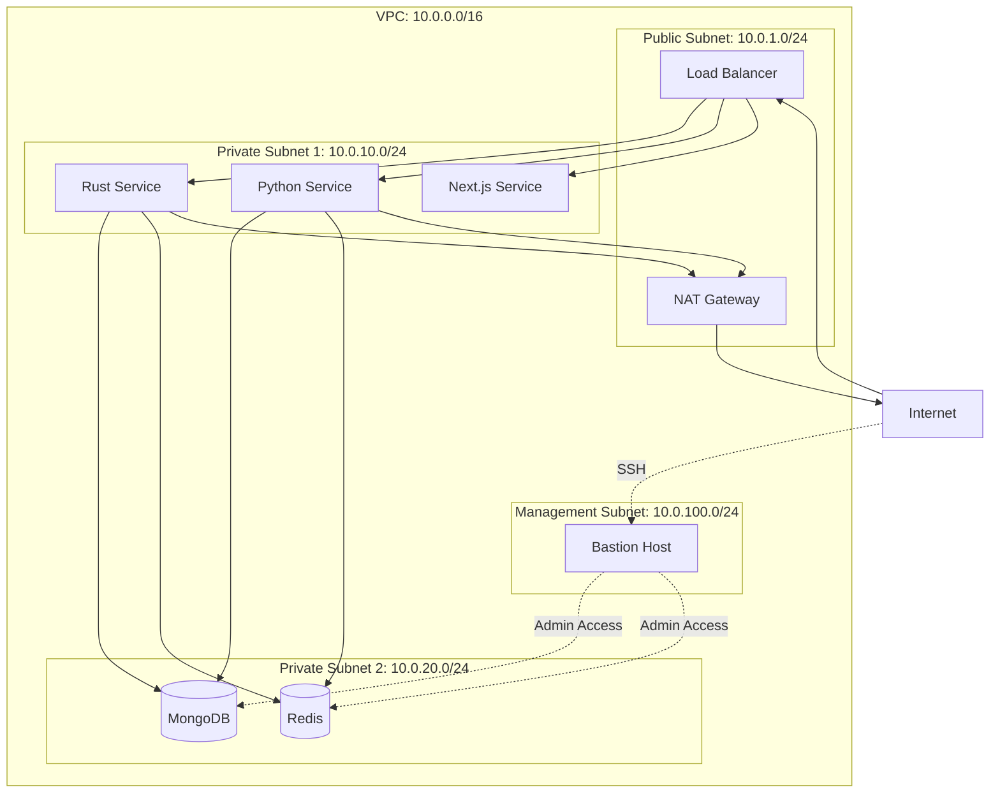

### Security Groups

**Web Tier**:
```yaml
ingress:
  - port: 443
    protocol: tcp
    source: 0.0.0.0/0
    description: HTTPS from internet
  - port: 80
    protocol: tcp
    source: 0.0.0.0/0
    description: HTTP redirect to HTTPS

egress:
  - port: 8080
    protocol: tcp
    destination: sg-app-tier
    description: To application tier
```

**Application Tier**:
```yaml
ingress:
  - port: 8080
    source: sg-web-tier
    description: From web tier
  - port: 8000
    source: sg-app-tier
    description: Inter-service communication

egress:
  - port: 27017
    destination: sg-data-tier
    description: To MongoDB
  - port: 6379
    destination: sg-data-tier
    description: To Redis
  - port: 443
    destination: 0.0.0.0/0
    description: External APIs
```

### DDoS Protection

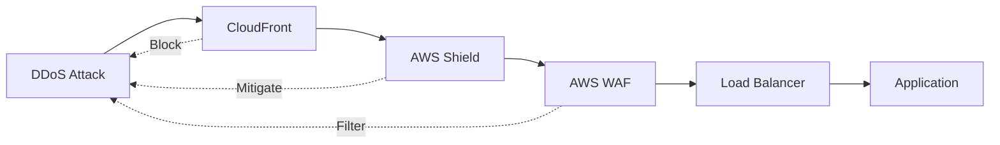

**WAF Rules**:
- Rate limiting (1000 req/min per IP)
- Geographic blocking (sanctioned countries)
- Known bad bot signatures
- SQL injection patterns
- XSS patterns
- Large payload blocking (> 1MB)

## Application Security

### Secure Coding Practices

**Rust: No `unwrap()` in Production**:
```rust
// Bad
let user = database.get_user(id).unwrap();  // Can panic!

// Good
let user = database.get_user(id)
    .map_err(|e| TradingError::DatabaseError(e))?;
```

**Python: Input Sanitization**:
```python
# Bad
query = f"SELECT * FROM users WHERE email = '{email}'"  # SQL injection!

# Good
query = "SELECT * FROM users WHERE email = ?"
cursor.execute(query, (email,))
```

**TypeScript: Type Safety**:
```typescript
// Bad
function processOrder(order: any) { ... }  // No type safety

// Good
function processOrder(order: Order): Result<Trade, Error> { ... }
```

### Security Headers

```http
Strict-Transport-Security: max-age=31536000; includeSubDomains; preload
X-Frame-Options: DENY
X-Content-Type-Options: nosniff
X-XSS-Protection: 1; mode=block
Content-Security-Policy: default-src 'self'; script-src 'self' 'unsafe-inline'; style-src 'self' 'unsafe-inline'
Referrer-Policy: strict-origin-when-cross-origin
Permissions-Policy: geolocation=(), microphone=(), camera=()
```

## Audit Logging

### Audit Trail

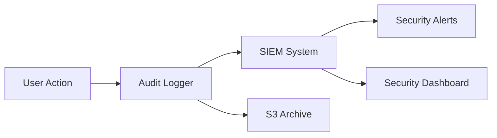

**Logged Events**:
```json
{
  "event_id": "evt_123456",
  "timestamp": "2025-10-10T12:00:00Z",
  "event_type": "trade_executed",
  "user_id": "user_123",
  "ip_address": "203.0.113.42",
  "user_agent": "Mozilla/5.0...",
  "action": "POST /api/trades/execute",
  "resource": "trade_789",
  "result": "success",
  "metadata": {
    "symbol": "BTCUSDT",
    "quantity": 0.001,
    "price": 45000.00
  },
  "session_id": "sess_456",
  "request_id": "req_789"
}
```

**Retention**:
- Security logs: 7 years
- Audit trail: 7 years
- Access logs: 1 year
- Debug logs: 30 days

## Vulnerability Management

### Security Scanning

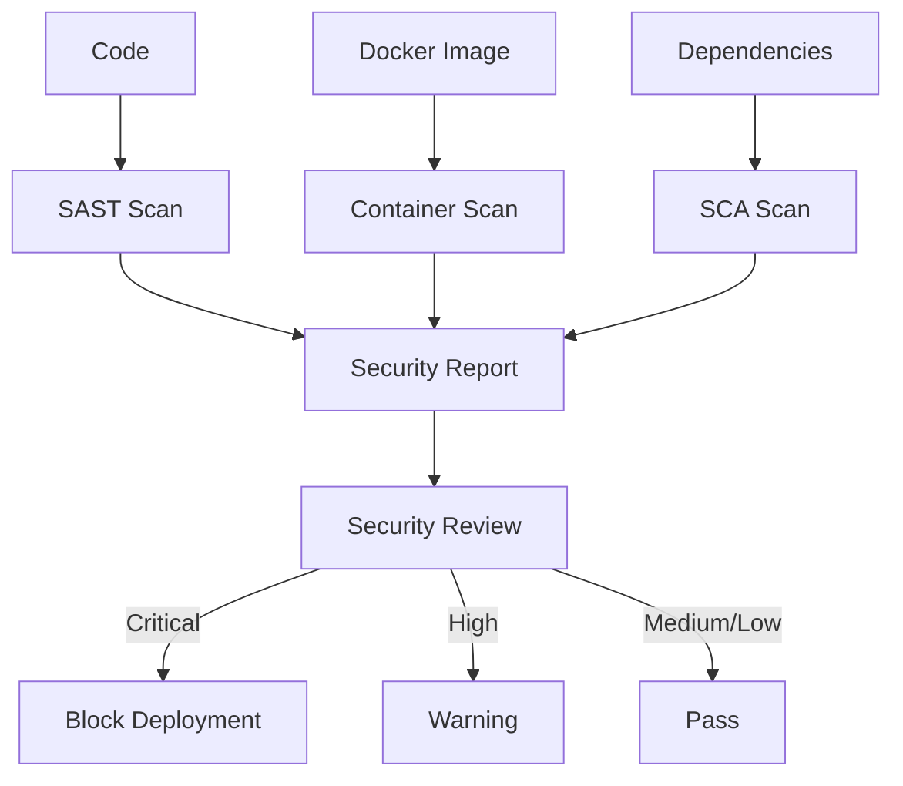

**Tools**:
- SAST: SonarQube, Semgrep
- Container: Trivy, Clair
- SCA: Dependabot, Snyk
- DAST: OWASP ZAP

**Vulnerability SLA**:
- Critical: 24 hours
- High: 7 days
- Medium: 30 days
- Low: 90 days

### Penetration Testing

**Schedule**:
- Annual third-party penetration test
- Quarterly internal security assessment
- Continuous automated scanning

**Scope**:
- External attack surface
- Internal network segmentation
- API security
- Authentication mechanisms
- Data protection

## Incident Response

### Incident Response Plan

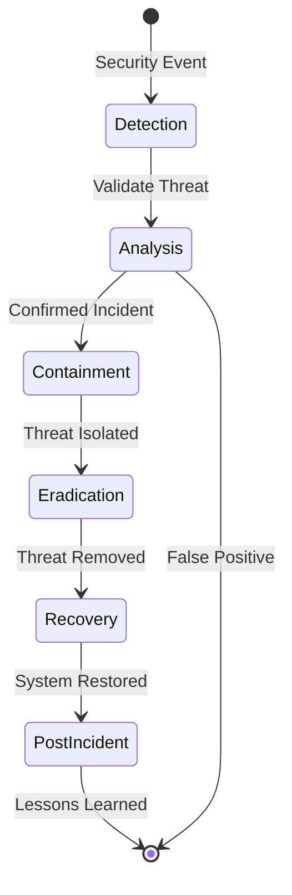

**Response Times**:
- Detection: < 5 minutes (automated)
- Analysis: < 15 minutes
- Containment: < 1 hour
- Communication: < 2 hours
- Recovery: < 24 hours

### Security Contacts

```yaml
security_team:
  email: security@botcore.com
  pagerduty: security-oncall
  emergency: +1-XXX-XXX-XXXX

escalation:
  - level: 1
    team: Security Engineers
    response_time: 15 min

  - level: 2
    team: Security Manager
    response_time: 30 min

  - level: 3
    team: CISO
    response_time: 1 hour
```

## Compliance

### Standards & Frameworks

- **SOC 2 Type II**: Annual audit
- **ISO 27001**: Information Security Management
- **PCI DSS**: Payment card data (if applicable)
- **GDPR**: EU user data protection
- **CCPA**: California privacy rights

### Data Privacy

**User Rights**:
- Right to access personal data
- Right to data portability
- Right to erasure ("right to be forgotten")
- Right to rectification
- Right to restrict processing

**Data Minimization**:
- Collect only necessary data
- Anonymize where possible
- Pseudonymize personal identifiers
- Regular data cleanup

## Security Checklist

### Pre-Deployment

- [ ] All secrets moved to Vault/KMS
- [ ] No hardcoded credentials in code
- [ ] TLS 1.3 configured
- [ ] Rate limiting enabled
- [ ] Input validation implemented
- [ ] RBAC configured
- [ ] Audit logging enabled
- [ ] Security headers set
- [ ] Dependencies scanned
- [ ] Container images scanned
- [ ] Penetration test completed

### Ongoing

- [ ] Daily security scans
- [ ] Weekly dependency updates
- [ ] Monthly access review
- [ ] Quarterly security training
- [ ] Annual penetration test
- [ ] Regular backup testing
- [ ] Incident response drills

## References

- [System Architecture](./SYSTEM_ARCHITECTURE.md)
- [Data Flow](./DATA_FLOW.md)
- [Deployment Guide](../../documents/DEPLOYMENT.md)
- [Disaster Recovery](../../documents/DISASTER_RECOVERY.md)
