# Data Flow Architecture

## Overview

This document describes how data flows through the Bot Core system, including request/response patterns, event-driven communication, and real-time data streaming.

## Primary Data Flows

### 1. User Authentication Flow

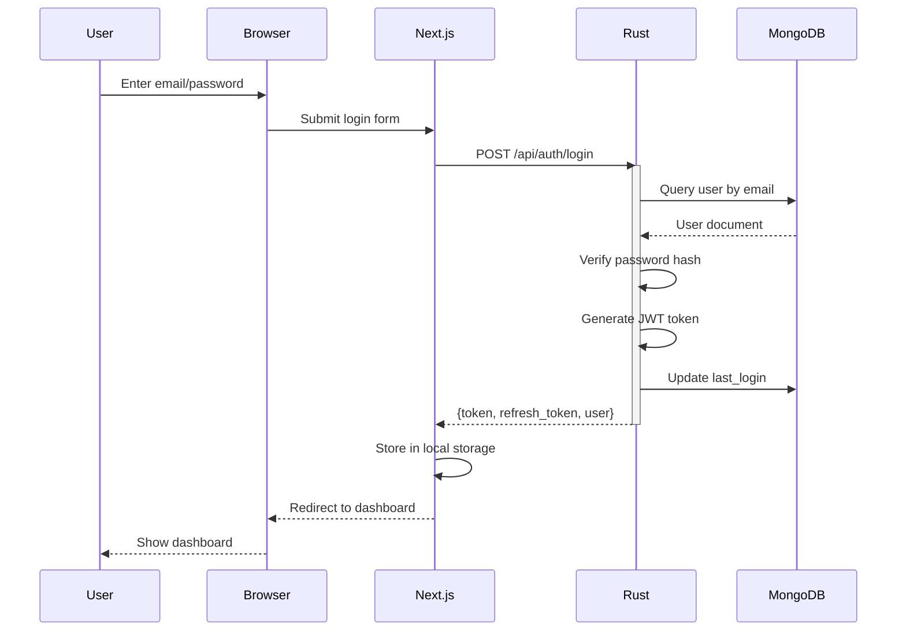

**Data Elements**:
```json
{
  "request": {
    "email": "user@example.com",
    "password": "hashed_password"
  },
  "response": {
    "token": "eyJhbGci...",
    "refresh_token": "eyJhbGci...",
    "user": {
      "id": "user_123",
      "email": "user@example.com",
      "full_name": "John Doe"
    }
  }
}
```

### 2. Real-Time Market Data Flow

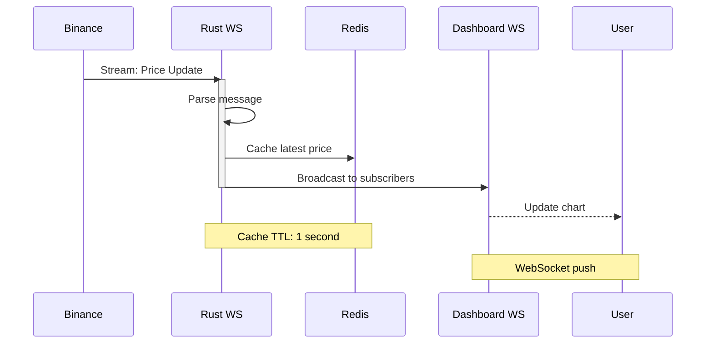

**Message Format**:
```json
{
  "type": "price_update",
  "data": {
    "symbol": "BTCUSDT",
    "price": 45123.45,
    "bid": 45123.40,
    "ask": 45123.50,
    "volume_24h": 25000000000,
    "change_24h": 2.5,
    "timestamp": "2025-10-10T12:00:00Z"
  }
}
```

### 3. AI Analysis Request Flow

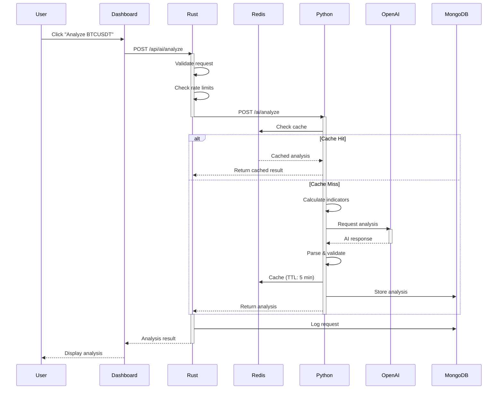

**Request/Response**:
```json
{
  "request": {
    "symbol": "BTCUSDT",
    "timeframe": "1h",
    "candles": [...],
    "technical_indicators": {...}
  },
  "response": {
    "signal": "Long",
    "confidence": 0.85,
    "reasoning": "Strong bullish momentum...",
    "suggested_entry": 45190.00,
    "suggested_stop_loss": 44900.00,
    "suggested_take_profit": 45600.00,
    "risk_reward_ratio": 1.37
  }
}
```

### 4. Trade Execution Flow

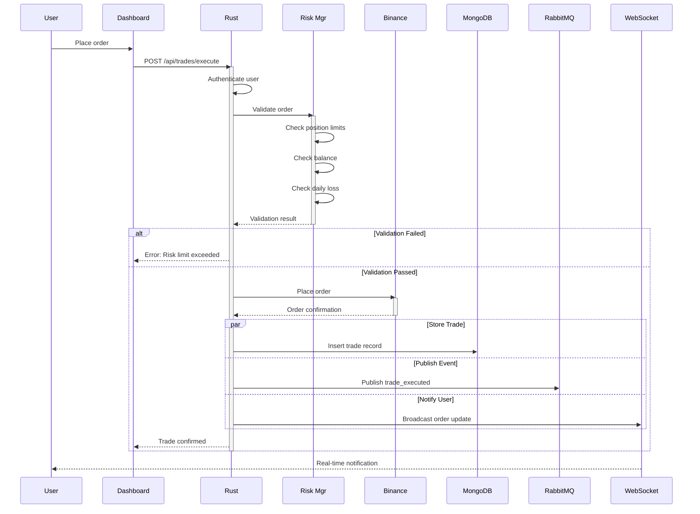

**Trade Record**:
```json
{
  "trade_id": "123e4567-e89b-12d3-a456-426614174000",
  "user_id": "user_123",
  "symbol": "BTCUSDT",
  "side": "BUY",
  "type": "LIMIT",
  "quantity": 0.001,
  "price": 45000.00,
  "executed_quantity": 0.001,
  "executed_price": 45000.00,
  "status": "FILLED",
  "commission": 0.045,
  "timestamp": "2025-10-10T12:00:00Z"
}
```

### 5. Paper Trading Flow

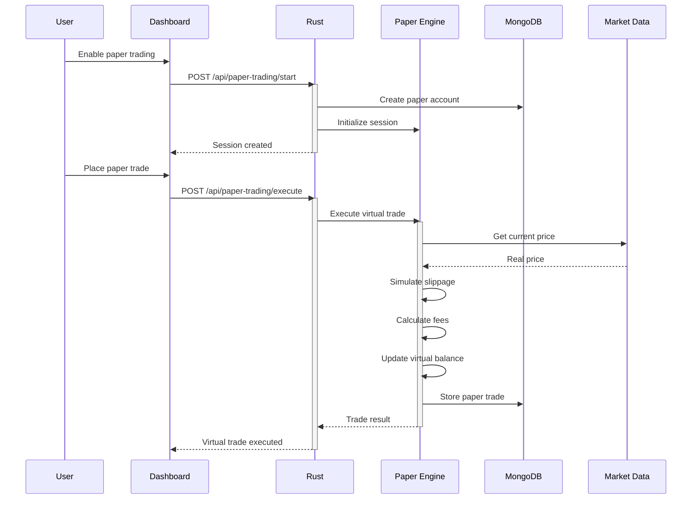

## Event-Driven Communication

### RabbitMQ Message Flow

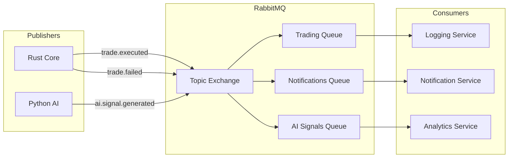

**Message Types**:

1. **Trade Events**:
```json
{
  "event": "trade_executed",
  "routing_key": "trade.executed",
  "data": {
    "trade_id": "123e4567",
    "symbol": "BTCUSDT",
    "side": "BUY",
    "quantity": 0.001,
    "price": 45000.00
  },
  "timestamp": "2025-10-10T12:00:00Z"
}
```

2. **AI Signal Events**:
```json
{
  "event": "ai_signal_generated",
  "routing_key": "ai.signal.generated",
  "data": {
    "analysis_id": "550e8400",
    "symbol": "BTCUSDT",
    "signal": "Long",
    "confidence": 0.85
  },
  "timestamp": "2025-10-10T12:00:00Z"
}
```

3. **Risk Events**:
```json
{
  "event": "risk_limit_exceeded",
  "routing_key": "risk.limit.exceeded",
  "data": {
    "user_id": "user_123",
    "limit_type": "daily_loss",
    "current_value": -5.5,
    "limit_value": -5.0
  },
  "timestamp": "2025-10-10T12:00:00Z"
}
```

## WebSocket Communication

### Connection Lifecycle

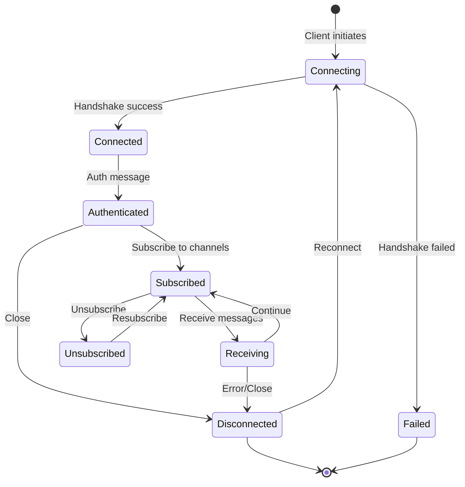

### WebSocket Message Types

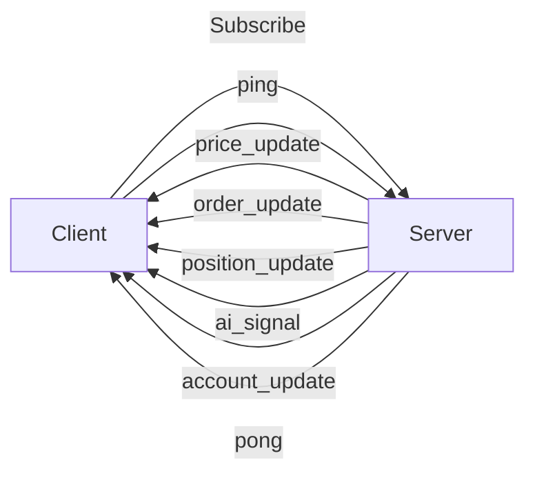

**Message Examples**:

1. **Subscribe**:
```json
{
  "type": "subscribe",
  "channels": ["BTCUSDT@ticker", "ETHUSDT@ticker"],
  "auth_token": "eyJhbGci..."
}
```

2. **Price Update**:
```json
{
  "type": "price_update",
  "channel": "BTCUSDT@ticker",
  "data": {
    "symbol": "BTCUSDT",
    "price": 45123.45,
    "volume": 1234.56
  },
  "timestamp": "2025-10-10T12:00:00.123Z",
  "sequence": 12345
}
```

3. **Order Update**:
```json
{
  "type": "order_update",
  "data": {
    "order_id": "order_123",
    "status": "FILLED",
    "executed_quantity": 0.001,
    "executed_price": 45000.00
  },
  "timestamp": "2025-10-10T12:00:00Z"
}
```

## Caching Strategy

### Cache Hierarchy

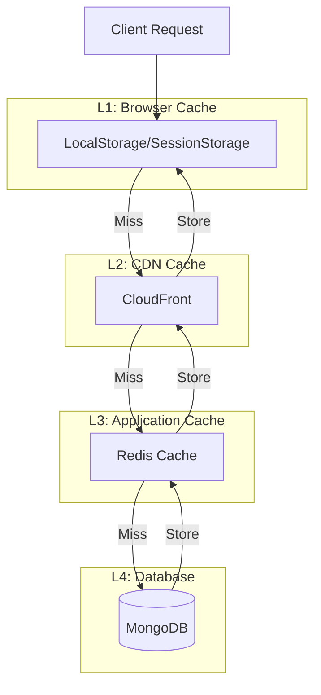

### Cache Invalidation

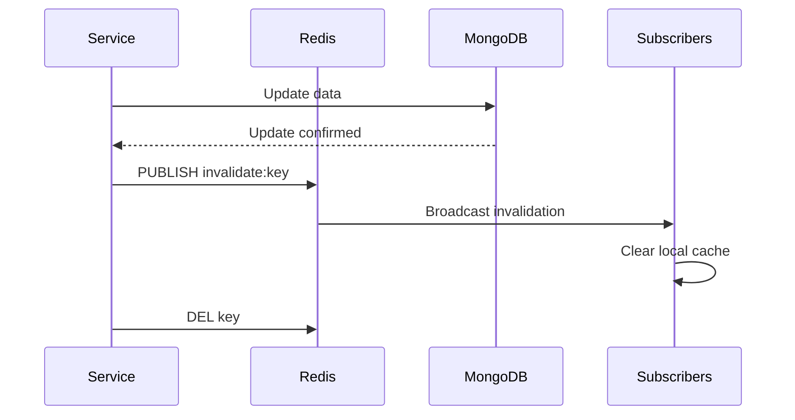

## Data Transformation Pipeline

### Market Data Processing

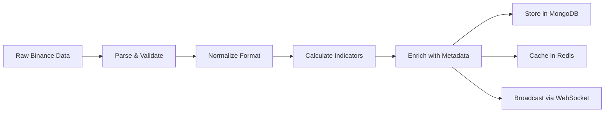

**Example Transformation**:

**Input (Binance)**:
```json
{
  "e": "kline",
  "E": 1701234567000,
  "s": "BTCUSDT",
  "k": {
    "t": 1701234560000,
    "o": "45000.00",
    "h": "45100.00",
    "l": "44950.00",
    "c": "45050.00",
    "v": "123.456"
  }
}
```

**Output (Internal)**:
```json
{
  "symbol": "BTCUSDT",
  "timeframe": "1m",
  "open_time": 1701234560000,
  "open": 45000.00,
  "high": 45100.00,
  "low": 44950.00,
  "close": 45050.00,
  "volume": 123.456,
  "close_time": 1701234619999,
  "indicators": {
    "rsi": 65.5,
    "macd": 12.34
  }
}
```

## Database Access Patterns

### Read Patterns

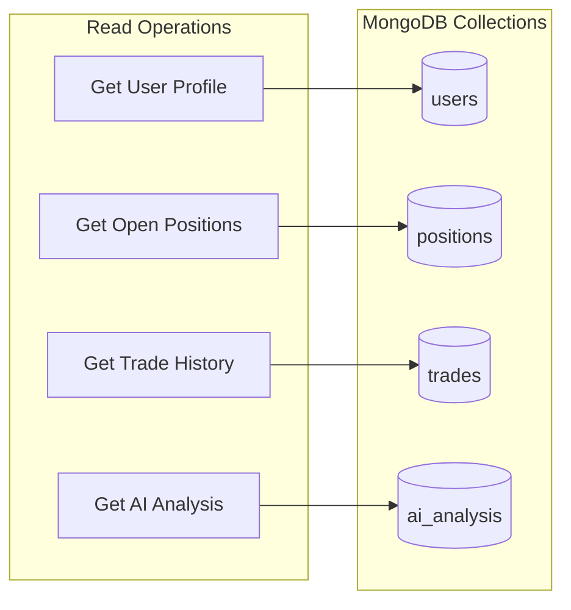

**Query Examples**:

1. **Get Open Positions**:
```javascript
db.positions.find({
  user_id: "user_123",
  closed_at: null
}).sort({ opened_at: -1 })
```

2. **Get Recent Trades**:
```javascript
db.trades.find({
  user_id: "user_123",
  created_at: { $gte: ISODate("2025-10-09T00:00:00Z") }
}).sort({ created_at: -1 }).limit(100)
```

### Write Patterns

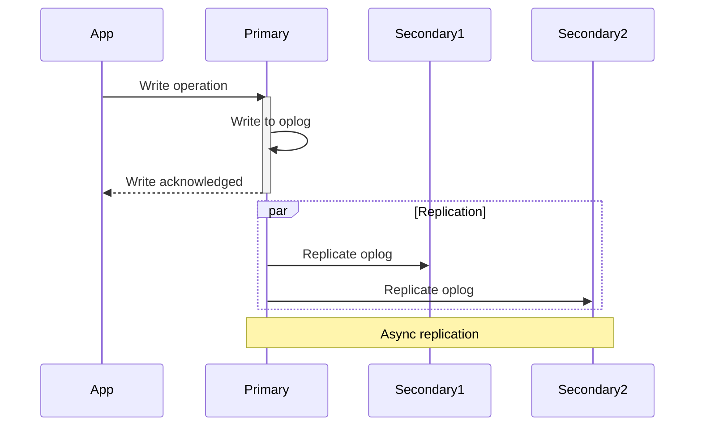

## Data Consistency Patterns

### Eventual Consistency

Used for:
- AI analysis results
- Historical trade data
- Analytical reports

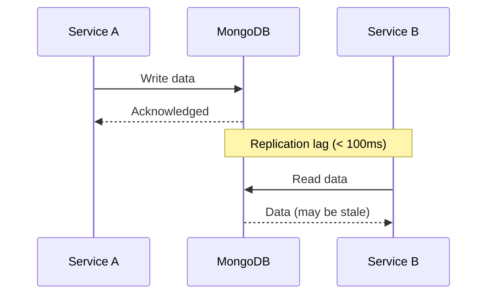

### Strong Consistency

Used for:
- Account balances
- Open positions
- Order placement

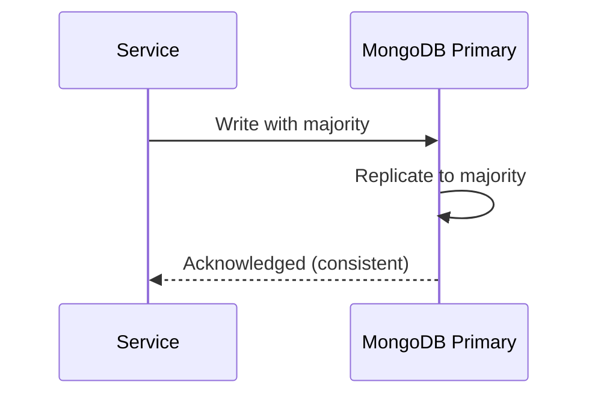

## Data Retention Policy

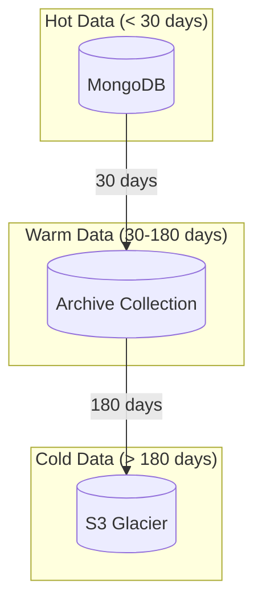

**Retention Schedule**:

| Data Type | Hot Storage | Archive | Cold Storage |
|-----------|-------------|---------|--------------|
| Trade records | 30 days | 6 months | 7 years |
| Price data | 7 days | 1 month | 1 year |
| AI analysis | 30 days | 3 months | Deleted |
| User activity | 90 days | 1 year | 7 years |
| System logs | 7 days | 1 month | Deleted |

## Performance Metrics

### Target Latencies

| Operation | Target | P95 | P99 |
|-----------|--------|-----|-----|
| REST API call | < 100ms | < 200ms | < 500ms |
| WebSocket message | < 50ms | < 100ms | < 200ms |
| Trade execution | < 10ms | < 20ms | < 50ms |
| AI analysis | < 2s | < 3s | < 5s |
| Database query | < 50ms | < 100ms | < 200ms |
| Cache hit | < 1ms | < 2ms | < 5ms |

## Error Handling

### Retry Strategy

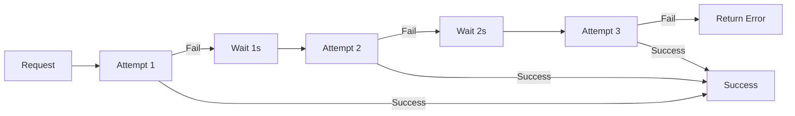

**Retryable Errors**:
- Network timeouts
- Temporary service unavailability
- Rate limit errors (with backoff)

**Non-Retryable Errors**:
- Invalid request parameters
- Authentication failures
- Insufficient balance

## References

- [System Architecture](./SYSTEM_ARCHITECTURE.md)
- [Security Architecture](./SECURITY_ARCHITECTURE.md)
- [API Specification](../../specs/API_SPEC.md)
- [Data Models](../../specs/DATA_MODELS.md)
