# System Architecture

## Overview

Bot Core is a microservices-based cryptocurrency trading platform designed for high performance, scalability, and reliability. This document provides a comprehensive view of the system architecture.

## High-Level Architecture

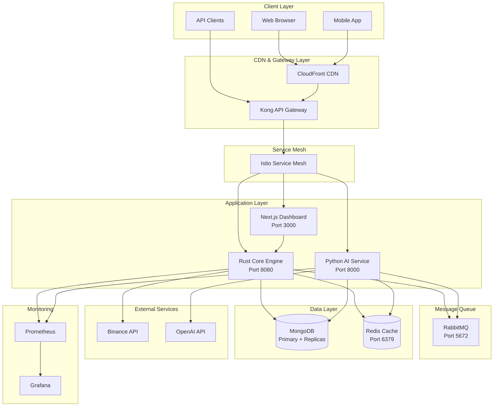

## Component Architecture

### 1. Rust Core Engine

**Purpose**: High-performance trading execution and real-time market data processing

**Key Responsibilities**:
- Trading order execution
- WebSocket connections to exchanges
- Position management
- Risk management
- User authentication and authorization
- Paper trading simulation

**Technology Stack**:
- Language: Rust 1.75+
- Framework: Actix-web for REST API
- WebSocket: tokio-tungstenite
- Database: MongoDB (via mongodb crate)
- Caching: Redis (via redis-rs)

**Architecture Diagram**:
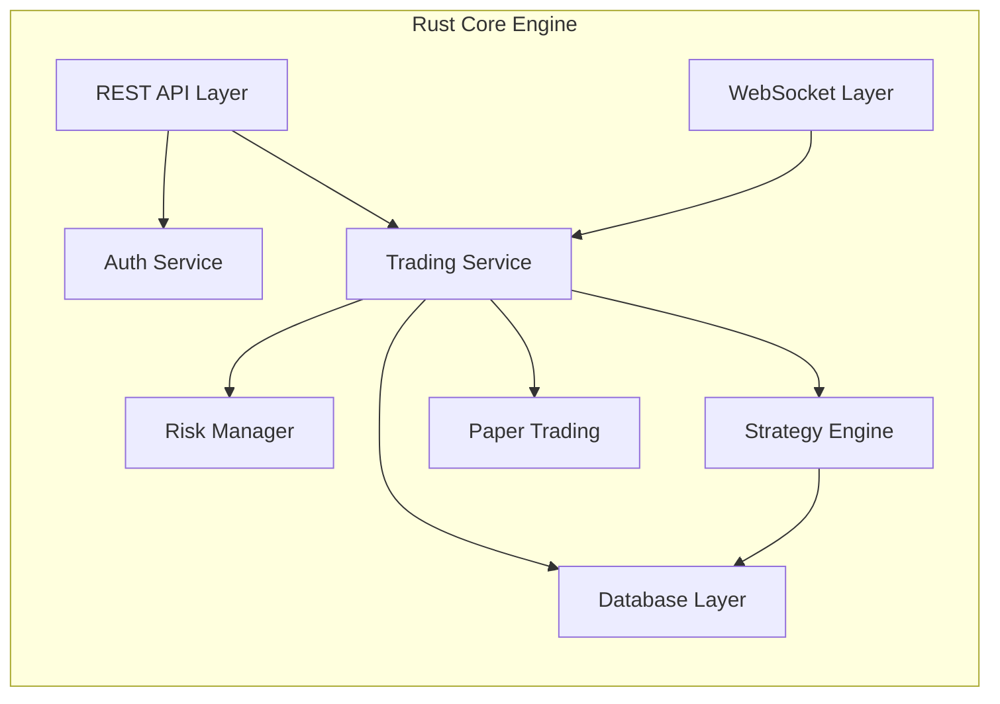

**Key Features**:
- Sub-10ms order execution latency
- Concurrent WebSocket handling (10,000+ connections)
- Thread-safe state management
- Circuit breaker pattern for external APIs
- Rate limiting per user and global

### 2. Python AI Service

**Purpose**: AI-powered market analysis and trading signal generation

**Key Responsibilities**:
- GPT-4 market analysis
- ML model predictions (LSTM, GRU, Transformer)
- Technical indicator calculations
- Market sentiment analysis
- Strategy recommendations

**Technology Stack**:
- Language: Python 3.11+
- Framework: FastAPI
- ML Libraries: PyTorch, TensorFlow
- Technical Analysis: TA-Lib
- AI: OpenAI API, LangChain

**Architecture Diagram**:
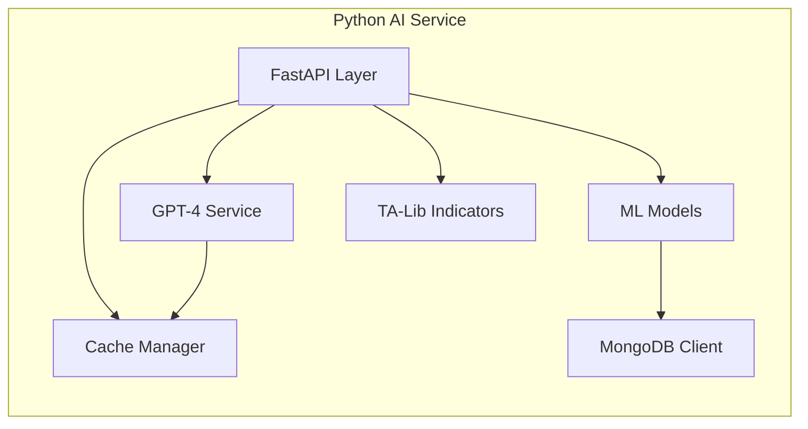

**Key Features**:
- Asynchronous processing
- Response caching (5-minute TTL)
- Batch request optimization
- Fallback models for reliability
- Cost tracking and budget limits

### 3. Next.js Dashboard

**Purpose**: Modern web interface for trading and monitoring

**Key Responsibilities**:
- User interface for trading
- Real-time data visualization
- Portfolio management
- Settings and configuration
- Multi-language support (i18n)

**Technology Stack**:
- Framework: Next.js 14+ with App Router
- Build Tool: Vite
- UI Library: Shadcn/UI + Tailwind CSS
- Charts: TradingView Lightweight Charts, Three.js
- State Management: React Context + Hooks
- WebSocket: Socket.io client

**Architecture Diagram**:
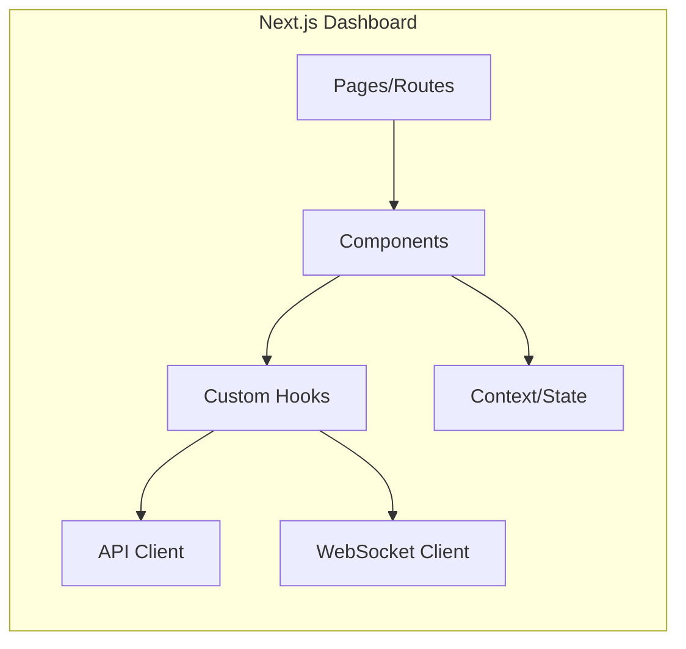

## Data Flow Architecture

### Trading Flow

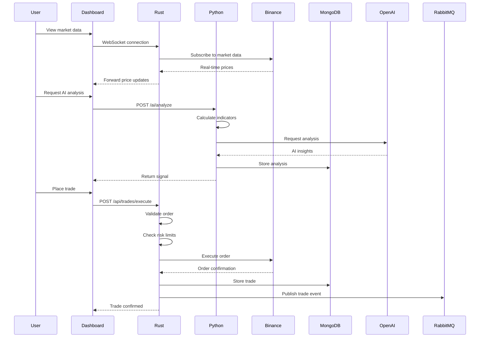

### AI Analysis Flow

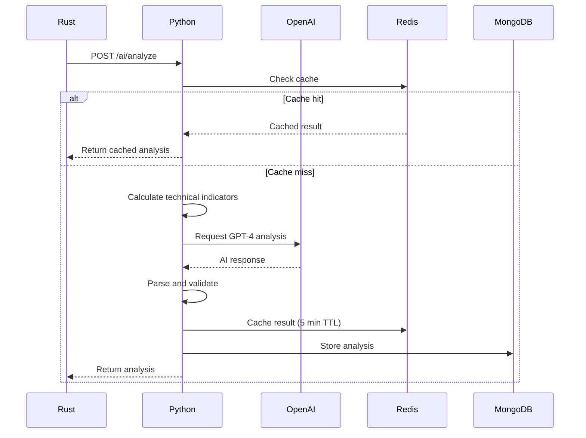

## Deployment Architecture

### Single Region Deployment

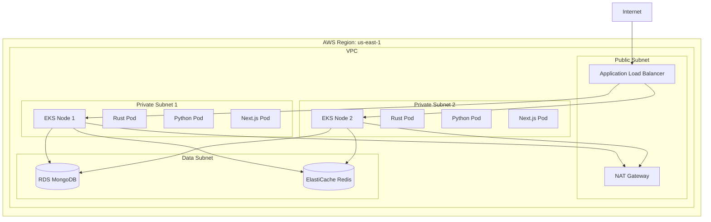

### Multi-Region Deployment

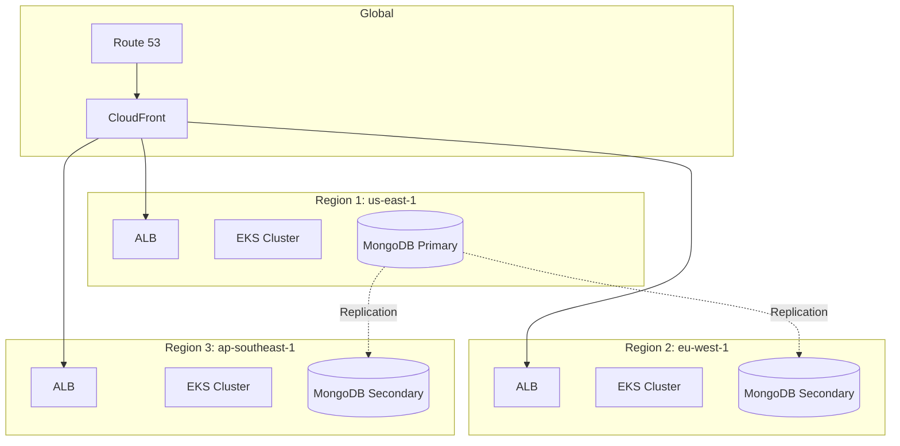

## Network Architecture

### Docker Network (Development)

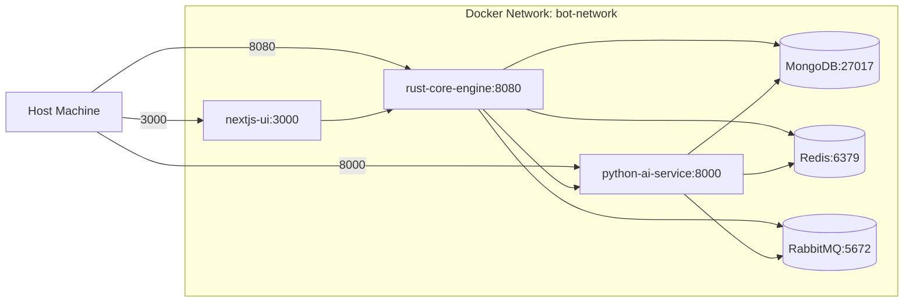

### Kubernetes Network

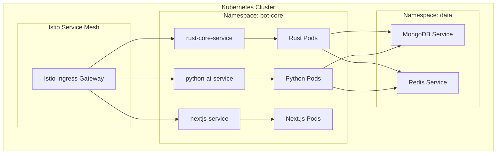

## Security Architecture

### Authentication Flow

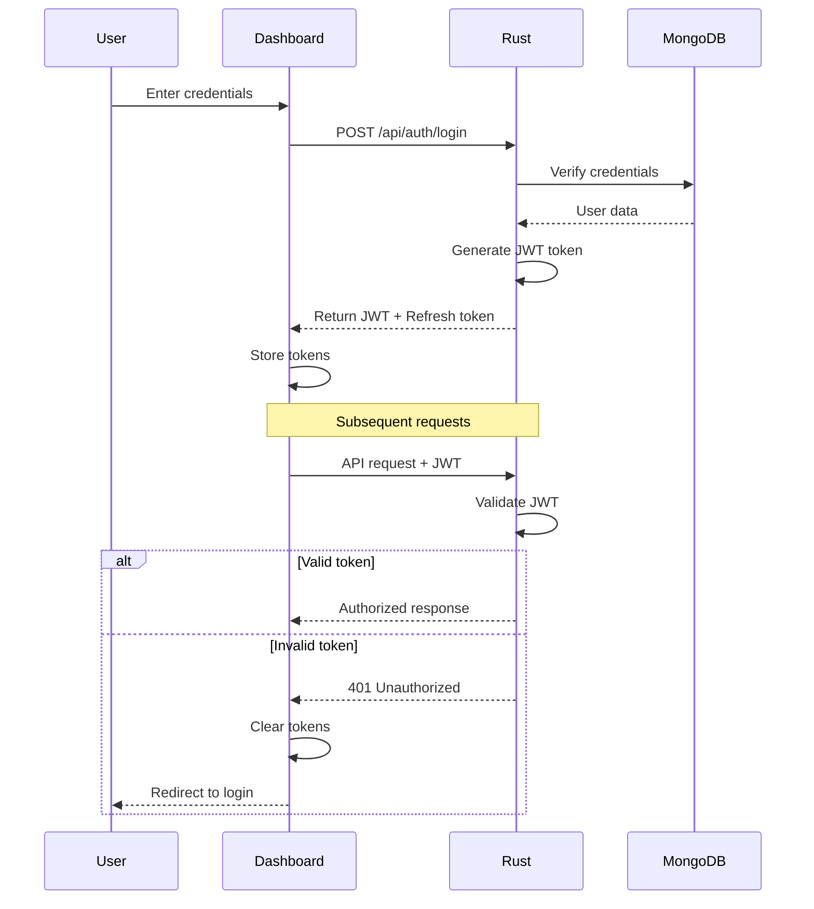

### Inter-Service Authentication

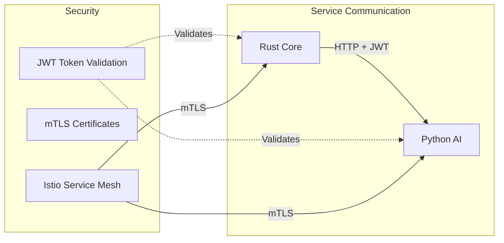

## Scalability Architecture

### Horizontal Scaling

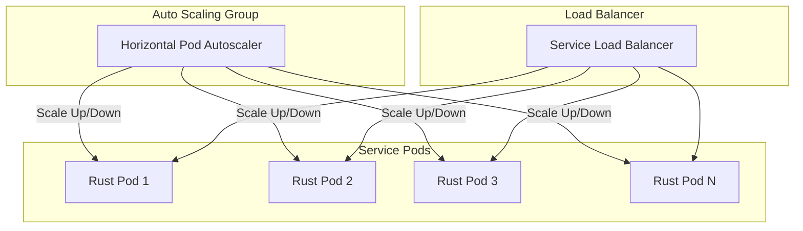

**Scaling Metrics**:
- CPU utilization > 70%: Scale up
- Memory utilization > 80%: Scale up
- Request rate > 1000 req/s: Scale up
- CPU utilization < 30% for 5 minutes: Scale down

### Database Scaling

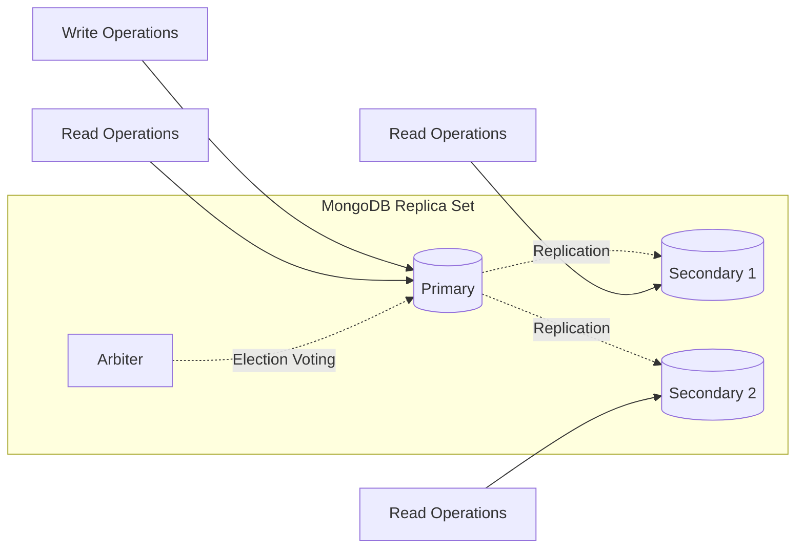

## Performance Optimization

### Caching Strategy

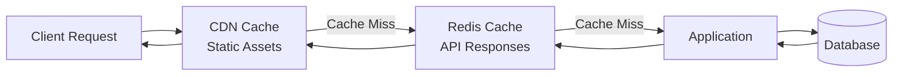

**Cache TTLs**:
- Static assets: 1 week
- API responses: 5 minutes
- Market data: 1 second
- User sessions: 24 hours
- AI analysis: 5 minutes

### Connection Pooling

- **MongoDB**: 100 connections per service
- **Redis**: 50 connections per service
- **HTTP**: Keep-alive with max 1000 connections

## Disaster Recovery

### Backup Strategy

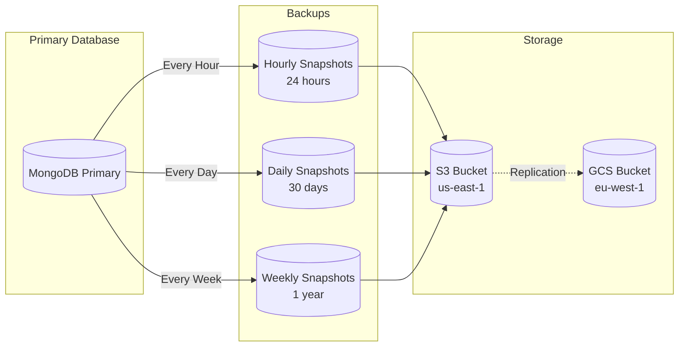

### Failover Architecture

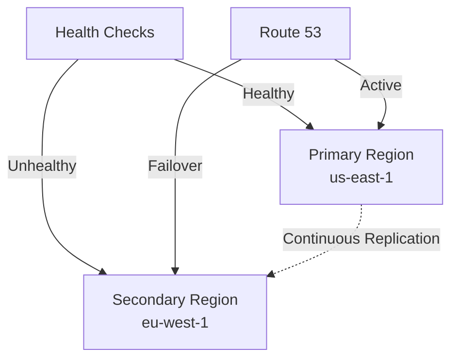

## Monitoring Architecture

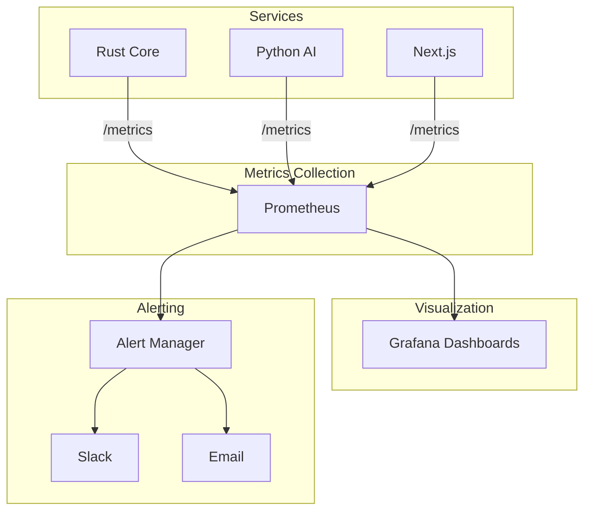

## Technology Stack Summary

| Component | Technology | Version |
|-----------|-----------|---------|
| Rust Core Engine | Rust, Actix-web | 1.75+ |
| Python AI Service | Python, FastAPI | 3.11+ |
| Frontend Dashboard | Next.js, React | 14+ |
| Database | MongoDB | 7.0+ |
| Cache | Redis | 7.2+ |
| Message Queue | RabbitMQ | 3.12+ |
| API Gateway | Kong | 3.4+ |
| Service Mesh | Istio | 1.19+ |
| Container Runtime | Docker | 24.0+ |
| Orchestration | Kubernetes | 1.28+ |
| Monitoring | Prometheus + Grafana | Latest |
| CI/CD | GitHub Actions | - |
| Cloud Provider | AWS (Primary), GCP (Secondary) | - |

## Architectural Decisions

### Why Microservices?

1. **Language Optimization**: Use best language for each task
   - Rust for performance-critical trading
   - Python for AI/ML workloads
   - TypeScript/React for modern UI

2. **Independent Scaling**: Scale services based on demand
3. **Fault Isolation**: Service failures don't cascade
4. **Team Autonomy**: Teams work independently

### Why Rust for Core Engine?

- Sub-millisecond execution latency
- Memory safety without garbage collection
- Excellent concurrency support
- Zero-cost abstractions

### Why Python for AI Service?

- Rich ML/AI ecosystem
- Easy integration with OpenAI
- Fast prototyping
- Extensive libraries (TA-Lib, NumPy, PyTorch)

### Why MongoDB?

- Flexible schema for trading data
- Excellent scaling capabilities
- Native JSON support
- Change streams for real-time updates
- Built-in replication

### Why Redis?

- In-memory speed for caching
- Pub/Sub for real-time updates
- Support for complex data structures
- Persistence options

## Future Architecture Improvements

1. **Event Sourcing**: Implement full event sourcing for audit trail
2. **CQRS**: Separate read and write models
3. **GraphQL**: Add GraphQL layer for frontend
4. **Serverless**: Move some workloads to Lambda/Cloud Functions
5. **Edge Computing**: Deploy closer to users globally
6. **Machine Learning Pipeline**: MLOps infrastructure for model training

## References

- [Data Flow Diagram](./DATA_FLOW.md)
- [Security Architecture](./SECURITY_ARCHITECTURE.md)
- [Deployment Guide](./DEPLOYMENT_ARCHITECTURE.md)
- [API Specification](../../specs/API_SPEC.md)
- [Integration Patterns](../../specs/INTEGRATION_SPEC.md)
