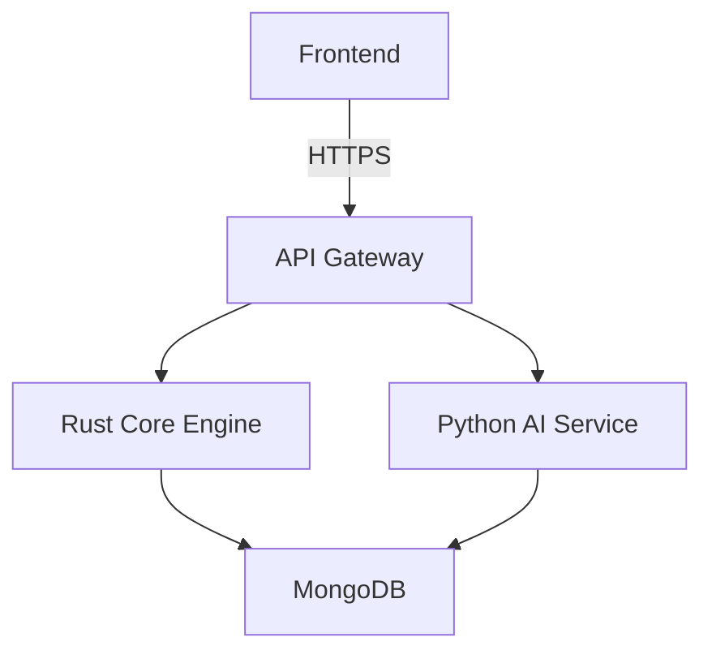

# [Component] - Architecture Design

**Spec ID**: ARCH-[TOPIC]-[NUMBER]  
**Version**: 1.0  
**Status**: ☐ Draft  
**Owner**: Architecture Team  
**Last Updated**: YYYY-MM-DD

## Sections for Architecture Docs

1. **System Overview** - High-level architecture
2. **Components** - Individual component descriptions
3. **Data Flow** - How data moves through the system
4. **Security Architecture** - Security controls and patterns
5. **Deployment Architecture** - How system is deployed
6. **Integration Patterns** - How services communicate

## Diagrams

Include Mermaid diagrams:

## Example: ARCH-OVERVIEW-001

See existing specs/INTEGRATION_SPEC.md for reference.
