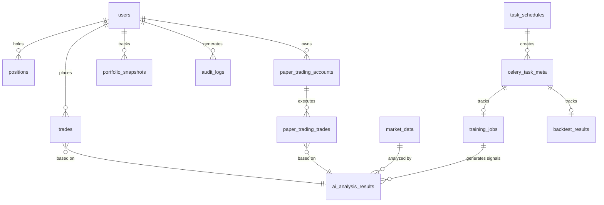

# Database Schema Specification

**Version:** 2.1.0
**Last Updated:** 2026-02-06
**Database:** MongoDB 7.0+
**Author:** Bot Core Team

## Overview

This document defines the complete MongoDB database schema for the Bot Core trading platform. The database supports high-frequency trading operations, AI-driven analysis, paper trading simulations, comprehensive user management, and asynchronous task execution.

### Key Design Principles

1. **Denormalization for Performance** - Critical trading data is denormalized for sub-millisecond reads
2. **Time-Series Optimization** - Market data uses time-series collections with TTL indexes
3. **Flexible Schema** - Metadata fields allow extensibility without migrations
4. **Audit Trail** - All user actions and trades maintain comprehensive audit logs
5. **Scalability** - Sharding-ready design for horizontal scaling
6. **Async Task Management** - Celery-based task tracking with RabbitMQ and Redis

### Database Architecture

```
bot_core_db/
├── users                          # User accounts and authentication
├── trades                         # Live trading records
├── positions                      # Active trading positions
├── market_data                    # OHLCV candlestick data
├── ai_analysis_results            # AI-generated trading signals
├── portfolio_snapshots            # Historical portfolio states
├── risk_metrics                   # Real-time risk calculations
├── strategy_configs               # User strategy configurations
├── paper_trading_accounts         # Paper trading account balances
├── paper_trading_trades           # Simulated trade records
├── paper_trading_settings         # Paper trading configurations
├── portfolio_history              # Paper trading portfolio history
├── ai_signals                     # AI signal execution log
├── performance_metrics            # Daily performance aggregations
├── audit_logs                     # System-wide audit trail
├── sessions                       # Active user sessions (optional)
├── notifications                  # User notifications queue
├── system_config                  # Global system settings
├── api_keys                       # User API keys for exchanges
├── celery_task_meta               # Celery task execution metadata ← NEW
├── training_jobs                  # ML model training jobs ← NEW
├── backtest_results               # Strategy backtest results ← NEW
├── monitoring_alerts              # System monitoring alerts ← NEW
└── task_schedules                 # Scheduled/periodic tasks ← NEW
```

**Total Collections:** 22 (up from 17)

### Collection Categories

- **Authentication:** 1 collection (users)
- **Trading:** 4 collections (trades, positions, strategy_configs, api_keys)
- **Paper Trading:** 3 collections (paper_trading_accounts, paper_trading_trades, paper_trading_settings)
- **Market Data:** 2 collections (market_data, portfolio_history)
- **AI/ML:** 3 collections (ai_analysis_results, ai_signals, performance_metrics)
- **Async Tasks:** 5 collections (celery_task_meta, training_jobs, backtest_results, monitoring_alerts, task_schedules) ← NEW
- **Monitoring:** 2 collections (audit_logs, risk_metrics)
- **Configuration:** 2 collections (system_config, sessions, notifications)

---

## Changelog

### Version 2.1.0 (2026-02-06)

**Schema Updates - User Collection:**
- Added `display_name` field (optional string, max 100 chars)
- Added `avatar_url` field (optional string, stores profile image URL or base64)
- Added `two_factor_enabled` field (boolean, default false)
- Added `two_factor_secret` field (optional string, TOTP secret for 2FA)

**Documentation Fixes:**
- Fixed schema drift identified in integration review
- Updated example documents to reflect actual implementation
- Updated validation rules for new fields
- Bumped version from 2.0.0 to 2.1.0

**Impact:** Low - All changes are additive, no breaking changes to existing documents.

### Version 2.0.0 (2025-11-22)

**Major Update - Async Task System:**
- Added 5 new collections for async task management
- Added Celery task tracking support
- Added training jobs management
- Added backtest results storage
- Added monitoring alerts collection
- Added task schedules collection

---

## Collection Schemas

### 1. users Collection

**Purpose:** User accounts, authentication, and profile management

**Schema:**
```typescript
{
  _id: ObjectId,                    // Primary key
  email: string,                    // Unique, indexed
  password_hash: string,            // bcrypt hash
  full_name: string | null,         // Optional full name
  display_name: string | null,      // Optional display name ← NEW
  avatar_url: string | null,        // Profile avatar URL ← NEW
  is_active: boolean,               // Account status (default: true)
  is_admin: boolean,                // Admin privileges (default: false)
  two_factor_enabled: boolean,      // 2FA enabled status (default: false) ← NEW
  two_factor_secret: string | null, // TOTP secret for 2FA (encrypted) ← NEW
  created_at: DateTime,             // Account creation timestamp
  updated_at: DateTime,             // Last profile update
  last_login: DateTime | null,      // Last successful login

  // Trading Settings (embedded document)
  settings: {
    trading_enabled: boolean,       // Master trading switch (default: false)
    risk_level: enum,              // "Low" | "Medium" | "High"
    max_positions: number,          // Maximum concurrent positions (default: 3)
    default_quantity: number,       // Default trade quantity (default: 0.01)

    // Notification Preferences
    notifications: {
      email_alerts: boolean,        // Email notifications (default: true)
      trade_notifications: boolean, // Trade execution alerts (default: true)
      system_alerts: boolean        // System notifications (default: true)
    }
  }
}
```

**Indexes:**
```javascript
db.users.createIndex({ "email": 1 }, { unique: true })
db.users.createIndex({ "created_at": -1 })
db.users.createIndex({ "is_active": 1 })
```

**Validation Rules:**
- `email`: Must be valid email format, unique
- `password_hash`: Minimum 60 characters (bcrypt)
- `display_name`: Maximum 100 characters
- `avatar_url`: Valid URL or base64 encoded image (max 500KB)
- `two_factor_secret`: 32-character base32 encoded string (when enabled)
- `settings.max_positions`: Range 1-10
- `settings.default_quantity`: Positive number > 0

**Example Document:**
```json
{
  "_id": ObjectId("507f1f77bcf86cd799439011"),
  "email": "trader@example.com",
  "password_hash": "$2b$12$KIXxLVRZ8YjE.VGH3lKP5OZq.hR5ZCqGvxEwFxH8yJ0RvMj5KqY8S",
  "full_name": "John Doe",
  "display_name": "JohnTrader",
  "avatar_url": "https://example.com/avatars/johndoe.jpg",
  "is_active": true,
  "is_admin": false,
  "two_factor_enabled": true,
  "two_factor_secret": "JBSWY3DPEHPK3PXP",
  "created_at": ISODate("2025-01-15T10:30:00Z"),
  "updated_at": ISODate("2026-02-06T14:22:00Z"),
  "last_login": ISODate("2026-02-06T14:22:00Z"),
  "settings": {
    "trading_enabled": true,
    "risk_level": "Medium",
    "max_positions": 5,
    "default_quantity": 0.05,
    "notifications": {
      "email_alerts": true,
      "trade_notifications": true,
      "system_alerts": true
    }
  }
}
```

**Growth Projections:**
- Expected: 10,000 users in year 1
- Growth rate: ~500 users/month
- Storage: ~2KB per user = 20MB for 10K users

---

### 2. trades Collection

**Purpose:** Live trading execution records with complete audit trail

**Schema:**
```typescript
{
  _id: ObjectId,                    // Primary key
  user_id: ObjectId,                // Reference to users collection
  symbol: string,                   // Trading pair (e.g., "BTCUSDT")
  side: enum,                       // "BUY" | "SELL"
  order_type: enum,                 // "MARKET" | "LIMIT" | "STOP_LOSS" | "TAKE_PROFIT"
  quantity: Decimal128,             // Order quantity in base asset
  price: Decimal128 | null,         // Limit price (null for market orders)
  executed_price: Decimal128 | null,// Actual execution price
  status: enum,                     // "PENDING" | "FILLED" | "PARTIALLY_FILLED" | "CANCELLED" | "FAILED"

  // Binance Integration
  binance_order_id: string | null,  // Binance order ID
  client_order_id: string,          // Client-generated ID
  time_in_force: enum,              // "GTC" | "IOC" | "FOK"

  // P&L Tracking
  pnl: Decimal128 | null,           // Realized profit/loss
  pnl_percentage: number | null,    // P&L as percentage
  fees: Decimal128,                 // Trading fees paid
  fee_asset: string,                // Fee currency (usually USDT)

  // Strategy Information
  strategy_name: string | null,     // Strategy that generated signal
  ai_signal_id: string | null,      // Reference to AI signal
  ai_confidence: number | null,     // AI confidence score (0-1)

  // Timestamps
  created_at: DateTime,             // Order creation time
  updated_at: DateTime,             // Last status update
  executed_at: DateTime | null,     // Execution timestamp
  cancelled_at: DateTime | null,    // Cancellation timestamp

  // Additional Data
  metadata: {
    ip_address: string,             // Client IP
    user_agent: string,             // Client user agent
    notes: string | null            // User notes
  }
}
```

**Indexes:**
```javascript
db.trades.createIndex({ "user_id": 1, "created_at": -1 })
db.trades.createIndex({ "symbol": 1, "created_at": -1 })
db.trades.createIndex({ "status": 1 })
db.trades.createIndex({ "binance_order_id": 1 }, { sparse: true })
db.trades.createIndex({ "ai_signal_id": 1 }, { sparse: true })
db.trades.createIndex({ "created_at": 1 }, { expireAfterSeconds: 31536000 })  // TTL 1 year
```

**Validation Rules:**
- `quantity`: Must be positive Decimal128
- `status`: Must be valid enum value
- `pnl_percentage`: Range -100 to infinity
- `fees`: Non-negative Decimal128

**Example Document:**
```json
{
  "_id": ObjectId("507f1f77bcf86cd799439012"),
  "user_id": ObjectId("507f1f77bcf86cd799439011"),
  "symbol": "BTCUSDT",
  "side": "BUY",
  "order_type": "LIMIT",
  "quantity": NumberDecimal("0.05"),
  "price": NumberDecimal("50000.00"),
  "executed_price": NumberDecimal("49995.50"),
  "status": "FILLED",
  "binance_order_id": "28457",
  "client_order_id": "web_1234567890",
  "time_in_force": "GTC",
  "pnl": NumberDecimal("125.50"),
  "pnl_percentage": 5.02,
  "fees": NumberDecimal("2.50"),
  "fee_asset": "USDT",
  "strategy_name": "RSI_MACD_Strategy",
  "ai_signal_id": "ai_signal_789",
  "ai_confidence": 0.87,
  "created_at": ISODate("2025-10-10T10:00:00Z"),
  "updated_at": ISODate("2025-10-10T10:00:15Z"),
  "executed_at": ISODate("2025-10-10T10:00:05Z"),
  "cancelled_at": null,
  "metadata": {
    "ip_address": "192.168.1.100",
    "user_agent": "Mozilla/5.0...",
    "notes": "Strong bullish signal"
  }
}
```

**Growth Projections:**
- Expected: 1M+ trades per year
- Average: ~2KB per trade
- Storage with TTL: ~2GB (capped at 1 year retention)

---

### 3. positions Collection

**Purpose:** Currently open trading positions with real-time P&L

**Schema:**
```typescript
{
  _id: ObjectId,                    // Primary key
  user_id: ObjectId,                // Reference to users collection
  symbol: string,                   // Trading pair
  side: enum,                       // "LONG" | "SHORT"

  // Position Details
  entry_price: Decimal128,          // Average entry price
  current_price: Decimal128,        // Current market price (updated frequently)
  quantity: Decimal128,             // Position size
  leverage: number,                 // Leverage multiplier (1-125)

  // Risk Management
  stop_loss: Decimal128 | null,     // Stop loss price
  take_profit: Decimal128 | null,   // Take profit price
  liquidation_price: Decimal128 | null, // Liquidation price (for futures)

  // P&L Tracking
  unrealized_pnl: Decimal128,       // Current unrealized P&L
  realized_pnl: Decimal128,         // Realized P&L from partial closes
  total_pnl: Decimal128,            // unrealized + realized
  pnl_percentage: number,           // P&L as percentage of margin

  // Margin & Collateral
  margin_type: enum,                // "cross" | "isolated"
  margin_used: Decimal128,          // Margin allocated to position
  maintenance_margin: Decimal128,   // Minimum margin requirement
  margin_ratio: number,             // Current margin / maintenance margin

  // Fees
  total_fees: Decimal128,           // Cumulative trading fees
  funding_fees: Decimal128,         // Funding rate fees (futures)

  // Strategy & AI
  strategy_name: string | null,     // Strategy managing position
  ai_signal_id: string | null,      // Original AI signal

  // Timestamps
  opened_at: DateTime,              // Position open time
  updated_at: DateTime,             // Last update time
  last_price_update: DateTime,      // Last market price update

  // Metadata
  metadata: {
    max_favorable_excursion: Decimal128,  // Maximum profit reached
    max_adverse_excursion: Decimal128,    // Maximum loss reached
    entry_volatility: number,             // Market volatility at entry
    risk_score: number                    // Risk assessment (0-1)
  }
}
```

**Indexes:**
```javascript
db.positions.createIndex({ "user_id": 1, "symbol": 1 })
db.positions.createIndex({ "symbol": 1, "opened_at": -1 })
db.positions.createIndex({ "margin_ratio": 1 })  // For liquidation monitoring
db.positions.createIndex({ "updated_at": -1 })
```

**Validation Rules:**
- `quantity`: Must be positive
- `leverage`: Range 1-125
- `margin_ratio`: Should trigger alerts below 1.5
- `liquidation_price`: Must be calculated for leveraged positions

**Example Document:**
```json
{
  "_id": ObjectId("507f1f77bcf86cd799439013"),
  "user_id": ObjectId("507f1f77bcf86cd799439011"),
  "symbol": "BTCUSDT",
  "side": "LONG",
  "entry_price": NumberDecimal("50000.00"),
  "current_price": NumberDecimal("51500.00"),
  "quantity": NumberDecimal("0.1"),
  "leverage": 10,
  "stop_loss": NumberDecimal("48000.00"),
  "take_profit": NumberDecimal("55000.00"),
  "liquidation_price": NumberDecimal("45000.00"),
  "unrealized_pnl": NumberDecimal("148.00"),
  "realized_pnl": NumberDecimal("0.00"),
  "total_pnl": NumberDecimal("148.00"),
  "pnl_percentage": 29.6,
  "margin_type": "isolated",
  "margin_used": NumberDecimal("500.00"),
  "maintenance_margin": NumberDecimal("125.00"),
  "margin_ratio": 5.184,
  "total_fees": NumberDecimal("2.00"),
  "funding_fees": NumberDecimal("0.50"),
  "strategy_name": "Momentum_Breakout",
  "ai_signal_id": "ai_signal_789",
  "opened_at": ISODate("2025-10-10T08:00:00Z"),
  "updated_at": ISODate("2025-10-10T14:30:00Z"),
  "last_price_update": ISODate("2025-10-10T14:30:00Z"),
  "metadata": {
    "max_favorable_excursion": NumberDecimal("200.00"),
    "max_adverse_excursion": NumberDecimal("-50.00"),
    "entry_volatility": 0.35,
    "risk_score": 0.42
  }
}
```

**Growth Projections:**
- Expected: Average 50 positions per user
- Storage: ~1.5KB per position
- Total: 50 * 10,000 users = 500K positions = ~750MB

---

### 4. market_data Collection

**Purpose:** OHLCV candlestick data for technical analysis (Time-Series Collection)

**Schema:**
```typescript
{
  _id: ObjectId,                    // Primary key
  symbol: string,                   // Trading pair
  timeframe: enum,                  // "1m" | "5m" | "15m" | "1h" | "4h" | "1d"

  // OHLCV Data
  open_time: DateTime,              // Candle open time
  close_time: DateTime,             // Candle close time
  open_price: Decimal128,           // Opening price
  high_price: Decimal128,           // Highest price
  low_price: Decimal128,            // Lowest price
  close_price: Decimal128,          // Closing price
  volume: Decimal128,               // Volume in base asset
  quote_volume: Decimal128,         // Volume in quote asset
  trades_count: number,             // Number of trades in candle

  // Volume Analysis
  taker_buy_base_volume: Decimal128,    // Taker buy volume (base)
  taker_buy_quote_volume: Decimal128,   // Taker buy volume (quote)

  // Derived Indicators (cached)
  indicators: {
    rsi_14: number | null,          // RSI with 14 period
    macd: number | null,            // MACD line
    macd_signal: number | null,     // Signal line
    bollinger_upper: Decimal128 | null,
    bollinger_middle: Decimal128 | null,
    bollinger_lower: Decimal128 | null,
    ema_20: Decimal128 | null,
    sma_50: Decimal128 | null
  },

  // Metadata
  created_at: DateTime,             // Data ingestion time
  source: string                    // "binance" | "manual" | "backfill"
}
```

**Indexes:**
```javascript
// Compound index for efficient time-range queries
db.market_data.createIndex({ "symbol": 1, "timeframe": 1, "open_time": -1 })
db.market_data.createIndex({ "symbol": 1, "timeframe": 1, "close_time": -1 })
// TTL index - Delete data older than 90 days
db.market_data.createIndex({ "open_time": 1 }, { expireAfterSeconds: 7776000 })
```

**Time-Series Collection Options:**
```javascript
db.createCollection("market_data", {
  timeseries: {
    timeField: "open_time",
    metaField: "symbol",
    granularity: "minutes"
  },
  expireAfterSeconds: 7776000  // 90 days
})
```

**Validation Rules:**
- `high_price` >= `low_price`
- `high_price` >= `open_price` and `close_price`
- `low_price` <= `open_price` and `close_price`
- `volume` and `quote_volume` must be non-negative

**Example Document:**
```json
{
  "_id": ObjectId("507f1f77bcf86cd799439014"),
  "symbol": "BTCUSDT",
  "timeframe": "1h",
  "open_time": ISODate("2025-10-10T14:00:00Z"),
  "close_time": ISODate("2025-10-10T14:59:59Z"),
  "open_price": NumberDecimal("51000.00"),
  "high_price": NumberDecimal("51500.00"),
  "low_price": NumberDecimal("50800.00"),
  "close_price": NumberDecimal("51200.00"),
  "volume": NumberDecimal("125.50"),
  "quote_volume": NumberDecimal("6425000.00"),
  "trades_count": 4521,
  "taker_buy_base_volume": NumberDecimal("65.25"),
  "taker_buy_quote_volume": NumberDecimal("3340000.00"),
  "indicators": {
    "rsi_14": 62.5,
    "macd": 125.30,
    "macd_signal": 118.45,
    "bollinger_upper": NumberDecimal("52000.00"),
    "bollinger_middle": NumberDecimal("51000.00"),
    "bollinger_lower": NumberDecimal("50000.00"),
    "ema_20": NumberDecimal("50950.00"),
    "sma_50": NumberDecimal("50500.00")
  },
  "created_at": ISODate("2025-10-10T15:00:01Z"),
  "source": "binance"
}
```

**Growth Projections:**
- Expected: 8 symbols * 6 timeframes = 48 data streams
- 1-minute data: 60 * 24 * 90 = 129,600 candles per symbol (90 days)
- Storage: ~1KB per candle
- Total: 48 streams * 129,600 candles = 6.2M candles = ~6.2GB

---

### 5. ai_analysis_results Collection

**Purpose:** AI-generated trading signals and market analysis

**Schema:**
```typescript
{
  _id: ObjectId,                    // Primary key
  analysis_id: string,              // UUID for external reference
  symbol: string,                   // Trading pair analyzed
  timeframe: string,                // Analysis timeframe

  // Signal Output
  signal: enum,                     // "BUY" | "SELL" | "HOLD" | "NEUTRAL"
  signal_strength: enum,            // "STRONG" | "MODERATE" | "WEAK"
  confidence: number,               // 0.0 to 1.0
  reasoning: string,                // AI-generated explanation

  // Trade Recommendations
  entry_price: Decimal128 | null,   // Suggested entry price
  stop_loss: Decimal128 | null,     // Suggested stop loss
  take_profit: Decimal128 | null,   // Suggested take profit
  position_size: number | null,     // % of portfolio (0-100)
  risk_reward_ratio: number | null, // R:R ratio

  // Market Analysis
  market_analysis: {
    trend_direction: string,        // "BULLISH" | "BEARISH" | "SIDEWAYS"
    trend_strength: number,         // 0-100
    volatility: number,             // 0-100
    volume_trend: string,           // "INCREASING" | "DECREASING" | "STABLE"
    support_levels: Decimal128[],   // Key support prices
    resistance_levels: Decimal128[], // Key resistance prices
    risk_score: number              // 0-100 (higher = riskier)
  },

  // Technical Indicators Used
  indicators: {
    rsi: number | null,
    macd: number | null,
    adx: number | null,
    bollinger_position: number | null,  // Price position in bands (0-1)
    volume_ratio: number | null,
    moving_averages: {
      sma_20: Decimal128 | null,
      ema_50: Decimal128 | null,
      ema_200: Decimal128 | null
    }
  },

  // AI Model Information
  model_metadata: {
    model_name: string,             // "gpt-4o-mini" | "custom_lstm"
    model_version: string,          // "v1.2.0"
    processing_time_ms: number,     // Analysis duration
    tokens_used: number | null,     // For GPT models
    temperature: number | null       // For GPT models
  },

  // Timestamps
  timestamp: DateTime,              // Analysis generation time
  created_at: DateTime,             // Database insertion time
  expires_at: DateTime | null,      // Signal expiration (optional)

  // Execution Status
  executed: boolean,                // Was signal acted upon
  trade_id: string | null,          // Reference to executed trade

  // Performance Tracking
  performance: {
    outcome: enum | null,           // "WIN" | "LOSS" | "BREAKEVEN" | null
    actual_pnl: Decimal128 | null,  // Actual P&L if executed
    signal_accuracy: number | null   // Retrospective accuracy score
  }
}
```

**Indexes:**
```javascript
db.ai_analysis_results.createIndex({ "symbol": 1, "timestamp": -1 })
db.ai_analysis_results.createIndex({ "signal": 1, "confidence": -1 })
db.ai_analysis_results.createIndex({ "executed": 1 })
db.ai_analysis_results.createIndex({ "trade_id": 1 }, { sparse: true })
db.ai_analysis_results.createIndex({ "created_at": 1 }, { expireAfterSeconds: 2592000 })  // TTL 30 days
```

**Validation Rules:**
- `confidence`: Range 0.0-1.0
- `risk_reward_ratio`: Must be positive if set
- `position_size`: Range 0-100
- `signal_strength`: Must be valid enum

**Example Document:**
```json
{
  "_id": ObjectId("507f1f77bcf86cd799439015"),
  "analysis_id": "ai_signal_789",
  "symbol": "BTCUSDT",
  "timeframe": "1h",
  "signal": "BUY",
  "signal_strength": "STRONG",
  "confidence": 0.87,
  "reasoning": "Strong bullish momentum detected. RSI showing oversold conditions with MACD bullish crossover. Volume increasing, indicating strong buying pressure. Key resistance at $52,000 with support at $50,000.",
  "entry_price": NumberDecimal("51000.00"),
  "stop_loss": NumberDecimal("49500.00"),
  "take_profit": NumberDecimal("54000.00"),
  "position_size": 5.0,
  "risk_reward_ratio": 2.0,
  "market_analysis": {
    "trend_direction": "BULLISH",
    "trend_strength": 75,
    "volatility": 35,
    "volume_trend": "INCREASING",
    "support_levels": [NumberDecimal("50000.00"), NumberDecimal("49000.00")],
    "resistance_levels": [NumberDecimal("52000.00"), NumberDecimal("54000.00")],
    "risk_score": 42
  },
  "indicators": {
    "rsi": 62.5,
    "macd": 125.30,
    "adx": 28.5,
    "bollinger_position": 0.65,
    "volume_ratio": 1.45,
    "moving_averages": {
      "sma_20": NumberDecimal("50800.00"),
      "ema_50": NumberDecimal("50200.00"),
      "ema_200": NumberDecimal("48500.00")
    }
  },
  "model_metadata": {
    "model_name": "gpt-4o-mini",
    "model_version": "v1.2.0",
    "processing_time_ms": 2450,
    "tokens_used": 1250,
    "temperature": 0.7
  },
  "timestamp": ISODate("2025-10-10T14:00:00Z"),
  "created_at": ISODate("2025-10-10T14:00:02Z"),
  "expires_at": ISODate("2025-10-10T18:00:00Z"),
  "executed": true,
  "trade_id": "trade_12345",
  "performance": {
    "outcome": "WIN",
    "actual_pnl": NumberDecimal("125.50"),
    "signal_accuracy": 0.92
  }
}
```

**Growth Projections:**
- Expected: ~10,000 analyses per day (8 symbols * hourly)
- TTL: 30 days retention
- Storage: ~3KB per analysis
- Total: 10,000 * 30 = 300K documents = ~900MB

---

### 6. portfolio_snapshots Collection

**Purpose:** Historical portfolio value tracking for performance charts

**Schema:**
```typescript
{
  _id: ObjectId,                    // Primary key
  user_id: ObjectId,                // Reference to users collection

  // Portfolio Values
  total_value: Decimal128,          // Total portfolio value in USDT
  cash_balance: Decimal128,         // Available cash
  positions_value: Decimal128,      // Value of all open positions
  margin_used: Decimal128,          // Total margin allocated
  free_margin: Decimal128,          // Available margin

  // P&L Summary
  unrealized_pnl: Decimal128,       // Total unrealized P&L
  realized_pnl: Decimal128,         // Total realized P&L (lifetime)
  daily_pnl: Decimal128,            // P&L for current day
  total_pnl: Decimal128,            // unrealized + realized
  total_pnl_percentage: number,     // P&L as % of initial investment

  // Position Summary
  open_positions_count: number,     // Number of open positions
  long_positions_count: number,     // Number of long positions
  short_positions_count: number,    // Number of short positions

  // Risk Metrics
  portfolio_leverage: number,       // Average leverage across positions
  max_drawdown: Decimal128,         // Maximum historical drawdown
  max_drawdown_percentage: number,  // Drawdown as percentage
  var_95: Decimal128 | null,        // Value at Risk (95% confidence)
  sharpe_ratio: number | null,      // Risk-adjusted return

  // Timestamps
  snapshot_time: DateTime,          // Snapshot timestamp
  created_at: DateTime              // Database insertion time
}
```

**Indexes:**
```javascript
db.portfolio_snapshots.createIndex({ "user_id": 1, "snapshot_time": -1 })
db.portfolio_snapshots.createIndex({ "snapshot_time": -1 })
db.portfolio_snapshots.createIndex({ "created_at": 1 }, { expireAfterSeconds: 7776000 })  // TTL 90 days
```

**Example Document:**
```json
{
  "_id": ObjectId("507f1f77bcf86cd799439016"),
  "user_id": ObjectId("507f1f77bcf86cd799439011"),
  "total_value": NumberDecimal("12500.00"),
  "cash_balance": NumberDecimal("7500.00"),
  "positions_value": NumberDecimal("5000.00"),
  "margin_used": NumberDecimal("2000.00"),
  "free_margin": NumberDecimal("5500.00"),
  "unrealized_pnl": NumberDecimal("250.00"),
  "realized_pnl": NumberDecimal("1500.00"),
  "daily_pnl": NumberDecimal("125.00"),
  "total_pnl": NumberDecimal("1750.00"),
  "total_pnl_percentage": 17.5,
  "open_positions_count": 3,
  "long_positions_count": 2,
  "short_positions_count": 1,
  "portfolio_leverage": 2.5,
  "max_drawdown": NumberDecimal("450.00"),
  "max_drawdown_percentage": 4.5,
  "var_95": NumberDecimal("320.00"),
  "sharpe_ratio": 1.85,
  "snapshot_time": ISODate("2025-10-10T14:00:00Z"),
  "created_at": ISODate("2025-10-10T14:00:01Z")
}
```

**Growth Projections:**
- Expected: Snapshots every 15 minutes per user
- 96 snapshots/day * 10,000 users = 960K snapshots/day
- TTL: 90 days = 86.4M snapshots
- Storage: ~400 bytes per snapshot = ~35GB

---

### 7. paper_trading_accounts Collection

**Purpose:** Paper trading account balances and configurations

**Schema:**
```typescript
{
  _id: ObjectId,                    // Primary key
  user_id: ObjectId,                // Reference to users collection (unique)

  // Account Balances
  initial_balance: Decimal128,      // Starting balance (default: 10000 USDT)
  current_balance: Decimal128,      // Current cash balance
  equity: Decimal128,               // Balance + unrealized P&L
  margin_used: Decimal128,          // Margin in open positions
  free_margin: Decimal128,          // Available for trading

  // Performance Metrics (embedded)
  metrics: {
    total_trades: number,           // Lifetime trade count
    winning_trades: number,         // Profitable trades
    losing_trades: number,          // Losing trades
    win_rate: number,               // Percentage (0-100)

    // P&L Statistics
    total_pnl: Decimal128,          // Lifetime P&L
    total_pnl_percentage: number,   // P&L as % of initial
    average_win: Decimal128,        // Average profit per winning trade
    average_loss: Decimal128,       // Average loss per losing trade
    largest_win: Decimal128,        // Biggest single profit
    largest_loss: Decimal128,       // Biggest single loss

    // Risk Metrics
    profit_factor: number,          // Gross profit / gross loss
    sharpe_ratio: number,           // Risk-adjusted returns
    max_drawdown: Decimal128,       // Maximum peak-to-trough decline
    max_drawdown_percentage: number,
    max_consecutive_wins: number,
    max_consecutive_losses: number,

    // Trade Duration
    average_trade_duration_ms: number,
    shortest_trade_ms: number,
    longest_trade_ms: number
  },

  // Current Positions
  open_positions: number,           // Count of open trades
  open_trade_ids: string[],         // Array of active trade IDs

  // Settings
  settings: {
    max_leverage: number,           // Maximum allowed leverage (default: 10)
    max_positions: number,          // Maximum concurrent positions
    default_quantity: Decimal128,   // Default trade size
    trading_fees_rate: number,      // Simulated fee rate (default: 0.0004)
    enable_ai_trading: boolean,     // Allow AI to execute trades
    risk_per_trade: number          // % of balance to risk per trade
  },

  // Timestamps
  created_at: DateTime,             // Account creation
  updated_at: DateTime,             // Last activity
  last_trade_at: DateTime | null,  // Last trade execution
  reset_at: DateTime | null         // Last account reset
}
```

**Indexes:**
```javascript
db.paper_trading_accounts.createIndex({ "user_id": 1 }, { unique: true })
db.paper_trading_accounts.createIndex({ "metrics.total_pnl": -1 })
db.paper_trading_accounts.createIndex({ "metrics.win_rate": -1 })
```

**Example Document:**
```json
{
  "_id": ObjectId("507f1f77bcf86cd799439017"),
  "user_id": ObjectId("507f1f77bcf86cd799439011"),
  "initial_balance": NumberDecimal("10000.00"),
  "current_balance": NumberDecimal("8500.00"),
  "equity": NumberDecimal("12250.00"),
  "margin_used": NumberDecimal("2000.00"),
  "free_margin": NumberDecimal("10250.00"),
  "metrics": {
    "total_trades": 45,
    "winning_trades": 28,
    "losing_trades": 17,
    "win_rate": 62.22,
    "total_pnl": NumberDecimal("2250.00"),
    "total_pnl_percentage": 22.5,
    "average_win": NumberDecimal("125.50"),
    "average_loss": NumberDecimal("-75.25"),
    "largest_win": NumberDecimal("450.00"),
    "largest_loss": NumberDecimal("-220.00"),
    "profit_factor": 2.75,
    "sharpe_ratio": 1.82,
    "max_drawdown": NumberDecimal("450.00"),
    "max_drawdown_percentage": 4.5,
    "max_consecutive_wins": 7,
    "max_consecutive_losses": 3,
    "average_trade_duration_ms": 7200000,
    "shortest_trade_ms": 300000,
    "longest_trade_ms": 86400000
  },
  "open_positions": 2,
  "open_trade_ids": ["trade_uuid_1", "trade_uuid_2"],
  "settings": {
    "max_leverage": 10,
    "max_positions": 5,
    "default_quantity": NumberDecimal("0.05"),
    "trading_fees_rate": 0.0004,
    "enable_ai_trading": true,
    "risk_per_trade": 2.0
  },
  "created_at": ISODate("2025-08-01T00:00:00Z"),
  "updated_at": ISODate("2025-10-10T14:30:00Z"),
  "last_trade_at": ISODate("2025-10-10T10:15:00Z"),
  "reset_at": null
}
```

**Growth Projections:**
- Expected: 1 account per user
- 10,000 users = 10,000 accounts
- Storage: ~2KB per account = 20MB

---

### 8. paper_trading_trades Collection

**Purpose:** Complete paper trading execution history

**Schema:**
```typescript
{
  _id: ObjectId,                    // Primary key
  trade_id: string,                 // UUID (unique)
  user_id: ObjectId,                // Reference to users collection
  account_id: ObjectId,             // Reference to paper_trading_accounts
  symbol: string,                   // Trading pair

  // Trade Type
  trade_type: enum,                 // "LONG" | "SHORT"
  status: enum,                     // "OPEN" | "CLOSED" | "CANCELLED"

  // Entry Details
  entry_price: Decimal128,          // Entry price
  quantity: Decimal128,             // Trade quantity
  leverage: number,                 // Leverage used (1-125)
  initial_margin: Decimal128,       // Margin required

  // Exit Details
  exit_price: Decimal128 | null,    // Exit price (null if open)
  close_reason: enum | null,        // "TAKE_PROFIT" | "STOP_LOSS" | "MANUAL" | "AI_SIGNAL" | "MARGIN_CALL"

  // P&L
  pnl: Decimal128 | null,           // Realized P&L (null if open)
  pnl_percentage: number,           // P&L as % of margin
  unrealized_pnl: Decimal128,       // Current unrealized P&L

  // Fees
  trading_fees: Decimal128,         // Entry + exit fees
  funding_fees: Decimal128,         // Accumulated funding fees
  total_fees: Decimal128,           // Total fees paid

  // Risk Management
  stop_loss: Decimal128 | null,     // Stop loss price
  take_profit: Decimal128 | null,   // Take profit price

  // Performance Metrics
  max_favorable_excursion: Decimal128,  // Best price reached
  max_adverse_excursion: Decimal128,    // Worst price reached

  // AI Information
  ai_signal_id: string | null,      // Reference to AI signal
  ai_confidence: number | null,     // AI confidence at entry
  ai_reasoning: string | null,      // AI explanation

  // Timestamps
  open_time: DateTime,              // Position open time
  close_time: DateTime | null,      // Position close time
  duration_ms: number | null,       // Trade duration
  created_at: DateTime,             // Database insertion
  updated_at: DateTime              // Last update
}
```

**Indexes:**
```javascript
db.paper_trading_trades.createIndex({ "trade_id": 1 }, { unique: true })
db.paper_trading_trades.createIndex({ "user_id": 1, "created_at": -1 })
db.paper_trading_trades.createIndex({ "account_id": 1, "status": 1 })
db.paper_trading_trades.createIndex({ "symbol": 1, "created_at": -1 })
db.paper_trading_trades.createIndex({ "status": 1 })
db.paper_trading_trades.createIndex({ "ai_signal_id": 1 }, { sparse: true })
```

**Example Document:**
```json
{
  "_id": ObjectId("507f1f77bcf86cd799439018"),
  "trade_id": "trade_uuid_12345",
  "user_id": ObjectId("507f1f77bcf86cd799439011"),
  "account_id": ObjectId("507f1f77bcf86cd799439017"),
  "symbol": "BTCUSDT",
  "trade_type": "LONG",
  "status": "CLOSED",
  "entry_price": NumberDecimal("50000.00"),
  "quantity": NumberDecimal("0.1"),
  "leverage": 10,
  "initial_margin": NumberDecimal("500.00"),
  "exit_price": NumberDecimal("51500.00"),
  "close_reason": "TAKE_PROFIT",
  "pnl": NumberDecimal("148.00"),
  "pnl_percentage": 29.6,
  "unrealized_pnl": NumberDecimal("0.00"),
  "trading_fees": NumberDecimal("2.00"),
  "funding_fees": NumberDecimal("0.50"),
  "total_fees": NumberDecimal("2.50"),
  "stop_loss": NumberDecimal("48000.00"),
  "take_profit": NumberDecimal("55000.00"),
  "max_favorable_excursion": NumberDecimal("200.00"),
  "max_adverse_excursion": NumberDecimal("-25.00"),
  "ai_signal_id": "ai_signal_789",
  "ai_confidence": 0.87,
  "ai_reasoning": "Strong bullish momentum with MACD crossover",
  "open_time": ISODate("2025-10-10T08:00:00Z"),
  "close_time": ISODate("2025-10-10T12:30:00Z"),
  "duration_ms": 16200000,
  "created_at": ISODate("2025-10-10T08:00:00Z"),
  "updated_at": ISODate("2025-10-10T12:30:01Z")
}
```

**Growth Projections:**
- Expected: 50 trades per user per month
- 10,000 users * 50 = 500K trades/month = 6M trades/year
- Storage: ~1.5KB per trade = 9GB/year

---

### 9. audit_logs Collection

**Purpose:** System-wide security and activity audit trail

**Schema:**
```typescript
{
  _id: ObjectId,                    // Primary key
  user_id: ObjectId | null,         // User who performed action (null for system)

  // Action Details
  action: string,                   // Action type (e.g., "USER_LOGIN", "TRADE_EXECUTED")
  resource: string,                 // Resource affected (e.g., "user", "trade", "position")
  resource_id: string | null,       // ID of affected resource

  // Request Context
  method: string | null,            // HTTP method (GET, POST, etc.)
  endpoint: string | null,          // API endpoint
  ip_address: string,               // Client IP address
  user_agent: string | null,        // Client user agent

  // Status
  status: enum,                     // "SUCCESS" | "FAILURE" | "ERROR"
  error_message: string | null,     // Error details if failed

  // Additional Data
  metadata: object,                 // Action-specific data

  // Timestamps
  timestamp: DateTime,              // Action timestamp
  created_at: DateTime              // Log insertion time
}
```

**Indexes:**
```javascript
db.audit_logs.createIndex({ "user_id": 1, "timestamp": -1 })
db.audit_logs.createIndex({ "action": 1, "timestamp": -1 })
db.audit_logs.createIndex({ "resource": 1, "resource_id": 1 })
db.audit_logs.createIndex({ "ip_address": 1 })
db.audit_logs.createIndex({ "timestamp": -1 })
db.audit_logs.createIndex({ "created_at": 1 }, { expireAfterSeconds: 15552000 })  // TTL 180 days
```

**Example Document:**
```json
{
  "_id": ObjectId("507f1f77bcf86cd799439019"),
  "user_id": ObjectId("507f1f77bcf86cd799439011"),
  "action": "TRADE_EXECUTED",
  "resource": "trade",
  "resource_id": "trade_12345",
  "method": "POST",
  "endpoint": "/api/v1/trades",
  "ip_address": "192.168.1.100",
  "user_agent": "Mozilla/5.0 (Windows NT 10.0; Win64; x64)...",
  "status": "SUCCESS",
  "error_message": null,
  "metadata": {
    "symbol": "BTCUSDT",
    "side": "BUY",
    "quantity": "0.05",
    "order_type": "MARKET",
    "estimated_value": "2500.00"
  },
  "timestamp": ISODate("2025-10-10T14:30:00Z"),
  "created_at": ISODate("2025-10-10T14:30:00Z")
}
```

---

### 10. system_config Collection

**Purpose:** Global system configuration and feature flags

**Schema:**
```typescript
{
  _id: ObjectId,                    // Primary key
  key: string,                      // Config key (unique)
  value: any,                       // Config value (flexible type)
  category: string,                 // "trading" | "security" | "features" | "limits"
  description: string,              // Human-readable description
  is_active: boolean,               // Whether config is active
  updated_by: string,               // Admin username
  updated_at: DateTime,             // Last update time
  created_at: DateTime              // Creation time
}
```

**Indexes:**
```javascript
db.system_config.createIndex({ "key": 1 }, { unique: true })
db.system_config.createIndex({ "category": 1 })
```

**Example Documents:**
```json
[
  {
    "_id": ObjectId("507f1f77bcf86cd79943901a"),
    "key": "TRADING_ENABLED",
    "value": false,
    "category": "trading",
    "description": "Global trading on/off switch",
    "is_active": true,
    "updated_by": "admin",
    "updated_at": ISODate("2025-10-10T00:00:00Z"),
    "created_at": ISODate("2025-01-01T00:00:00Z")
  },
  {
    "_id": ObjectId("507f1f77bcf86cd79943901b"),
    "key": "MAX_LEVERAGE_GLOBAL",
    "value": 125,
    "category": "limits",
    "description": "Maximum leverage allowed platform-wide",
    "is_active": true,
    "updated_by": "admin",
    "updated_at": ISODate("2025-10-10T00:00:00Z"),
    "created_at": ISODate("2025-01-01T00:00:00Z")
  }
]
```

---

## Additional Collections (Brief)

### 11. paper_trading_settings Collection
Stores serialized paper trading settings configurations.

### 12. portfolio_history Collection
Time-series data for paper trading portfolio snapshots.

### 13. ai_signals Collection
Log of all AI signals and their execution status.

### 14. performance_metrics Collection
Daily aggregated performance metrics for reporting.

### 15. notifications Collection
User notification queue for alerts and system messages.

### 16. sessions Collection (Optional)
Active user sessions for authentication tracking.

### 17. api_keys Collection
User-stored API keys for exchange integrations (encrypted).

---

## Async Task Collections

### 18. celery_task_meta Collection

**Purpose:** Store Celery task execution metadata and results (managed by Celery)

**Schema:**
```typescript
{
  _id: ObjectId,                    // Primary key
  task_id: string,                  // UUID, unique, indexed
  task_name: string,                // Full task name (e.g., "tasks.ml_tasks.train_model")
  status: enum,                     // "PENDING" | "STARTED" | "SUCCESS" | "FAILURE" | "RETRY"

  // Task Arguments
  args: any[],                      // Task positional arguments
  kwargs: object,                   // Task keyword arguments

  // Task Results
  result: any | null,               // Task execution result (null if not completed)
  error: string | null,             // Error message if FAILURE (null otherwise)
  traceback: string | null,         // Full stacktrace if FAILURE

  // Timestamps
  created_at: DateTime,             // Task creation time
  started_at: DateTime | null,      // Task start time
  completed_at: DateTime | null,    // Task completion time

  // Execution Metadata
  worker_hostname: string | null,   // Worker that executed the task
  retries: number,                  // Number of retry attempts
  eta: DateTime | null,             // Estimated time of arrival (for delayed tasks)
  expires: DateTime | null,         // Task expiration

  // Performance
  runtime: number | null,           // Execution time in seconds

  // Task Hierarchy
  parent_id: string | null,         // Parent task if this is a subtask
  children: string[],               // Child task IDs

  // Indexing
  indexed_at: DateTime              // Database insertion time
}
```

**Indexes:**
```javascript
db.celery_task_meta.createIndex({ "task_id": 1 }, { unique: true })
db.celery_task_meta.createIndex({ "status": 1 })
db.celery_task_meta.createIndex({ "task_name": 1 })
db.celery_task_meta.createIndex({ "created_at": -1 })
db.celery_task_meta.createIndex({ "worker_hostname": 1 })
db.celery_task_meta.createIndex({ "status": 1, "task_name": 1 })  // Compound
```

**Constraints:**
- `task_id`: Required, unique, UUID format
- `task_name`: Required
- `status`: Required, enum [PENDING, STARTED, SUCCESS, FAILURE, RETRY]
- `created_at`: Required, auto-set

**Example Document:**
```json
{
  "_id": ObjectId("507f1f77bcf86cd799439022"),
  "task_id": "abc-123-def-456-ghi-789",
  "task_name": "tasks.ml_tasks.train_model",
  "status": "SUCCESS",
  "args": ["lstm", "BTCUSDT", "15m"],
  "kwargs": {
    "epochs": 100,
    "batch_size": 64,
    "learning_rate": 0.001
  },
  "result": {
    "model_id": "lstm_BTCUSDT_15m_20251122",
    "final_loss": 0.0234,
    "accuracy": 0.72,
    "training_time_seconds": 3600
  },
  "error": null,
  "traceback": null,
  "created_at": ISODate("2025-11-22T10:00:00Z"),
  "started_at": ISODate("2025-11-22T10:00:05Z"),
  "completed_at": ISODate("2025-11-22T11:00:05Z"),
  "worker_hostname": "worker-ml-01",
  "retries": 0,
  "eta": null,
  "expires": ISODate("2025-11-23T10:00:00Z"),
  "runtime": 3600.5,
  "parent_id": null,
  "children": [],
  "indexed_at": ISODate("2025-11-22T11:00:06Z")
}
```

**Growth Projections:**
- Expected: ~5,000 tasks per day
- Storage: ~2KB per task
- Retention: 30 days (SUCCESS only), keep FAILURE forever
- Total: 150K documents = ~300MB

---

### 19. training_jobs Collection

**Purpose:** Track ML model training jobs with detailed metadata

**Schema:**
```typescript
{
  _id: ObjectId,                    // Primary key
  job_id: string,                   // Unique identifier (e.g., "training_lstm_BTCUSDT_20251122_v1")
  celery_task_id: string | null,    // Reference to celery_task_meta

  // Model Info
  model_type: enum,                 // "lstm" | "gru" | "transformer"
  symbol: string,                   // Trading pair (e.g., "BTCUSDT")
  timeframe: string,                // Timeframe (e.g., "15m")
  version: string,                  // Model version (e.g., "v1.2.3")

  // Training Parameters
  parameters: {
    epochs: number,                 // Number of training epochs
    batch_size: number,             // Batch size
    learning_rate: number,          // Learning rate
    validation_split: number,       // Validation split ratio (0-1)
    optimizer: string,              // Optimizer name (e.g., "adam")
    loss_function: string,          // Loss function (e.g., "mse")
    early_stopping: boolean,        // Whether early stopping is enabled
    patience: number                // Early stopping patience
  },

  // Dataset Info
  dataset: {
    start_date: DateTime,           // Dataset start date
    end_date: DateTime,             // Dataset end date
    total_samples: number,          // Total number of samples
    train_samples: number,          // Training samples
    validation_samples: number,     // Validation samples
    features: string[],             // Feature names
    feature_count: number           // Number of features
  },

  // Training Results
  results: {
    final_loss: number | null,      // Final training loss
    final_val_loss: number | null,  // Final validation loss
    best_epoch: number | null,      // Best epoch number
    accuracy: number | null,        // Model accuracy
    precision: number | null,       // Precision score
    recall: number | null,          // Recall score
    f1_score: number | null,        // F1 score

    // Loss History (sampled every 10 epochs)
    loss_history: number[],         // Training loss per epoch
    val_loss_history: number[],     // Validation loss per epoch

    // Confusion Matrix
    confusion_matrix: number[][] | null,

    // Training Time
    training_duration_seconds: number | null,
    avg_epoch_time_seconds: number | null
  },

  // Model Artifact
  model_file: {
    path: string | null,            // File path to saved model
    size_bytes: number | null,      // File size in bytes
    checksum_md5: string | null     // MD5 checksum
  },

  // Status Tracking
  status: enum,                     // "PENDING" | "TRAINING" | "COMPLETED" | "FAILED"
  error: string | null,             // Error message if failed

  // Timestamps
  created_at: DateTime,             // Job creation time
  started_at: DateTime | null,      // Training start time
  completed_at: DateTime | null,    // Training completion time

  // Deployment
  deployed: boolean,                // Whether model is deployed
  deployed_at: DateTime | null,     // Deployment timestamp
  production_performance: object | null, // Production metrics

  // Metadata
  created_by: string,               // User or task that triggered training
  notes: string | null              // Additional notes
}
```

**Indexes:**
```javascript
db.training_jobs.createIndex({ "job_id": 1 }, { unique: true })
db.training_jobs.createIndex({ "model_type": 1, "symbol": 1, "timeframe": 1 })
db.training_jobs.createIndex({ "status": 1 })
db.training_jobs.createIndex({ "created_at": -1 })
db.training_jobs.createIndex({ "deployed": 1 })
db.training_jobs.createIndex({ "results.accuracy": -1 })  // Find best models
db.training_jobs.createIndex({ "celery_task_id": 1 }, { sparse: true })
```

**Example Document:**
```json
{
  "_id": ObjectId("507f1f77bcf86cd799439033"),
  "job_id": "training_lstm_BTCUSDT_20251122_v1",
  "celery_task_id": "abc-123-def-456",
  "model_type": "lstm",
  "symbol": "BTCUSDT",
  "timeframe": "15m",
  "version": "v1.2.3",
  "parameters": {
    "epochs": 100,
    "batch_size": 64,
    "learning_rate": 0.001,
    "validation_split": 0.2,
    "optimizer": "adam",
    "loss_function": "mse",
    "early_stopping": true,
    "patience": 10
  },
  "dataset": {
    "start_date": ISODate("2025-05-22T00:00:00Z"),
    "end_date": ISODate("2025-11-22T00:00:00Z"),
    "total_samples": 24000,
    "train_samples": 19200,
    "validation_samples": 4800,
    "features": ["close", "volume", "rsi", "macd", "bb_upper", "bb_lower"],
    "feature_count": 6
  },
  "results": {
    "final_loss": 0.0234,
    "final_val_loss": 0.0256,
    "best_epoch": 87,
    "accuracy": 0.72,
    "precision": 0.69,
    "recall": 0.75,
    "f1_score": 0.72,
    "loss_history": [0.15, 0.08, 0.05, 0.04, 0.03, 0.025, 0.024, 0.0234],
    "val_loss_history": [0.16, 0.09, 0.06, 0.045, 0.035, 0.028, 0.026, 0.0256],
    "confusion_matrix": [[150, 50], [40, 160]],
    "training_duration_seconds": 3600,
    "avg_epoch_time_seconds": 36
  },
  "model_file": {
    "path": "/models/lstm_BTCUSDT_15m_20251122_v1.h5",
    "size_bytes": 5242880,
    "checksum_md5": "d41d8cd98f00b204e9800998ecf8427e"
  },
  "status": "COMPLETED",
  "error": null,
  "created_at": ISODate("2025-11-22T10:00:00Z"),
  "started_at": ISODate("2025-11-22T10:00:05Z"),
  "completed_at": ISODate("2025-11-22T11:00:05Z"),
  "deployed": false,
  "deployed_at": null,
  "production_performance": null,
  "created_by": "auto_retraining_task",
  "notes": "Scheduled weekly retraining"
}
```

**Growth Projections:**
- Expected: ~10 training jobs per day
- Storage: ~5KB per job + model files (~5MB each)
- Total: 300 jobs/month = ~1.5GB/month (with model files)

---

### 20. backtest_results Collection

**Purpose:** Store strategy backtest results

**Schema:**
```typescript
{
  _id: ObjectId,                    // Primary key
  backtest_id: string,              // Unique identifier
  celery_task_id: string | null,    // Reference to celery_task_meta

  // Strategy Info
  strategy_name: string,            // Strategy name (e.g., "stochastic")
  symbol: string,                   // Trading pair
  timeframe: string,                // Timeframe

  // Backtest Period
  start_date: DateTime,             // Backtest start date
  end_date: DateTime,               // Backtest end date
  duration_days: number,            // Period duration in days

  // Strategy Parameters (for this backtest)
  parameters: object,               // Strategy-specific parameters

  // Results
  results: {
    // Trade Statistics
    total_trades: number,           // Total number of trades
    winning_trades: number,         // Number of winning trades
    losing_trades: number,          // Number of losing trades
    win_rate: number,               // Win rate percentage (0-100)

    // Profit/Loss
    gross_profit: number,           // Gross profit percentage
    gross_loss: number,             // Gross loss percentage
    net_profit: number,             // Net profit percentage
    avg_win: number,                // Average win percentage
    avg_loss: number,               // Average loss percentage
    largest_win: number,            // Largest win percentage
    largest_loss: number,           // Largest loss percentage

    // Risk Metrics
    sharpe_ratio: number,           // Sharpe ratio
    sortino_ratio: number,          // Sortino ratio
    max_drawdown: number,           // Maximum drawdown percentage
    max_drawdown_duration_days: number, // Max drawdown duration

    // Other Metrics
    profit_factor: number,          // Gross profit / abs(gross loss)
    recovery_factor: number,        // Net profit / abs(max drawdown)
    win_loss_ratio: number,         // Avg win / abs(avg loss)

    // Equity Curve (sampled daily)
    equity_curve: number[],         // Daily equity values

    // Drawdown Curve
    drawdown_curve: number[],       // Daily drawdown values

    // Trade Distribution
    trades_per_month: number[],     // Trades per month

    // Best/Worst Periods
    best_month_return: number,      // Best monthly return
    worst_month_return: number      // Worst monthly return
  },

  // Sample Trades (first/last 10 trades)
  sample_trades: [{
    entry_date: DateTime,
    exit_date: DateTime,
    direction: enum,                // "LONG" | "SHORT"
    entry_price: number,
    exit_price: number,
    profit_pct: number,
    reason: string                  // Exit reason
  }],

  // Status
  status: enum,                     // "PENDING" | "RUNNING" | "COMPLETED" | "FAILED"
  error: string | null,             // Error message if failed

  // Timestamps
  created_at: DateTime,             // Backtest creation time
  completed_at: DateTime | null,    // Backtest completion time

  // Metadata
  created_by: string,               // User who initiated backtest
  notes: string | null              // Additional notes
}
```

**Indexes:**
```javascript
db.backtest_results.createIndex({ "backtest_id": 1 }, { unique: true })
db.backtest_results.createIndex({ "strategy_name": 1 })
db.backtest_results.createIndex({ "symbol": 1 })
db.backtest_results.createIndex({ "created_at": -1 })
db.backtest_results.createIndex({ "results.sharpe_ratio": -1 })
db.backtest_results.createIndex({ "results.win_rate": -1 })
db.backtest_results.createIndex({ "celery_task_id": 1 }, { sparse: true })
```

**Example Document:**
```json
{
  "_id": ObjectId("507f1f77bcf86cd799439044"),
  "backtest_id": "backtest_stochastic_BTCUSDT_20251122",
  "celery_task_id": "xyz-789-abc-123",
  "strategy_name": "stochastic",
  "symbol": "BTCUSDT",
  "timeframe": "15m",
  "start_date": ISODate("2025-05-22T00:00:00Z"),
  "end_date": ISODate("2025-11-22T00:00:00Z"),
  "duration_days": 184,
  "parameters": {
    "k_period": 14,
    "d_period": 3,
    "overbought_level": 70,
    "oversold_level": 30,
    "stop_loss_pct": 2.0,
    "take_profit_pct": 4.0
  },
  "results": {
    "total_trades": 324,
    "winning_trades": 182,
    "losing_trades": 142,
    "win_rate": 56.2,
    "gross_profit": 67.8,
    "gross_loss": -49.4,
    "net_profit": 18.4,
    "avg_win": 2.1,
    "avg_loss": -1.8,
    "largest_win": 8.5,
    "largest_loss": -4.2,
    "sharpe_ratio": 1.52,
    "sortino_ratio": 2.14,
    "max_drawdown": -7.2,
    "max_drawdown_duration_days": 12,
    "profit_factor": 1.37,
    "recovery_factor": 2.56,
    "win_loss_ratio": 1.17,
    "equity_curve": [10000, 10200, 10150, 11840],
    "drawdown_curve": [0, 0, -50, 0],
    "trades_per_month": [12, 15, 18, 14, 16, 19],
    "best_month_return": 8.5,
    "worst_month_return": -3.2
  },
  "sample_trades": [
    {
      "entry_date": ISODate("2025-05-22T08:30:00Z"),
      "exit_date": ISODate("2025-05-22T10:15:00Z"),
      "direction": "LONG",
      "entry_price": 50100,
      "exit_price": 51150,
      "profit_pct": 2.1,
      "reason": "take_profit"
    }
  ],
  "status": "COMPLETED",
  "error": null,
  "created_at": ISODate("2025-11-22T12:00:00Z"),
  "completed_at": ISODate("2025-11-22T12:15:00Z"),
  "created_by": "admin_user",
  "notes": "Testing stochastic strategy parameters"
}
```

**Growth Projections:**
- Expected: ~50 backtests per month
- Storage: ~10KB per backtest
- Total: 600 backtests/year = ~6MB/year

---

### 21. monitoring_alerts Collection

**Purpose:** Store system monitoring alerts and notifications

**Schema:**
```typescript
{
  _id: ObjectId,                    // Primary key
  alert_id: string,                 // Unique alert identifier

  // Alert Details
  alert_type: enum,                 // "SYSTEM_HEALTH" | "PERFORMANCE" | "COST" | "SECURITY"
  severity: enum,                   // "LOW" | "MEDIUM" | "HIGH" | "CRITICAL"
  title: string,                    // Alert title
  message: string,                  // Detailed alert message

  // Metrics
  metrics: object,                  // Alert-specific metrics

  // Source
  source: {
    hostname: string | null,        // Source hostname
    service: string | null,         // Source service name
    process_id: number | null       // Process ID
  },

  // Status
  status: enum,                     // "OPEN" | "ACKNOWLEDGED" | "RESOLVED" | "IGNORED"
  acknowledged_by: string | null,   // User who acknowledged
  acknowledged_at: DateTime | null, // Acknowledgment time
  resolved_at: DateTime | null,     // Resolution time
  resolution_notes: string | null,  // Resolution notes

  // Notifications Sent
  notifications: [{
    channel: string,                // Notification channel (e.g., "email", "slack")
    recipient: string,              // Recipient identifier
    sent_at: DateTime,              // Send timestamp
    status: string                  // Delivery status
  }],

  // Timestamps
  created_at: DateTime,             // Alert creation time
  updated_at: DateTime              // Last update time
}
```

**Indexes:**
```javascript
db.monitoring_alerts.createIndex({ "alert_id": 1 }, { unique: true })
db.monitoring_alerts.createIndex({ "status": 1 })
db.monitoring_alerts.createIndex({ "severity": 1 })
db.monitoring_alerts.createIndex({ "created_at": -1 })
db.monitoring_alerts.createIndex({ "alert_type": 1, "status": 1 })
db.monitoring_alerts.createIndex({ "source.hostname": 1 })
```

**Example Document:**
```json
{
  "_id": ObjectId("507f1f77bcf86cd799439055"),
  "alert_id": "alert_high_cpu_20251122_143000",
  "alert_type": "SYSTEM_HEALTH",
  "severity": "HIGH",
  "title": "High CPU Usage Detected",
  "message": "CPU usage exceeded 90% for 5 minutes on worker-ml-01",
  "metrics": {
    "cpu_usage_pct": 95.5,
    "memory_usage_pct": 78.2,
    "disk_usage_pct": 65.3,
    "threshold": 90.0
  },
  "source": {
    "hostname": "worker-ml-01",
    "service": "celery_worker",
    "process_id": 12345
  },
  "status": "OPEN",
  "acknowledged_by": null,
  "acknowledged_at": null,
  "resolved_at": null,
  "resolution_notes": null,
  "notifications": [
    {
      "channel": "email",
      "recipient": "admin@example.com",
      "sent_at": ISODate("2025-11-22T14:30:05Z"),
      "status": "delivered"
    },
    {
      "channel": "slack",
      "recipient": "#alerts",
      "sent_at": ISODate("2025-11-22T14:30:06Z"),
      "status": "delivered"
    }
  ],
  "created_at": ISODate("2025-11-22T14:30:00Z"),
  "updated_at": ISODate("2025-11-22T14:30:00Z")
}
```

**Growth Projections:**
- Expected: ~100 alerts per day
- Storage: ~1KB per alert
- Retention: 90 days (RESOLVED), keep CRITICAL forever
- Total: 9,000 documents = ~9MB

---

### 22. task_schedules Collection

**Purpose:** Define scheduled/periodic Celery tasks (Celery Beat)

**Schema:**
```typescript
{
  _id: ObjectId,                    // Primary key
  schedule_id: string,              // Unique schedule identifier

  // Task Info
  task_name: string,                // Full task name (e.g., "tasks.ml_tasks.evaluate_all_models")
  description: string,              // Human-readable description

  // Schedule Configuration
  schedule_type: enum,              // "interval" | "crontab"
  crontab: {                        // For crontab schedule
    minute: string,                 // Minute (0-59 or *)
    hour: string,                   // Hour (0-23 or *)
    day_of_week: string,            // Day of week (0-6 or *)
    day_of_month: string,           // Day of month (1-31 or *)
    month_of_year: string           // Month (1-12 or *)
  } | null,
  interval: {                       // For interval schedule
    every: number,                  // Interval value
    period: enum                    // "seconds" | "minutes" | "hours" | "days"
  } | null,

  // Task Arguments
  args: any[],                      // Positional arguments
  kwargs: object,                   // Keyword arguments

  // Configuration
  enabled: boolean,                 // Whether schedule is active
  expires: DateTime | null,         // Task expiration (null = never)
  one_off: boolean,                 // Run only once

  // Execution Tracking
  last_run_at: DateTime | null,     // Last execution time
  total_run_count: number,          // Total executions

  // Metadata
  created_at: DateTime,             // Schedule creation time
  updated_at: DateTime,             // Last update time
  created_by: string,               // User or system that created schedule

  // Status
  is_active: boolean,               // Whether schedule is currently active
  notes: string | null              // Additional notes
}
```

**Indexes:**
```javascript
db.task_schedules.createIndex({ "schedule_id": 1 }, { unique: true })
db.task_schedules.createIndex({ "enabled": 1 })
db.task_schedules.createIndex({ "task_name": 1 })
db.task_schedules.createIndex({ "last_run_at": -1 })
db.task_schedules.createIndex({ "schedule_type": 1 })
```

**Example Document:**
```json
{
  "_id": ObjectId("507f1f77bcf86cd799439066"),
  "schedule_id": "daily_model_evaluation",
  "task_name": "tasks.ml_tasks.evaluate_all_models",
  "description": "Evaluate all deployed models daily",
  "schedule_type": "crontab",
  "crontab": {
    "minute": "0",
    "hour": "2",
    "day_of_week": "*",
    "day_of_month": "*",
    "month_of_year": "*"
  },
  "interval": null,
  "args": [],
  "kwargs": {
    "include_inactive": false
  },
  "enabled": true,
  "expires": null,
  "one_off": false,
  "last_run_at": ISODate("2025-11-22T02:00:00Z"),
  "total_run_count": 180,
  "created_at": ISODate("2025-05-22T00:00:00Z"),
  "updated_at": ISODate("2025-11-22T02:00:00Z"),
  "created_by": "system",
  "is_active": true,
  "notes": "Critical daily task"
}
```

**Growth Projections:**
- Expected: ~20 scheduled tasks
- Storage: <1KB per schedule
- Total: <20KB (minimal)

---

## Entity Relationship Diagram



---

## Data Retention Policies

| Collection | Retention Period | Mechanism | Estimated Size |
|-----------|-----------------|-----------|----------------|
| users | Permanent | Manual deletion only | 20MB |
| trades | 1 year | TTL index | ~2GB |
| positions | Until closed | Manual deletion on close | ~750MB |
| market_data | 90 days | TTL index + time-series | ~6.2GB |
| ai_analysis_results | 30 days | TTL index | ~900MB |
| portfolio_snapshots | 90 days | TTL index | ~35GB |
| paper_trading_trades | Permanent | User-controlled reset | ~9GB/year |
| audit_logs | 180 days | TTL index | ~2.5GB |
| notifications | 7 days | TTL index | <100MB |
| **celery_task_meta** | **30 days (SUCCESS), Forever (FAILURE)** | **Manual cleanup** | **~300MB** |
| **training_jobs** | **Forever (metadata), 90 days (model files)** | **Archival process** | **~1.5GB/month** |
| **backtest_results** | **Forever (results), 30 days (full trades)** | **Summarization** | **~6MB/year** |
| **monitoring_alerts** | **90 days (RESOLVED), Forever (CRITICAL)** | **Manual cleanup** | **~9MB** |
| **task_schedules** | **Permanent** | **Manual deletion only** | **<1MB** |

**Total Estimated Storage:** ~60GB (with retention policies applied)

---

## Cross-References

- See `DB-INDEXES.md` for detailed index strategies
- See `DB-ERD.mermaid` for visual relationship diagram
- See `DB-MIGRATIONS.md` for schema migration procedures
- See `../DATA_MODELS.md` for API-level data models

---

**Document Version:** 2.0.0
**Schema Version:** 2.0.0
**Last Updated:** 2025-11-22
**Changes:** Added 5 async task collections (celery_task_meta, training_jobs, backtest_results, monitoring_alerts, task_schedules)
