# User Experience Flows

**Document Version**: 1.0
**Last Updated**: 2025-10-10
**Owner**: UX Team
**Status**: Complete

---

## Table of Contents

1. [Overview](#overview)
2. [User Journey Flows](#user-journey-flows)
   - [New User Onboarding Flow](#1-new-user-onboarding-flow)
   - [Trading Execution Flow](#2-trading-execution-flow)
   - [AI Signal to Trade Flow](#3-ai-signal-to-trade-flow)
   - [Portfolio Management Flow](#4-portfolio-management-flow)
   - [Settings Configuration Flow](#5-settings-configuration-flow)
   - [Error Recovery Flow](#6-error-recovery-flow)
   - [Paper to Live Transition Flow](#7-paper-to-live-transition-flow)
3. [User Personas](#user-personas)
4. [Pain Points & Solutions](#pain-points--solutions)
5. [Success Metrics](#success-metrics)

---

## Overview

This document details the user experience flows for the Bot Core Trading Platform. Each flow includes:
- Mermaid flow diagrams
- User goals and motivations
- Entry and exit points
- Decision points and branches
- Success criteria
- Error handling paths
- Pain point identification

**Related Documents**:
- **UI-WIREFRAMES.md** - Screen layouts
- **UI-COMPONENTS.md** - Component library
- **FR-DASHBOARD.md** - Functional requirements

---

## User Journey Flows

### 1. New User Onboarding Flow

**User Goal**: Register account, understand the platform, and start paper trading

**Entry Point**: Landing page or direct link to `/login`

**Success Criteria**:
- User creates account
- User logs in successfully
- User understands paper trading mode
- User initiates first paper trading session

```mermaid
graph TD
    Start[User arrives at platform] --> HasAccount{Has account?}

    HasAccount -->|Yes| Login[Navigate to Login page]
    HasAccount -->|No| Register[Navigate to Register page]

    Register --> FillRegForm[Fill registration form]
    FillRegForm --> ValidateReg{Form valid?}
    ValidateReg -->|No - Email invalid| ShowEmailError[Show: 'Email không hợp lệ']
    ValidateReg -->|No - Password mismatch| ShowPassError[Show: 'Mật khẩu không khớp']
    ValidateReg -->|No - Password too short| ShowLengthError[Show: 'Mật khẩu quá ngắn']
    ShowEmailError --> FillRegForm
    ShowPassError --> FillRegForm
    ShowLengthError --> FillRegForm

    ValidateReg -->|Yes| SubmitReg[Submit registration]
    SubmitReg --> RegSuccess{Success?}
    RegSuccess -->|No - Email exists| ShowExistsError[Show: 'Email đã tồn tại']
    RegSuccess -->|No - Network error| ShowNetworkError[Show network error + Retry]
    ShowExistsError --> FillRegForm
    ShowNetworkError --> SubmitReg

    RegSuccess -->|Yes| AutoLogin[Auto-login with new credentials]

    Login --> FillLoginForm[Fill login form]
    FillLoginForm --> ValidateLogin{Form valid?}
    ValidateLogin -->|No| ShowValidationError[Show validation error]
    ShowValidationError --> FillLoginForm

    ValidateLogin -->|Yes| SubmitLogin[Submit login]
    SubmitLogin --> LoginSuccess{Success?}
    LoginSuccess -->|No - Invalid credentials| ShowInvalidError[Show: 'Thông tin không đúng']
    LoginSuccess -->|No - Network error| ShowLoginNetworkError[Show network error + Retry]
    ShowInvalidError --> FillLoginForm
    ShowLoginNetworkError --> SubmitLogin

    LoginSuccess -->|Yes| RedirectDashboard[Redirect to Dashboard]
    AutoLogin --> RedirectDashboard

    RedirectDashboard --> DashboardLoad[Dashboard loads]
    DashboardLoad --> WelcomeModal{First time user?}

    WelcomeModal -->|Yes| ShowWelcome[Show Welcome Modal]
    WelcomeModal -->|No| ShowDashboard[Show Dashboard]

    ShowWelcome --> ChooseMode{Choose trading mode}
    ChooseMode -->|Paper Trading| InitPaper[Initialize Paper Account]
    ChooseMode -->|Live Trading| ShowAPIWarning[Show: 'Cần cấu hình API']

    ShowAPIWarning --> NavigateSettings[Navigate to Settings]
    NavigateSettings --> ConfigureAPI[Configure Binance API]
    ConfigureAPI --> TestConnection[Test API Connection]
    TestConnection --> ConnectionSuccess{Connection OK?}
    ConnectionSuccess -->|No| ShowConnectionError[Show connection error]
    ShowConnectionError --> ConfigureAPI
    ConnectionSuccess -->|Yes| EnableLiveTrading[Enable Live Trading]

    InitPaper --> PaperAccountCreated[Paper account: $10,000]
    EnableLiveTrading --> LiveTradingReady[Live trading ready]

    PaperAccountCreated --> TutorialPrompt{Show tutorial?}
    LiveTradingReady --> TutorialPrompt

    TutorialPrompt -->|Yes| ShowTutorial[Interactive Tutorial]
    TutorialPrompt -->|No| StartTrading[Start Trading]
    ShowTutorial --> StartTrading

    ShowDashboard --> StartTrading

    StartTrading --> BotActive[Bot monitoring market]
    BotActive --> OnboardingComplete[✓ Onboarding Complete]

    style Start fill:#e1f5ff
    style OnboardingComplete fill:#d4edda
    style ShowEmailError fill:#f8d7da
    style ShowPassError fill:#f8d7da
    style ShowLengthError fill:#f8d7da
    style ShowExistsError fill:#f8d7da
    style ShowNetworkError fill:#f8d7da
    style ShowInvalidError fill:#f8d7da
    style ShowLoginNetworkError fill:#f8d7da
    style ShowConnectionError fill:#f8d7da
```



**Key Decision Points**:
1. **Has account?** - New vs returning user path
2. **Form valid?** - Client-side validation before submission
3. **Success?** - Server response handling
4. **First time user?** - Show welcome modal or not
5. **Choose mode** - Paper trading vs live trading
6. **Connection OK?** - API configuration validation
7. **Show tutorial?** - Optional onboarding tutorial

**Pain Points & Solutions**:

| Pain Point | Solution |
|------------|----------|
| User doesn't understand paper trading | Welcome modal explains paper vs live trading clearly |
| User fears losing money | Default to paper trading, require explicit opt-in for live |
| Complex API setup | Step-by-step wizard with test connection button |
| Overwhelming dashboard | Interactive tutorial highlights key features |
| Validation errors unclear | Specific error messages in Vietnamese |

**Alternative Paths**:
- **Skip tutorial**: User dismisses tutorial, can access via Help menu later
- **API setup later**: User chooses paper trading, configures API later in Settings
- **Social login** (future): OAuth with Google/Facebook

---

### 2. Trading Execution Flow

**User Goal**: Execute a manual trade based on market analysis

**Entry Point**: Trading Paper page or Dashboard with trade button

**Success Criteria**:
- User selects trading pair
- User configures trade parameters
- Trade executes successfully
- User receives confirmation
- Position appears in open trades

```mermaid
graph TD
    Start[User on Trading Paper page] --> ViewSignals[View AI Signals]
    ViewSignals --> DecideManual{Execute manually?}

    DecideManual -->|No - Let bot decide| AutoTrading[Bot auto-executes based on signals]
    DecideManual -->|Yes - Manual trade| OpenTradeForm[Open Trade Execution Form]

    OpenTradeForm --> SelectSymbol[Select Symbol]
    SelectSymbol --> SelectSide{Choose Side}
    SelectSide -->|LONG| ConfigLong[Configure LONG parameters]
    SelectSide -->|SHORT| ConfigShort[Configure SHORT parameters]

    ConfigLong --> SetQuantity[Set Quantity]
    ConfigShort --> SetQuantity

    SetQuantity --> SetLeverage[Set Leverage 1-50x]
    SetLeverage --> SetStopLoss[Set Stop Loss %]
    SetStopLoss --> SetTakeProfit[Set Take Profit %]

    SetTakeProfit --> ReviewTrade[Review Trade Summary]
    ReviewTrade --> ShowRisk[Show Risk Calculation]
    ShowRisk --> ConfirmTrade{Confirm?}

    ConfirmTrade -->|Cancel| CancelTrade[Cancel trade]
    ConfirmTrade -->|Confirm| ValidateParams{Params valid?}

    ValidateParams -->|No - Quantity too low| ShowQtyError[Show: 'Số lượng quá nhỏ']
    ValidateParams -->|No - Leverage too high| ShowLevError[Show: 'Đòn bẩy vượt giới hạn']
    ValidateParams -->|No - Insufficient balance| ShowBalError[Show: 'Số dư không đủ']
    ShowQtyError --> SetQuantity
    ShowLevError --> SetLeverage
    ShowBalError --> ReviewTrade

    ValidateParams -->|Yes| SubmitTrade[Submit trade to backend]
    SubmitTrade --> ExecutionResult{Execution success?}

    ExecutionResult -->|No - Market closed| ShowClosedError[Show: 'Thị trường đóng cửa']
    ExecutionResult -->|No - Price slippage| ShowSlippageError[Show slippage warning + Retry]
    ExecutionResult -->|No - Network error| ShowNetError[Show network error + Retry]
    ShowClosedError --> CancelTrade
    ShowSlippageError --> SubmitTrade
    ShowNetError --> SubmitTrade

    ExecutionResult -->|Yes| TradeExecuted[Trade executed]
    TradeExecuted --> ShowConfirmation[Show success toast]
    ShowConfirmation --> UpdateOpenTrades[Add to Open Trades table]
    UpdateOpenTrades --> UpdatePortfolio[Update portfolio metrics]
    UpdatePortfolio --> StartMonitoring[Start position monitoring]

    StartMonitoring --> MonitorPrice[Monitor price & P&L]
    MonitorPrice --> CheckTriggers{SL/TP triggered?}

    CheckTriggers -->|No| ContinueMonitoring[Continue monitoring]
    CheckTriggers -->|Yes - Stop Loss hit| AutoCloseLoss[Auto-close at loss]
    CheckTriggers -->|Yes - Take Profit hit| AutoCloseProfit[Auto-close at profit]

    AutoCloseLoss --> ShowLossNotif[Show stop loss notification]
    AutoCloseProfit --> ShowProfitNotif[Show take profit notification]

    ShowLossNotif --> MoveToHistory[Move to Closed Trades]
    ShowProfitNotif --> MoveToHistory

    MoveToHistory --> TradeComplete[✓ Trade Complete]

    CancelTrade --> TradeCancelled[Trade cancelled]
    AutoTrading --> BotExecutes[Bot executes automatically]
    BotExecutes --> UpdateOpenTrades

    ContinueMonitoring --> MonitorPrice

    style Start fill:#e1f5ff
    style TradeComplete fill:#d4edda
    style TradeCancelled fill:#fff3cd
    style ShowQtyError fill:#f8d7da
    style ShowLevError fill:#f8d7da
    style ShowBalError fill:#f8d7da
    style ShowClosedError fill:#f8d7da
    style ShowSlippageError fill:#fff3cd
    style ShowNetError fill:#f8d7da
```



**Key Decision Points**:
1. **Execute manually?** - User intervention vs bot automation
2. **Choose Side** - LONG (bullish) vs SHORT (bearish)
3. **Confirm?** - Final review before execution
4. **Params valid?** - Risk and balance validation
5. **Execution success?** - Network and market conditions
6. **SL/TP triggered?** - Automatic position closure

**Risk Calculation Display**:
```
Trade Summary
────────────────────────────────
Symbol:           BTCUSDT
Side:             LONG
Entry Price:      $27,500
Quantity:         0.05 BTC
Leverage:         20x
Position Size:    $1,375
Margin Required:  $68.75

Risk Management
────────────────────────────────
Stop Loss:        $26,500 (-3.64%)
Take Profit:      $28,500 (+3.64%)
Max Loss:         -$50.00
Max Profit:       +$50.00
Risk/Reward:      1:1
```

**Pain Points & Solutions**:

| Pain Point | Solution |
|------------|----------|
| User unsure about leverage | Real-time risk calculator shows potential loss/profit |
| Complex parameter setting | Preset buttons (Conservative/Moderate/Aggressive) |
| Fear of missing out (FOMO) | AI confidence score helps validate decisions |
| Position monitoring burden | Auto SL/TP execution with notifications |
| Unclear execution status | Real-time status updates + confirmation toast |

**Error Handling**:
- **Network errors**: Automatic retry with exponential backoff
- **Validation errors**: Clear field-specific error messages
- **Market errors**: Informative messages with suggested actions

---

### 3. AI Signal to Trade Flow

**User Goal**: Use AI recommendations to execute profitable trades

**Entry Point**: Dashboard AI Signals section or Trading Paper signals tab

**Success Criteria**:
- User reviews AI signal with confidence score
- User understands signal reasoning
- User executes trade based on signal
- Trade aligns with AI recommendation

```mermaid
graph TD
    Start[User viewing AI Signals] --> SignalAppears[New AI signal appears]
    SignalAppears --> SignalType{Signal type?}

    SignalType -->|LONG| ShowLongSignal[Display LONG signal 🟢]
    SignalType -->|SHORT| ShowShortSignal[Display SHORT signal 🔴]
    SignalType -->|NEUTRAL| ShowNeutralSignal[Display NEUTRAL signal 🟡]

    ShowLongSignal --> DisplayConfidence[Show confidence score]
    ShowShortSignal --> DisplayConfidence
    ShowNeutralSignal --> DisplayConfidence

    DisplayConfidence --> ConfidenceLevel{Confidence level?}
    ConfidenceLevel -->|High >= 80%| HighlightGreen[Highlight in green]
    ConfidenceLevel -->|Medium 60-80%| HighlightYellow[Highlight in yellow]
    ConfidenceLevel -->|Low < 60%| HighlightRed[Highlight in red + Warning]

    HighlightGreen --> UserReview[User reviews signal]
    HighlightYellow --> UserReview
    HighlightRed --> UserReview

    UserReview --> ClickForDetails{Click for details?}
    ClickForDetails -->|No| QuickDecision{Quick action?}
    ClickForDetails -->|Yes| OpenDetailDialog[Open Detailed Analysis Dialog]

    OpenDetailDialog --> ShowMarketAnalysis[Show Market Analysis]
    ShowMarketAnalysis --> ShowStrategyScores[Show Strategy Scores]
    ShowStrategyScores --> ClickStrategy{Click strategy?}

    ClickStrategy -->|Yes - RSI| ShowRSIExplanation[Show RSI Strategy Explanation]
    ClickStrategy -->|Yes - MACD| ShowMACDExplanation[Show MACD Strategy Explanation]
    ClickStrategy -->|Yes - Volume| ShowVolumeExplanation[Show Volume Strategy Explanation]
    ClickStrategy -->|Yes - Bollinger| ShowBollingerExplanation[Show Bollinger Explanation]
    ClickStrategy -->|No| ContinueReview[Continue reviewing]

    ShowRSIExplanation --> LearnStrategy[Learn strategy details]
    ShowMACDExplanation --> LearnStrategy
    ShowVolumeExplanation --> LearnStrategy
    ShowBollingerExplanation --> LearnStrategy

    LearnStrategy --> ViewChartIllustration[View SVG chart illustration]
    ViewChartIllustration --> UnderstandSignal[Understand signal reasoning]
    UnderstandSignal --> CloseExplanation[Close explanation dialog]
    CloseExplanation --> ContinueReview

    ContinueReview --> ShowRiskAssessment[Show Risk Assessment]
    ShowRiskAssessment --> ReviewSLTP[Review suggested SL/TP levels]
    ReviewSLTP --> UserDecision{User decision?}

    QuickDecision -->|Ignore| DismissSignal[Dismiss signal]
    QuickDecision -->|Follow| PrepareTradeFromSignal[Prepare trade from signal]

    UserDecision -->|Ignore| DismissSignal
    UserDecision -->|Follow| PrepareTradeFromSignal
    UserDecision -->|Save for later| BookmarkSignal[Bookmark signal]

    PrepareTradeFromSignal --> AutoFillParams[Auto-fill trade parameters]
    AutoFillParams --> FillSymbol[Symbol: From signal]
    FillSymbol --> FillSide[Side: LONG/SHORT from signal]
    FillSide --> FillSLTP[SL/TP: From AI suggestion]
    FillSLTP --> FillQuantity[Quantity: Based on risk %]

    FillQuantity --> ReviewAutoFilled[Review auto-filled trade]
    ReviewAutoFilled --> AdjustParams{Adjust parameters?}

    AdjustParams -->|Yes| CustomizeParams[Customize quantity/leverage/SL/TP]
    AdjustParams -->|No| ConfirmExecution[Confirm execution]

    CustomizeParams --> ConfirmExecution
    ConfirmExecution --> ExecuteTrade[Execute trade - See Trading Flow]

    ExecuteTrade --> TradeExecuted{Trade successful?}
    TradeExecuted -->|Yes| LinkSignalToTrade[Link signal to trade in history]
    TradeExecuted -->|No| ShowExecutionError[Show execution error]

    LinkSignalToTrade --> UpdateSignalStatus[Mark signal as 'Executed']
    UpdateSignalStatus --> TrackPerformance[Track signal performance]
    TrackPerformance --> SignalComplete[✓ Signal to Trade Complete]

    ShowExecutionError --> RetryOrCancel{Retry or cancel?}
    RetryOrCancel -->|Retry| ExecuteTrade
    RetryOrCancel -->|Cancel| DismissSignal

    DismissSignal --> SignalDismissed[Signal dismissed]
    BookmarkSignal --> SignalBookmarked[Signal saved for later review]

    style Start fill:#e1f5ff
    style SignalComplete fill:#d4edda
    style SignalDismissed fill:#fff3cd
    style SignalBookmarked fill:#fff3cd
    style HighlightRed fill:#f8d7da
    style ShowExecutionError fill:#f8d7da
```



**AI Signal Components**:
1. **Signal Card**:
   - Symbol (e.g., BTCUSDT)
   - Signal type (LONG/SHORT/NEUTRAL)
   - Confidence score (0-100%)
   - Brief reasoning
   - Timestamp
   - Active status (<30 min = active)

2. **Detailed Analysis Dialog**:
   - Market Analysis (Trend, Volatility, Volume)
   - Strategy Scores (RSI, MACD, Volume, Bollinger)
   - Risk Assessment (Overall risk, Technical risk, Market risk)
   - Suggested SL/TP levels
   - Full reasoning text

3. **Strategy Explanation**:
   - Strategy description
   - How it works
   - Buy/Sell signals
   - Advantages/Disadvantages
   - Best timeframes
   - SVG chart illustration
   - Educational explanations

**Key Decision Points**:
1. **Signal type?** - LONG (buy) / SHORT (sell) / NEUTRAL (hold)
2. **Confidence level?** - Color coding for quick assessment
3. **Click for details?** - Quick action vs deep analysis
4. **Click strategy?** - Educational exploration
5. **User decision?** - Follow, ignore, or save for later
6. **Adjust parameters?** - Use AI suggestions or customize
7. **Trade successful?** - Execution result handling
8. **Retry or cancel?** - Error recovery options

**Auto-fill Logic**:
```typescript
// When user clicks "Follow Signal"
const tradeParams = {
  symbol: signal.symbol,                    // From AI signal
  side: signal.signal,                      // LONG or SHORT
  stopLoss: signal.riskAssessment.stop_loss_suggestion,
  takeProfit: signal.riskAssessment.take_profit_suggestion,
  quantity: calculateQuantity(
    portfolioBalance,
    signal.riskAssessment.recommended_position_size  // e.g., 2% of portfolio
  ),
  leverage: getDefaultLeverage(signal.riskAssessment.overall_risk)
};
```

**Signal Performance Tracking**:
- Track which signals were followed
- Measure actual P&L vs prediction
- Show signal success rate over time
- Provide feedback to AI model

**Pain Points & Solutions**:

| Pain Point | Solution |
|------------|----------|
| User doesn't trust AI | Detailed explanation with strategy breakdowns + confidence score |
| Too many signals | Show only highest confidence signals, filter by timeframe |
| Educational gap | Interactive strategy explanations with visual charts |
| Fear of auto-execution | Require manual confirmation, auto-fill but allow customization |
| Signal timing | Active indicator (<30 min), dismiss stale signals |

---

### 4. Portfolio Management Flow

**User Goal**: Monitor and manage trading portfolio, track performance, adjust positions

**Entry Point**: Dashboard or Trading Paper overview tab

**Success Criteria**:
- User views real-time portfolio metrics
- User monitors open positions
- User closes profitable/losing trades
- User adjusts risk parameters

```mermaid
graph TD
    Start[User on Dashboard/Trading Paper] --> ViewPortfolio[View Portfolio Overview]
    ViewPortfolio --> DisplayMetrics[Display key metrics]

    DisplayMetrics --> ShowBalance[Balance: $10,245.50]
    ShowBalance --> ShowEquity[Equity: $12,500.00]
    ShowEquity --> ShowPnL[Total P&L: +$245.50 +2.5%]
    ShowPnL --> ShowWinRate[Win Rate: 65% 3/5 trades]

    ShowWinRate --> ViewOpenTrades[View Open Trades 3]
    ViewOpenTrades --> DisplayTradeTable[Display trades table]

    DisplayTradeTable --> SelectTrade{Select trade action?}
    SelectTrade -->|No action| ContinueMonitoring[Continue monitoring]
    SelectTrade -->|Click for details| OpenTradeDetails[Open Trade Details Dialog]
    SelectTrade -->|Close position| ConfirmClose{Confirm close?}

    OpenTradeDetails --> ShowFullTradeInfo[Show full trade information]
    ShowFullTradeInfo --> DisplayTradeMetrics[Display detailed metrics]

    DisplayTradeMetrics --> ShowEntry[Entry Price: $27,500]
    ShowEntry --> ShowCurrent[Current Price: $27,800 Live]
    ShowCurrent --> ShowPnLLive[Unrealized P&L: +$150 +10.91%]
    ShowPnLLive --> ShowSLTP[SL: $26,500 | TP: $28,500]
    ShowSLTP --> ShowDuration[Duration: 45 minutes]

    ShowDuration --> UserTradeAction{User action?}
    UserTradeAction -->|Close now| ConfirmCloseFromDialog{Confirm?}
    UserTradeAction -->|Adjust SL/TP| OpenAdjustForm[Open Adjust SL/TP Form]
    UserTradeAction -->|View more| KeepOpen[Keep dialog open]

    OpenAdjustForm --> NewStopLoss[Set new Stop Loss]
    NewStopLoss --> NewTakeProfit[Set new Take Profit]
    NewTakeProfit --> ValidateNewLevels{Levels valid?}
    ValidateNewLevels -->|No - SL above entry| ShowSLError[Show: 'SL phải nhỏ hơn giá vào']
    ValidateNewLevels -->|No - TP below entry| ShowTPError[Show: 'TP phải lớn hơn giá vào']
    ShowSLError --> NewStopLoss
    ShowTPError --> NewTakeProfit

    ValidateNewLevels -->|Yes| UpdateSLTP[Update SL/TP levels]
    UpdateSLTP --> ShowUpdateSuccess[Show: 'Cập nhật thành công']
    ShowUpdateSuccess --> RefreshTradeDetails[Refresh trade details]
    RefreshTradeDetails --> UserTradeAction

    ConfirmCloseFromDialog -->|Cancel| UserTradeAction
    ConfirmCloseFromDialog -->|Confirm| ExecuteClose[Execute position close]

    ConfirmClose -->|Cancel| ContinueMonitoring
    ConfirmClose -->|Confirm| ExecuteClose

    ExecuteClose --> CloseAtMarket[Close at current market price]
    CloseAtMarket --> CalculateFinalPnL[Calculate final P&L]
    CalculateFinalPnL --> UpdateClosedTrades[Add to Closed Trades]
    UpdateClosedTrades --> UpdatePortfolioMetrics[Update portfolio metrics]
    UpdatePortfolioMetrics --> ShowCloseNotification[Show close notification]

    ShowCloseNotification --> IsProfitable{Profitable?}
    IsProfitable -->|Yes| ShowProfitToast[Toast: '✓ Lãi $150 +10.91%']
    IsProfitable -->|No| ShowLossToast[Toast: '✗ Lỗ $50 -3.5%']

    ShowProfitToast --> RecordInHistory[Record in trade history]
    ShowLossToast --> RecordInHistory

    RecordInHistory --> AnalyzePerformance[Update performance analytics]
    AnalyzePerformance --> RefreshDashboard[Refresh dashboard metrics]
    RefreshDashboard --> TradeManagementComplete[✓ Trade managed successfully]

    ContinueMonitoring --> WebSocketUpdate[WebSocket price update]
    WebSocketUpdate --> UpdatePnL[Update unrealized P&L]
    UpdatePnL --> CheckAutoTriggers{Auto SL/TP hit?}

    CheckAutoTriggers -->|No| ContinueMonitoring
    CheckAutoTriggers -->|Yes - SL| AutoCloseSL[Auto-close at Stop Loss]
    CheckAutoTriggers -->|Yes - TP| AutoCloseTP[Auto-close at Take Profit]

    AutoCloseSL --> ShowSLNotification[Notify: 'Stop Loss executed']
    AutoCloseTP --> ShowTPNotification[Notify: 'Take Profit executed']

    ShowSLNotification --> UpdateClosedTrades
    ShowTPNotification --> UpdateClosedTrades

    KeepOpen --> UserTradeAction

    style Start fill:#e1f5ff
    style TradeManagementComplete fill:#d4edda
    style ShowSLError fill:#f8d7da
    style ShowTPError fill:#f8d7da
    style ShowLossToast fill:#fff3cd
```

**Portfolio Overview Metrics**:
1. **Balance**: Current account balance
2. **Equity**: Balance + unrealized P&L
3. **Total P&L**: Profit/loss with percentage
4. **Win Rate**: Percentage and fraction of profitable trades
5. **Total Trades**: Count of executed trades
6. **Open Positions**: Number of active trades
7. **Performance Chart**: Balance over time (24h)

**Open Trade Details**:
```
BTCUSDT LONG Position Details
────────────────────────────────────
Status:           🟢 Open (45 minutes)
Entry Price:      $27,500.00
Current Price:    $27,800.00 (Live)
Quantity:         0.05 BTC
Leverage:         20x
Position Size:    $1,375.00
Margin Required:  $68.75

Performance
────────────────────────────────────
Unrealized P&L:   +$150.00 (+10.91%)
ROI:              218% (on margin)

Risk Management
────────────────────────────────────
Stop Loss:        $26,500 (-3.64%)
Take Profit:      $28,500 (+3.64%)
Distance to SL:   -$1,300 (-4.68%)
Distance to TP:   +$700 (+2.52%)

Actions
────────────────────────────────────
[Adjust SL/TP] [Close Position ×]
```

**Key Decision Points**:
1. **Select trade action?** - Monitor, view details, or close
2. **User action?** - Close, adjust SL/TP, or keep viewing
3. **Confirm close?** - Double confirmation for closing
4. **Levels valid?** - SL/TP parameter validation
5. **Profitable?** - Determine notification type
6. **Auto SL/TP hit?** - Automatic execution triggers

**Performance Analytics**:
- Daily P&L chart
- Win rate over time
- Average trade duration
- Best/worst performing pairs
- Risk-adjusted returns

**Pain Points & Solutions**:

| Pain Point | Solution |
|------------|----------|
| Can't see real-time P&L | WebSocket updates + live badges |
| Missed SL/TP execution | Auto-execution + push notifications |
| Unclear when to close | Color-coded P&L, AI suggestions |
| Adjusting SL/TP is tedious | Quick edit form in dialog |
| Portfolio overview scattered | Single dashboard with all metrics |

---

### 5. Settings Configuration Flow

**User Goal**: Configure bot behavior, API keys, notifications, and security settings

**Entry Point**: Settings page or settings icon from any page

**Success Criteria**:
- User updates trading strategy parameters
- User configures API keys successfully
- User enables notifications
- Settings persist and apply to bot

```mermaid
graph TD
    Start[User navigates to Settings] --> SettingsLoad[Settings page loads]
    SettingsLoad --> ChooseTab{Choose settings tab?}

    ChooseTab -->|Bot Settings| BotSettingsTab[Open Bot Settings tab]
    ChooseTab -->|API Keys| APIKeysTab[Open API Keys tab]
    ChooseTab -->|Notifications| NotificationsTab[Open Notifications tab]
    ChooseTab -->|Security| SecurityTab[Open Security tab]

    %% Bot Settings Flow
    BotSettingsTab --> LoadStrategies[Load current strategy settings]
    LoadStrategies --> ChoosePreset{Use preset?}

    ChoosePreset -->|Yes - Low Volatility| ApplyLowVol[Apply Low Volatility preset]
    ChoosePreset -->|Yes - Normal| ApplyNormalVol[Apply Normal Volatility preset]
    ChoosePreset -->|Yes - High Volatility| ApplyHighVol[Apply High Volatility preset]
    ChoosePreset -->|No - Custom| CustomizeStrategies[Customize strategies manually]

    ApplyLowVol --> ShowPresetApplied[Toast: 'Preset applied']
    ApplyNormalVol --> ShowPresetApplied
    ApplyHighVol --> ShowPresetApplied

    ShowPresetApplied --> ReviewSettings[Review applied settings]
    CustomizeStrategies --> SelectStrategy{Choose strategy?}

    SelectStrategy -->|RSI| AdjustRSI[Adjust RSI parameters]
    SelectStrategy -->|MACD| AdjustMACD[Adjust MACD parameters]
    SelectStrategy -->|Volume| AdjustVolume[Adjust Volume parameters]
    SelectStrategy -->|Bollinger| AdjustBollinger[Adjust Bollinger parameters]

    AdjustRSI --> EnableRSI[Toggle enable RSI]
    EnableRSI --> SetRSIPeriod[Set RSI period 5-30]
    SetRSIPeriod --> SetRSIThresholds[Set oversold/overbought 20-80]

    AdjustMACD --> EnableMACD[Toggle enable MACD]
    EnableMACD --> SetMACDPeriods[Set fast/slow/signal periods]

    AdjustVolume --> EnableVolume[Toggle enable Volume]
    EnableVolume --> SetVolumeSMA[Set SMA period 10-30]
    SetVolumeSMA --> SetVolumeSpike[Set spike threshold 1-5x]

    AdjustBollinger --> EnableBollinger[Toggle enable Bollinger]
    EnableBollinger --> SetBollingerPeriod[Set period 10-30]
    SetBollingerPeriod --> SetBollingerMultiplier[Set multiplier 1-3]

    SetRSIThresholds --> AdjustRiskManagement[Adjust Risk Management]
    SetMACDPeriods --> AdjustRiskManagement
    SetVolumeSpike --> AdjustRiskManagement
    SetBollingerMultiplier --> AdjustRiskManagement

    AdjustRiskManagement --> SetMaxRisk[Max risk per trade 0.5-5%]
    SetMaxRisk --> SetStopLoss[Stop loss 0.5-5%]
    SetStopLoss --> SetTakeProfit[Take profit 1-10%]
    SetTakeProfit --> SetMaxLeverage[Max leverage 1-50x]
    SetMaxLeverage --> SetMaxDrawdown[Max drawdown 5-25%]

    SetMaxDrawdown --> AdjustEngine[Adjust Engine Settings]
    AdjustEngine --> SetConfidence[Min confidence threshold 30-90%]
    SetConfidence --> SetCombinationMode[Signal combination mode]
    SetCombinationMode --> SetMarketCondition[Market condition]
    SetMarketCondition --> SetRiskLevel[Risk level]

    SetRiskLevel --> ReviewSettings
    ReviewSettings --> SaveBotSettings{Save settings?}

    SaveBotSettings -->|Cancel| DiscardChanges[Discard changes]
    SaveBotSettings -->|Save| ValidateBotSettings{Settings valid?}

    ValidateBotSettings -->|No| ShowValidationError[Show validation errors]
    ShowValidationError --> ReviewSettings

    ValidateBotSettings -->|Yes| SubmitBotSettings[Submit to backend]
    SubmitBotSettings --> BotSettingsSaved[Settings saved successfully]
    BotSettingsSaved --> ShowSaveSuccess[Toast: 'Cài đặt đã lưu']
    ShowSaveSuccess --> ApplyToBot[Apply settings to bot]

    %% API Keys Flow
    APIKeysTab --> LoadAPIKeys[Load current API configuration]
    LoadAPIKeys --> EnterAPIKey[Enter Binance API Key]
    EnterAPIKey --> EnterSecretKey[Enter Secret Key masked]
    EnterSecretKey --> SelectPermissions[Select trading permissions]

    SelectPermissions --> CheckFutures{Futures trading?}
    CheckFutures -->|Yes - Required| EnableFutures[Enable Futures Trading]
    CheckFutures -->|No| ShowFuturesRequired[Show: 'Futures required for bot']
    ShowFuturesRequired --> EnableFutures

    EnableFutures --> OptionalSpot[Optional: Spot Trading]
    OptionalSpot --> OptionalMargin[Optional: Margin Trading]
    OptionalMargin --> TestConnection[Click 'Test Connection']

    TestConnection --> ConnectToBinance[Connect to Binance API]
    ConnectToBinance --> ConnectionResult{Connection success?}

    ConnectionResult -->|No - Invalid keys| ShowInvalidKeys[Show: 'API keys không hợp lệ']
    ConnectionResult -->|No - Network error| ShowNetworkError[Show network error + Retry]
    ConnectionResult -->|No - Insufficient perms| ShowPermError[Show: 'Thiếu quyền Futures']

    ShowInvalidKeys --> EnterAPIKey
    ShowNetworkError --> TestConnection
    ShowPermError --> SelectPermissions

    ConnectionResult -->|Yes| ShowTestSuccess[Toast: 'Kết nối thành công']
    ShowTestSuccess --> SaveAPIKeys[Click 'Save API Keys']
    SaveAPIKeys --> EncryptAndStore[Encrypt and store keys]
    EncryptAndStore --> APIKeysSaved[API keys saved]

    %% Notifications Flow
    NotificationsTab --> LoadNotifSettings[Load notification settings]
    LoadNotifSettings --> ConfigureEmail[Configure Email]
    ConfigureEmail --> ToggleEmail{Enable email?}
    ToggleEmail -->|Yes| EmailEnabled[Email notifications ON]
    ToggleEmail -->|No| EmailDisabled[Email notifications OFF]

    EmailEnabled --> ConfigureTelegram[Configure Telegram]
    EmailDisabled --> ConfigureTelegram

    ConfigureTelegram --> ToggleTelegram{Enable Telegram?}
    ToggleTelegram -->|Yes| EnterBotToken[Enter Telegram Bot Token]
    ToggleTelegram -->|No| TelegramDisabled[Telegram notifications OFF]

    EnterBotToken --> TestTelegram[Test Telegram connection]
    TestTelegram --> TelegramResult{Test success?}
    TelegramResult -->|No| ShowTelegramError[Show: 'Token không hợp lệ']
    TelegramResult -->|Yes| TelegramEnabled[Telegram notifications ON]
    ShowTelegramError --> EnterBotToken

    TelegramEnabled --> ConfigureDiscord[Configure Discord]
    TelegramDisabled --> ConfigureDiscord

    ConfigureDiscord --> ToggleDiscord{Enable Discord?}
    ToggleDiscord -->|Yes| EnterWebhook[Enter Discord Webhook URL]
    ToggleDiscord -->|No| DiscordDisabled[Discord notifications OFF]

    EnterWebhook --> DiscordEnabled[Discord notifications ON]

    DiscordEnabled --> ConfigurePush[Configure Push Notifications]
    DiscordDisabled --> ConfigurePush

    ConfigurePush --> TogglePush{Enable push?}
    TogglePush -->|Yes| RequestPermission[Request browser permission]
    TogglePush -->|No| PushDisabled[Push notifications OFF]

    RequestPermission --> PermissionResult{Permission granted?}
    PermissionResult -->|No| ShowPermDenied[Show: 'Cần cấp quyền trình duyệt']
    PermissionResult -->|Yes| PushEnabled[Push notifications ON]

    PushEnabled --> SaveNotifSettings[Save notification settings]
    PushDisabled --> SaveNotifSettings

    SaveNotifSettings --> NotifSettingsSaved[Notification settings saved]

    %% Security Flow
    SecurityTab --> LoadSecuritySettings[Load security settings]
    LoadSecuritySettings --> Show2FAStatus[Show 2FA status]
    Show2FAStatus --> Is2FAEnabled{2FA enabled?}

    Is2FAEnabled -->|Yes| Show2FAActive[Display: '🟢 Đã kích hoạt']
    Is2FAEnabled -->|No| Offer2FASetup[Offer: 'Kích hoạt 2FA']

    Offer2FASetup --> Setup2FA{Setup 2FA?}
    Setup2FA -->|Yes| ShowQRCode[Show QR code for authenticator app]
    Setup2FA -->|No| Skip2FA[Skip 2FA setup]

    ShowQRCode --> EnterOTP[Enter OTP code]
    EnterOTP --> VerifyOTP{OTP valid?}
    VerifyOTP -->|No| ShowOTPError[Show: 'Mã OTP không đúng']
    VerifyOTP -->|Yes| Enable2FA[Enable 2FA]
    ShowOTPError --> EnterOTP

    Enable2FA --> Show2FAActive
    Show2FAActive --> PasswordChange[Password change section]
    Skip2FA --> PasswordChange

    PasswordChange --> ChangePassword{Change password?}
    ChangePassword -->|No| ViewSessions[View active sessions]
    ChangePassword -->|Yes| EnterCurrentPass[Enter current password]

    EnterCurrentPass --> EnterNewPass[Enter new password]
    EnterNewPass --> ConfirmNewPass[Confirm new password]
    ConfirmNewPass --> ValidatePassChange{Passwords valid?}

    ValidatePassChange -->|No - Current wrong| ShowCurrentPassError[Show: 'Mật khẩu hiện tại sai']
    ValidatePassChange -->|No - Mismatch| ShowMismatchError[Show: 'Mật khẩu mới không khớp']
    ValidatePassChange -->|No - Too short| ShowLengthError[Show: 'Mật khẩu quá ngắn']

    ShowCurrentPassError --> EnterCurrentPass
    ShowMismatchError --> ConfirmNewPass
    ShowLengthError --> EnterNewPass

    ValidatePassChange -->|Yes| UpdatePassword[Update password]
    UpdatePassword --> PasswordChanged[Password changed successfully]
    PasswordChanged --> ForceLogoutOther[Force logout other sessions]
    ForceLogoutOther --> ViewSessions

    ViewSessions --> DisplaySessions[Display active sessions list]
    DisplaySessions --> SessionAction{Session action?}

    SessionAction -->|Logout all| ConfirmLogoutAll{Confirm logout all?}
    SessionAction -->|No action| SessionsViewed[Sessions viewed]

    ConfirmLogoutAll -->|Cancel| SessionsViewed
    ConfirmLogoutAll -->|Confirm| LogoutAllSessions[Logout all devices]
    LogoutAllSessions --> ShowLogoutSuccess[Toast: 'Đã đăng xuất tất cả']
    ShowLogoutSuccess --> SessionsViewed

    %% Completion paths
    ApplyToBot --> SettingsComplete[✓ Settings configured]
    APIKeysSaved --> SettingsComplete
    NotifSettingsSaved --> SettingsComplete
    SessionsViewed --> SettingsComplete
    DiscardChanges --> SettingsAbandoned[Settings not saved]

    style Start fill:#e1f5ff
    style SettingsComplete fill:#d4edda
    style SettingsAbandoned fill:#fff3cd
    style ShowValidationError fill:#f8d7da
    style ShowInvalidKeys fill:#f8d7da
    style ShowNetworkError fill:#f8d7da
    style ShowPermError fill:#f8d7da
    style ShowTelegramError fill:#f8d7da
    style ShowOTPError fill:#f8d7da
    style ShowCurrentPassError fill:#f8d7da
    style ShowMismatchError fill:#f8d7da
    style ShowLengthError fill:#f8d7da
```



**Key Decision Points**:
1. **Choose settings tab?** - Bot, API, Notifications, or Security
2. **Use preset?** - Quick config vs custom tuning
3. **Choose strategy?** - Individual strategy configuration
4. **Save settings?** - Commit or discard changes
5. **Connection success?** - API key validation
6. **Enable notifications?** - Individual channel toggles
7. **2FA enabled?** - Security enhancement
8. **Change password?** - Account security
9. **Session action?** - Logout all devices

**Pain Points & Solutions**:

| Pain Point | Solution |
|------------|----------|
| Too many parameters | Market presets for quick configuration |
| Unclear parameter impact | Real-time preview + tooltips with explanations |
| API key setup complex | Step-by-step wizard + test connection |
| Lost changes accidentally | Confirm dialog on cancel/navigate |
| Security setup tedious | Optional but recommended with clear benefits |

---

### 6. Error Recovery Flow

**User Goal**: Recover from errors gracefully and continue using the platform

**Entry Point**: Any error state (network, validation, execution, etc.)

**Success Criteria**:
- User understands the error
- User knows what action to take
- System recovers automatically when possible
- User can retry failed operations

```mermaid
graph TD
    Start[Error occurs] --> ErrorType{Error type?}

    %% Network Errors
    ErrorType -->|Network Error| DetectNetworkError[Detect network failure]
    DetectNetworkError --> ShowNetworkError[Display: 'Lỗi kết nối mạng']
    ShowNetworkError --> OfferRetry[Show 'Thử lại' button]
    OfferRetry --> UserRetryChoice{User clicks retry?}
    UserRetryChoice -->|Yes| RetryOperation[Retry failed operation]
    UserRetryChoice -->|No| WaitForAuto[Wait for auto-retry]

    RetryOperation --> RetryResult{Retry successful?}
    RetryResult -->|Yes| ErrorResolved[✓ Error resolved]
    RetryResult -->|No - Still failing| IncrementRetryCount[Increment retry count]
    IncrementRetryCount --> CheckRetryLimit{Max retries reached?}
    CheckRetryLimit -->|No| ExponentialBackoff[Wait with exponential backoff]
    CheckRetryLimit -->|Yes| ShowPersistentError[Show: 'Vui lòng kiểm tra kết nối']
    ExponentialBackoff --> RetryOperation

    WaitForAuto --> AutoRetryTimer[Auto-retry after 5s]
    AutoRetryTimer --> RetryOperation

    ShowPersistentError --> OfferContactSupport[Offer: 'Liên hệ hỗ trợ']
    OfferContactSupport --> ContactSupport{Contact support?}
    ContactSupport -->|Yes| OpenChatBot[Open ChatBot support]
    ContactSupport -->|No| ErrorAcknowledged[User acknowledges error]

    %% Validation Errors
    ErrorType -->|Validation Error| IdentifyInvalidField[Identify invalid field]
    IdentifyInvalidField --> HighlightField[Highlight field with red border]
    HighlightField --> ShowFieldError[Show specific error message]

    ShowFieldError --> ErrorExamples{Error type?}
    ErrorExamples -->|Email invalid| ShowEmailFormat[Show: 'Email không hợp lệ']
    ErrorExamples -->|Password too short| ShowPasswordMin[Show: 'Mật khẩu >= 6 ký tự']
    ErrorExamples -->|Quantity too low| ShowMinQuantity[Show: 'Số lượng tối thiểu: 0.001']
    ErrorExamples -->|Leverage too high| ShowMaxLeverage[Show: 'Đòn bẩy tối đa: 50x']
    ErrorExamples -->|Insufficient balance| ShowBalanceError[Show: 'Số dư không đủ']

    ShowEmailFormat --> UserCorrects[User corrects input]
    ShowPasswordMin --> UserCorrects
    ShowMinQuantity --> UserCorrects
    ShowMaxLeverage --> UserCorrects
    ShowBalanceError --> UserCorrects

    UserCorrects --> RevalidateField[Re-validate on input change]
    RevalidateField --> ValidationResult{Valid now?}
    ValidationResult -->|No| KeepErrorShown[Keep error message]
    ValidationResult -->|Yes| RemoveError[Remove error styling]
    RemoveError --> ErrorResolved
    KeepErrorShown --> UserCorrects

    %% API Errors
    ErrorType -->|API Error| ParseAPIError[Parse error response]
    ParseAPIError --> APIErrorCode{Error code?}

    APIErrorCode -->|401 Unauthorized| ShowAuthError[Show: 'Phiên đã hết hạn']
    APIErrorCode -->|403 Forbidden| ShowForbiddenError[Show: 'Không có quyền']
    APIErrorCode -->|404 Not Found| ShowNotFoundError[Show: 'Không tìm thấy']
    APIErrorCode -->|429 Rate Limit| ShowRateLimitError[Show: 'Quá nhiều yêu cầu']
    APIErrorCode -->|500 Server Error| ShowServerError[Show: 'Lỗi server']
    APIErrorCode -->|Other| ShowGenericError[Show error message from API]

    ShowAuthError --> RedirectToLogin[Redirect to login page]
    RedirectToLogin --> UserReauthenticates[User logs in again]
    UserReauthenticates --> RetryOriginalAction[Retry original action]
    RetryOriginalAction --> ErrorResolved

    ShowForbiddenError --> CheckPermissions[Check user permissions]
    CheckPermissions --> InsufficientPerms[Show: 'Cần nâng cấp tài khoản']
    InsufficientPerms --> ErrorAcknowledged

    ShowNotFoundError --> OfferRefresh[Offer: 'Tải lại trang']
    OfferRefresh --> UserRefreshes{User refreshes?}
    UserRefreshes -->|Yes| ReloadPage[Reload page]
    UserRefreshes -->|No| ErrorAcknowledged

    ShowRateLimitError --> ShowCooldown[Show: 'Vui lòng chờ 60s']
    ShowCooldown --> CooldownTimer[Display countdown timer]
    CooldownTimer --> CooldownComplete[Cooldown finished]
    CooldownComplete --> AutoRetryAfterCooldown[Auto-retry operation]
    AutoRetryAfterCooldown --> ErrorResolved

    ShowServerError --> LogErrorToBackend[Log error to backend]
    LogErrorToBackend --> ShowServerRetry[Offer: 'Thử lại sau']
    ShowServerRetry --> OfferContactSupport

    ShowGenericError --> DisplayErrorDetails[Display error details]
    DisplayErrorDetails --> OfferContactSupport

    %% WebSocket Errors
    ErrorType -->|WebSocket Error| DetectWSDisconnect[Detect WebSocket disconnect]
    DetectWSDisconnect --> ShowDisconnectBadge[Show: '🔴 DISCONNECTED' badge]
    ShowDisconnectBadge --> AttemptReconnect[Attempt reconnect]

    AttemptReconnect --> ReconnectResult{Reconnect success?}
    ReconnectResult -->|Yes| UpdateBadge[Update: '🟢 CONNECTED']
    ReconnectResult -->|No| IncrementReconnectAttempt[Increment attempt]

    UpdateBadge --> ResumeRealtime[Resume real-time updates]
    ResumeRealtime --> ErrorResolved

    IncrementReconnectAttempt --> CheckReconnectLimit{Max attempts?}
    CheckReconnectLimit -->|No| BackoffReconnect[Backoff 2^n seconds]
    CheckReconnectLimit -->|Yes| ShowManualReconnect[Show: 'Click to reconnect']

    BackoffReconnect --> AttemptReconnect
    ShowManualReconnect --> UserManualReconnect{User clicks?}
    UserManualReconnect -->|Yes| AttemptReconnect
    UserManualReconnect -->|No| OfflineMode[Continue in offline mode]

    OfflineMode --> ShowOfflineBanner[Show: 'Dữ liệu có thể không cập nhật']
    ShowOfflineBanner --> ErrorAcknowledged

    %% Trading Execution Errors
    ErrorType -->|Trade Execution Error| ParseTradeError[Parse trade error]
    ParseTradeError --> TradeErrorType{Trade error type?}

    TradeErrorType -->|Market Closed| ShowMarketClosed[Show: 'Thị trường đóng cửa']
    TradeErrorType -->|Insufficient Margin| ShowInsufficientMargin[Show: 'Margin không đủ']
    TradeErrorType -->|Price Slippage| ShowSlippageWarning[Show: 'Giá thay đổi, retry?']
    TradeErrorType -->|Symbol Not Found| ShowSymbolError[Show: 'Symbol không hợp lệ']

    ShowMarketClosed --> SuggestWaitOrCancel[Suggest: Wait or Cancel]
    SuggestWaitOrCancel --> ErrorAcknowledged

    ShowInsufficientMargin --> SuggestReduceSize[Suggest: 'Giảm số lượng hoặc leverage']
    SuggestReduceSize --> UserAdjusts{User adjusts?}
    UserAdjusts -->|Yes| RetryWithNewParams[Retry with new parameters]
    UserAdjusts -->|No| CancelTrade[Cancel trade]
    RetryWithNewParams --> ErrorResolved
    CancelTrade --> ErrorAcknowledged

    ShowSlippageWarning --> OfferRetryOrAccept{Retry or accept?}
    OfferRetryOrAccept -->|Retry| RetryOperation
    OfferRetryOrAccept -->|Accept| ExecuteAtNewPrice[Execute at new price]
    ExecuteAtNewPrice --> ErrorResolved

    ShowSymbolError --> SuggestCorrectSymbol[Suggest correct symbols]
    SuggestCorrectSymbol --> UserSelectsCorrect{User selects?}
    UserSelectsCorrect -->|Yes| RetryWithCorrectSymbol[Retry with correct symbol]
    UserSelectsCorrect -->|No| CancelTrade
    RetryWithCorrectSymbol --> ErrorResolved

    %% Data Loading Errors
    ErrorType -->|Data Loading Error| ShowLoadingError[Show: 'Không thể tải dữ liệu']
    ShowLoadingError --> OfferDataRetry[Offer: 'Tải lại']
    OfferDataRetry --> UserRetriesData{User clicks retry?}
    UserRetriesData -->|Yes| ReloadData[Reload data from API]
    UserRetriesData -->|No| ShowCachedData[Show cached data if available]

    ReloadData --> DataLoadResult{Load success?}
    DataLoadResult -->|Yes| ErrorResolved
    DataLoadResult -->|No| ShowLoadingError

    ShowCachedData --> ShowCachedBadge[Badge: 'Dữ liệu cũ']
    ShowCachedBadge --> ErrorAcknowledged

    OpenChatBot --> ChatBotHelps[ChatBot provides guidance]
    ChatBotHelps --> ErrorResolved

    ReloadPage --> ErrorResolved

    style Start fill:#f8d7da
    style ErrorResolved fill:#d4edda
    style ErrorAcknowledged fill:#fff3cd
```



**Error Categories**:

1. **Network Errors**:
   - Connection timeout
   - DNS resolution failure
   - Server unreachable
   - **Recovery**: Auto-retry with exponential backoff

2. **Validation Errors**:
   - Invalid email format
   - Password too short/weak
   - Quantity below minimum
   - Leverage above maximum
   - Insufficient balance
   - **Recovery**: Field-specific error messages, re-validate on change

3. **API Errors**:
   - 401 Unauthorized: Session expired
   - 403 Forbidden: Insufficient permissions
   - 404 Not Found: Resource missing
   - 429 Rate Limit: Too many requests
   - 500 Server Error: Backend failure
   - **Recovery**: Specific handling per error code

4. **WebSocket Errors**:
   - Connection lost
   - Reconnect failed
   - Message parsing error
   - **Recovery**: Auto-reconnect with backoff, manual reconnect option

5. **Trading Execution Errors**:
   - Market closed
   - Insufficient margin
   - Price slippage
   - Symbol not found
   - **Recovery**: Contextual suggestions, parameter adjustment

6. **Data Loading Errors**:
   - Chart data unavailable
   - AI analysis failed
   - Portfolio sync error
   - **Recovery**: Show cached data, manual retry

**Error Display Patterns**:

```typescript
// Toast Notification (temporary)
toast.error("Lỗi kết nối mạng", {
  description: "Đang thử kết nối lại...",
  action: {
    label: "Thử lại",
    onClick: () => retry()
  }
});

// Inline Field Error (persistent until fixed)
<Input
  className="border-red-500"
  aria-invalid="true"
  aria-describedby="email-error"
/>
<p id="email-error" className="text-sm text-red-500">
  Email không hợp lệ
</p>

// Error Banner (page-level)
<Alert variant="destructive">
  <AlertCircle className="h-4 w-4" />
  <AlertTitle>Không thể tải dữ liệu</AlertTitle>
  <AlertDescription>
    Vui lòng kiểm tra kết nối mạng và thử lại.
    <Button variant="outline" size="sm" onClick={retry}>
      Tải lại
    </Button>
  </AlertDescription>
</Alert>

// Status Badge (real-time)
<Badge variant="destructive">
  🔴 DISCONNECTED
</Badge>
```

**Pain Points & Solutions**:

| Pain Point | Solution |
|------------|----------|
| Generic error messages | Specific, actionable error messages in Vietnamese |
| No recovery path | Clear retry buttons, auto-retry where appropriate |
| Lost work on error | Auto-save drafts, session recovery |
| Unclear next steps | Contextual suggestions (e.g., "Reduce quantity or leverage") |
| Silent failures | Toast notifications + error logging |

---

### 7. Paper to Live Transition Flow

**User Goal**: Transition from paper trading to live trading after gaining confidence

**Entry Point**: Settings page after successful paper trading

**Success Criteria**:
- User configures Binance API keys
- User tests connection successfully
- User understands risks of live trading
- Bot transitions to live mode
- First live trade executes successfully

```mermaid
graph TD
    Start[User successful in paper trading] --> DecideTransition{Ready for live?}

    DecideTransition -->|Not yet| ContinuePaper[Continue paper trading]
    DecideTransition -->|Yes| NavigateToSettings[Navigate to Settings]

    NavigateToSettings --> OpenAPITab[Open API Keys tab]
    OpenAPITab --> ReadInstructions[Read API setup instructions]

    ReadInstructions --> CreateBinanceAccount{Has Binance account?}
    CreateBinanceAccount -->|No| SignUpBinance[Sign up for Binance]
    CreateBinanceAccount -->|Yes| LoginBinance[Login to Binance]

    SignUpBinance --> CompleteKYC[Complete KYC verification]
    CompleteKYC --> EnableFuturesTrading[Enable Futures Trading]
    LoginBinance --> EnableFuturesTrading

    EnableFuturesTrading --> NavigateToAPIManagement[Navigate to API Management]
    NavigateToAPIManagement --> CreateNewAPI[Create New API Key]

    CreateNewAPI --> SetAPIName[Set API name: 'Trading Bot']
    SetAPIName --> SelectPermissions[Select permissions]

    SelectPermissions --> EnableFuturesPerm[☑ Enable Futures]
    EnableFuturesPerm --> DisableWithdrawal[☐ Disable Withdrawal IMPORTANT]
    DisableWithdrawal --> SetIPWhitelist{Set IP whitelist?}

    SetIPWhitelist -->|Yes - Recommended| AddServerIP[Add server IP to whitelist]
    SetIPWhitelist -->|No - Skip| SkipWhitelist[Skip IP whitelist]

    AddServerIP --> GenerateKeys[Generate API Keys]
    SkipWhitelist --> GenerateKeys

    GenerateKeys --> CopyAPIKey[Copy API Key]
    CopyAPIKey --> CopySecretKey[Copy Secret Key - SHOW ONCE]

    CopySecretKey --> StoreKeysSecurely[Store keys in password manager]
    StoreKeysSecurely --> ReturnToBotSettings[Return to Bot Settings]

    ReturnToBotSettings --> PasteAPIKey[Paste API Key into form]
    PasteAPIKey --> PasteSecretKey[Paste Secret Key into form]
    PasteSecretKey --> SelectBotPermissions[Select bot permissions]

    SelectBotPermissions --> CheckFuturesPerm{Futures trading?}
    CheckFuturesPerm -->|Not checked| ShowWarning[Show: 'Futures required']
    CheckFuturesPerm -->|Checked| EnableFuturesBot[☑ Enable Futures]

    ShowWarning --> EnableFuturesBot
    EnableFuturesBot --> OptionalSpotBot[☐ Optional: Spot Trading]
    OptionalSpotBot --> ClickTestConnection[Click 'Test Connection' button]

    ClickTestConnection --> ShowTestingIndicator[Show: 'Testing...']
    ShowTestingIndicator --> ConnectToAPI[Connect to Binance API]

    ConnectToAPI --> TestResult{Test result?}

    TestResult -->|Error - Invalid keys| ShowInvalidKeysError[Show: 'API keys không hợp lệ']
    TestResult -->|Error - IP not whitelisted| ShowIPError[Show: 'IP chưa được whitelist']
    TestResult -->|Error - Insufficient perms| ShowPermError[Show: 'Thiếu quyền Futures']
    TestResult -->|Error - Network| ShowNetworkError[Show network error]

    ShowInvalidKeysError --> DoubleCheckKeys{Keys correct?}
    DoubleCheckKeys -->|No| PasteAPIKey
    DoubleCheckKeys -->|Yes - Regenerate| RegenerateKeys[Regenerate API keys on Binance]
    RegenerateKeys --> CopyAPIKey

    ShowIPError --> AddIPToBinance[Add IP to whitelist on Binance]
    AddIPToBinance --> ClickTestConnection

    ShowPermError --> FixPermissions[Fix permissions on Binance]
    FixPermissions --> ClickTestConnection

    ShowNetworkError --> RetryTest{Retry test?}
    RetryTest -->|Yes| ClickTestConnection
    RetryTest -->|No| AbandonSetup[Abandon setup]

    TestResult -->|Success| ShowTestSuccess[Toast: '✓ Kết nối thành công']
    ShowTestSuccess --> DisplayAccountInfo[Display Binance account info]

    DisplayAccountInfo --> ShowBalance[Balance: $X USDT]
    ShowBalance --> ShowPermissions[Permissions: ✓ Futures]
    ShowPermissions --> SaveAPIKeys[Click 'Save API Keys']

    SaveAPIKeys --> EncryptKeys[Encrypt keys with AES-256]
    EncryptKeys --> StoreInBackend[Store encrypted keys in database]
    StoreInBackend --> ShowSaveSuccess[Toast: '✓ API keys đã lưu']

    ShowSaveSuccess --> ShowLiveWarning[Show Live Trading Warning Dialog]
    ShowLiveWarning --> DisplayRisks[Display key risks]

    DisplayRisks --> Risk1[⚠️ Real money at risk]
    Risk1 --> Risk2[⚠️ Market volatility can cause losses]
    Risk2 --> Risk3[⚠️ Start with small amounts]
    Risk3 --> Risk4[⚠️ Monitor bot closely initially]

    Risk4 --> ConfirmUnderstanding{Understand risks?}
    ConfirmUnderstanding -->|No - Read more| ShowRiskGuide[Show detailed risk guide]
    ConfirmUnderstanding -->|Yes| CheckConfirmation[Checkbox: 'Tôi hiểu rủi ro']

    ShowRiskGuide --> Risk1
    CheckConfirmation --> ConfirmChecked{Checkbox checked?}
    ConfirmChecked -->|No| ShowCheckboxError[Show: 'Vui lòng xác nhận']
    ConfirmChecked -->|Yes| ClickEnableLive[Click 'Enable Live Trading']

    ShowCheckboxError --> CheckConfirmation

    ClickEnableLive --> FinalConfirmDialog[Final confirmation dialog]
    FinalConfirmDialog --> TypeConfirmation[Type 'ENABLE LIVE TRADING']
    TypeConfirmation --> ValidateTyping{Text matches?}

    ValidateTyping -->|No| ShowTypingError[Show: 'Text không khớp']
    ValidateTyping -->|Yes| ActivateLiveMode[Activate live trading mode]

    ShowTypingError --> TypeConfirmation

    ActivateLiveMode --> UpdateBotConfig[Update bot configuration]
    UpdateBotConfig --> SwitchFromPaper[Switch from paper to live]
    SwitchFromPaper --> ConnectLiveFeed[Connect to live Binance feed]
    ConnectLiveFeed --> InitializeLivePortfolio[Initialize live portfolio]

    InitializeLivePortfolio --> SyncBalance[Sync USDT balance from Binance]
    SyncBalance --> ShowLiveActive[Show: '🟢 LIVE MODE ACTIVE']

    ShowLiveActive --> ReduceDefaultRisk[Auto-apply conservative settings]
    ReduceDefaultRisk --> LowerLeverage[Max leverage: 10x recommended]
    LowerLeverage --> HigherConfidence[Min confidence: 75% recommended]
    HigherConfidence --> SmallerPosition[Position size: 1% recommended]

    SmallerPosition --> MonitorFirstTrades[Monitor first live trades closely]
    MonitorFirstTrades --> WaitForSignal[Wait for AI signal]

    WaitForSignal --> FirstSignalAppears{Signal appears?}
    FirstSignalAppears -->|Yes - High confidence| ExecuteFirstTrade[Execute first live trade]
    FirstSignalAppears -->|Yes - Low confidence| WaitForBetter[Wait for better signal]

    WaitForBetter --> WaitForSignal

    ExecuteFirstTrade --> SubmitToExchange[Submit order to Binance]
    SubmitToExchange --> OrderResult{Order result?}

    OrderResult -->|Error| HandleFirstError[Handle first trade error]
    OrderResult -->|Success| FirstLiveTradeSuccess[✓ First live trade successful]

    HandleFirstError --> LogError[Log error details]
    LogError --> NotifyUser[Notify user via all channels]
    NotifyUser --> AnalyzeError[Analyze error cause]
    AnalyzeError --> SuggestFix[Suggest fix]
    SuggestFix --> RetryOrRevert{Retry or revert?}

    RetryOrRevert -->|Retry| WaitForSignal
    RetryOrRevert -->|Revert to paper| RevertToPaper[Revert to paper mode]

    FirstLiveTradeSuccess --> ShowSuccessNotif[Toast: '✓ Lệnh live đầu tiên thành công']
    ShowSuccessNotif --> MonitorPosition[Monitor position in real-time]
    MonitorPosition --> TrackPnL[Track real P&L]
    TrackPnL --> CompareWithPaper[Compare live vs paper performance]

    CompareWithPaper --> ContinueLiveTrading[Continue live trading]
    ContinueLiveTrading --> TransitionComplete[✓ Transition Complete]

    ContinuePaper --> PaperModeActive[Paper mode continues]
    AbandonSetup --> SetupAbandoned[Live setup abandoned]
    RevertToPaper --> BackToPaper[Back to paper mode]

    style Start fill:#e1f5ff
    style TransitionComplete fill:#d4edda
    style PaperModeActive fill:#fff3cd
    style SetupAbandoned fill:#fff3cd
    style BackToPaper fill:#fff3cd
    style ShowInvalidKeysError fill:#f8d7da
    style ShowIPError fill:#f8d7da
    style ShowPermError fill:#f8d7da
    style ShowNetworkError fill:#f8d7da
    style ShowCheckboxError fill:#f8d7da
    style ShowTypingError fill:#f8d7da
```



**Key Decision Points**:
1. **Ready for live?** - User confidence check
2. **Has Binance account?** - Registration flow
3. **Set IP whitelist?** - Security recommendation
4. **Test result?** - API validation
5. **Understand risks?** - Risk acknowledgment
6. **Checkbox checked?** - Explicit confirmation
7. **Text matches?** - Final safety check
8. **Signal appears?** - First trade timing
9. **Order result?** - Execution success
10. **Retry or revert?** - Error recovery

**Risk Warning Dialog**:
```
⚠️  LIVE TRADING WARNING

You are about to enable LIVE trading with real money.

Key Risks:
• Real financial loss possible
• Market volatility can be extreme
• Past paper trading performance does not guarantee future results
• Bot operates automatically - monitor closely

Recommendations:
• Start with small position sizes (1% of portfolio)
• Use conservative leverage (5-10x maximum)
• Set tight stop losses (2-3%)
• Monitor bot for first 24 hours
• Only invest what you can afford to lose

☐ I understand the risks and accept full responsibility

[Cancel]  [Enable Live Trading →]
```

**Final Confirmation Dialog**:
```
Final Confirmation Required

To proceed with live trading, type the following exactly:

ENABLE LIVE TRADING

[____________________]

This action cannot be undone without manual intervention.

[Cancel]  [Confirm]
```

**Pain Points & Solutions**:

| Pain Point | Solution |
|------------|----------|
| Fear of losing money | Clear risk warnings, recommended conservative settings |
| Complex API setup | Step-by-step wizard with Binance screenshots |
| Accidental live trading | Multiple confirmation steps, explicit checkbox |
| API key security | Encryption, no withdrawal permissions, IP whitelist |
| First trade anxiety | High confidence threshold, close monitoring |
| Performance difference | Compare live vs paper, explain causes |

**Post-Transition Monitoring**:
- First 24 hours: Email/Telegram notification for every trade
- Performance comparison: Live vs paper side-by-side
- Safety net: Auto-disable if drawdown > 5% in first week
- Support: ChatBot available 24/7 for questions

---

## User Personas

### Persona 1: Beginner Trader - Minh

**Background**:
- Age: 25
- Occupation: Software engineer
- Trading experience: 3 months (paper trading only)
- Tech savvy: High
- Risk tolerance: Low

**Goals**:
- Learn cryptocurrency trading without risking money
- Understand AI trading signals
- Build confidence before live trading

**Pain Points**:
- Overwhelmed by trading terminology
- Doesn't understand technical indicators
- Afraid of making mistakes with real money
- Needs educational resources

**How Bot Core Helps**:
- Default paper trading mode
- Strategy explanation dialogs with visual charts
- ChatBot for 24/7 questions in Vietnamese
- Interactive tutorial on first visit
- Clear validation errors with suggestions

---

### Persona 2: Experienced Trader - Lan

**Background**:
- Age: 35
- Occupation: Financial analyst
- Trading experience: 5 years (stocks & crypto)
- Tech savvy: Medium
- Risk tolerance: Medium-High

**Goals**:
- Automate trading strategies
- Maximize returns with AI signals
- Manage multiple positions efficiently
- Fine-tune strategy parameters

**Pain Points**:
- Manual trading is time-consuming
- Missing profitable opportunities
- Difficult to manage multiple timeframes
- Needs detailed performance analytics

**How Bot Core Helps**:
- Automated AI-driven trading
- Customizable strategy parameters
- Multi-symbol monitoring
- Real-time WebSocket updates
- Performance charts and analytics

---

### Persona 3: Casual Investor - Hai

**Background**:
- Age: 42
- Occupation: Small business owner
- Trading experience: 1 year (buy & hold)
- Tech savvy: Low-Medium
- Risk tolerance: Low

**Goals**:
- Passive income from crypto
- Set and forget automation
- Minimize time spent monitoring
- Conservative risk management

**Pain Points**:
- No time to actively trade
- Doesn't understand complex indicators
- Worried about security
- Needs simple setup

**How Bot Core Helps**:
- Market presets (Low Volatility for conservative)
- Auto SL/TP execution
- Email/Telegram notifications for important events
- One-click strategy application
- 2FA and API key security

---

## Pain Points & Solutions

### Cross-Cutting Pain Points

| Pain Point | User Impact | Solution | Priority |
|------------|-------------|----------|----------|
| **Slow page loads** | Frustration, bounce | Lazy loading, code splitting, Recharts optimization | High |
| **Unclear error messages** | Confusion, support tickets | Specific Vietnamese error messages with actions | High |
| **No offline mode** | Loss of access during network issues | Cached data, offline indicator, retry logic | Medium |
| **Mobile responsiveness** | Poor mobile UX | Responsive Tailwind classes, mobile-first design | High |
| **Lost work on navigation** | Data loss | Auto-save drafts, confirm before navigate | Medium |
| **No keyboard shortcuts** | Slow power user workflow | Keyboard navigation, shortcuts (Cmd+K for search) | Low |
| **Overwhelming information** | Information overload | Progressive disclosure, tabbed interfaces | Medium |
| **No tutorial** | Steep learning curve | Interactive onboarding wizard, tooltips | Medium |
| **Unclear AI reasoning** | Distrust of signals | Detailed explanation dialogs, confidence scores | High |
| **No customization** | Generic experience | User preferences, theme selection | Low |

---

## Success Metrics

### Onboarding Metrics

| Metric | Target | Measurement |
|--------|--------|-------------|
| Registration completion rate | >80% | (Completed / Started) * 100% |
| Time to first paper trade | <5 minutes | Median time from signup to first trade execution |
| Tutorial completion rate | >60% | Users who complete onboarding tutorial |
| API configuration success rate | >90% | (Successful / Attempted) * 100% |

### Engagement Metrics

| Metric | Target | Measurement |
|--------|--------|-------------|
| Daily active users (DAU) | Growing | Unique users per day |
| Average session duration | >10 minutes | Average time spent per session |
| Trades per user per week | >5 | Average number of executed trades |
| Settings customization rate | >40% | Users who modify default settings |

### Performance Metrics

| Metric | Target | Measurement |
|--------|--------|-------------|
| Error rate | <1% | (Failed requests / Total requests) * 100% |
| Average page load time | <2 seconds | Time to interactive (TTI) |
| WebSocket uptime | >99% | (Connected time / Total time) * 100% |
| API response time (p95) | <500ms | 95th percentile response time |

### Conversion Metrics

| Metric | Target | Measurement |
|--------|--------|-------------|
| Paper to live conversion | >20% | (Live traders / Paper traders) * 100% |
| AI signal follow rate | >50% | (Followed signals / Total signals) * 100% |
| ChatBot usage rate | >30% | Users who interact with ChatBot |
| Return user rate | >60% | Users who return within 7 days |

### Satisfaction Metrics

| Metric | Target | Measurement |
|--------|--------|-------------|
| Net Promoter Score (NPS) | >50 | Survey: "Recommend to friend? 0-10" |
| User satisfaction (CSAT) | >4.0/5 | Survey: "Overall satisfaction? 1-5" |
| Support ticket volume | <5% of users | (Tickets / Total users) * 100% |
| Feature adoption rate | >70% | Users who use key features |

---

## Related Documents

- **UI-WIREFRAMES.md** - Screen layouts and wireframes
- **UI-COMPONENTS.md** - React component library
- **FR-DASHBOARD.md** - Functional requirements
- **DATA_MODELS.md** - Data structures and schemas
- **API_SPEC.md** - API endpoints and contracts

---

## Version History

| Version | Date | Author | Changes |
|---------|------|--------|---------|
| 1.0 | 2025-10-10 | UX Team | Initial UX flows for 7+ user journeys |

---

**END OF UX-FLOWS.md**
