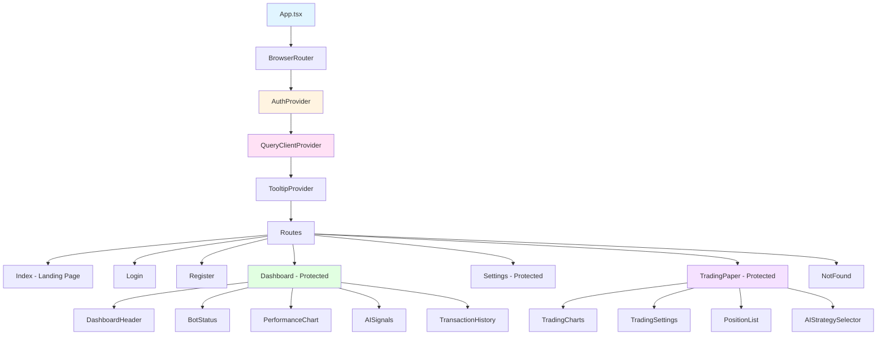

# COMP-FRONTEND-DASHBOARD.md - Frontend Dashboard Component

**Version:** 1.0
**Last Updated:** 2025-10-10
**Status:** Final
**Owner:** Frontend Team

---

## Table of Contents

1. [Component Overview](#1-component-overview)
2. [Application Structure](#2-application-structure)
3. [Core Services](#3-core-services)
4. [State Management](#4-state-management)
5. [Component Architecture](#5-component-architecture)
6. [Design Patterns](#6-design-patterns)
7. [Routing & Navigation](#7-routing--navigation)
8. [Real-time Features](#8-real-time-features)
9. [Performance Optimization](#9-performance-optimization)
10. [Testing Strategy](#10-testing-strategy)

---

## 1. Component Overview

### 1.1 Purpose

The Frontend Dashboard Component provides a modern, responsive web interface for the Bot Core trading platform. It enables users to monitor trading performance, manage paper trading sessions, view AI-generated signals, and configure bot settings through an intuitive UI.

### 1.2 Technology Stack

| Technology | Version | Purpose |
|------------|---------|---------|
| React | 18.3 | UI framework |
| TypeScript | 5.6 | Type-safe development |
| Vite | 6.0 | Build tool & dev server |
| React Router | 7.1 | Client-side routing |
| TanStack Query | 5.62 | Server state management |
| Axios | 1.7 | HTTP client |
| Recharts | 2.15 | Data visualization |
| Shadcn/UI | latest | Component library |
| Tailwind CSS | 3.4 | Utility-first CSS |
| i18next | 24.2 | Internationalization |

### 1.3 Dependencies

**External Services:**
- Rust Core Engine (http://localhost:8080) - Authentication, trading, WebSocket
- Python AI Service (http://localhost:8000) - AI analysis, ML predictions

**Build Dependencies:**
- Node.js 18+ or Bun 1.1+
- pnpm/npm/yarn package manager

### 1.4 Key Features

- **Authentication:** Login, registration, JWT-based auth
- **Paper Trading:** Virtual trading with real-time portfolio tracking
- **AI Signals:** Real-time ML predictions via WebSocket
- **Trading Dashboard:** Position management, P&L tracking, charts
- **Bot Configuration:** Risk settings, strategy selection
- **Internationalization:** Multi-language support (i18n)
- **Responsive Design:** Mobile, tablet, desktop layouts
- **Dark Mode:** Theme switching

---

## 2. Application Structure

### 2.1 Directory Layout

```
nextjs-ui-dashboard/src/
├── App.tsx                        # Main app component (76 lines)
├── main.tsx                       # Application entry point
├── vite-env.d.ts                  # Vite type definitions
├── components/
│   ├── ui/                        # Shadcn/UI components (43 files)
│   ├── landing/                   # Landing page components
│   │   ├── Hero3D.tsx
│   │   ├── FeaturesSection.tsx
│   │   ├── PricingSection.tsx
│   │   ├── TestimonialsSection.tsx
│   │   ├── FAQSection.tsx
│   │   └── CTASection.tsx
│   ├── dashboard/                 # Dashboard components
│   │   ├── DashboardHeader.tsx
│   │   ├── BotStatus.tsx
│   │   ├── BotSettings.tsx
│   │   ├── PerformanceChart.tsx
│   │   ├── AISignals.tsx
│   │   ├── TradingCharts.tsx
│   │   ├── TradingSettings.tsx
│   │   ├── AIStrategySelector.tsx
│   │   └── TransactionHistory.tsx
│   ├── ChatBot.tsx                # AI chatbot widget
│   ├── TradingInterface.tsx       # Main trading UI
│   ├── ProtectedRoute.tsx         # Auth guard
│   └── LanguageSelector.tsx       # i18n switcher
├── pages/
│   ├── Index.tsx                  # Landing page
│   ├── Login.tsx                  # Login page
│   ├── Register.tsx               # Registration page
│   ├── Dashboard.tsx              # Main dashboard
│   ├── Settings.tsx               # User settings
│   ├── TradingPaper.tsx          # Paper trading page
│   └── NotFound.tsx               # 404 page
├── contexts/
│   └── AuthContext.tsx            # Authentication context (142 lines)
├── hooks/
│   ├── useAuth.ts                 # Auth hook (from context)
│   ├── useWebSocket.ts            # WebSocket connection
│   ├── useMarketData.ts           # Market data fetching
│   ├── useTradingApi.ts           # Trading API client
│   ├── usePositions.ts            # Position management
│   ├── useTrades.ts               # Trade history
│   ├── useAccount.ts              # Account info
│   ├── useAIAnalysis.ts           # AI analysis data
│   ├── usePaperTrading.ts         # Paper trading state
│   └── use-toast.ts               # Toast notifications
├── services/
│   ├── api.ts                     # BotCoreApiClient (1500+ lines)
│   └── chatbot.ts                 # Chatbot service
├── utils/
│   ├── formatters.ts              # Number/date formatting
│   └── logger.ts                  # Console logging utility
├── lib/
│   └── utils.ts                   # Utility functions (cn, etc.)
├── i18n/
│   └── index.ts                   # i18n configuration
└── types/
    └── env.d.ts                   # Environment variable types
```

**Total Files:** 150+ files
**Total Lines of Code:** ~8,000+ lines (excluding UI library)

### 2.2 Build Configuration

**vite.config.ts:**
```typescript
import { defineConfig } from 'vite';
import react from '@vitejs/plugin-react';
import path from 'path';

export default defineConfig({
  plugins: [react()],
  resolve: {
    alias: {
      '@': path.resolve(__dirname, './src'),
    },
  },
  server: {
    port: 3000,
    proxy: {
      '/api': {
        target: 'http://localhost:8080',
        changeOrigin: true,
      },
    },
  },
  build: {
    outDir: 'dist',
    sourcemap: true,
    rollupOptions: {
      output: {
        manualChunks: {
          'react-vendor': ['react', 'react-dom', 'react-router-dom'],
          'ui-vendor': ['@radix-ui/react-dialog', '@radix-ui/react-dropdown-menu'],
          'chart-vendor': ['recharts'],
        },
      },
    },
  },
});
```

**Key Features:**
- Path alias `@/` for clean imports
- Proxy API requests to Rust backend
- Code splitting for vendors
- Source maps for debugging
- Hot Module Replacement (HMR)

---

## 3. Core Services

### 3.1 BotCoreApiClient

**Purpose:** Centralized API client for all backend communication.

#### 3.1.1 Structure

```typescript
export class BotCoreApiClient {
  private rustApi: AxiosInstance;
  private pythonAiApi: AxiosInstance;
  public auth: AuthClient;
  public trading: TradingClient;
  public paperTrading: PaperTradingClient;
  public ai: AIClient;
  public market: MarketDataClient;
  public account: AccountClient;

  constructor() {
    this.rustApi = axios.create({
      baseURL: RUST_API_URL,  // http://localhost:8080
      timeout: API_TIMEOUT,   // 10000ms
      headers: {
        'Content-Type': 'application/json',
      },
    });

    this.pythonAiApi = axios.create({
      baseURL: PYTHON_AI_URL,  // http://localhost:8000
      timeout: API_TIMEOUT,
    });

    // Request interceptor (add auth token)
    this.rustApi.interceptors.request.use((config) => {
      const token = this.auth.getAuthToken();
      if (token) {
        config.headers.Authorization = `Bearer ${token}`;
      }
      return config;
    });

    // Response interceptor (handle errors)
    this.rustApi.interceptors.response.use(
      (response) => response,
      (error) => {
        if (error.response?.status === 401) {
          // Unauthorized - clear token and redirect to login
          this.auth.removeAuthToken();
          window.location.href = '/login';
        }
        return Promise.reject(error);
      }
    );

    // Initialize sub-clients
    this.auth = new AuthClient(this.rustApi);
    this.trading = new TradingClient(this.rustApi);
    this.paperTrading = new PaperTradingClient(this.rustApi);
    this.ai = new AIClient(this.pythonAiApi);
    this.market = new MarketDataClient(this.rustApi);
    this.account = new AccountClient(this.rustApi);
  }
}
```

**Spec Reference:** @spec:FR-UI-001

#### 3.1.2 AuthClient

```typescript
export class AuthClient {
  constructor(private api: AxiosInstance) {}

  async login(request: LoginRequest): Promise<LoginResponse> {
    const response = await this.api.post('/auth/login', request);
    return response.data.data;
  }

  async register(request: RegisterRequest): Promise<LoginResponse> {
    const response = await this.api.post('/auth/register', request);
    return response.data.data;
  }

  async verifyToken(): Promise<TokenVerificationResponse> {
    const response = await this.api.get('/auth/verify');
    return response.data.data;
  }

  async getProfile(): Promise<UserProfile> {
    const response = await this.api.get('/auth/profile');
    return response.data.data;
  }

  // Token management (localStorage)
  setAuthToken(token: string): void {
    localStorage.setItem('auth_token', token);
  }

  getAuthToken(): string | null {
    return localStorage.getItem('auth_token');
  }

  removeAuthToken(): void {
    localStorage.removeItem('auth_token');
  }

  isTokenExpired(): boolean {
    const token = this.getAuthToken();
    if (!token) return true;

    try {
      const payload = JSON.parse(atob(token.split('.')[1]));
      return payload.exp * 1000 < Date.now();
    } catch {
      return true;
    }
  }
}
```

**Spec Reference:** @spec:FR-UI-002

#### 3.1.3 TradingClient

```typescript
export class TradingClient {
  constructor(private api: AxiosInstance) {}

  async getBotStatus(): Promise<BotStatus> {
    const response = await this.api.get('/api/bot/status');
    return response.data;
  }

  async getPositions(): Promise<Position[]> {
    const response = await this.api.get('/api/positions');
    return response.data.data;
  }

  async getTradeHistory(): Promise<TradeHistory[]> {
    const response = await this.api.get('/api/trades/history');
    return response.data.data;
  }

  async placeOrder(order: OrderRequest): Promise<OrderResponse> {
    const response = await this.api.post('/api/trading/order', order);
    return response.data.data;
  }

  async closePosition(positionId: string): Promise<void> {
    await this.api.post(`/api/positions/${positionId}/close`);
  }

  async getTradingConfig(): Promise<TradingConfig> {
    const response = await this.api.get('/api/trading/config');
    return response.data.data;
  }

  async updateTradingConfig(config: TradingConfig): Promise<void> {
    await this.api.put('/api/trading/config', config);
  }
}
```

**Spec Reference:** @spec:FR-UI-003

#### 3.1.4 PaperTradingClient

```typescript
export class PaperTradingClient {
  constructor(private api: AxiosInstance) {}

  async startPaperTrading(settings: PaperTradingSettings): Promise<void> {
    await this.api.post('/api/paper/start', settings);
  }

  async stopPaperTrading(): Promise<void> {
    await this.api.post('/api/paper/stop');
  }

  async getPortfolio(): Promise<PortfolioMetrics> {
    const response = await this.api.get('/api/paper/portfolio');
    return response.data.data;
  }

  async getSettings(): Promise<PaperTradingSettings> {
    const response = await this.api.get('/api/paper/settings');
    return response.data.data;
  }

  async updateSettings(settings: PaperTradingSettings): Promise<void> {
    await this.api.put('/api/paper/settings', settings);
  }

  async resetPaperTrading(): Promise<void> {
    await this.api.post('/api/paper/reset');
  }
}
```

**Spec Reference:** @spec:FR-UI-004

#### 3.1.5 AIClient

```typescript
export class AIClient {
  constructor(private api: AxiosInstance) {}

  async analyzeMarket(request: AIAnalysisRequest): Promise<AISignalResponse> {
    const response = await this.api.post('/api/v1/analyze', request);
    return response.data;
  }

  async getServiceInfo(): Promise<AIServiceInfo> {
    const response = await this.api.get('/api/v1/info');
    return response.data;
  }

  async getModelInfo(): Promise<AIModelInfo> {
    const response = await this.api.get('/api/v1/model/info');
    return response.data;
  }

  async recommendStrategy(
    context: AIStrategyContext
  ): Promise<StrategyRecommendation[]> {
    const response = await this.api.post('/api/v1/strategy/recommend', context);
    return response.data.recommendations;
  }

  async analyzeMarketCondition(
    data: any
  ): Promise<MarketConditionAnalysis> {
    const response = await this.api.post('/api/v1/market/analyze-condition', data);
    return response.data;
  }
}
```

**Spec Reference:** @spec:FR-UI-005

---

## 4. State Management

### 4.1 Authentication State (Context API)

**Purpose:** Global authentication state management.

#### 4.1.1 AuthContext

```typescript
interface AuthContextType {
  isAuthenticated: boolean;
  user: UserProfile | null;
  login: (email: string, password: string) => Promise<boolean>;
  register: (email: string, password: string, fullName?: string) => Promise<boolean>;
  logout: () => void;
  loading: boolean;
  error: string | null;
}

export const AuthProvider: React.FC<{ children: React.ReactNode }> = ({ children }) => {
  const [isAuthenticated, setIsAuthenticated] = useState(false);
  const [user, setUser] = useState<UserProfile | null>(null);
  const [loading, setLoading] = useState(true);
  const [error, setError] = useState<string | null>(null);

  useEffect(() => {
    // Check if user is already logged in
    const initializeAuth = async () => {
      const token = apiClient.auth.getAuthToken();

      if (token && !apiClient.auth.isTokenExpired()) {
        try {
          const userProfile = await apiClient.auth.getProfile();
          setUser(userProfile);
          setIsAuthenticated(true);
        } catch (error) {
          logger.error("Failed to verify token:", error);
          apiClient.auth.removeAuthToken();
        }
      }
      setLoading(false);
    };

    initializeAuth();
  }, []);

  const login = async (email: string, password: string): Promise<boolean> => {
    setLoading(true);
    setError(null);

    try {
      const loginRequest: LoginRequest = { email, password };
      const response = await apiClient.auth.login(loginRequest);

      apiClient.auth.setAuthToken(response.token);
      setUser(response.user);
      setIsAuthenticated(true);

      return true;
    } catch (error: unknown) {
      logger.error("Login failed:", error);
      setError(error instanceof Error ? error.message : "Login failed");
      return false;
    } finally {
      setLoading(false);
    }
  };

  const logout = () => {
    apiClient.auth.removeAuthToken();
    setIsAuthenticated(false);
    setUser(null);
    setError(null);
  };

  return (
    <AuthContext.Provider value={{ isAuthenticated, user, login, register, logout, loading, error }}>
      {children}
    </AuthContext.Provider>
  );
};

export const useAuth = () => {
  const context = useContext(AuthContext);
  if (context === undefined) {
    throw new Error("useAuth must be used within an AuthProvider");
  }
  return context;
};
```

**Spec Reference:** @spec:FR-UI-006

### 4.2 Server State (TanStack Query)

**Purpose:** Cache and manage server data.

#### 4.2.1 useMarketData Hook

```typescript
export const useMarketData = (symbol: string, timeframe: string) => {
  return useQuery({
    queryKey: ['marketData', symbol, timeframe],
    queryFn: async () => {
      const response = await apiClient.market.getChartData(symbol, timeframe);
      return response;
    },
    refetchInterval: 60000,  // Refetch every 60 seconds
    staleTime: 30000,        // Data is fresh for 30 seconds
  });
};
```

#### 4.2.2 usePositions Hook

```typescript
export const usePositions = () => {
  return useQuery({
    queryKey: ['positions'],
    queryFn: async () => {
      const positions = await apiClient.trading.getPositions();
      return positions;
    },
    refetchInterval: 10000,  // Refetch every 10 seconds
  });
};
```

#### 4.2.3 usePaperTrading Hook

```typescript
export const usePaperTrading = () => {
  const [state, setState] = useState<PaperTradingState>({
    isActive: false,
    portfolio: defaultPortfolio,
    openTrades: [],
    closedTrades: [],
    settings: defaultSettings,
    recentSignals: [],
    isLoading: false,
    error: null,
    lastUpdated: null,
    updateCounter: 0,
  });

  const loadPortfolio = useCallback(async () => {
    try {
      const portfolio = await apiClient.paperTrading.getPortfolio();
      setState((prev) => ({
        ...prev,
        portfolio,
        lastUpdated: new Date(),
      }));
    } catch (error) {
      setState((prev) => ({ ...prev, error: error.message }));
    }
  }, []);

  const startTrading = useCallback(async (settings: PaperTradingSettings) => {
    try {
      await apiClient.paperTrading.startPaperTrading(settings);
      setState((prev) => ({ ...prev, isActive: true, settings }));
      loadPortfolio();
    } catch (error) {
      setState((prev) => ({ ...prev, error: error.message }));
    }
  }, [loadPortfolio]);

  const stopTrading = useCallback(async () => {
    await apiClient.paperTrading.stopPaperTrading();
    setState((prev) => ({ ...prev, isActive: false }));
  }, []);

  return {
    state,
    startTrading,
    stopTrading,
    loadPortfolio,
  };
};
```

**Spec Reference:** @spec:FR-UI-007

---

## 5. Component Architecture

### 5.1 Application Component Tree



### 5.2 Page Components

#### 5.2.1 Dashboard Page

**Purpose:** Main dashboard showing trading overview.

```typescript
const Dashboard: React.FC = () => {
  const { user } = useAuth();
  const { data: botStatus } = useBotStatus();
  const { data: positions } = usePositions();
  const { data: tradeHistory } = useTradeHistory();

  return (
    <div className="container mx-auto p-4">
      <DashboardHeader user={user} />

      <div className="grid grid-cols-1 md:grid-cols-2 lg:grid-cols-3 gap-4 mt-4">
        <Card>
          <CardHeader>
            <CardTitle>Bot Status</CardTitle>
          </CardHeader>
          <CardContent>
            <BotStatus status={botStatus} />
          </CardContent>
        </Card>

        <Card>
          <CardHeader>
            <CardTitle>Performance</CardTitle>
          </CardHeader>
          <CardContent>
            <PerformanceChart data={tradeHistory} />
          </CardContent>
        </Card>

        <Card>
          <CardHeader>
            <CardTitle>AI Signals</CardTitle>
          </CardHeader>
          <CardContent>
            <AISignals />
          </CardContent>
        </Card>
      </div>

      <Card className="mt-4">
        <CardHeader>
          <CardTitle>Open Positions</CardTitle>
        </CardHeader>
        <CardContent>
          <PositionTable positions={positions} />
        </CardContent>
      </Card>

      <Card className="mt-4">
        <CardHeader>
          <CardTitle>Transaction History</CardTitle>
        </CardHeader>
        <CardContent>
          <TransactionHistory trades={tradeHistory} />
        </CardContent>
      </Card>
    </div>
  );
};
```

**Spec Reference:** @spec:FR-UI-008

#### 5.2.2 TradingPaper Page

**Purpose:** Paper trading interface.

```typescript
const TradingPaper: React.FC = () => {
  const { state, startTrading, stopTrading, loadPortfolio } = usePaperTrading();
  const { signals } = useAISignals();

  useEffect(() => {
    if (state.isActive) {
      const interval = setInterval(() => {
        loadPortfolio();
      }, 5000);  // Update every 5 seconds

      return () => clearInterval(interval);
    }
  }, [state.isActive, loadPortfolio]);

  return (
    <div className="container mx-auto p-4">
      <div className="flex justify-between items-center mb-4">
        <h1 className="text-3xl font-bold">Paper Trading</h1>
        <div className="flex gap-2">
          {!state.isActive ? (
            <Button onClick={() => startTrading(state.settings)}>
              Start Trading
            </Button>
          ) : (
            <Button variant="destructive" onClick={stopTrading}>
              Stop Trading
            </Button>
          )}
        </div>
      </div>

      <div className="grid grid-cols-1 lg:grid-cols-3 gap-4">
        <Card className="lg:col-span-2">
          <CardHeader>
            <CardTitle>Portfolio Overview</CardTitle>
          </CardHeader>
          <CardContent>
            <div className="grid grid-cols-2 md:grid-cols-4 gap-4">
              <MetricCard
                label="Balance"
                value={formatCurrency(state.portfolio.current_balance)}
              />
              <MetricCard
                label="Equity"
                value={formatCurrency(state.portfolio.equity)}
              />
              <MetricCard
                label="Total P&L"
                value={formatCurrency(state.portfolio.total_pnl)}
                valueClassName={state.portfolio.total_pnl >= 0 ? 'text-green-600' : 'text-red-600'}
              />
              <MetricCard
                label="Win Rate"
                value={formatPercent(state.portfolio.win_rate)}
              />
            </div>
          </CardContent>
        </Card>

        <Card>
          <CardHeader>
            <CardTitle>AI Signals</CardTitle>
          </CardHeader>
          <CardContent>
            <AISignalList signals={signals} />
          </CardContent>
        </Card>
      </div>

      <div className="grid grid-cols-1 lg:grid-cols-2 gap-4 mt-4">
        <Card>
          <CardHeader>
            <CardTitle>Open Positions</CardTitle>
          </CardHeader>
          <CardContent>
            <PositionTable positions={state.openTrades} />
          </CardContent>
        </Card>

        <Card>
          <CardHeader>
            <CardTitle>Trading Chart</CardTitle>
          </CardHeader>
          <CardContent>
            <TradingCharts />
          </CardContent>
        </Card>
      </div>

      <Card className="mt-4">
        <CardHeader>
          <CardTitle>Closed Trades</CardTitle>
        </CardHeader>
        <CardContent>
          <TradeHistoryTable trades={state.closedTrades} />
        </CardContent>
      </Card>
    </div>
  );
};
```

**Spec Reference:** @spec:FR-UI-009

---

## 6. Design Patterns

### 6.1 Compound Component Pattern

**Purpose:** Create flexible, composable components.

**Example: Card Component**
```typescript
// Card.tsx
const Card = ({ className, children, ...props }: CardProps) => (
  <div className={cn("rounded-lg border bg-card", className)} {...props}>
    {children}
  </div>
);

const CardHeader = ({ className, children, ...props }: CardHeaderProps) => (
  <div className={cn("flex flex-col space-y-1.5 p-6", className)} {...props}>
    {children}
  </div>
);

const CardTitle = ({ className, children, ...props }: CardTitleProps) => (
  <h3 className={cn("text-2xl font-semibold", className)} {...props}>
    {children}
  </h3>
);

const CardContent = ({ className, children, ...props }: CardContentProps) => (
  <div className={cn("p-6 pt-0", className)} {...props}>
    {children}
  </div>
);

export { Card, CardHeader, CardTitle, CardContent };
```

**Usage:**
```typescript
<Card>
  <CardHeader>
    <CardTitle>Dashboard</CardTitle>
  </CardHeader>
  <CardContent>
    <p>Content goes here</p>
  </CardContent>
</Card>
```

### 6.2 Custom Hook Pattern

**Purpose:** Encapsulate reusable logic.

**Example: useWebSocket Hook**
```typescript
export const useWebSocket = (url: string) => {
  const [messages, setMessages] = useState<any[]>([]);
  const [isConnected, setIsConnected] = useState(false);
  const wsRef = useRef<WebSocket | null>(null);

  useEffect(() => {
    const ws = new WebSocket(url);

    ws.onopen = () => {
      setIsConnected(true);
      logger.info('WebSocket connected');
    };

    ws.onmessage = (event) => {
      const message = JSON.parse(event.data);
      setMessages((prev) => [...prev, message]);
    };

    ws.onclose = () => {
      setIsConnected(false);
      logger.info('WebSocket disconnected');
    };

    ws.onerror = (error) => {
      logger.error('WebSocket error:', error);
    };

    wsRef.current = ws;

    return () => {
      ws.close();
    };
  }, [url]);

  const sendMessage = useCallback((message: any) => {
    if (wsRef.current?.readyState === WebSocket.OPEN) {
      wsRef.current.send(JSON.stringify(message));
    }
  }, []);

  return { messages, isConnected, sendMessage };
};
```

### 6.3 Higher-Order Component Pattern

**Purpose:** Add functionality to components.

**Example: ProtectedRoute**
```typescript
const ProtectedRoute: React.FC<{ children: React.ReactNode }> = ({ children }) => {
  const { isAuthenticated, loading } = useAuth();
  const location = useLocation();

  if (loading) {
    return <LoadingSpinner />;
  }

  if (!isAuthenticated) {
    return <Navigate to="/login" state={{ from: location }} replace />;
  }

  return <>{children}</>;
};

export default ProtectedRoute;
```

**Usage:**
```typescript
<Route
  path="/dashboard"
  element={
    <ProtectedRoute>
      <Dashboard />
    </ProtectedRoute>
  }
/>
```

### 6.4 Render Props Pattern

**Purpose:** Share code between components.

**Example: DataFetcher Component**
```typescript
interface DataFetcherProps<T> {
  url: string;
  render: (data: T | null, loading: boolean, error: Error | null) => React.ReactNode;
}

const DataFetcher = <T,>({ url, render }: DataFetcherProps<T>) => {
  const [data, setData] = useState<T | null>(null);
  const [loading, setLoading] = useState(true);
  const [error, setError] = useState<Error | null>(null);

  useEffect(() => {
    fetch(url)
      .then((res) => res.json())
      .then((data) => {
        setData(data);
        setLoading(false);
      })
      .catch((err) => {
        setError(err);
        setLoading(false);
      });
  }, [url]);

  return <>{render(data, loading, error)}</>;
};
```

**Usage:**
```typescript
<DataFetcher<Position[]>
  url="/api/positions"
  render={(data, loading, error) => {
    if (loading) return <Spinner />;
    if (error) return <ErrorMessage error={error} />;
    return <PositionTable positions={data} />;
  }}
/>
```

---

## 7. Routing & Navigation

### 7.1 Route Configuration

```typescript
const App = () => (
  <QueryClientProvider client={queryClient}>
    <AuthProvider>
      <TooltipProvider>
        <Toaster />
        <Sonner />
        <BrowserRouter>
          <Suspense fallback={<LoadingFallback />}>
            <Routes>
              {/* Public routes */}
              <Route path="/" element={<Index />} />
              <Route path="/login" element={<Login />} />
              <Route path="/register" element={<Register />} />

              {/* Protected routes */}
              <Route
                path="/dashboard"
                element={
                  <ProtectedRoute>
                    <Dashboard />
                  </ProtectedRoute>
                }
              />
              <Route
                path="/settings"
                element={
                  <ProtectedRoute>
                    <Settings />
                  </ProtectedRoute>
                }
              />
              <Route
                path="/trading-paper"
                element={
                  <ProtectedRoute>
                    <TradingPaper />
                  </ProtectedRoute>
                }
              />

              {/* Catch-all route */}
              <Route path="*" element={<NotFound />} />
            </Routes>
          </Suspense>
        </BrowserRouter>
      </TooltipProvider>
    </AuthProvider>
  </QueryClientProvider>
);
```

### 7.2 Navigation Links

```typescript
const navigationLinks = [
  { name: 'Dashboard', path: '/dashboard', icon: LayoutDashboard },
  { name: 'Paper Trading', path: '/trading-paper', icon: TrendingUp },
  { name: 'Settings', path: '/settings', icon: Settings },
];

const Sidebar = () => {
  const location = useLocation();

  return (
    <nav className="flex flex-col gap-2">
      {navigationLinks.map((link) => (
        <Link
          key={link.path}
          to={link.path}
          className={cn(
            "flex items-center gap-2 px-4 py-2 rounded-lg",
            location.pathname === link.path
              ? "bg-primary text-primary-foreground"
              : "hover:bg-muted"
          )}
        >
          <link.icon className="w-5 h-5" />
          <span>{link.name}</span>
        </Link>
      ))}
    </nav>
  );
};
```

---

## 8. Real-time Features

### 8.1 WebSocket Connection

**Purpose:** Real-time AI signals from Python AI service.

```typescript
export const useAISignals = () => {
  const [signals, setSignals] = useState<AISignal[]>([]);
  const [isConnected, setIsConnected] = useState(false);
  const wsRef = useRef<WebSocket | null>(null);

  useEffect(() => {
    const ws = new WebSocket('ws://localhost:8000/ws');

    ws.onopen = () => {
      setIsConnected(true);
      logger.info('Connected to AI WebSocket');
    };

    ws.onmessage = (event) => {
      const message = JSON.parse(event.data);

      if (message.type === 'AISignalReceived') {
        const signal: AISignal = {
          id: crypto.randomUUID(),
          signal: message.data.signal,
          symbol: message.data.symbol || 'BTCUSDT',
          confidence: message.data.confidence,
          timestamp: new Date(message.timestamp),
          reasoning: message.data.reasoning,
          strategy_scores: message.data.strategy_scores,
          market_analysis: message.data.market_analysis,
          risk_assessment: message.data.risk_assessment,
        };

        setSignals((prev) => [signal, ...prev].slice(0, 20));  // Keep last 20 signals

        // Show toast notification
        toast({
          title: `New AI Signal: ${signal.signal.toUpperCase()}`,
          description: `${signal.symbol} - Confidence: ${signal.confidence}%`,
          variant: signal.signal === 'long' ? 'default' : 'destructive',
        });
      }
    };

    ws.onclose = () => {
      setIsConnected(false);
      logger.info('Disconnected from AI WebSocket');
    };

    ws.onerror = (error) => {
      logger.error('AI WebSocket error:', error);
    };

    wsRef.current = ws;

    return () => {
      ws.close();
    };
  }, []);

  return { signals, isConnected };
};
```

**Spec Reference:** @spec:FR-UI-010

### 8.2 Real-time Data Updates

**Strategy:** Combine WebSocket + Polling

```typescript
// WebSocket for instant updates
const { signals } = useAISignals();

// Polling for data consistency
const { data: portfolio } = useQuery({
  queryKey: ['portfolio'],
  queryFn: () => apiClient.paperTrading.getPortfolio(),
  refetchInterval: 5000,  // Poll every 5 seconds
});

// WebSocket + immediate refetch on signal
useEffect(() => {
  if (signals.length > 0) {
    queryClient.invalidateQueries({ queryKey: ['portfolio'] });
  }
}, [signals]);
```

---

## 9. Performance Optimization

### 9.1 Code Splitting

**Lazy Loading Pages:**
```typescript
const Index = lazy(() => import("./pages/Index"));
const Login = lazy(() => import("./pages/Login"));
const Register = lazy(() => import("./pages/Register"));
const Dashboard = lazy(() => import("./pages/Dashboard"));
const Settings = lazy(() => import("./pages/Settings"));
const TradingPaper = lazy(() => import("./pages/TradingPaper"));
```

**Vendor Chunking (vite.config.ts):**
```typescript
build: {
  rollupOptions: {
    output: {
      manualChunks: {
        'react-vendor': ['react', 'react-dom', 'react-router-dom'],
        'ui-vendor': ['@radix-ui/react-dialog', '@radix-ui/react-dropdown-menu'],
        'chart-vendor': ['recharts'],
      },
    },
  },
}
```

### 9.2 Memoization

**React.memo:**
```typescript
const PositionRow = React.memo<{ position: Position }>(({ position }) => {
  return (
    <tr>
      <td>{position.symbol}</td>
      <td>{position.side}</td>
      <td>{formatCurrency(position.entry_price)}</td>
      <td className={cn(position.unrealized_pnl >= 0 ? 'text-green-600' : 'text-red-600')}>
        {formatCurrency(position.unrealized_pnl)}
      </td>
    </tr>
  );
});
```

**useMemo & useCallback:**
```typescript
const filteredPositions = useMemo(() => {
  return positions.filter((p) => p.status === 'open');
}, [positions]);

const handleClosePosition = useCallback((positionId: string) => {
  apiClient.trading.closePosition(positionId);
}, []);
```

### 9.3 Virtual Scrolling

**For Large Lists:**
```typescript
import { FixedSizeList } from 'react-window';

const TradeHistoryList: React.FC<{ trades: Trade[] }> = ({ trades }) => {
  const Row = ({ index, style }: { index: number; style: React.CSSProperties }) => (
    <div style={style}>
      <TradeRow trade={trades[index]} />
    </div>
  );

  return (
    <FixedSizeList
      height={600}
      itemCount={trades.length}
      itemSize={50}
      width="100%"
    >
      {Row}
    </FixedSizeList>
  );
};
```

---

## 10. Testing Strategy

### 10.1 Unit Tests

**Component Testing:**
```typescript
import { render, screen } from '@testing-library/react';
import { BotStatus } from '@/components/dashboard/BotStatus';

describe('BotStatus Component', () => {
  it('renders bot status correctly', () => {
    const status = {
      status: 'running' as const,
      uptime: 3600000,
      active_positions: 3,
      total_trades: 10,
      total_pnl: 1250.50,
      last_update: '2025-01-10T12:00:00Z',
    };

    render(<BotStatus status={status} />);

    expect(screen.getByText('Running')).toBeInTheDocument();
    expect(screen.getByText('3 Active Positions')).toBeInTheDocument();
    expect(screen.getByText('$1,250.50')).toBeInTheDocument();
  });
});
```

**Hook Testing:**
```typescript
import { renderHook, waitFor } from '@testing-library/react';
import { usePositions } from '@/hooks/usePositions';

describe('usePositions Hook', () => {
  it('fetches positions successfully', async () => {
    const { result } = renderHook(() => usePositions());

    await waitFor(() => expect(result.current.isSuccess).toBe(true));

    expect(result.current.data).toBeDefined();
    expect(Array.isArray(result.current.data)).toBe(true);
  });
});
```

### 10.2 Integration Tests

**API Integration:**
```typescript
import { BotCoreApiClient } from '@/services/api';

describe('BotCoreApiClient', () => {
  let apiClient: BotCoreApiClient;

  beforeEach(() => {
    apiClient = new BotCoreApiClient();
  });

  it('should login successfully', async () => {
    const response = await apiClient.auth.login({
      email: 'test@example.com',
      password: 'password123',
    });

    expect(response.token).toBeDefined();
    expect(response.user.email).toBe('test@example.com');
  });
});
```

### 10.3 E2E Tests (Playwright)

**Login Flow:**
```typescript
import { test, expect } from '@playwright/test';

test('user can login successfully', async ({ page }) => {
  await page.goto('http://localhost:3000/login');

  await page.fill('input[name="email"]', 'test@example.com');
  await page.fill('input[name="password"]', 'password123');
  await page.click('button[type="submit"]');

  await expect(page).toHaveURL('http://localhost:3000/dashboard');
  await expect(page.locator('text=Dashboard')).toBeVisible();
});
```

---

## Appendices

### A. Functional Requirements Mapping

| Requirement | Module | Implementation |
|-------------|--------|----------------|
| FR-UI-001 | services/api.ts | BotCoreApiClient |
| FR-UI-002 | contexts/AuthContext.tsx | AuthProvider, useAuth |
| FR-UI-003 | hooks/useTradingApi.ts | Trading API hooks |
| FR-UI-004 | hooks/usePaperTrading.ts | Paper trading state |
| FR-UI-005 | hooks/useAIAnalysis.ts | AI analysis integration |
| FR-UI-006 | components/ProtectedRoute.tsx | Route guards |
| FR-UI-007 | hooks/useWebSocket.ts | Real-time WebSocket |
| FR-UI-008 | pages/Dashboard.tsx | Main dashboard |
| FR-UI-009 | pages/TradingPaper.tsx | Paper trading UI |
| FR-UI-010 | hooks/useAISignals.ts | Real-time AI signals |

### B. Environment Variables

```env
VITE_RUST_API_URL=http://localhost:8080
VITE_PYTHON_AI_URL=http://localhost:8000
VITE_API_TIMEOUT=10000
VITE_WS_URL=ws://localhost:8000/ws
```

### C. Related Documents

- [API_SPEC.md](../2.3-api/API_SPEC.md) - Backend API contracts
- [COMP-RUST-AUTH.md](./COMP-RUST-AUTH.md) - Authentication backend
- [COMP-PYTHON-ML.md](./COMP-PYTHON-ML.md) - AI service integration
- [UI-UX.md](../2.4-ui-ux/UI-UX.md) - Design specifications

### D. Future Enhancements

1. **PWA Support:** Service workers, offline mode
2. **Mobile App:** React Native version
3. **Advanced Charts:** TradingView integration
4. **Social Trading:** Follow other traders
5. **Notifications:** Push notifications for trades
6. **Multi-Language:** Complete i18n support for 10+ languages

---

**End of Document**
