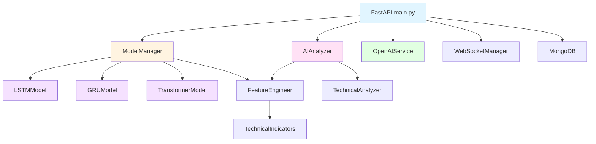
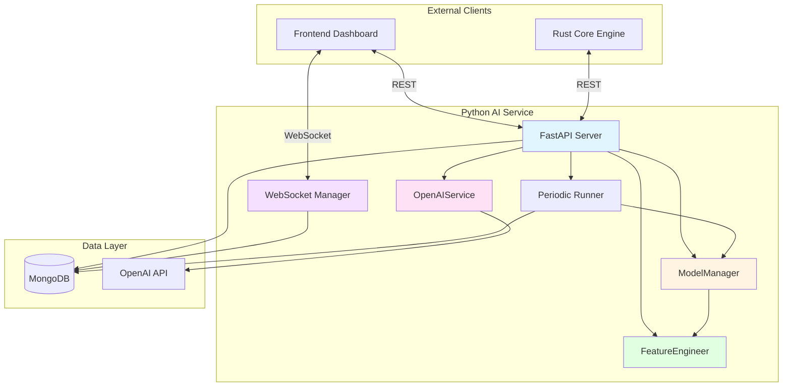
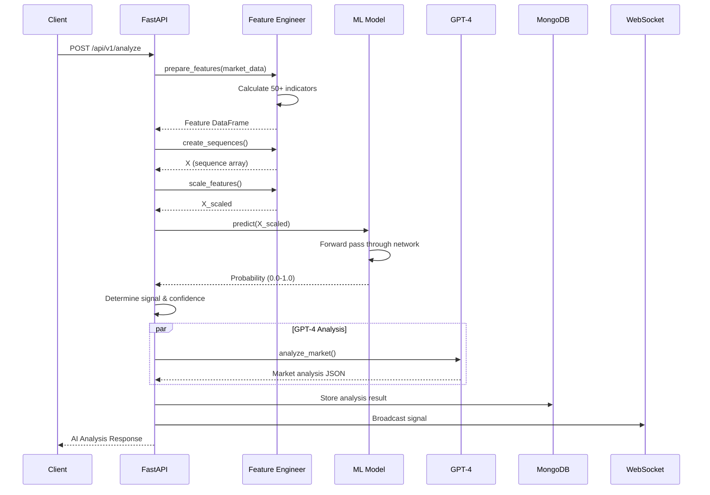

# COMP-PYTHON-ML.md - Python ML Component

**Version:** 1.0
**Last Updated:** 2025-10-10
**Status:** Final
**Owner:** AI/ML Team

---

## Table of Contents

1. [Component Overview](#1-component-overview)
2. [Module Structure](#2-module-structure)
3. [ML Models](#3-ml-models)
4. [AI Services](#4-ai-services)
5. [Component Architecture](#5-component-architecture)
6. [Design Patterns](#6-design-patterns)
7. [Data Pipeline](#7-data-pipeline)
8. [API Integration](#8-api-integration)
9. [Performance & Scaling](#9-performance--scaling)
10. [Model Training & Deployment](#10-model-training--deployment)

---

## 1. Component Overview

### 1.1 Purpose

The Python ML Component provides machine learning-based price prediction, technical analysis, and AI-powered trading signals using deep learning models (LSTM, GRU, Transformer) and GPT-4 integration for market analysis.

### 1.2 Technology Stack

| Technology | Version | Purpose |
|------------|---------|---------|
| Python | 3.11+ | Core language |
| FastAPI | ^0.115 | REST API framework |
| TensorFlow | 2.18.0 | Deep learning framework |
| PyTorch | 2.5.1 | Alternative DL framework |
| OpenAI | ^1.57 | GPT-4 integration |
| pandas | ^2.2 | Data manipulation |
| numpy | ^2.0 | Numerical computing |
| ta | ^0.11 | Technical indicators |
| motor | ^3.6 | Async MongoDB driver |

### 1.3 Dependencies

**External Services:**
- MongoDB (port 27017) - AI analysis results storage
- OpenAI API - GPT-4o-mini for market analysis
- Binance API - Market data (indirect, via Rust engine)

**Internal Dependencies:**
- Rust Core Engine - Requests AI analysis
- Frontend Dashboard - Displays signals

### 1.4 Key Features

- **3 ML Models:** LSTM, GRU, Transformer for price prediction
- **GPT-4 Integration:** Natural language market analysis
- **Technical Indicators:** 50+ indicators via `ta` library
- **Real-time WebSocket:** Broadcasting AI signals to clients
- **Periodic Analysis:** Automated analysis every 5 minutes
- **Feature Engineering:** Automated feature extraction
- **Model Management:** Training, saving, loading models
- **REST API:** 15+ endpoints for AI services

---

## 2. Module Structure

### 2.1 Directory Layout

```
python-ai-service/
├── main.py                      # FastAPI application (2300+ lines)
├── config/
│   └── config.py                # Configuration management
├── models/
│   ├── __init__.py
│   ├── lstm_model.py            # LSTM implementation (260 lines)
│   ├── gru_model.py             # GRU implementation (260 lines)
│   ├── transformer_model.py     # Transformer implementation (290 lines)
│   └── model_manager.py         # Model lifecycle (400 lines)
├── services/
│   ├── ai_analyzer.py           # Main AI service (400 lines)
│   ├── technical_analyzer.py    # Technical indicators (300 lines)
│   └── openai_service.py        # GPT-4 integration (200 lines)
├── features/
│   ├── __init__.py
│   ├── feature_engineering.py   # Feature extraction (310 lines)
│   └── technical_indicators.py  # Indicator calculation (300 lines)
├── utils/
│   ├── logger.py                # Logging utilities
│   └── helpers.py               # Helper functions
├── requirements.txt             # Production dependencies
├── requirements.dev.txt         # Development dependencies
└── requirements.test.txt        # Test dependencies
```

**Total Lines of Code:** ~4,800+ lines

### 2.2 Module Dependencies



---

## 3. ML Models

### 3.1 LSTM Model

**Purpose:** Long Short-Term Memory network for sequential price prediction.

#### 3.1.1 Architecture

```python
class LSTMModel:
    def __init__(self):
        self.config = config.get_model_config()
        self.model = None
        self.history = None

    def build_model(self, input_shape: Tuple[int, int]) -> Model:
        sequence_length, features_count = input_shape

        model = Sequential([
            # First LSTM layer
            LSTM(
                units=self.config.get("hidden_size", 64),
                return_sequences=True,
                input_shape=(sequence_length, features_count),
            ),
            BatchNormalization(),
            Dropout(self.config.get("dropout", 0.2)),

            # Second LSTM layer
            LSTM(units=hidden_size // 2, return_sequences=True),
            BatchNormalization(),
            Dropout(0.2),

            # Third LSTM layer
            LSTM(units=hidden_size // 4, return_sequences=False),
            BatchNormalization(),
            Dropout(0.2),

            # Dense layers
            Dense(32, activation="relu"),
            BatchNormalization(),
            Dropout(0.1),
            Dense(16, activation="relu"),
            BatchNormalization(),
            Dropout(0.1),

            # Output layer (sigmoid for probability)
            Dense(1, activation="sigmoid"),
        ])

        model.compile(
            optimizer=Adam(learning_rate=self.config.get("learning_rate", 0.001)),
            loss="binary_crossentropy",
            metrics=["accuracy", "precision", "recall"],
        )

        return model
```

**Key Features:**
- **Architecture:** 3-layer LSTM + 2 Dense layers
- **Hidden Units:** 64 -> 32 -> 16
- **Regularization:** BatchNormalization + Dropout (0.2, 0.1)
- **Output:** Sigmoid activation (probability: 0=sell, 1=buy)
- **Loss:** Binary cross-entropy
- **Optimizer:** Adam with learning rate 0.001

**Spec Reference:** @spec:FR-AI-001

#### 3.1.2 Training Process

```python
def train(
    self,
    X_train: np.ndarray,
    y_train: np.ndarray,
    X_val: Optional[np.ndarray] = None,
    y_val: Optional[np.ndarray] = None,
    save_path: Optional[str] = None,
) -> Dict[str, Any]:

    # Callbacks
    callbacks = [
        EarlyStopping(
            monitor="val_loss" if X_val is not None else "loss",
            patience=10,
            restore_best_weights=True,
        ),
        ReduceLROnPlateau(
            monitor="val_loss" if X_val is not None else "loss",
            factor=0.5,
            patience=5,
            min_lr=1e-7,
        ),
        ModelCheckpoint(
            save_path,
            monitor="val_loss",
            save_best_only=True,
        ),
    ]

    self.history = self.model.fit(
        X_train,
        y_train,
        epochs=self.config.get("epochs", 100),
        batch_size=self.config.get("batch_size", 32),
        validation_data=(X_val, y_val),
        callbacks=callbacks,
    )

    return {
        "final_loss": self.history.history["loss"][-1],
        "final_accuracy": self.history.history["accuracy"][-1],
        "final_val_loss": self.history.history["val_loss"][-1],
        "final_val_accuracy": self.history.history["val_accuracy"][-1],
    }
```

**Training Parameters:**
| Parameter | Default | Description |
|-----------|---------|-------------|
| Epochs | 100 | Maximum training epochs |
| Batch Size | 32 | Samples per gradient update |
| Early Stopping Patience | 10 | Epochs without improvement before stopping |
| LR Reduction Factor | 0.5 | Learning rate multiplier on plateau |
| LR Reduction Patience | 5 | Epochs on plateau before LR reduction |
| Min Learning Rate | 1e-7 | Minimum learning rate |

**Spec Reference:** @spec:FR-AI-002

---

### 3.2 GRU Model

**Purpose:** Gated Recurrent Unit network (simpler alternative to LSTM).

#### 3.2.1 Architecture

```python
def build_model(self, input_shape: Tuple[int, int]) -> Model:
    model = Sequential([
        # First GRU layer
        GRU(
            units=self.config.get("hidden_size", 64),
            return_sequences=True,
            input_shape=input_shape,
        ),
        BatchNormalization(),
        Dropout(0.2),

        # Second GRU layer
        GRU(units=hidden_size // 2, return_sequences=True),
        BatchNormalization(),
        Dropout(0.2),

        # Third GRU layer
        GRU(units=hidden_size // 4, return_sequences=False),
        BatchNormalization(),
        Dropout(0.2),

        # Dense layers
        Dense(32, activation="relu"),
        BatchNormalization(),
        Dropout(0.1),
        Dense(16, activation="relu"),
        BatchNormalization(),
        Dropout(0.1),

        # Output
        Dense(1, activation="sigmoid"),
    ])

    model.compile(
        optimizer=Adam(learning_rate=0.001),
        loss="binary_crossentropy",
        metrics=["accuracy", "precision", "recall"],
    )

    return model
```

**Differences from LSTM:**
- **Faster Training:** GRU has fewer parameters (2 gates vs. 3 gates in LSTM)
- **Lower Memory:** ~25% less memory usage
- **Comparable Performance:** Often similar accuracy to LSTM on financial data

**Spec Reference:** @spec:FR-AI-001

---

### 3.3 Transformer Model

**Purpose:** Attention-based architecture for capturing long-range dependencies.

#### 3.3.1 Architecture

```python
def build_model(self, input_shape: Tuple[int, int]) -> Model:
    inputs = Input(shape=input_shape)

    # Positional encoding
    x = self.positional_encoding(inputs)

    # Multi-head attention layers
    for _ in range(self.config.get("num_transformer_blocks", 2)):
        # Multi-head attention
        attention_output = MultiHeadAttention(
            num_heads=self.config.get("num_heads", 4),
            key_dim=self.config.get("key_dim", 32),
        )(x, x)

        attention_output = Dropout(0.2)(attention_output)
        x = LayerNormalization()(x + attention_output)

        # Feed-forward network
        ffn_output = Dense(
            self.config.get("ffn_units", 128),
            activation="relu"
        )(x)
        ffn_output = Dropout(0.2)(ffn_output)
        ffn_output = Dense(input_shape[-1])(ffn_output)

        x = LayerNormalization()(x + ffn_output)

    # Global average pooling
    x = GlobalAveragePooling1D()(x)

    # Dense layers
    x = Dense(64, activation="relu")(x)
    x = BatchNormalization()(x)
    x = Dropout(0.2)(x)
    x = Dense(32, activation="relu")(x)
    x = BatchNormalization()(x)
    x = Dropout(0.1)(x)

    # Output
    outputs = Dense(1, activation="sigmoid")(x)

    model = Model(inputs=inputs, outputs=outputs)

    model.compile(
        optimizer=Adam(learning_rate=0.001),
        loss="binary_crossentropy",
        metrics=["accuracy", "precision", "recall"],
    )

    return model
```

**Key Features:**
- **Multi-Head Attention:** 4 attention heads
- **Transformer Blocks:** 2 blocks (configurable)
- **Positional Encoding:** Captures temporal information
- **Layer Normalization:** Stabilizes training
- **Global Pooling:** Aggregates sequence information

**Advantages:**
- **Parallelizable:** Faster training than RNNs
- **Long-Range Dependencies:** Captures patterns across entire sequence
- **Attention Visualization:** Can inspect what model focuses on

**Spec Reference:** @spec:FR-AI-001

---

## 4. AI Services

### 4.1 ModelManager

**Purpose:** Centralized model lifecycle management.

#### 4.1.1 Structure

```python
class ModelManager:
    def __init__(self):
        self.config = config.get_model_config()
        self.management_config = config.get_model_management_config()
        self.trading_config = config.get_trading_config()

        self.feature_engineer = FeatureEngineer()
        self.current_model = None
        self.model_type = self.config.get("type", "lstm")
        self.model_metadata = {}

        self.model_save_path = self.management_config.get(
            "model_save_path", "./models/saved/"
        )
        ensure_directory_exists(self.model_save_path)

    def create_model(self, model_type: Optional[str] = None):
        """Create LSTM, GRU, or Transformer model"""

    def train_model(self, df: pd.DataFrame, retrain: bool = False) -> Dict[str, Any]:
        """Train model with historical data"""

    def predict(self, df: pd.DataFrame) -> Dict[str, Any]:
        """Make prediction on new data"""

    def save_model(self, model_name: Optional[str] = None) -> bool:
        """Save model to disk"""

    def load_model(self, model_path: str) -> bool:
        """Load model from disk"""

    def get_model_info(self) -> Dict[str, Any]:
        """Get model metadata"""
```

#### 4.1.2 Signal Determination

```python
def _determine_signal(self, probability: float) -> str:
    """Determine trading signal based on probability"""
    long_threshold = self.trading_config.get("long_threshold", 0.6)
    short_threshold = self.trading_config.get("short_threshold", 0.4)

    if probability >= long_threshold:
        return "long"
    elif probability <= short_threshold:
        return "short"
    else:
        return "neutral"

def _calculate_confidence(self, probability: float) -> float:
    """Calculate confidence score"""
    distance_from_neutral = abs(probability - 0.5)
    confidence = (distance_from_neutral * 2) * 100
    return round(confidence, 2)
```

**Thresholds:**
- **Long Signal:** Probability >= 0.6 (60% confidence)
- **Short Signal:** Probability <= 0.4 (40% confidence)
- **Neutral:** 0.4 < Probability < 0.6

**Spec Reference:** @spec:FR-AI-003

---

### 4.2 FeatureEngineer

**Purpose:** Extract and transform features for ML models.

#### 4.2.1 Structure

```python
class FeatureEngineer:
    def __init__(self):
        self.config = config.get_feature_config()
        self.scaler = StandardScaler()  # or MinMaxScaler
        self.features_list = []
        self.sequence_length = self.config.get("sequence_length", 60)

    def prepare_features(self, df: pd.DataFrame) -> pd.DataFrame:
        """
        Generate technical indicators and features
        """
        df = self._calculate_price_features(df)
        df = self._calculate_volume_features(df)
        df = self._calculate_momentum_indicators(df)
        df = self._calculate_trend_indicators(df)
        df = self._calculate_volatility_indicators(df)

        return df

    def create_sequences(
        self, df: pd.DataFrame
    ) -> Tuple[np.ndarray, np.ndarray]:
        """
        Create time series sequences for LSTM/GRU/Transformer
        Input: DataFrame with features
        Output: (X, y) where X shape is (samples, sequence_length, features)
        """

    def scale_features(
        self, X: np.ndarray, fit_scaler: bool = False
    ) -> np.ndarray:
        """Normalize features"""

    def prepare_for_inference(self, df: pd.DataFrame) -> Optional[np.ndarray]:
        """Prepare single sample for prediction"""
```

#### 4.2.2 Feature Categories

**Price Features:**
- `returns` - Percentage price change
- `log_returns` - Log returns
- `price_change` - Absolute price change
- `high_low_range` - Daily range
- `body_ratio` - Candle body to wick ratio

**Volume Features:**
- `volume_change` - Volume percentage change
- `volume_ma` - Volume moving average
- `volume_std` - Volume standard deviation
- `on_balance_volume` (OBV)
- `volume_price_trend` (VPT)

**Momentum Indicators:**
- `rsi` - Relative Strength Index (14 period)
- `stoch_k`, `stoch_d` - Stochastic Oscillator
- `williams_r` - Williams %R
- `roc` - Rate of Change
- `momentum` - Momentum indicator

**Trend Indicators:**
- `sma_20`, `sma_50`, `sma_200` - Simple Moving Averages
- `ema_12`, `ema_26` - Exponential Moving Averages
- `macd`, `macd_signal`, `macd_histogram` - MACD
- `adx` - Average Directional Index
- `cci` - Commodity Channel Index

**Volatility Indicators:**
- `bb_upper`, `bb_middle`, `bb_lower` - Bollinger Bands
- `bb_width` - Bollinger Band Width
- `atr` - Average True Range
- `keltner_upper`, `keltner_lower` - Keltner Channels

**Total Features:** 50+ technical indicators

**Spec Reference:** @spec:FR-AI-004

---

### 4.3 OpenAIService

**Purpose:** GPT-4 integration for natural language market analysis.

#### 4.3.1 Structure

```python
class OpenAIService:
    def __init__(self, api_key: str):
        self.client = AsyncOpenAI(api_key=api_key)
        self.model = "gpt-4o-mini"  # Fast and cost-effective
        self.max_tokens = 1000
        self.temperature = 0.7

    async def analyze_market(
        self,
        symbol: str,
        market_data: Dict[str, Any],
        technical_indicators: Dict[str, Any],
    ) -> Dict[str, Any]:
        """
        Generate AI-powered market analysis using GPT-4
        """
        prompt = self._build_analysis_prompt(
            symbol, market_data, technical_indicators
        )

        response = await self.client.chat.completions.create(
            model=self.model,
            messages=[
                {"role": "system", "content": SYSTEM_PROMPT},
                {"role": "user", "content": prompt},
            ],
            max_tokens=self.max_tokens,
            temperature=self.temperature,
        )

        return self._parse_response(response)

    def _build_analysis_prompt(self, symbol, data, indicators) -> str:
        """
        Build structured prompt with:
        - Current price and volume
        - Price changes (1h, 4h, 24h)
        - Technical indicators (RSI, MACD, Bollinger Bands)
        - Volume analysis
        - Request: trend direction, support/resistance, risk assessment
        """

    def _parse_response(self, response) -> Dict[str, Any]:
        """
        Extract structured data from GPT-4 response:
        - Signal (long/short/neutral)
        - Confidence (0-100)
        - Reasoning
        - Market analysis
        - Risk assessment
        """
```

**Rate Limiting:**
- **Delay:** 20 seconds between requests (GPT-4o-mini limit)
- **Implementation:** Thread-safe lock with timestamp tracking
- **Fallback:** Return cached analysis if rate limit exceeded

**Spec Reference:** @spec:FR-AI-005

---

## 5. Component Architecture

### 5.1 System Context Diagram



### 5.2 AI Analysis Pipeline



---

## 6. Design Patterns

### 6.1 Singleton Pattern

**Purpose:** Single instance of ModelManager.

**Implementation:**
```python
# Global instance
model_manager = ModelManager()

# Used across endpoints
@app.post("/api/v1/predict")
async def predict(request: PredictionRequest):
    result = model_manager.predict(request.data)
    return result
```

### 6.2 Strategy Pattern

**Purpose:** Interchangeable ML models.

**Implementation:**
```python
def create_model(self, model_type: str):
    if model_type == "lstm":
        self.current_model = LSTMModel()
    elif model_type == "gru":
        self.current_model = GRUModel()
    elif model_type == "transformer":
        self.current_model = TransformerModel()
```

### 6.3 Pipeline Pattern

**Purpose:** Sequential data transformations.

**Implementation:**
```python
def prepare_for_inference(self, df: pd.DataFrame) -> np.ndarray:
    # Pipeline: Features -> Sequences -> Scaling
    df = self.prepare_features(df)
    X, _ = self.create_sequences(df)
    X_scaled = self.scale_features(X)
    return X_scaled
```

### 6.4 Observer Pattern

**Purpose:** WebSocket broadcasting.

**Implementation:**
```python
class WebSocketManager:
    def __init__(self):
        self.active_connections: Set[WebSocket] = set()

    async def connect(self, websocket: WebSocket):
        await websocket.accept()
        self.active_connections.add(websocket)

    def disconnect(self, websocket: WebSocket):
        self.active_connections.discard(websocket)

    async def broadcast_signal(self, signal_data: Dict[str, Any]):
        for connection in self.active_connections.copy():
            try:
                await connection.send_json(signal_data)
            except Exception:
                self.active_connections.discard(connection)
```

---

## 7. Data Pipeline

### 7.1 Feature Engineering Pipeline

**Input:** OHLCV candlestick data

```python
{
  "open_time": 1704124800000,
  "close_time": 1704125700000,
  "open": 50000.0,
  "high": 50500.0,
  "low": 49800.0,
  "close": 50300.0,
  "volume": 123.45,
  "quote_volume": 6200000.0,
  "trades": 1500,
  "is_closed": true
}
```

**Pipeline Steps:**

1. **Price Features** (5 features):
   - returns, log_returns, price_change, high_low_range, body_ratio

2. **Volume Features** (5 features):
   - volume_change, volume_ma, volume_std, obv, vpt

3. **Momentum Indicators** (7 features):
   - rsi, stoch_k, stoch_d, williams_r, roc, momentum, ultimate_oscillator

4. **Trend Indicators** (12 features):
   - sma_20, sma_50, sma_200, ema_12, ema_26, macd, macd_signal, macd_histogram, adx, cci, trix, dpo

5. **Volatility Indicators** (7 features):
   - bb_upper, bb_middle, bb_lower, bb_width, atr, keltner_upper, keltner_lower

6. **Volume Indicators** (5 features):
   - cmf, fi, adi, ease_of_movement, vwap

7. **Other Indicators** (9 features):
   - ichimoku_a, ichimoku_b, parabolic_sar, kst, kst_signal, ulcer_index, pgo, ppo, ppo_signal

**Total: 50 features**

**Output:** DataFrame with 50+ columns

### 7.2 Sequence Creation

**Input:** Feature DataFrame (shape: [n_samples, 50])

**Process:**
```python
def create_sequences(self, df: pd.DataFrame) -> Tuple[np.ndarray, np.ndarray]:
    sequence_length = 60  # 60 timesteps (e.g., 60 minutes)

    X, y = [], []
    for i in range(sequence_length, len(df)):
        X.append(df.iloc[i - sequence_length:i].values)
        y.append(df['target'].iloc[i])  # Binary: 1=price up, 0=price down

    X = np.array(X)  # Shape: (samples, 60, 50)
    y = np.array(y)  # Shape: (samples,)

    return X, y
```

**Output:**
- X: (samples, 60, 50) - 60 timesteps of 50 features each
- y: (samples,) - Binary labels

### 7.3 Feature Scaling

**Method:** StandardScaler or MinMaxScaler

```python
def scale_features(self, X: np.ndarray, fit_scaler: bool = False) -> np.ndarray:
    original_shape = X.shape
    X_reshaped = X.reshape(-1, X.shape[-1])

    if fit_scaler:
        X_scaled = self.scaler.fit_transform(X_reshaped)
    else:
        X_scaled = self.scaler.transform(X_reshaped)

    return X_scaled.reshape(original_shape)
```

**Output:** Normalized X with mean=0, std=1

---

## 8. API Integration

### 8.1 FastAPI Endpoints

**Base URL:** `http://localhost:8000`

#### 8.1.1 Core Endpoints

| Endpoint | Method | Description | Auth |
|----------|--------|-------------|------|
| `/api/v1/analyze` | POST | Generate AI analysis | No |
| `/api/v1/predict` | POST | ML model prediction | No |
| `/api/v1/model/info` | GET | Model metadata | No |
| `/api/v1/model/train` | POST | Train model | Admin |
| `/api/v1/model/load` | POST | Load saved model | Admin |
| `/api/v1/health` | GET | Health check | No |
| `/ws` | WebSocket | Real-time signals | No |

#### 8.1.2 Analysis Request

```json
{
  "symbol": "BTCUSDT",
  "timeframe_data": {
    "1m": [
      {
        "open_time": 1704124800000,
        "close_time": 1704125700000,
        "open": 50000.0,
        "high": 50500.0,
        "low": 49800.0,
        "close": 50300.0,
        "volume": 123.45,
        "quote_volume": 6200000.0,
        "trades": 1500,
        "is_closed": true
      }
    ],
    "5m": [...],
    "15m": [...]
  },
  "current_price": 50300.0,
  "volume_24h": 12345.67,
  "timestamp": 1704124800000,
  "strategy_context": {
    "selected_strategies": ["momentum", "trend_following"],
    "market_condition": "trending",
    "risk_level": "medium",
    "user_preferences": {},
    "technical_indicators": {}
  }
}
```

#### 8.1.3 Analysis Response

```json
{
  "signal": "long",
  "confidence": 85.6,
  "reasoning": "Strong bullish momentum confirmed by RSI divergence and MACD crossover. Volume increasing above 20-day average. Key support at $50,000 held firmly.",
  "strategy_scores": {
    "momentum": 0.87,
    "trend_following": 0.82,
    "mean_reversion": 0.45
  },
  "market_analysis": {
    "trend_direction": "bullish",
    "trend_strength": 0.85,
    "support_levels": [50000, 49500, 49000],
    "resistance_levels": [51000, 51500, 52000],
    "volatility_level": "medium",
    "volume_analysis": "Volume increasing, confirming upward momentum"
  },
  "risk_assessment": {
    "overall_risk": "medium",
    "technical_risk": 0.35,
    "market_risk": 0.42,
    "recommended_position_size": 0.02,
    "stop_loss_suggestion": 49800.0,
    "take_profit_suggestion": 51500.0
  },
  "timestamp": 1704124800000
}
```

**Spec Reference:** @spec:API-AI-001

---

## 9. Performance & Scaling

### 9.1 Performance Characteristics

**ML Model Inference:**
- LSTM: 10-20ms per prediction
- GRU: 8-15ms per prediction
- Transformer: 15-30ms per prediction

**Feature Engineering:**
- 50+ indicators: 50-100ms for 60 timesteps
- Scaling: <1ms

**GPT-4 Analysis:**
- Response time: 2-5 seconds
- Rate limit: 3 requests/minute (20s delay)

**WebSocket Broadcasting:**
- Latency: <10ms to all connected clients
- Scalability: 1000+ concurrent connections

### 9.2 Memory Usage

**ML Models:**
- LSTM: ~50MB loaded model
- GRU: ~40MB loaded model
- Transformer: ~60MB loaded model

**Feature Engineer:**
- DataFrame: ~1MB per 1000 candlesticks
- Scaler: <1MB

**Total Service Memory:** ~500MB base + ~100MB per model

### 9.3 Optimization Strategies

**Model Optimization:**
```python
# Model quantization (future)
converter = tf.lite.TFLiteConverter.from_keras_model(model)
converter.optimizations = [tf.lite.Optimize.DEFAULT]
tflite_model = converter.convert()
```

**Caching:**
```python
# Cache recent analysis results
analysis_cache = {}

@lru_cache(maxsize=100)
def get_technical_indicators(symbol: str, timeframe: str):
    # Cache indicator calculations
    ...
```

**Batch Prediction:**
```python
# Predict multiple symbols in batch
def batch_predict(symbols: List[str]) -> Dict[str, Dict]:
    X_batch = [prepare_features(symbol) for symbol in symbols]
    predictions = model.predict(np.array(X_batch))
    return {symbol: pred for symbol, pred in zip(symbols, predictions)}
```

---

## 10. Model Training & Deployment

### 10.1 Training Workflow

**Data Collection:**
```python
# Collect historical data from Binance
df = binance_client.get_historical_klines(
    symbol="BTCUSDT",
    interval="1m",
    start_str="1 month ago UTC"
)
```

**Data Preprocessing:**
```python
# Feature engineering
feature_engineer = FeatureEngineer()
df = feature_engineer.prepare_features(df)

# Create sequences
X, y = feature_engineer.create_sequences(df)

# Split train/validation (80/20)
train_size = int(len(X) * 0.8)
X_train, X_val = X[:train_size], X[train_size:]
y_train, y_val = y[:train_size], y[train_size:]

# Scale features
X_train = feature_engineer.scale_features(X_train, fit_scaler=True)
X_val = feature_engineer.scale_features(X_val)
```

**Model Training:**
```python
model_manager = ModelManager()
model_manager.create_model("lstm")
results = model_manager.train_model(
    X_train, y_train,
    X_val, y_val,
    save_path="./models/lstm_btcusdt_20250110.h5"
)

print(f"Final accuracy: {results['final_val_accuracy']:.4f}")
print(f"Final loss: {results['final_val_loss']:.4f}")
```

### 10.2 Model Evaluation

**Metrics:**
- Accuracy: Percentage of correct predictions
- Precision: TP / (TP + FP)
- Recall: TP / (TP + FN)
- F1-Score: Harmonic mean of precision and recall
- AUC-ROC: Area under ROC curve

**Backtesting:**
```python
# Simulate trading based on model predictions
backtest_results = backtest_strategy(
    model=model,
    historical_data=df,
    initial_capital=10000,
    position_size=0.01
)

print(f"Total Return: {backtest_results['total_return']:.2%}")
print(f"Sharpe Ratio: {backtest_results['sharpe_ratio']:.2f}")
print(f"Max Drawdown: {backtest_results['max_drawdown']:.2%}")
```

### 10.3 Model Deployment

**Save Model:**
```python
model.save("./models/saved/lstm_model_20250110.h5")
feature_engineer.save_scaler("./models/saved/scaler_20250110.pkl")
metadata = {
    "model_type": "lstm",
    "trained_on": "2025-01-10",
    "symbol": "BTCUSDT",
    "timeframe": "1m",
    "accuracy": 0.85,
    "features": feature_engineer.features_list
}
save_json(metadata, "./models/saved/metadata_20250110.json")
```

**Load Model:**
```python
model_manager.load_model("./models/saved/lstm_model_20250110.h5")
```

**API Endpoint:**
```python
@app.post("/api/v1/model/load")
async def load_model(model_path: str):
    success = model_manager.load_model(model_path)
    if success:
        return {"message": "Model loaded successfully"}
    else:
        raise HTTPException(status_code=500, detail="Failed to load model")
```

---

## Appendices

### A. Functional Requirements Mapping

| Requirement | Module | Implementation |
|-------------|--------|----------------|
| FR-AI-001 | lstm_model.py, gru_model.py, transformer_model.py | ML model architectures |
| FR-AI-002 | model_manager.py | Model training pipeline |
| FR-AI-003 | model_manager.py | Signal determination logic |
| FR-AI-004 | feature_engineering.py | Technical indicator calculation |
| FR-AI-005 | openai_service.py | GPT-4 market analysis |
| FR-AI-006 | main.py | REST API endpoints |
| FR-AI-007 | main.py | WebSocket broadcasting |
| FR-AI-008 | main.py | Periodic analysis runner |

### B. Configuration Reference

**config.yaml:**
```yaml
model:
  type: lstm  # lstm, gru, transformer
  hidden_size: 64
  dropout: 0.2
  learning_rate: 0.001
  epochs: 100
  batch_size: 32

feature:
  sequence_length: 60
  scaler_type: standard  # standard or minmax

trading:
  long_threshold: 0.6
  short_threshold: 0.4

openai:
  model: gpt-4o-mini
  max_tokens: 1000
  temperature: 0.7
```

### C. Related Documents

- [API_SPEC.md](../2.3-api/API_SPEC.md) - Complete API documentation
- [COMP-RUST-TRADING.md](./COMP-RUST-TRADING.md) - Trading component (consumer)
- [DATA_MODELS.md](../../01-requirements/DATA_MODELS.md) - Data structures

### D. Future Enhancements

1. **Ensemble Models:** Combine predictions from LSTM, GRU, and Transformer
2. **Reinforcement Learning:** Q-learning agent for optimal trade execution
3. **Explainable AI:** SHAP values for feature importance
4. **Real-time Retraining:** Incremental learning with new data
5. **Multi-Asset Models:** Train on multiple symbols simultaneously
6. **Sentiment Analysis:** Integrate news and social media sentiment

---

**End of Document**
