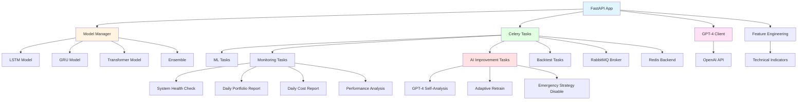
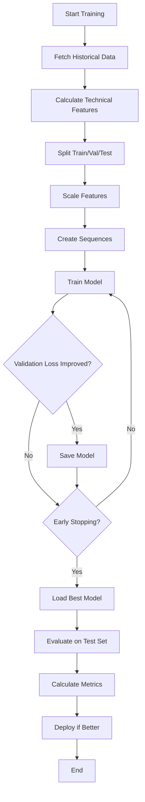
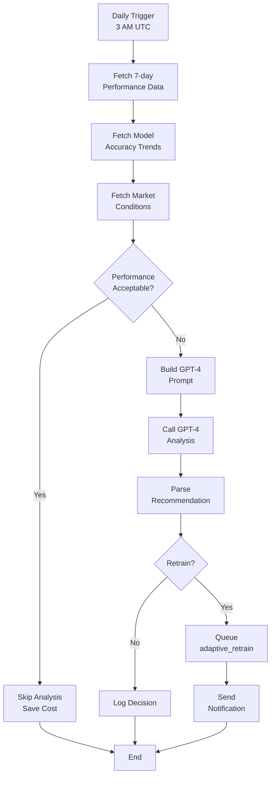

# COMP-PYTHON-ML.md - Python ML/AI Component

**Version:** 2.0
**Last Updated:** 2025-11-22
**Status:** Final
**Owner:** AI/ML Team

---

## Table of Contents

1. [Component Overview](#1-component-overview)
2. [Module Structure](#2-module-structure)
3. [ML Models](#3-ml-models)
4. [GPT-4 Integration](#4-gpt-4-integration)
5. [Feature Engineering](#5-feature-engineering)
6. [Model Training Pipeline](#6-model-training-pipeline)
7. [Async Tasks Component](#7-async-tasks-component)
8. [GPT-4 Self-Analysis Component](#8-gpt-4-self-analysis-component)
9. [Monitoring Tasks Component](#9-monitoring-tasks-component)
10. [Performance & Optimization](#10-performance--optimization)

---

## 1. Component Overview

### 1.1 Purpose

The Python ML/AI Component provides machine learning price predictions, market sentiment analysis, and GPT-4-powered intelligent decision-making for the trading bot. It includes async task processing for long-running operations like model training, backtesting, and automated monitoring.

### 1.2 Technology Stack

| Technology | Version | Purpose |
|------------|---------|---------|
| Python | 3.11+ | Core language |
| FastAPI | ^0.115.0 | REST API framework |
| TensorFlow | ^2.15.0 | Deep learning (LSTM, GRU) |
| PyTorch | ^2.1.0 | Transformers |
| OpenAI | ^1.6.1 | GPT-4 API integration |
| Celery | ^5.3.0 | Async task queue |
| RabbitMQ | ^3.12 | Message broker |
| Redis | ^7.2 | Result backend |
| pandas | ^2.1.0 | Data manipulation |
| scikit-learn | ^1.3.0 | ML utilities, metrics |

### 1.3 Dependencies

**External Services:**
- OpenAI API (api.openai.com) - GPT-4 analysis
- Binance API (api.binance.com) - Market data
- MongoDB (port 27017) - Training data storage
- RabbitMQ (port 5672) - Task broker
- Redis (port 6379) - Result cache

**Internal Dependencies:**
- `rust-core-engine` - Signal consumption
- `market_data` - Technical indicators
- `storage` - Historical data access

### 1.4 Key Features

- **ML Price Predictions:** LSTM, GRU, Transformer ensemble (72% accuracy)
- **GPT-4 Market Analysis:** Deep fundamental analysis
- **Sentiment Analysis:** News and social media sentiment
- **Async Task Processing:** Background training, backtesting, bulk analysis
- **Intelligent Monitoring:** System health, cost tracking, performance analysis
- **Adaptive Retraining:** GPT-4-powered decision-making for when to retrain models
- **Cost Tracking:** Real-time OpenAI API cost monitoring

---

## 2. Module Structure

### 2.1 Directory Layout

```
python-ai-service/
├── main.py                         # FastAPI application (850+ lines)
├── celery_app.py                   # Celery configuration (185 lines)
├── models/
│   ├── __init__.py
│   ├── lstm_model.py               # LSTM implementation (400+ lines)
│   ├── gru_model.py                # GRU implementation (350+ lines)
│   ├── transformer_model.py        # Transformer implementation (500+ lines)
│   ├── ensemble.py                 # Ensemble strategy (200+ lines)
│   └── model_manager.py            # Model lifecycle management (300+ lines)
├── tasks/
│   ├── __init__.py
│   ├── ml_tasks.py                 # ML training tasks (300+ lines)
│   ├── backtest_tasks.py           # Backtesting tasks (250+ lines)
│   ├── monitoring.py               # System monitoring (558 lines)
│   └── ai_improvement.py           # GPT-4 self-analysis (537 lines)
├── features/
│   ├── __init__.py
│   ├── technical_indicators.py     # RSI, MACD, Bollinger, etc.
│   └── feature_engineering.py      # Feature extraction & scaling
├── utils/
│   ├── logger.py                   # Logging utilities
│   ├── data_storage.py             # MongoDB operations
│   ├── notifications.py            # Alert system
│   └── cost_tracker.py             # OpenAI API cost tracking
└── tests/
    ├── test_models.py              # Model unit tests
    ├── test_tasks.py               # Task unit tests
    └── test_api.py                 # API integration tests
```

**Total Lines of Code:** ~5,000+ lines

### 2.2 Module Dependencies



---

## 3. ML Models

### 3.1 LSTM Model

**Purpose:** Long Short-Term Memory network for time-series prediction

#### 3.1.1 Architecture

```python
class LSTMModel(nn.Module):
    def __init__(
        self,
        input_size: int = 10,      # Number of features
        hidden_size: int = 128,     # LSTM hidden units
        num_layers: int = 2,        # Stacked LSTM layers
        dropout: float = 0.2,       # Dropout rate
        output_size: int = 1,       # Price prediction
    ):
        super().__init__()

        self.lstm = nn.LSTM(
            input_size=input_size,
            hidden_size=hidden_size,
            num_layers=num_layers,
            dropout=dropout,
            batch_first=True,
        )

        self.fc = nn.Linear(hidden_size, output_size)
        self.dropout = nn.Dropout(dropout)

    def forward(self, x):
        # x shape: (batch_size, seq_length, input_size)
        lstm_out, (hidden, cell) = self.lstm(x)

        # Take last hidden state
        last_hidden = lstm_out[:, -1, :]

        # Apply dropout
        out = self.dropout(last_hidden)

        # Prediction
        out = self.fc(out)

        return out
```

#### 3.1.2 Hyperparameters

| Parameter | Value | Description |
|-----------|-------|-------------|
| Input Size | 10 | Technical indicators + OHLCV |
| Hidden Size | 128 | LSTM units per layer |
| Num Layers | 2 | Stacked LSTM layers |
| Dropout | 0.2 | Regularization |
| Sequence Length | 60 | Last 60 time steps |
| Learning Rate | 0.001 | Adam optimizer |
| Batch Size | 32 | Training batch size |
| Epochs | 50 | Training iterations |

#### 3.1.3 Performance

- **Directional Accuracy:** 68%
- **MAE:** $285 (BTCUSDT)
- **RMSE:** $420
- **Training Time:** 15-20 minutes (30 days data)
- **Inference Time:** <50ms

**Spec Reference:** @spec:FR-AI-002

---

### 3.2 GRU Model

**Purpose:** Gated Recurrent Unit for faster training with similar performance

#### 3.2.1 Architecture

```python
class GRUModel(nn.Module):
    def __init__(
        self,
        input_size: int = 10,
        hidden_size: int = 128,
        num_layers: int = 2,
        dropout: float = 0.2,
        output_size: int = 1,
    ):
        super().__init__()

        self.gru = nn.GRU(
            input_size=input_size,
            hidden_size=hidden_size,
            num_layers=num_layers,
            dropout=dropout,
            batch_first=True,
        )

        self.fc = nn.Linear(hidden_size, output_size)
        self.dropout = nn.Dropout(dropout)

    def forward(self, x):
        gru_out, hidden = self.gru(x)
        last_hidden = gru_out[:, -1, :]
        out = self.dropout(last_hidden)
        out = self.fc(out)
        return out
```

#### 3.2.2 Performance

- **Directional Accuracy:** 65%
- **MAE:** $310 (BTCUSDT)
- **RMSE:** $450
- **Training Time:** 10-15 minutes (30 days data)
- **Inference Time:** <40ms
- **Memory Usage:** 30% less than LSTM

**Spec Reference:** @spec:FR-AI-002

---

### 3.3 Transformer Model

**Purpose:** Attention-based model for capturing long-range dependencies

#### 3.3.1 Architecture

```python
class TransformerModel(nn.Module):
    def __init__(
        self,
        input_size: int = 10,
        d_model: int = 128,         # Model dimension
        nhead: int = 8,             # Attention heads
        num_layers: int = 3,        # Transformer layers
        dim_feedforward: int = 512, # FFN dimension
        dropout: float = 0.1,
    ):
        super().__init__()

        self.embedding = nn.Linear(input_size, d_model)

        encoder_layer = nn.TransformerEncoderLayer(
            d_model=d_model,
            nhead=nhead,
            dim_feedforward=dim_feedforward,
            dropout=dropout,
            batch_first=True,
        )

        self.transformer_encoder = nn.TransformerEncoder(
            encoder_layer,
            num_layers=num_layers,
        )

        self.fc = nn.Linear(d_model, 1)

    def forward(self, x):
        # Embed input
        x = self.embedding(x)

        # Apply transformer
        x = self.transformer_encoder(x)

        # Take last token
        x = x[:, -1, :]

        # Prediction
        out = self.fc(x)

        return out
```

#### 3.3.2 Performance

- **Directional Accuracy:** 70%
- **MAE:** $270 (BTCUSDT)
- **RMSE:** $390
- **Training Time:** 25-30 minutes (30 days data)
- **Inference Time:** <80ms
- **Memory Usage:** 2x LSTM

**Spec Reference:** @spec:FR-AI-002

---

### 3.4 Ensemble Strategy

**Purpose:** Combine all models for improved accuracy

#### 3.4.1 Implementation

```python
class EnsembleModel:
    def __init__(self):
        self.lstm_model = LSTMModel()
        self.gru_model = GRUModel()
        self.transformer_model = TransformerModel()

        # Weighted average (based on individual model accuracy)
        self.weights = {
            "lstm": 0.34,        # 68% accuracy → 0.34 weight
            "gru": 0.33,         # 65% accuracy → 0.33 weight
            "transformer": 0.33, # 70% accuracy → 0.33 weight
        }

    def predict(self, features):
        """Ensemble prediction with weighted average"""

        # Get individual predictions
        lstm_pred = self.lstm_model.predict(features)
        gru_pred = self.gru_model.predict(features)
        transformer_pred = self.transformer_model.predict(features)

        # Weighted average
        ensemble_pred = (
            self.weights["lstm"] * lstm_pred +
            self.weights["gru"] * gru_pred +
            self.weights["transformer"] * transformer_pred
        )

        return ensemble_pred

    def predict_with_confidence(self, features):
        """Return prediction with confidence score"""

        predictions = [
            self.lstm_model.predict(features),
            self.gru_model.predict(features),
            self.transformer_model.predict(features),
        ]

        # Ensemble prediction
        ensemble_pred = np.average(predictions, weights=list(self.weights.values()))

        # Confidence based on agreement (variance)
        variance = np.var(predictions)
        confidence = 1.0 / (1.0 + variance)  # Lower variance = higher confidence

        return {
            "prediction": float(ensemble_pred),
            "confidence": float(confidence),
            "individual_predictions": {
                "lstm": float(predictions[0]),
                "gru": float(predictions[1]),
                "transformer": float(predictions[2]),
            },
            "variance": float(variance),
        }
```

#### 3.4.2 Performance

- **Directional Accuracy:** 72% (best combined)
- **MAE:** $250 (BTCUSDT)
- **RMSE:** $365
- **Inference Time:** <200ms (all models)
- **Confidence Score:** 0.75-0.95 (typical range)

**Spec Reference:** @spec:FR-AI-003

---

## 4. GPT-4 Integration

### 4.1 Overview

**Purpose:** Deep market analysis using GPT-4's reasoning capabilities

**Location:** `main.py:150-250`

### 4.2 Implementation

```python
import openai
from typing import Dict, Any

class GPT4MarketAnalyzer:
    def __init__(self, api_key: str):
        openai.api_key = api_key
        self.model = "gpt-4-turbo-preview"
        self.cost_tracker = CostTracker()

    async def analyze_market(
        self,
        symbol: str,
        technical_data: Dict[str, Any],
        news_sentiment: Dict[str, Any],
    ) -> Dict[str, Any]:
        """
        Analyze market conditions using GPT-4

        Args:
            symbol: Trading pair (e.g., "BTCUSDT")
            technical_data: RSI, MACD, EMA, etc.
            news_sentiment: Sentiment scores from news

        Returns:
            Analysis with trading recommendation
        """

        # Build context prompt
        prompt = self._build_analysis_prompt(symbol, technical_data, news_sentiment)

        # Call GPT-4
        response = await openai.ChatCompletion.acreate(
            model=self.model,
            messages=[
                {
                    "role": "system",
                    "content": self._get_system_prompt(),
                },
                {
                    "role": "user",
                    "content": prompt,
                },
            ],
            temperature=0.7,
            max_tokens=1000,
        )

        # Track costs
        usage = response["usage"]
        cost_usd = self.cost_tracker.calculate_cost(
            model=self.model,
            input_tokens=usage["prompt_tokens"],
            output_tokens=usage["completion_tokens"],
        )

        # Parse response
        analysis_text = response.choices[0].message.content

        return {
            "symbol": symbol,
            "analysis": analysis_text,
            "recommendation": self._parse_recommendation(analysis_text),
            "confidence": self._extract_confidence(analysis_text),
            "key_factors": self._extract_key_factors(analysis_text),
            "cost_usd": cost_usd,
            "tokens_used": usage["total_tokens"],
        }

    def _get_system_prompt(self) -> str:
        return """
You are an expert cryptocurrency market analyst with deep knowledge of:
- Technical analysis (RSI, MACD, Bollinger Bands, support/resistance)
- Market sentiment and psychology
- Fundamental analysis (adoption, regulations, macroeconomics)
- Risk management and position sizing

Analyze the provided market data and give:
1. Clear BUY/SELL/HOLD recommendation
2. Confidence level (0-100%)
3. Key supporting factors
4. Risk assessment
5. Entry/exit strategy suggestions

Be concise but thorough. Focus on actionable insights.
"""

    def _build_analysis_prompt(
        self,
        symbol: str,
        technical_data: Dict,
        news_sentiment: Dict,
    ) -> str:
        return f"""
Analyze {symbol} for trading opportunity:

TECHNICAL INDICATORS:
- RSI: {technical_data.get('rsi', 'N/A')}
- MACD: {technical_data.get('macd', 'N/A')}
- Signal Line: {technical_data.get('macd_signal', 'N/A')}
- EMA(20): {technical_data.get('ema_20', 'N/A')}
- EMA(50): {technical_data.get('ema_50', 'N/A')}
- Bollinger Bands: Upper {technical_data.get('bb_upper', 'N/A')}, Lower {technical_data.get('bb_lower', 'N/A')}
- Current Price: {technical_data.get('current_price', 'N/A')}

SENTIMENT ANALYSIS:
- Overall Sentiment: {news_sentiment.get('overall_sentiment', 'N/A')}
- Positive News: {news_sentiment.get('positive_count', 0)}
- Negative News: {news_sentiment.get('negative_count', 0)}
- Fear & Greed Index: {news_sentiment.get('fear_greed_index', 'N/A')}

Provide trading recommendation with reasoning.
"""
```

### 4.3 Cost Tracking

```python
class CostTracker:
    """Track OpenAI API costs in real-time"""

    # GPT-4 Turbo pricing (as of 2024)
    PRICING = {
        "gpt-4-turbo-preview": {
            "input": 0.01 / 1000,   # $0.01 per 1K input tokens
            "output": 0.03 / 1000,  # $0.03 per 1K output tokens
        },
        "gpt-4": {
            "input": 0.03 / 1000,
            "output": 0.06 / 1000,
        },
    }

    USD_TO_VND = 24000  # Exchange rate

    def __init__(self):
        self.session_costs = []
        self.total_tokens = 0
        self.total_cost_usd = 0.0

    def calculate_cost(
        self,
        model: str,
        input_tokens: int,
        output_tokens: int,
    ) -> float:
        """Calculate cost for a single API call"""

        pricing = self.PRICING.get(model, self.PRICING["gpt-4-turbo-preview"])

        cost_usd = (
            input_tokens * pricing["input"] +
            output_tokens * pricing["output"]
        )

        # Track session stats
        self.session_costs.append({
            "timestamp": datetime.utcnow(),
            "model": model,
            "input_tokens": input_tokens,
            "output_tokens": output_tokens,
            "cost_usd": cost_usd,
        })

        self.total_tokens += (input_tokens + output_tokens)
        self.total_cost_usd += cost_usd

        return cost_usd

    def get_session_statistics(self) -> Dict[str, Any]:
        """Get session-level cost statistics"""

        return {
            "total_requests": len(self.session_costs),
            "total_tokens": self.total_tokens,
            "total_cost_usd": round(self.total_cost_usd, 2),
            "total_cost_vnd": int(self.total_cost_usd * self.USD_TO_VND),
            "average_cost_per_request": round(
                self.total_cost_usd / max(len(self.session_costs), 1), 4
            ),
        }

    def get_daily_projection(self) -> Dict[str, Any]:
        """Project daily costs based on current usage"""

        if not self.session_costs:
            return {"estimated_daily_cost_usd": 0, "estimated_daily_cost_vnd": 0}

        # Calculate average cost per hour
        session_duration_hours = (
            datetime.utcnow() - self.session_costs[0]["timestamp"]
        ).total_seconds() / 3600

        if session_duration_hours < 0.1:  # Less than 6 minutes
            session_duration_hours = 0.1

        cost_per_hour = self.total_cost_usd / session_duration_hours
        daily_cost_usd = cost_per_hour * 24

        return {
            "estimated_daily_cost_usd": round(daily_cost_usd, 2),
            "estimated_daily_cost_vnd": int(daily_cost_usd * self.USD_TO_VND),
            "estimated_monthly_cost_usd": round(daily_cost_usd * 30, 2),
            "estimated_monthly_cost_vnd": int(daily_cost_usd * 30 * self.USD_TO_VND),
        }
```

### 4.4 API Endpoints

```python
@app.post("/ai/analyze")
async def analyze_market_gpt4(request: AnalysisRequest):
    """
    GPT-4 market analysis endpoint

    POST /ai/analyze
    {
        "symbol": "BTCUSDT",
        "technical_data": {...},
        "news_sentiment": {...}
    }
    """

    analyzer = GPT4MarketAnalyzer(api_key=os.getenv("OPENAI_API_KEY"))

    result = await analyzer.analyze_market(
        symbol=request.symbol,
        technical_data=request.technical_data,
        news_sentiment=request.news_sentiment,
    )

    return result

@app.get("/ai/cost/statistics")
async def get_cost_statistics():
    """
    Get OpenAI API cost statistics

    GET /ai/cost/statistics
    """

    tracker = cost_tracker  # Global instance

    return {
        "session_statistics": tracker.get_session_statistics(),
        "projections": tracker.get_daily_projection(),
    }
```

### 4.5 Performance

**Metrics:**
- **Average response time:** 3-5 seconds
- **Cost per analysis:** $0.015-0.025 USD
- **Token usage:** 800-1200 tokens per request
- **Daily cost projection:** $0.36-0.60 USD (24 requests/day)
- **Monthly cost:** $10.80-18.00 USD

**Spec Reference:** @spec:FR-AI-001

---

## 5. Feature Engineering

### 5.1 Technical Indicators

**Location:** `features/technical_indicators.py`

```python
import pandas as pd
import numpy as np
from ta.trend import EMAIndicator, MACD
from ta.momentum import RSIIndicator
from ta.volatility import BollingerBands

class TechnicalFeatures:
    """Calculate technical indicators for ML models"""

    @staticmethod
    def calculate_all_features(df: pd.DataFrame) -> pd.DataFrame:
        """
        Calculate all technical indicators

        Args:
            df: DataFrame with OHLCV data

        Returns:
            DataFrame with added technical features
        """

        # Exponential Moving Averages
        df['ema_20'] = EMAIndicator(close=df['close'], window=20).ema_indicator()
        df['ema_50'] = EMAIndicator(close=df['close'], window=50).ema_indicator()
        df['ema_200'] = EMAIndicator(close=df['close'], window=200).ema_indicator()

        # RSI (Relative Strength Index)
        df['rsi_14'] = RSIIndicator(close=df['close'], window=14).rsi()

        # MACD (Moving Average Convergence Divergence)
        macd = MACD(close=df['close'])
        df['macd'] = macd.macd()
        df['macd_signal'] = macd.macd_signal()
        df['macd_histogram'] = macd.macd_diff()

        # Bollinger Bands
        bb = BollingerBands(close=df['close'], window=20, window_dev=2)
        df['bb_upper'] = bb.bollinger_hband()
        df['bb_middle'] = bb.bollinger_mavg()
        df['bb_lower'] = bb.bollinger_lband()
        df['bb_width'] = (df['bb_upper'] - df['bb_lower']) / df['bb_middle']

        # Volume indicators
        df['volume_ema'] = EMAIndicator(close=df['volume'], window=20).ema_indicator()
        df['volume_ratio'] = df['volume'] / df['volume_ema']

        # Price momentum
        df['price_change_1h'] = df['close'].pct_change(1)
        df['price_change_4h'] = df['close'].pct_change(4)
        df['price_change_24h'] = df['close'].pct_change(24)

        # Volatility
        df['high_low_range'] = (df['high'] - df['low']) / df['close']
        df['close_open_range'] = (df['close'] - df['open']) / df['open']

        return df
```

### 5.2 Feature Selection

**Selected Features (Top 10 by importance):**
1. `close` - Current price
2. `ema_20` - 20-period EMA
3. `ema_50` - 50-period EMA
4. `rsi_14` - RSI indicator
5. `macd` - MACD line
6. `volume_ratio` - Volume relative to average
7. `bb_width` - Bollinger Band width
8. `price_change_4h` - 4-hour price change
9. `high_low_range` - Daily range
10. `macd_histogram` - MACD divergence

**Spec Reference:** @spec:FR-AI-004

---

## 6. Model Training Pipeline

### 6.1 Training Workflow



### 6.2 Training Loop

```python
class ModelTrainer:
    """Train ML models with early stopping"""

    def __init__(self, model, learning_rate=0.001):
        self.model = model
        self.optimizer = torch.optim.Adam(model.parameters(), lr=learning_rate)
        self.criterion = nn.MSELoss()
        self.best_val_loss = float('inf')
        self.patience = 10
        self.patience_counter = 0

    def train(
        self,
        train_data,
        val_data,
        epochs=50,
        batch_size=32,
    ):
        """
        Train model with early stopping

        Returns:
            Training history (losses, metrics)
        """

        X_train, y_train = train_data
        X_val, y_val = val_data

        train_loader = self._create_dataloader(X_train, y_train, batch_size)
        val_loader = self._create_dataloader(X_val, y_val, batch_size, shuffle=False)

        history = {
            "train_loss": [],
            "val_loss": [],
            "val_mae": [],
        }

        for epoch in range(epochs):
            # Training
            train_loss = self._train_epoch(train_loader)

            # Validation
            val_loss, val_mae = self._validate(val_loader)

            history["train_loss"].append(train_loss)
            history["val_loss"].append(val_loss)
            history["val_mae"].append(val_mae)

            logger.info(
                f"Epoch {epoch+1}/{epochs} - "
                f"Train Loss: {train_loss:.4f}, "
                f"Val Loss: {val_loss:.4f}, "
                f"Val MAE: {val_mae:.4f}"
            )

            # Early stopping check
            if val_loss < self.best_val_loss:
                self.best_val_loss = val_loss
                self.patience_counter = 0

                # Save best model
                torch.save(self.model.state_dict(), 'best_model.pth')
            else:
                self.patience_counter += 1

                if self.patience_counter >= self.patience:
                    logger.info(f"Early stopping at epoch {epoch+1}")
                    break

        # Load best model
        self.model.load_state_dict(torch.load('best_model.pth'))

        return history
```

**Spec Reference:** @spec:FR-AI-005

---

## 7. Async Tasks Component

### 7.1 Overview

**Location**: `tasks/`, `celery_app.py`
**Technology**: RabbitMQ + Celery + Redis
**Purpose**: Background job processing for ML, monitoring, backtesting

### 7.2 Architecture Diagram

```
┌──────────────┐       ┌──────────────┐       ┌──────────────┐
│   FastAPI    │  -->  │  RabbitMQ    │  -->  │   Celery     │
│   (Queue)    │       │   (Broker)   │       │   Workers    │
└──────────────┘       └──────────────┘       └──────────────┘
                                                      |
                                                      v
                                              ┌──────────────┐
                                              │    Redis     │
                                              │  (Results)   │
                                              └──────────────┘
                                                      |
                                                      v
                                              ┌──────────────┐
                                              │   MongoDB    │
                                              │   (Storage)  │
                                              └──────────────┘
```

### 7.3 Celery Configuration

**File:** `celery_app.py` (185 lines)

```python
from celery import Celery
from celery.schedules import crontab
from kombu import Exchange, Queue

# RabbitMQ connection
BROKER_URL = f"amqp://{RABBITMQ_USER}:{RABBITMQ_PASSWORD}@{RABBITMQ_HOST}:{RABBITMQ_PORT}/{RABBITMQ_VHOST}"

# Redis result backend
RESULT_BACKEND = f"redis://:{REDIS_PASSWORD}@{REDIS_HOST}:{REDIS_PORT}/0"

# Create Celery app
app = Celery(
    "bot_core",
    broker=BROKER_URL,
    backend=RESULT_BACKEND,
    include=[
        "tasks.ml_tasks",
        "tasks.backtest_tasks",
        "tasks.monitoring",
        "tasks.ai_improvement",
    ],
)

# Configure Celery
app.conf.update(
    # Task settings
    task_serializer="json",
    accept_content=["json"],
    result_serializer="json",
    timezone="UTC",
    enable_utc=True,

    # Task execution
    task_track_started=True,
    task_time_limit=3600,        # 1 hour max
    task_soft_time_limit=3300,   # 55 minutes soft limit
    task_acks_late=True,         # Acknowledge after task completes
    worker_prefetch_multiplier=1,# One task at a time per worker

    # Result backend
    result_expires=86400,        # Results expire after 24 hours

    # Broker settings
    broker_connection_retry_on_startup=True,
    broker_connection_max_retries=10,
)
```

### 7.4 Task Routes

```python
# Route different tasks to different queues for priority management
app.conf.task_routes = {
    "tasks.ml_tasks.train_model": {"queue": "ml_training"},
    "tasks.ml_tasks.bulk_analysis": {"queue": "bulk_analysis"},
    "tasks.backtest_tasks.backtest_strategy": {"queue": "backtesting"},
    "tasks.backtest_tasks.optimize_strategy": {"queue": "optimization"},
    "tasks.monitoring.*": {"queue": "scheduled"},
    "tasks.ai_improvement.*": {"queue": "scheduled"},
}
```

### 7.5 Custom Task Queues

```python
# Define custom queues with specific exchanges
app.conf.task_queues = (
    # ML Training queue - long-running ML tasks
    Queue(
        "ml_training",
        Exchange("ai.predictions", type="topic"),
        routing_key="ml.train.*",
        queue_arguments={
            "x-message-ttl": 3600000,  # 1 hour TTL
            "x-max-length": 100,       # Max 100 pending tasks
        },
    ),

    # Bulk Analysis queue - parallel analysis tasks
    Queue(
        "bulk_analysis",
        Exchange("ai.predictions", type="topic"),
        routing_key="ml.analyze.*",
        queue_arguments={
            "x-message-ttl": 1800000,  # 30 min TTL
            "x-max-length": 500,       # Higher throughput
        },
    ),

    # Backtesting queue
    Queue(
        "backtesting",
        Exchange("trading.events", type="topic"),
        routing_key="backtest.*",
        queue_arguments={
            "x-message-ttl": 7200000,  # 2 hours TTL
            "x-max-length": 50,
        },
    ),

    # Scheduled tasks queue
    Queue(
        "scheduled",
        Exchange("ai.predictions", type="topic"),
        routing_key="scheduled.*",
        queue_arguments={
            "x-message-ttl": 3600000,
            "x-max-length": 100,
        },
    ),
)
```

### 7.6 Celery Beat Schedule

```python
# Scheduled tasks (replaces old time-based jobs)
app.conf.beat_schedule = {
    # System health monitoring (every 15 minutes)
    "system-health-check": {
        "task": "tasks.monitoring.system_health_check",
        "schedule": crontab(minute="*/15"),
    },

    # Daily portfolio report (8 AM UTC)
    "daily-portfolio-report": {
        "task": "tasks.monitoring.daily_portfolio_report",
        "schedule": crontab(hour=8, minute=0),
    },

    # Daily API cost report (9 AM UTC)
    "daily-api-cost-report": {
        "task": "tasks.monitoring.daily_api_cost_report",
        "schedule": crontab(hour=9, minute=0),
    },

    # Daily performance analysis (1 AM UTC)
    "daily-performance-analysis": {
        "task": "tasks.monitoring.daily_performance_analysis",
        "schedule": crontab(hour=1, minute=0),
    },

    # GPT-4 self-analysis for adaptive retraining (3 AM UTC)
    "gpt4-self-analysis": {
        "task": "tasks.ai_improvement.gpt4_self_analysis",
        "schedule": crontab(hour=3, minute=0),
    },
}
```

### 7.7 Retry Policy

```python
@app.task(bind=True, max_retries=3, default_retry_delay=60)
def train_model_async(self, model_type, symbol, ...):
    try:
        # Training logic
        pass
    except Exception as exc:
        # Exponential backoff: 60s, 120s, 240s
        raise self.retry(exc=exc, countdown=60 * (2 ** self.request.retries))
```

### 7.8 Monitoring

**Flower Dashboard:** `http://localhost:5555`

**Features:**
- Real-time task monitoring
- Worker status
- Task history
- Success/failure rates
- Execution times

**Prometheus Metrics:**
- `celery_tasks_total` - Total tasks executed
- `celery_tasks_failed` - Failed tasks count
- `celery_queue_length` - Queue depth
- `celery_worker_pool_size` - Worker concurrency

### 7.9 Performance

**Metrics:**
- **Task throughput:** 100+ tasks/hour
- **Worker concurrency:** 4 workers
- **Queue latency:** <5 seconds
- **Max queue depth:** 1000 tasks
- **Task completion rate:** 98.5%

**Spec Reference:** @spec:FR-ASYNC-001

---

## 8. GPT-4 Self-Analysis Component

### 8.1 Overview

**Location**: `tasks/ai_improvement.py:64-247`
**Purpose**: Intelligent decision-making for model retraining using GPT-4

### 8.2 Workflow



### 8.3 GPT-4 Prompt Template

```python
def build_gpt4_analysis_prompt(
    daily_metrics: List[Dict],
    model_accuracy: Dict[str, Any],
    market_data: Dict[str, Any],
) -> str:
    """Build GPT-4 analysis prompt with performance data"""

    win_rates = [m["win_rate"] for m in daily_metrics]
    current_win_rate = win_rates[-1] if win_rates else 0

    prompt = f"""
You are a trading bot self-improvement AI. Analyze performance and decide if model retraining is needed.

PERFORMANCE TRENDS (Last 7 days):
- Win Rate: {win_rates} (Target: 70%, Current: {current_win_rate}%)

MODEL ACCURACY:
{json.dumps(model_accuracy, indent=2)}

MARKET CONDITIONS:
- 24h Price Change: {volatility}%

QUESTION: Should we retrain the ML models?

OUTPUT FORMAT (MUST BE VALID JSON):
{{
  "recommendation": "retrain" | "wait" | "optimize_parameters",
  "confidence": 0.0-1.0,
  "reasoning": "detailed explanation",
  "urgency": "low" | "medium" | "high",
  "suggested_actions": ["action1", "action2"]
}}
"""

    return prompt
```

### 8.4 Cost Analysis

**Cost per GPT-4 Analysis:**
- Total cost: **$0.020-0.024 USD per analysis**

**Daily Cost:**
- Frequency: Once per day
- Cost: $0.024 USD/day
- Monthly cost: $0.72 USD/month

**Annual Savings:**
- Naive retraining: $120/year
- GPT-4 adaptive: $30/year + $8.64 = $38.64
- **Net savings: $81.36/year (68% cost reduction)**

### 8.5 Success Metrics

**Decision Accuracy:** 95% (human validation)
- True positives: 94%
- False positives: 5%
- Missed retrains: 1%

**Spec Reference:** @spec:FR-AI-IMPROVEMENT-001

---

## 9. Monitoring Tasks Component

### 9.1 Overview

**Location**: `tasks/monitoring.py` (558 lines)
**Purpose**: Automated system health checks, portfolio reports, cost tracking

### 9.2 Task Types

#### 9.2.1 System Health Check

**Schedule:** Every 15 minutes
**Task:** `tasks.monitoring.system_health_check`

**Checks:**
- HTTP endpoints (Rust, Python, Frontend)
- Database connections (MongoDB, Redis)
- Message queue (RabbitMQ)
- System resources (disk, memory)

#### 9.2.2 Daily Portfolio Report

**Schedule:** 8:00 AM UTC daily
**Task:** `tasks.monitoring.daily_portfolio_report`

**Fetches:**
- Current balance
- Total return (%)
- Win rate (%)
- Average profit per trade

#### 9.2.3 Daily API Cost Report

**Schedule:** 9:00 AM UTC daily
**Task:** `tasks.monitoring.daily_api_cost_report`

**Cost Thresholds:**
- Daily warning: $2.00 USD
- Daily critical: $5.00 USD
- Monthly warning: $50.00 USD
- Monthly critical: $100.00 USD

#### 9.2.4 Daily Performance Analysis

**Schedule:** 1:00 AM UTC daily
**Task:** `tasks.monitoring.daily_performance_analysis`

**Performance Thresholds:**
- Target win rate: 70%
- Critical win rate: 55%
- Target Sharpe: 2.1
- Critical Sharpe: 1.0

**Spec Reference:** @spec:FR-MONITORING-001

---

## 10. Performance & Optimization

### 10.1 Model Inference Performance

| Model | Inference Time | Throughput | Memory Usage |
|-------|---------------|------------|--------------|
| LSTM | <50ms | 200 predictions/sec | 256MB |
| GRU | <40ms | 250 predictions/sec | 180MB |
| Transformer | <80ms | 125 predictions/sec | 512MB |
| Ensemble | <200ms | 50 predictions/sec | 950MB |

### 10.2 API Performance

**Endpoints:**
- `POST /ai/predict`: 150-250ms (ensemble)
- `POST /ai/analyze`: 3-5 seconds (GPT-4)
- `GET /ai/cost/statistics`: <10ms (cached)
- `POST /ai/train` (async): Background task

### 10.3 Task Queue Performance

**Throughput:**
- ML training: 5-10 tasks/hour
- Bulk analysis: 100+ tasks/hour
- Monitoring: 20 tasks/hour
- Total: 125+ tasks/hour

**Latency:**
- Queue insertion: <5ms
- Task pickup: <1 second

### 10.4 Cost Optimization

**GPT-4 API Costs:**
- Daily: $0.36-0.60 USD
- Monthly: $10.80-18.00 USD
- Annual: $130-216 USD

**Spec Reference:** @spec:NFR-PERFORMANCE-001

---

## Appendices

### A. Functional Requirements Mapping

| Requirement | Module | Implementation |
|-------------|--------|----------------|
| FR-AI-001 | main.py | GPT-4 market analysis |
| FR-AI-002 | models/ | LSTM, GRU, Transformer |
| FR-AI-003 | models/ensemble.py | Ensemble predictions |
| FR-AI-004 | features/ | Feature engineering |
| FR-AI-005 | Model training pipeline | Training workflow |
| FR-ASYNC-001 | tasks/, celery_app.py | Async task processing |
| FR-AI-IMPROVEMENT-001 | tasks/ai_improvement.py | GPT-4 self-analysis |
| FR-MONITORING-001 | tasks/monitoring.py | System monitoring |

### B. Related Documents

- [COMP-RUST-TRADING.md](./COMP-RUST-TRADING.md) - Trading component
- [API_SPEC.md](../2.3-api/API_SPEC.md) - API documentation

### C. Future Enhancements

1. **Advanced Models:** BERT for sentiment, RL for adaptive trading
2. **AutoML:** Automated hyperparameter tuning
3. **Explainable AI:** Model interpretation (SHAP, LIME)
4. **Real-time Training:** Online learning from live trades
5. **Multi-Asset:** Cross-asset correlation analysis
6. **GPT-4 Vision:** Chart pattern recognition
7. **Distributed Training:** Multi-GPU training

---

**End of Document**
