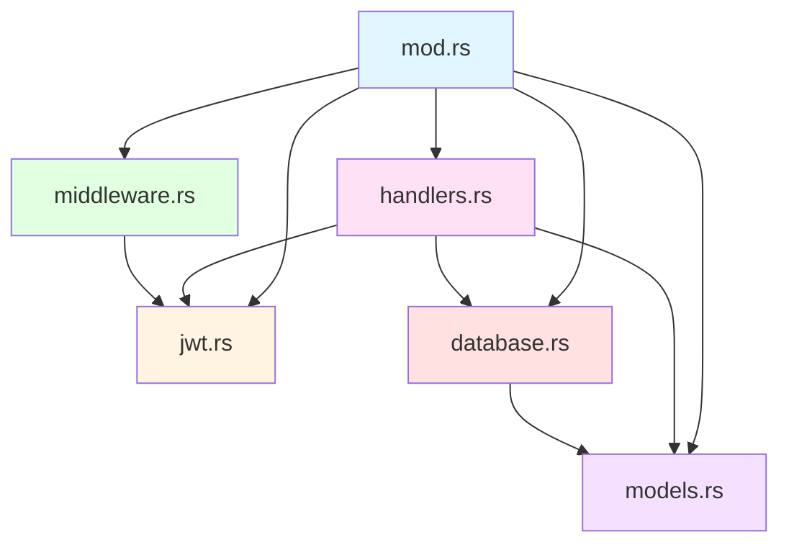
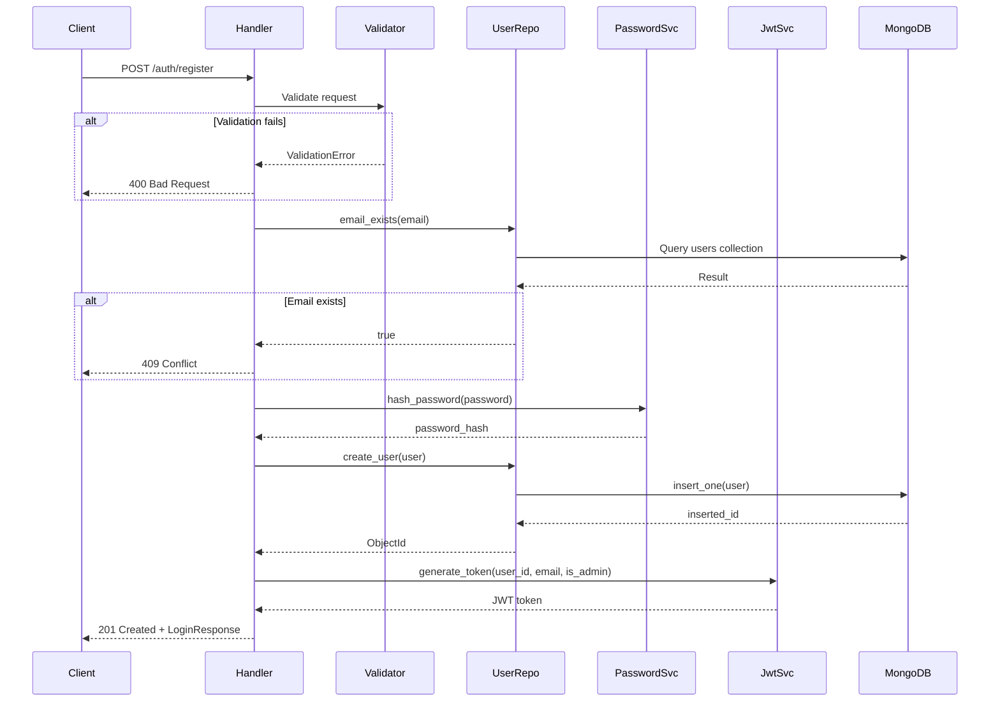
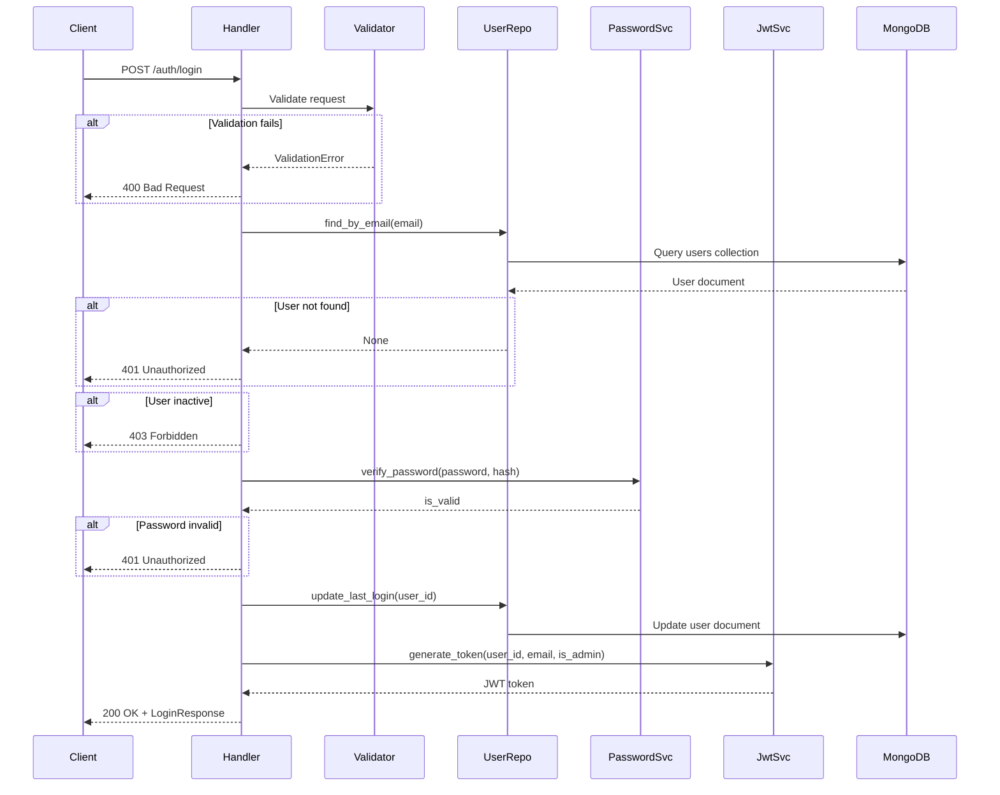
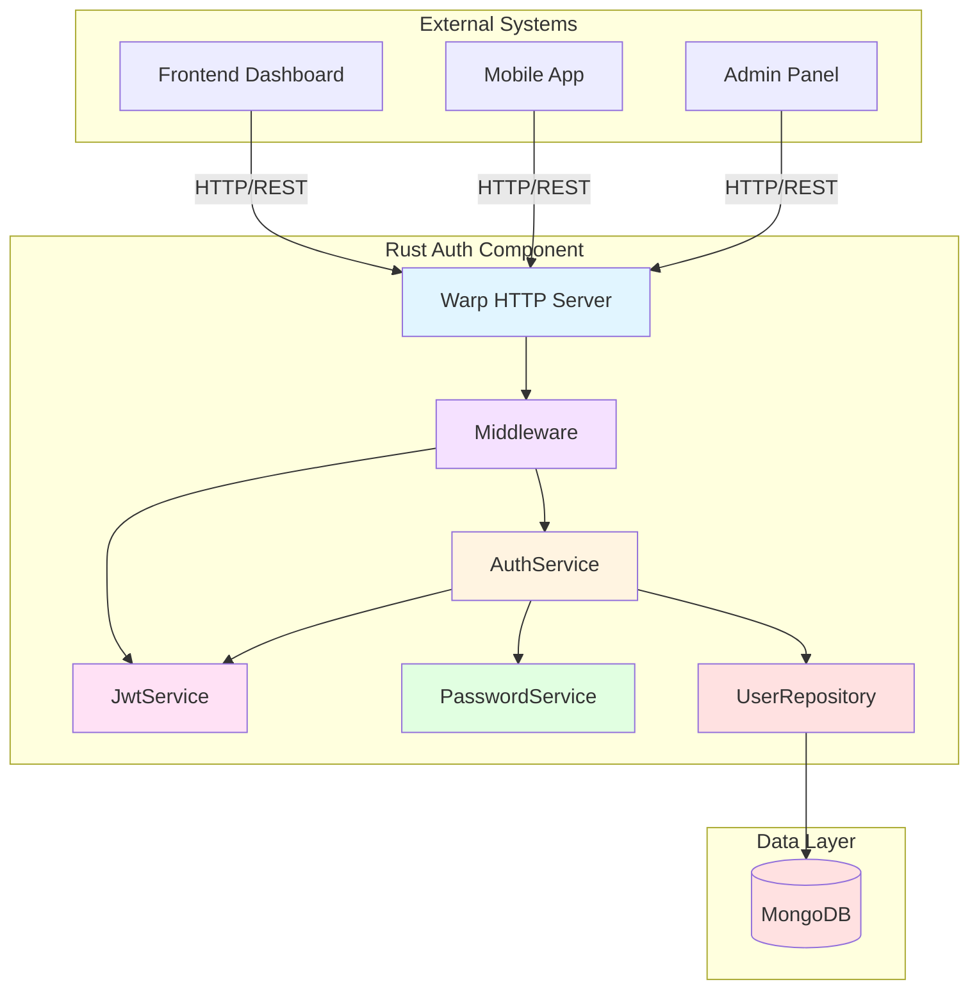
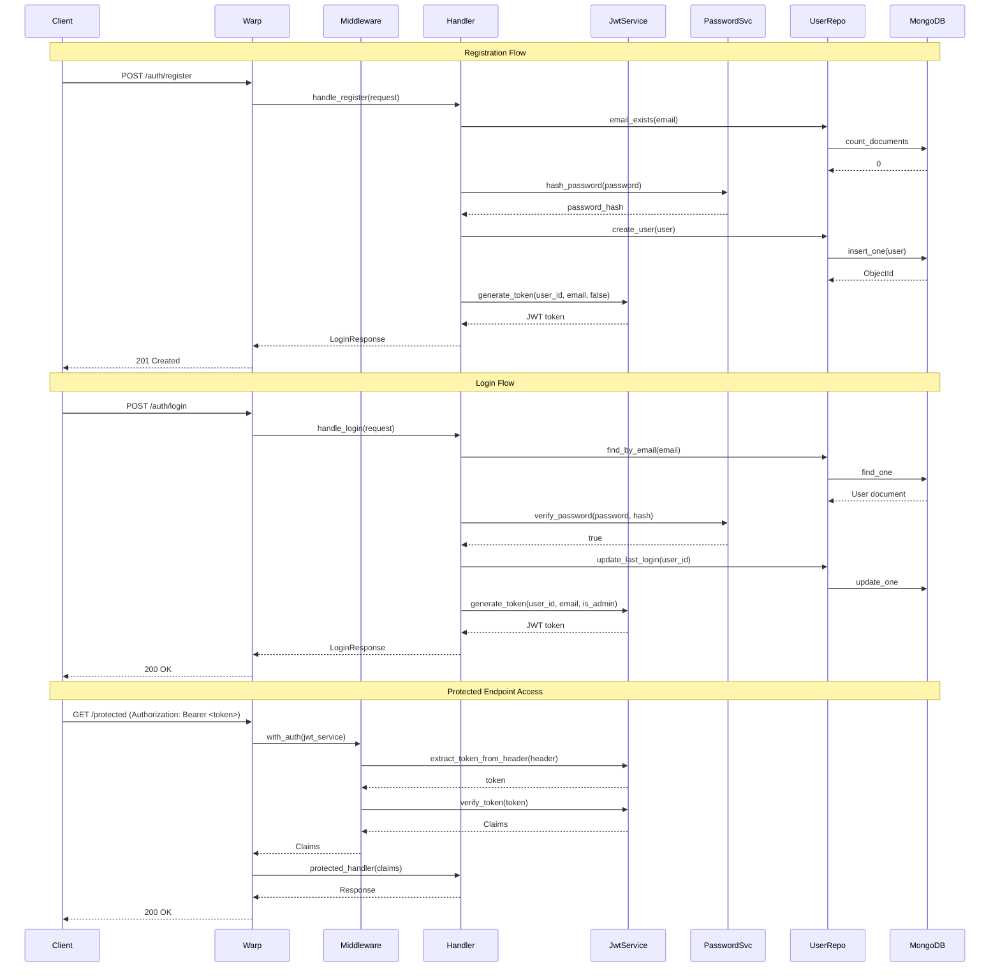
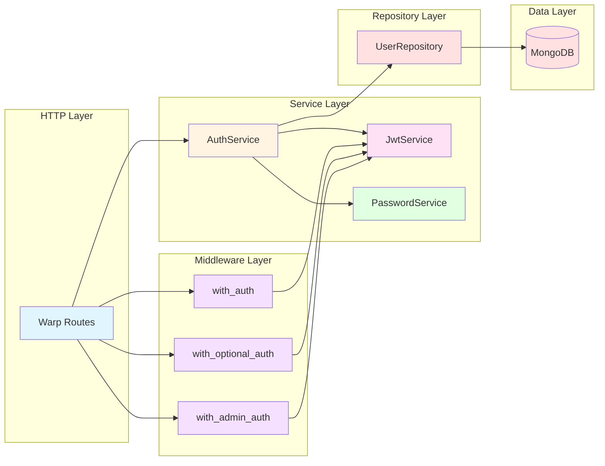

# COMP-RUST-AUTH.md - Rust Authentication Component

**Version:** 1.0
**Last Updated:** 2025-10-10
**Status:** Final
**Owner:** Backend Team

---

## Table of Contents

1. [Component Overview](#1-component-overview)
2. [Module Structure](#2-module-structure)
3. [Key Modules](#3-key-modules)
4. [Component Architecture](#4-component-architecture)
5. [Design Patterns](#5-design-patterns)
6. [Data Models](#6-data-models)
7. [Security Considerations](#7-security-considerations)
8. [Error Handling](#8-error-handling)
9. [Testing Strategy](#9-testing-strategy)
10. [Performance Considerations](#10-performance-considerations)

---

## 1. Component Overview

### 1.1 Purpose

The Rust Authentication Component provides secure JWT-based authentication and authorization for the Bot Core trading platform. It handles user registration, login, token generation/verification, and user profile management.

### 1.2 Technology Stack

| Technology | Version | Purpose |
|------------|---------|---------|
| Rust | 1.86 | Core language |
| warp | ^0.3 | Web framework |
| jsonwebtoken | ^9.3 | JWT implementation |
| bcrypt | ^0.15 | Password hashing |
| MongoDB | 7.0 | User data persistence |
| tokio | ^1.42 | Async runtime |
| serde | ^1.0 | Serialization |
| validator | ^0.19 | Input validation |

### 1.3 Dependencies

**External Services:**
- MongoDB (port 27017) - User data storage
- Environment Variables - JWT_SECRET, DATABASE_URL

**Internal Dependencies:**
- None (standalone component)

### 1.4 Entry Points

**Main Service:**
- `AuthService::routes()` - Warp filter combining all auth routes
- Port: 8080 (part of Rust core engine)

**Public API Endpoints:**
```
POST /auth/register  - User registration
POST /auth/login     - User authentication
GET  /auth/verify    - Token verification
GET  /auth/profile   - User profile retrieval
```

---

## 2. Module Structure

### 2.1 Directory Layout

```
rust-core-engine/src/auth/
├── mod.rs              # Module exports and public interface (9 lines)
├── jwt.rs              # JWT token generation/verification (269 lines)
├── handlers.rs         # HTTP request handlers (1138 lines)
├── middleware.rs       # Authentication middleware (644 lines)
├── models.rs           # User data models (852 lines)
└── database.rs         # MongoDB operations (299 lines)
```

**Total Lines of Code:** ~3,211 lines (including tests)

### 2.2 Module Dependencies



---

## 3. Key Modules

### 3.1 JWT Module (jwt.rs)

**Purpose:** JWT token generation, verification, and password hashing services.

#### 3.1.1 Claims Structure

```rust
#[derive(Debug, Serialize, Deserialize)]
pub struct Claims {
    pub sub: String,      // user_id (MongoDB ObjectId as hex)
    pub email: String,    // User email address
    pub is_admin: bool,   // Admin flag
    pub exp: i64,         // Expiration timestamp (Unix)
    pub iat: i64,         // Issued at timestamp (Unix)
}
```

**Spec Reference:** @spec:FR-AUTH-001 - JWT token structure

#### 3.1.2 JwtService

```rust
#[derive(Clone)]
pub struct JwtService {
    secret: String,           // JWT signing secret
    expiration_hours: i64,    // Token lifetime (default: 24h)
}

impl JwtService {
    pub fn new(secret: String, expiration_hours: Option<i64>) -> Self
    pub fn generate_token(&self, user_id: &str, email: &str, is_admin: bool) -> Result<String>
    pub fn verify_token(&self, token: &str) -> Result<Claims>
    pub fn extract_token_from_header(auth_header: &str) -> Option<&str>
}
```

**Key Features:**
- **Algorithm:** HS256 (HMAC with SHA-256)
- **Default Expiration:** 24 hours (configurable)
- **Header Format:** `Bearer <token>`
- **Security:** Secret loaded from environment variable

**Implementation Details:**
```rust
pub fn generate_token(&self, user_id: &str, email: &str, is_admin: bool) -> Result<String> {
    let now = Utc::now();
    let exp = now + Duration::hours(self.expiration_hours);

    let claims = Claims {
        sub: user_id.to_string(),
        email: email.to_string(),
        is_admin,
        exp: exp.timestamp(),
        iat: now.timestamp(),
    };

    let header = Header::new(Algorithm::HS256);
    let token = encode(
        &header,
        &claims,
        &EncodingKey::from_secret(self.secret.as_ref()),
    )?;

    Ok(token)
}
```

**Spec Reference:** @spec:FR-AUTH-001, FR-AUTH-006

#### 3.1.3 PasswordService

```rust
pub struct PasswordService;

impl PasswordService {
    pub fn hash_password(password: &str) -> Result<String>
    pub fn verify_password(password: &str, hash: &str) -> Result<bool>
}
```

**Key Features:**
- **Algorithm:** bcrypt
- **Cost Factor:** 12 (DEFAULT_COST)
- **Salt:** Automatically generated (random per hash)
- **Verification:** Constant-time comparison to prevent timing attacks

**Implementation Details:**
```rust
pub fn hash_password(password: &str) -> Result<String> {
    let hashed = bcrypt::hash(password, bcrypt::DEFAULT_COST)?;
    Ok(hashed)
}

pub fn verify_password(password: &str, hash: &str) -> Result<bool> {
    let is_valid = bcrypt::verify(password, hash)?;
    Ok(is_valid)
}
```

**Security Properties:**
- Same password produces different hashes (random salt)
- Hashing is intentionally slow (cost factor 12)
- Timing-safe comparison prevents timing attacks

**Spec Reference:** @spec:FR-AUTH-002, FR-AUTH-003

---

### 3.2 Handlers Module (handlers.rs)

**Purpose:** HTTP request handling for authentication endpoints.

#### 3.2.1 AuthService Structure

```rust
#[derive(Clone)]
pub struct AuthService {
    user_repo: UserRepository,
    jwt_service: JwtService,
}

impl AuthService {
    pub fn new(user_repo: UserRepository, jwt_secret: String) -> Self
    pub fn new_dummy() -> Self  // For testing without DB
    pub fn routes(&self) -> impl Filter<Extract = impl Reply, Error = Rejection> + Clone

    // Private route constructors
    fn register_route(&self) -> impl Filter<...>
    fn login_route(&self) -> impl Filter<...>
    fn verify_route(&self) -> impl Filter<...>
    fn profile_route(&self) -> impl Filter<...>
}
```

**Token Expiration:** 7 days (24 * 7 hours) for AuthService tokens

#### 3.2.2 Registration Handler

```rust
async fn handle_register(
    request: RegisterRequest,
    auth_service: AuthService,
) -> Result<impl Reply, Infallible>
```

**Flow Diagram:**



**Validation Rules:**
```rust
pub struct RegisterRequest {
    #[validate(email(message = "Invalid email format"))]
    pub email: String,

    #[validate(length(min = 6, message = "Password must be at least 6 characters"))]
    pub password: String,

    pub full_name: Option<String>,
}
```

**Response Format:**
```json
{
  "success": true,
  "data": {
    "token": "eyJhbGciOiJIUzI1NiIsInR5cCI6IkpXVCJ9...",
    "user": {
      "id": "507f1f77bcf86cd799439011",
      "email": "user@example.com",
      "full_name": "John Doe",
      "is_active": true,
      "is_admin": false,
      "created_at": "2024-01-01T12:00:00Z",
      "last_login": null,
      "settings": {
        "trading_enabled": false,
        "risk_level": "Medium",
        "max_positions": 3,
        "default_quantity": 0.01,
        "notifications": {
          "email_alerts": true,
          "trade_notifications": true,
          "system_alerts": true
        }
      }
    }
  }
}
```

**Error Responses:**
- **400 Bad Request:** Validation failed
- **409 Conflict:** Email already registered
- **500 Internal Server Error:** Database or hashing error

**Spec Reference:** @spec:FR-AUTH-002

#### 3.2.3 Login Handler

```rust
async fn handle_login(
    request: LoginRequest,
    auth_service: AuthService,
) -> Result<impl Reply, Infallible>
```

**Flow Diagram:**



**Validation Rules:**
```rust
pub struct LoginRequest {
    #[validate(email(message = "Invalid email format"))]
    pub email: String,

    #[validate(length(min = 1, message = "Password cannot be empty"))]
    pub password: String,
}
```

**Security Features:**
- Generic error message for invalid credentials (prevents email enumeration)
- Account deactivation check
- Last login timestamp update
- Constant-time password verification

**Response Format:** Same as registration (LoginResponse)

**Error Responses:**
- **400 Bad Request:** Validation failed
- **401 Unauthorized:** Invalid email or password
- **403 Forbidden:** Account deactivated
- **500 Internal Server Error:** Database error

**Spec Reference:** @spec:FR-AUTH-003

#### 3.2.4 Token Verification Handler

```rust
async fn handle_verify(
    auth_header: String,
    auth_service: AuthService,
) -> Result<impl Reply, Infallible>
```

**Purpose:** Verify JWT token validity and extract claims.

**Response Format:**
```json
{
  "success": true,
  "data": {
    "user_id": "507f1f77bcf86cd799439011",
    "email": "user@example.com",
    "is_admin": false,
    "exp": 1704124800
  }
}
```

**Error Responses:**
- **401 Unauthorized:** Invalid authorization header or expired token

**Spec Reference:** @spec:FR-AUTH-004

#### 3.2.5 Profile Handler

```rust
async fn handle_profile(
    auth_header: String,
    auth_service: AuthService,
) -> Result<impl Reply, Infallible>
```

**Purpose:** Retrieve user profile using JWT token.

**Response Format:**
```json
{
  "success": true,
  "data": {
    "id": "507f1f77bcf86cd799439011",
    "email": "user@example.com",
    "full_name": "John Doe",
    "is_active": true,
    "is_admin": false,
    "created_at": "2024-01-01T12:00:00Z",
    "last_login": "2024-01-02T10:30:00Z",
    "settings": { ... }
  }
}
```

**Error Responses:**
- **400 Bad Request:** Invalid user ID format
- **401 Unauthorized:** Invalid or expired token
- **404 Not Found:** User not found
- **500 Internal Server Error:** Database error

**Spec Reference:** @spec:FR-AUTH-005

---

### 3.3 Middleware Module (middleware.rs)

**Purpose:** Warp filters for authentication and authorization.

#### 3.3.1 Authentication Filters

```rust
pub fn with_auth(
    jwt_service: JwtService,
) -> impl Filter<Extract = (Claims,), Error = Rejection> + Clone

pub fn with_optional_auth(
    jwt_service: JwtService,
) -> impl Filter<Extract = (Option<Claims>,), Error = Rejection> + Clone

pub fn with_admin_auth(
    jwt_service: JwtService,
) -> impl Filter<Extract = (Claims,), Error = Rejection> + Clone
```

**Usage Examples:**

```rust
// Protected route (requires authentication)
warp::path("protected")
    .and(with_auth(jwt_service))
    .and_then(|claims: Claims| async move {
        // claims.sub contains user_id
        Ok::<_, Rejection>(warp::reply::json(&claims))
    })

// Optional auth (user may or may not be logged in)
warp::path("public")
    .and(with_optional_auth(jwt_service))
    .and_then(|claims: Option<Claims>| async move {
        if let Some(claims) = claims {
            // Authenticated user
        } else {
            // Anonymous user
        }
        Ok::<_, Rejection>(warp::reply::json(&"response"))
    })

// Admin-only route
warp::path("admin")
    .and(with_admin_auth(jwt_service))
    .and_then(|claims: Claims| async move {
        // claims.is_admin is guaranteed to be true
        Ok::<_, Rejection>(warp::reply::json(&claims))
    })
```

#### 3.3.2 Authorization Logic

```rust
async fn authorize(auth_header: String, jwt_service: JwtService) -> Result<Claims, Rejection> {
    let token = match JwtService::extract_token_from_header(&auth_header) {
        Some(token) => token,
        None => {
            return Err(warp::reject::custom(AuthError::InvalidHeader));
        },
    };

    match jwt_service.verify_token(token) {
        Ok(claims) => Ok(claims),
        Err(_) => Err(warp::reject::custom(AuthError::InvalidToken)),
    }
}

async fn admin_authorize(
    auth_header: String,
    jwt_service: JwtService,
) -> Result<Claims, Rejection> {
    let claims = authorize(auth_header, jwt_service).await?;

    if claims.is_admin {
        Ok(claims)
    } else {
        Err(warp::reject::custom(AuthError::InsufficientPermissions))
    }
}
```

#### 3.3.3 Custom Error Types

```rust
#[derive(Debug)]
pub enum AuthError {
    InvalidHeader,              // Missing or malformed Authorization header
    InvalidToken,               // Expired or invalid JWT token
    InsufficientPermissions,    // User lacks required permissions
}

impl warp::reject::Reject for AuthError {}
```

#### 3.3.4 Error Handler

```rust
pub async fn handle_auth_rejection(err: Rejection) -> Result<impl Reply, Infallible> {
    if let Some(auth_error) = err.find::<AuthError>() {
        let (code, message) = match auth_error {
            AuthError::InvalidHeader => (
                warp::http::StatusCode::UNAUTHORIZED,
                "Invalid authorization header",
            ),
            AuthError::InvalidToken => (
                warp::http::StatusCode::UNAUTHORIZED,
                "Invalid or expired token",
            ),
            AuthError::InsufficientPermissions => (
                warp::http::StatusCode::FORBIDDEN,
                "Insufficient permissions",
            ),
        };

        Ok(warp::reply::with_status(
            warp::reply::json(&json!({
                "success": false,
                "error": message
            })),
            code,
        ))
    } else if err.is_not_found() {
        Ok(warp::reply::with_status(
            warp::reply::json(&json!({
                "success": false,
                "error": "Route not found"
            })),
            warp::http::StatusCode::NOT_FOUND,
        ))
    } else {
        Ok(warp::reply::with_status(
            warp::reply::json(&json!({
                "success": false,
                "error": "Internal server error"
            })),
            warp::http::StatusCode::INTERNAL_SERVER_ERROR,
        ))
    }
}
```

**Spec Reference:** @spec:FR-AUTH-006, FR-AUTH-007, FR-AUTH-008

---

### 3.4 Models Module (models.rs)

**Purpose:** Data structures for users, requests, and responses.

#### 3.4.1 User Model

```rust
#[derive(Debug, Clone, Serialize, Deserialize)]
pub struct User {
    #[serde(rename = "_id", skip_serializing_if = "Option::is_none")]
    pub id: Option<ObjectId>,
    pub email: String,
    pub password_hash: String,
    pub full_name: Option<String>,
    pub is_active: bool,
    pub is_admin: bool,
    #[serde(with = "date_time_serde")]
    pub created_at: DateTime<Utc>,
    #[serde(with = "date_time_serde")]
    pub updated_at: DateTime<Utc>,
    #[serde(with = "optional_date_time_serde")]
    pub last_login: Option<DateTime<Utc>>,
    pub settings: UserSettings,
}

impl User {
    pub fn new(email: String, password_hash: String, full_name: Option<String>) -> Self
    pub fn to_profile(&self) -> UserProfile
    pub fn update_last_login(&mut self)
}
```

**Default Values:**
- `is_active`: true
- `is_admin`: false
- `created_at`: Current UTC timestamp
- `updated_at`: Current UTC timestamp
- `last_login`: None
- `settings`: UserSettings::default()

#### 3.4.2 User Settings

```rust
#[derive(Debug, Clone, Serialize, Deserialize)]
pub struct UserSettings {
    pub trading_enabled: bool,
    pub risk_level: RiskLevel,
    pub max_positions: u32,
    pub default_quantity: f64,
    pub notifications: NotificationSettings,
}

impl Default for UserSettings {
    fn default() -> Self {
        Self {
            trading_enabled: false,        // Disabled by default for safety
            risk_level: RiskLevel::Medium,
            max_positions: 3,
            default_quantity: 0.01,
            notifications: NotificationSettings::default(),
        }
    }
}
```

#### 3.4.3 Risk Level Enum

```rust
#[derive(Debug, Clone, Serialize, Deserialize)]
pub enum RiskLevel {
    Low,      // Conservative trading
    Medium,   // Balanced approach
    High,     // Aggressive trading
}
```

#### 3.4.4 Notification Settings

```rust
#[derive(Debug, Clone, Serialize, Deserialize)]
pub struct NotificationSettings {
    pub email_alerts: bool,
    pub trade_notifications: bool,
    pub system_alerts: bool,
}

impl Default for NotificationSettings {
    fn default() -> Self {
        Self {
            email_alerts: true,
            trade_notifications: true,
            system_alerts: true,
        }
    }
}
```

#### 3.4.5 Request Models

```rust
#[derive(Debug, Clone, Serialize, Deserialize, Validate)]
pub struct RegisterRequest {
    #[validate(email(message = "Invalid email format"))]
    pub email: String,
    #[validate(length(min = 6, message = "Password must be at least 6 characters"))]
    pub password: String,
    pub full_name: Option<String>,
}

#[derive(Debug, Clone, Serialize, Deserialize, Validate)]
pub struct LoginRequest {
    #[validate(email(message = "Invalid email format"))]
    pub email: String,
    #[validate(length(min = 1, message = "Password cannot be empty"))]
    pub password: String,
}
```

#### 3.4.6 Response Models

```rust
#[derive(Debug, Clone, Serialize, Deserialize)]
pub struct LoginResponse {
    pub token: String,
    pub user: UserProfile,
}

#[derive(Debug, Clone, Serialize, Deserialize)]
pub struct UserProfile {
    pub id: String,
    pub email: String,
    pub full_name: Option<String>,
    pub is_active: bool,
    pub is_admin: bool,
    #[serde(with = "date_time_serde")]
    pub created_at: DateTime<Utc>,
    #[serde(with = "optional_date_time_serde")]
    pub last_login: Option<DateTime<Utc>>,
    pub settings: UserSettings,
}
```

**Note:** UserProfile excludes sensitive data (password_hash, id is converted to hex string).

#### 3.4.7 Custom DateTime Serialization

```rust
mod date_time_serde {
    use chrono::{DateTime, Utc};
    use serde::{Deserialize, Deserializer, Serializer};

    pub fn serialize<S>(date: &DateTime<Utc>, serializer: S) -> Result<S::Ok, S::Error>
    where
        S: Serializer,
    {
        serializer.serialize_str(&date.to_rfc3339())
    }

    pub fn deserialize<'de, D>(deserializer: D) -> Result<DateTime<Utc>, D::Error>
    where
        D: Deserializer<'de>,
    {
        // Handles both BSON DateTime and RFC3339 string formats
    }
}
```

**Purpose:** Seamless conversion between MongoDB BSON DateTime and JSON RFC3339 strings.

---

### 3.5 Database Module (database.rs)

**Purpose:** MongoDB operations for user management.

#### 3.5.1 UserRepository Structure

```rust
#[derive(Clone)]
pub struct UserRepository {
    collection: Option<Collection<User>>,
}

impl UserRepository {
    pub async fn new(database: &Database) -> Result<Self>
    pub fn new_dummy() -> Self  // For testing without MongoDB

    // CRUD operations
    pub async fn create_user(&self, user: User) -> Result<ObjectId>
    pub async fn find_by_email(&self, email: &str) -> Result<Option<User>>
    pub async fn find_by_id(&self, id: &ObjectId) -> Result<Option<User>>
    pub async fn update_user(&self, id: &ObjectId, user: User) -> Result<()>
    pub async fn update_last_login(&self, id: &ObjectId) -> Result<()>
    pub async fn deactivate_user(&self, id: &ObjectId) -> Result<()>

    // Utility methods
    pub async fn email_exists(&self, email: &str) -> Result<bool>
    pub async fn count_users(&self) -> Result<u64>
}
```

#### 3.5.2 Index Creation

```rust
pub async fn new(database: &Database) -> Result<Self> {
    let collection: Collection<User> = database.collection("users");

    // Create unique index on email
    let index_options = mongodb::options::IndexOptions::builder()
        .unique(true)
        .build();

    let index_model = mongodb::IndexModel::builder()
        .keys(doc! { "email": 1 })
        .options(index_options)
        .build();

    if let Err(e) = collection.create_index(index_model).await {
        error!("Failed to create email index: {}", e);
    } else {
        info!("Email unique index created/ensured");
    }

    Ok(Self {
        collection: Some(collection),
    })
}
```

**Index Properties:**
- Field: `email`
- Type: Ascending (1)
- Unique: true
- Purpose: Prevent duplicate email registrations and optimize lookups

#### 3.5.3 Database Operations

**Create User:**
```rust
pub async fn create_user(&self, user: User) -> Result<ObjectId> {
    let collection = self
        .collection
        .as_ref()
        .ok_or_else(|| anyhow::anyhow!("Database not available"))?;

    let result = collection.insert_one(user).await?;

    if let Some(id) = result.inserted_id.as_object_id() {
        Ok(id)
    } else {
        Err(anyhow::anyhow!("Failed to get inserted user ID"))
    }
}
```

**Find by Email:**
```rust
pub async fn find_by_email(&self, email: &str) -> Result<Option<User>> {
    let collection = self
        .collection
        .as_ref()
        .ok_or_else(|| anyhow::anyhow!("Database not available"))?;

    let filter = doc! { "email": email };
    let user = collection.find_one(filter).await?;
    Ok(user)
}
```

**Update Last Login:**
```rust
pub async fn update_last_login(&self, id: &ObjectId) -> Result<()> {
    let collection = self
        .collection
        .as_ref()
        .ok_or_else(|| anyhow::anyhow!("Database not available"))?;

    let filter = doc! { "_id": id };
    let update = doc! {
        "$set": {
            "last_login": chrono::Utc::now(),
            "updated_at": chrono::Utc::now()
        }
    };

    collection.update_one(filter, update).await?;
    Ok(())
}
```

**Check Email Existence:**
```rust
pub async fn email_exists(&self, email: &str) -> Result<bool> {
    let collection = self
        .collection
        .as_ref()
        .ok_or_else(|| anyhow::anyhow!("Database not available"))?;

    let filter = doc! { "email": email };
    let count = collection.count_documents(filter).await?;
    Ok(count > 0)
}
```

---

## 4. Component Architecture

### 4.1 System Context Diagram



### 4.2 Authentication Flow Diagram



### 4.3 Component Interaction Diagram



---

## 5. Design Patterns

### 5.1 Repository Pattern

**Purpose:** Abstract database operations and provide a clean interface for data access.

**Implementation:**
- `UserRepository` encapsulates all MongoDB operations
- Business logic in handlers is decoupled from data access
- Easy to mock for testing (new_dummy() method)

**Benefits:**
- Single responsibility (data access)
- Testability (can use dummy repository)
- Flexibility (easy to change database implementation)

### 5.2 Service Layer Pattern

**Purpose:** Encapsulate business logic and coordinate between layers.

**Implementation:**
- `AuthService` orchestrates authentication flow
- `JwtService` handles token operations
- `PasswordService` manages password hashing

**Benefits:**
- Clear separation of concerns
- Reusable business logic
- Easier to maintain and test

### 5.3 Middleware Pattern

**Purpose:** Cross-cutting concerns like authentication and authorization.

**Implementation:**
- Warp filters (`with_auth`, `with_optional_auth`, `with_admin_auth`)
- Composable filters using `and()` combinator
- Early rejection for unauthorized requests

**Example:**
```rust
warp::path("trading")
    .and(with_auth(jwt_service))
    .and_then(|claims: Claims| async move {
        // Handler code with authenticated user
    })
```

**Benefits:**
- DRY principle (don't repeat authorization logic)
- Composability (combine multiple filters)
- Early validation (fail fast)

### 5.4 Builder Pattern

**Purpose:** Construct complex objects step by step.

**Implementation:**
- MongoDB index creation uses builder pattern
- HTTP responses use builder pattern (warp::reply::with_status)

**Example:**
```rust
let index_options = mongodb::options::IndexOptions::builder()
    .unique(true)
    .build();
```

### 5.5 Error Handling Pattern

**Purpose:** Consistent error handling across the component.

**Implementation:**
- Custom error types (AuthError enum)
- Result<T, E> for recoverable errors
- Custom rejection types for warp
- Centralized error handler (handle_auth_rejection)

**Example:**
```rust
pub enum AuthError {
    InvalidHeader,
    InvalidToken,
    InsufficientPermissions,
}

impl warp::reject::Reject for AuthError {}
```

---

## 6. Data Models

### 6.1 MongoDB Schema

**Collection Name:** `users`

**Document Structure:**
```javascript
{
  "_id": ObjectId("507f1f77bcf86cd799439011"),
  "email": "user@example.com",
  "password_hash": "$2b$12$KIX...",
  "full_name": "John Doe",
  "is_active": true,
  "is_admin": false,
  "created_at": ISODate("2024-01-01T12:00:00Z"),
  "updated_at": ISODate("2024-01-01T12:00:00Z"),
  "last_login": ISODate("2024-01-02T10:30:00Z"),
  "settings": {
    "trading_enabled": false,
    "risk_level": "Medium",
    "max_positions": 3,
    "default_quantity": 0.01,
    "notifications": {
      "email_alerts": true,
      "trade_notifications": true,
      "system_alerts": true
    }
  }
}
```

**Indexes:**
```javascript
{
  "email": 1  // Unique index
}
```

### 6.2 JWT Token Structure

**Header:**
```json
{
  "alg": "HS256",
  "typ": "JWT"
}
```

**Payload (Claims):**
```json
{
  "sub": "507f1f77bcf86cd799439011",
  "email": "user@example.com",
  "is_admin": false,
  "exp": 1704124800,
  "iat": 1704038400
}
```

**Signature:**
```
HMACSHA256(
  base64UrlEncode(header) + "." + base64UrlEncode(payload),
  secret
)
```

### 6.3 API Request/Response Models

See section 3.4 for detailed request/response models.

---

## 7. Security Considerations

### 7.1 Password Security

**Hashing Algorithm:** bcrypt with cost factor 12

**Properties:**
- **Salting:** Automatic random salt per password
- **Slow hashing:** Intentional computational cost to resist brute-force attacks
- **Unique hashes:** Same password produces different hashes

**Best Practices:**
- Never store plaintext passwords
- Use bcrypt::DEFAULT_COST (currently 12)
- Consider increasing cost factor over time as hardware improves

### 7.2 JWT Security

**Token Properties:**
- **Algorithm:** HS256 (HMAC with SHA-256)
- **Secret:** Loaded from environment variable (never hardcoded)
- **Expiration:** 24 hours (configurable)
- **Claims:** User ID, email, admin flag, timestamps

**Best Practices:**
- Store JWT_SECRET in environment variables
- Use strong random secrets (256+ bits)
- Set appropriate expiration times
- Validate tokens on every request
- Never expose secrets in logs or error messages

### 7.3 Email Enumeration Prevention

**Problem:** Attackers can determine which emails are registered.

**Solution:** Generic error messages for login failures.

```rust
// Bad: Reveals if email exists
if user.is_none() {
    return "User not found";
} else if !password_valid {
    return "Invalid password";
}

// Good: Generic message
if !user.is_some() || !password_valid {
    return "Invalid email or password";
}
```

### 7.4 Account Deactivation

**Feature:** Prevent login for deactivated accounts.

**Implementation:**
```rust
if !user.is_active {
    return Err("Account is deactivated");
}
```

**Use Cases:**
- Suspicious activity
- Terms of service violations
- User-requested account closure
- Administrative actions

### 7.5 Input Validation

**Validation Rules:**
- Email format (RFC 5322 compliant)
- Password length (minimum 6 characters)
- No SQL injection (MongoDB driver handles this)
- No XSS (JSON serialization escapes HTML)

**Implementation:**
```rust
#[derive(Validate)]
pub struct RegisterRequest {
    #[validate(email(message = "Invalid email format"))]
    pub email: String,
    #[validate(length(min = 6, message = "Password must be at least 6 characters"))]
    pub password: String,
}
```

### 7.6 Rate Limiting

**Status:** Not yet implemented (future enhancement)

**Recommendation:**
- Implement rate limiting per IP address
- Different limits for registration (stricter) vs. login
- Use Redis or in-memory cache for tracking
- Return 429 Too Many Requests when limit exceeded

---

## 8. Error Handling

### 8.1 Error Types

**Internal Errors:**
```rust
pub enum AuthError {
    InvalidHeader,              // 401 Unauthorized
    InvalidToken,               // 401 Unauthorized
    InsufficientPermissions,    // 403 Forbidden
}
```

**HTTP Status Codes:**
- **200 OK:** Successful operation (login, verify, profile)
- **201 Created:** User registration successful
- **400 Bad Request:** Validation error
- **401 Unauthorized:** Invalid credentials or token
- **403 Forbidden:** Account deactivated or insufficient permissions
- **404 Not Found:** User not found
- **409 Conflict:** Email already registered
- **500 Internal Server Error:** Database or server error

### 8.2 Error Response Format

**Standardized Format:**
```json
{
  "success": false,
  "error": "Error message",
  "details": "Optional detailed error information"
}
```

**Examples:**

**Validation Error:**
```json
{
  "success": false,
  "error": "Validation failed",
  "details": "email: Invalid email format; password: Password must be at least 6 characters"
}
```

**Authentication Error:**
```json
{
  "success": false,
  "error": "Invalid or expired token"
}
```

**Authorization Error:**
```json
{
  "success": false,
  "error": "Insufficient permissions"
}
```

### 8.3 Error Propagation

**Pattern:** Result<T, E> for recoverable errors

**Example:**
```rust
pub async fn find_by_email(&self, email: &str) -> Result<Option<User>> {
    let collection = self
        .collection
        .as_ref()
        .ok_or_else(|| anyhow::anyhow!("Database not available"))?;

    let filter = doc! { "email": email };
    let user = collection.find_one(filter).await?;
    Ok(user)
}
```

**Benefits:**
- Explicit error handling
- Compile-time error checking
- Easy error propagation with `?` operator

---

## 9. Testing Strategy

### 9.1 Unit Tests

**Coverage:** 268 test functions across 6 modules

**Test Organization:**
```rust
#[cfg(test)]
mod tests {
    use super::*;

    #[test]
    fn test_password_hashing() {
        // Test password hashing and verification
    }

    #[tokio::test]
    async fn test_handle_register_with_valid_request() {
        // Test async registration handler
    }
}
```

**Key Test Cases:**

**JWT Module (jwt.rs):**
- Token generation with default/custom expiration
- Token verification with correct/wrong secret
- Invalid token format handling
- Claims serialization/deserialization
- Password hashing uniqueness
- Empty password handling
- Extract token from header (various formats)

**Handlers Module (handlers.rs):**
- Registration: valid/invalid email, short password, duplicate email
- Login: valid/invalid credentials, deactivated account, empty password
- Verify: valid/invalid/expired token, missing bearer prefix
- Profile: valid token, invalid user ID, user not found

**Middleware Module (middleware.rs):**
- Authorization with valid/invalid token
- Optional authorization (with/without token)
- Admin authorization (admin/non-admin user)
- Error handling for all rejection types

**Models Module (models.rs):**
- User creation and profile conversion
- Last login update
- Settings and notification defaults
- Request validation (email, password length)
- DateTime serialization/deserialization

**Database Module (database.rs):**
- Dummy repository (all operations fail with "Database not available")
- ObjectId generation and parsing

### 9.2 Integration Tests

**Status:** Not yet implemented (future work)

**Recommended Tests:**
1. End-to-end registration flow
2. End-to-end login flow with MongoDB
3. Token verification with real JWT
4. Profile retrieval with database lookup
5. Admin-only endpoint protection

### 9.3 Test Utilities

**Dummy Repository:**
```rust
pub fn new_dummy() -> Self {
    Self { collection: None }
}
```

**Purpose:** Testing without MongoDB dependency

**Dummy AuthService:**
```rust
pub fn new_dummy() -> Self {
    let dummy_repo = UserRepository::new_dummy();
    let jwt_service = JwtService::new("dummy_secret".to_string(), Some(24 * 7));
    Self {
        user_repo: dummy_repo,
        jwt_service,
    }
}
```

---

## 10. Performance Considerations

### 10.1 Database Performance

**Indexes:**
- Unique index on `email` field (improves lookup speed)
- Consider adding index on `is_active` if filtering inactive users frequently

**Connection Pooling:**
- MongoDB driver handles connection pooling automatically
- Default pool size: 10 connections
- Configure via MongoDB connection string if needed

### 10.2 Password Hashing Performance

**bcrypt Cost Factor:** 12 (default)

**Hashing Time:** ~60-100ms per password (intentional)

**Recommendations:**
- Use async runtime to prevent blocking
- Consider implementing request queuing for registration endpoints
- Monitor CPU usage during registration spikes

### 10.3 JWT Verification Performance

**Algorithm:** HS256 (symmetric, fast)

**Verification Time:** <1ms per token

**Recommendations:**
- JWT verification is CPU-bound
- No need for caching (already fast)
- Consider Redis-based token blacklist for logout functionality

### 10.4 Concurrency

**Thread Safety:**
- All structs implement `Clone` for safe sharing across threads
- MongoDB client is thread-safe
- tokio runtime handles async concurrency
- No shared mutable state

**Recommended Configuration:**
```rust
// In main.rs
tokio::runtime::Builder::new_multi_thread()
    .worker_threads(4)  // Adjust based on CPU cores
    .enable_all()
    .build()
```

### 10.5 Memory Usage

**Estimated Memory per Request:**
- JWT token: ~500 bytes
- User document: ~1-2 KB
- HTTP overhead: ~1-2 KB
- Total: ~3-5 KB per authenticated request

**Recommendations:**
- Monitor memory usage under load
- Consider implementing connection limits
- Use load balancing for horizontal scaling

---

## Appendices

### A. Functional Requirements Mapping

| Requirement | Module | Implementation |
|-------------|--------|----------------|
| FR-AUTH-001 | jwt.rs | JWT token generation with HS256 |
| FR-AUTH-002 | handlers.rs | User registration with validation |
| FR-AUTH-003 | handlers.rs | User login with password verification |
| FR-AUTH-004 | handlers.rs | Token verification endpoint |
| FR-AUTH-005 | handlers.rs | User profile retrieval |
| FR-AUTH-006 | middleware.rs | Authentication middleware (with_auth) |
| FR-AUTH-007 | middleware.rs | Optional authentication (with_optional_auth) |
| FR-AUTH-008 | middleware.rs | Admin-only middleware (with_admin_auth) |

### B. Environment Variables

| Variable | Required | Default | Description |
|----------|----------|---------|-------------|
| JWT_SECRET | Yes | None | Secret key for JWT signing (256+ bits recommended) |
| DATABASE_URL | Yes | None | MongoDB connection string |
| JWT_EXPIRATION_HOURS | No | 24 | Token expiration time in hours |

### C. API Endpoints Summary

| Endpoint | Method | Auth Required | Description |
|----------|--------|---------------|-------------|
| /auth/register | POST | No | Register new user |
| /auth/login | POST | No | Authenticate user |
| /auth/verify | GET | Yes | Verify JWT token |
| /auth/profile | GET | Yes | Get user profile |

### D. Related Documents

- [API_SPEC.md](../2.3-api/API_SPEC.md) - Complete API documentation
- [DATA_MODELS.md](../../01-requirements/DATA_MODELS.md) - Data structure specifications
- [BUSINESS_RULES.md](../../01-requirements/BUSINESS_RULES.md) - Business logic rules
- [DB-SCHEMA.md](../2.2-database/DB-SCHEMA.md) - Database schema details

### E. Changelog

| Version | Date | Author | Changes |
|---------|------|--------|---------|
| 1.0 | 2025-10-10 | Backend Team | Initial component design specification |

---

**End of Document**
