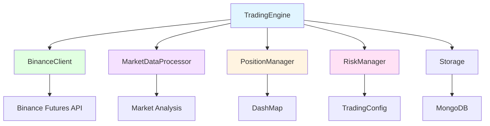
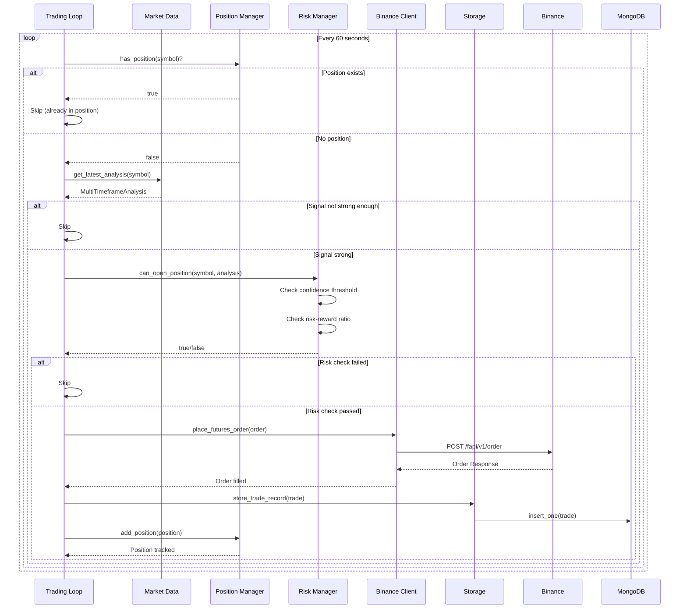
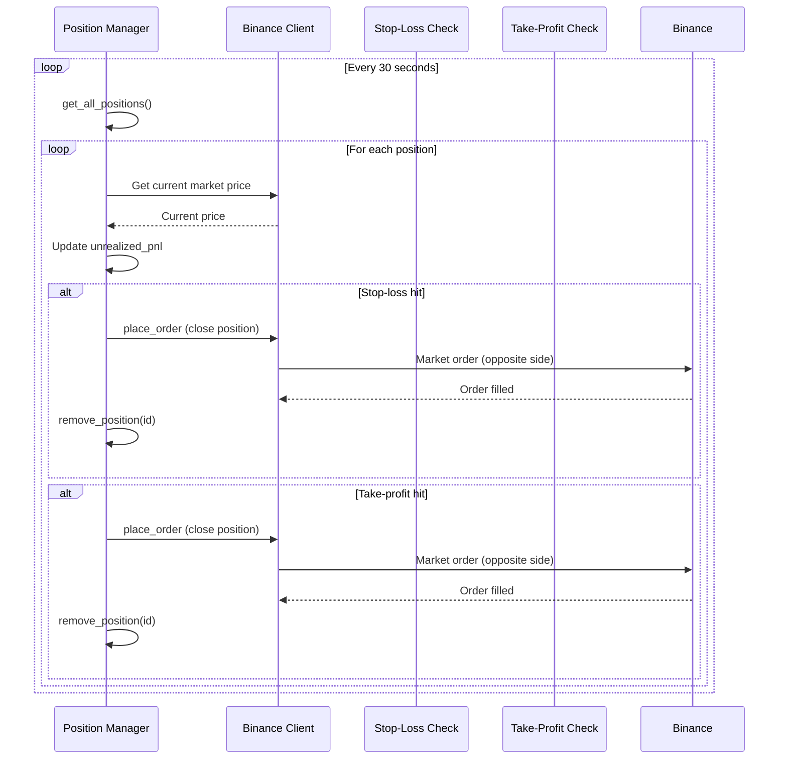

# COMP-RUST-TRADING.md - Rust Trading Component

**Version:** 1.0
**Last Updated:** 2025-10-10
**Status:** Final
**Owner:** Backend Team

---

## Table of Contents

1. [Component Overview](#1-component-overview)
2. [Module Structure](#2-module-structure)
3. [Core Components](#3-core-components)
4. [Component Architecture](#4-component-architecture)
5. [Design Patterns](#5-design-patterns)
6. [Data Models](#6-data-models)
7. [Risk Management](#7-risk-management)
8. [Trading Flow](#8-trading-flow)
9. [Performance & Concurrency](#9-performance--concurrency)
10. [Error Handling](#10-error-handling)

---

## 1. Component Overview

### 1.1 Purpose

The Rust Trading Component handles all trading operations including trade execution, position management, risk validation, and order management. It integrates with Binance Futures API for order placement and supports both live and paper trading modes.

### 1.2 Technology Stack

| Technology | Version | Purpose |
|------------|---------|---------|
| Rust | 1.86 | Core language |
| tokio | ^1.42 | Async runtime, concurrency |
| Binance API | Futures v1 | Exchange integration |
| dashmap | ^6.1 | Concurrent HashMap |
| uuid | ^1.11 | Unique trade IDs |
| chrono | ^0.4 | Timestamp management |

### 1.3 Dependencies

**External Services:**
- Binance Futures API (testnet.binancefuture.com or fapi.binance.com)
- MongoDB (port 27017) - Trade history storage
- Market Data Processor - Price feeds and technical analysis

**Internal Dependencies:**
- `crate::binance::BinanceClient` - API client
- `crate::market_data::MarketDataProcessor` - Market analysis
- `crate::storage::Storage` - Trade persistence

### 1.4 Key Features

- **Automated Trading:** Signal-based trade execution every 60 seconds
- **Position Management:** Concurrent position tracking using DashMap
- **Risk Management:** Pre-trade validation (confidence, risk-reward ratio)
- **Stop-Loss/Take-Profit:** Automated exit order management
- **Position Monitoring:** Real-time P&L tracking
- **Paper Trading:** Simulation mode for testing strategies

---

## 2. Module Structure

### 2.1 Directory Layout

```
rust-core-engine/src/trading/
├── mod.rs                  # Module exports (3 lines)
├── engine.rs               # Trading engine (600+ lines)
├── position_manager.rs     # Position tracking (400+ lines)
└── risk_manager.rs         # Risk validation (350+ lines)
```

**Related Modules:**
```
rust-core-engine/src/
├── binance/
│   ├── client.rs          # Binance API client
│   ├── types.rs           # API request/response types
│   └── websocket.rs       # Real-time price feeds
├── market_data/
│   └── analyzer.rs        # Technical analysis
└── storage/
    └── mod.rs             # MongoDB trade storage
```

**Total Lines of Code:** ~1,350+ lines (trading modules only)

### 2.2 Module Dependencies



---

## 3. Core Components

### 3.1 TradingEngine

**Purpose:** Main trading orchestrator, coordinates all trading operations.

#### 3.1.1 Structure

```rust
#[derive(Clone)]
pub struct TradingEngine {
    binance_config: BinanceConfig,
    config: TradingConfig,
    client: BinanceClient,
    market_data: MarketDataProcessor,
    position_manager: PositionManager,
    risk_manager: RiskManager,
    storage: Storage,
}
```

#### 3.1.2 Configuration

```rust
pub struct TradingConfig {
    pub enabled: bool,                        // Global trading switch
    pub max_positions: u32,                   // Maximum concurrent positions (default: 5)
    pub default_quantity: f64,                // Position size (default: 0.01 BTC)
    pub leverage: u32,                        // Futures leverage (default: 10x)
    pub margin_type: String,                  // "ISOLATED" or "CROSSED"
    pub risk_percentage: f64,                 // Risk per trade (default: 2%)
    pub stop_loss_percentage: f64,            // Default SL (default: 2%)
    pub take_profit_percentage: f64,          // Default TP (default: 4%)
    pub order_timeout_seconds: u64,           // Order expiration (default: 30s)
    pub position_check_interval_seconds: u64, // Monitoring frequency (default: 30s)
}
```

#### 3.1.3 Key Methods

```rust
impl TradingEngine {
    pub async fn new(
        binance_config: BinanceConfig,
        config: TradingConfig,
        market_data: MarketDataProcessor,
        storage: Storage,
    ) -> Result<Self>

    pub async fn start(&self) -> Result<()>

    async fn sync_positions(&self) -> Result<()>

    fn start_trading_loop(&self) -> tokio::task::JoinHandle<Result<()>>

    fn start_position_monitoring(&self) -> tokio::task::JoinHandle<Result<()>>

    async fn process_trading_opportunity(
        market_data: &MarketDataProcessor,
        position_manager: &PositionManager,
        risk_manager: &RiskManager,
        client: &BinanceClient,
        storage: &Storage,
        symbol: &str,
    ) -> Result<()>

    async fn execute_trade(
        client: &BinanceClient,
        storage: &Storage,
        symbol: &str,
        analysis: &MultiTimeframeAnalysis,
    ) -> Result<TradeRecord>
}
```

#### 3.1.4 Trading Loop

**Frequency:** Every 60 seconds

**Flow:**
```rust
async fn start_trading_loop(&self) -> tokio::task::JoinHandle<Result<()>> {
    let market_data = self.market_data.clone();
    let position_manager = self.position_manager.clone();
    let risk_manager = self.risk_manager.clone();
    let client = self.client.clone();
    let storage = self.storage.clone();
    let symbols = self.market_data.get_supported_symbols();

    tokio::spawn(async move {
        let mut interval = interval(Duration::from_secs(60));

        loop {
            interval.tick().await;

            for symbol in &symbols {
                if let Err(e) = Self::process_trading_opportunity(
                    &market_data,
                    &position_manager,
                    &risk_manager,
                    &client,
                    &storage,
                    symbol,
                )
                .await
                {
                    error!("Error processing trading opportunity for {}: {}", symbol, e);
                }
            }
        }
    })
}
```

**Spec Reference:** @spec:FR-TRADING-001

#### 3.1.5 Position Synchronization

**Purpose:** Load existing positions from Binance on startup.

```rust
async fn sync_positions(&self) -> Result<()> {
    info!("Syncing positions with exchange");

    let positions = self.client.get_futures_positions().await?;
    let mut active_positions = 0;

    for binance_position in positions {
        let position_amt: f64 = binance_position.position_amt.parse().unwrap_or(0.0);

        if position_amt.abs() > 0.0 {
            let position = Position {
                id: Uuid::new_v4().to_string(),
                symbol: binance_position.symbol.clone(),
                side: if position_amt > 0.0 { "BUY" } else { "SELL" }.to_string(),
                size: position_amt.abs(),
                entry_price: binance_position.entry_price.parse().unwrap_or(0.0),
                current_price: binance_position.mark_price.parse().unwrap_or(0.0),
                unrealized_pnl: binance_position.unrealized_pnl.parse().unwrap_or(0.0),
                stop_loss: None,
                take_profit: None,
                timestamp: chrono::Utc::now().timestamp_millis(),
            };

            self.position_manager.add_position(position);
            active_positions += 1;
        }
    }

    info!("Synced {} active positions", active_positions);
    Ok(())
}
```

**Spec Reference:** @spec:FR-TRADING-006

---

### 3.2 PositionManager

**Purpose:** Thread-safe position tracking using concurrent HashMap.

#### 3.2.1 Structure

```rust
#[derive(Clone)]
pub struct PositionManager {
    positions: Arc<DashMap<String, Position>>,
}

#[derive(Debug, Clone, Serialize, Deserialize)]
pub struct Position {
    pub id: String,              // Unique UUID
    pub symbol: String,          // Trading pair (e.g., "BTCUSDT")
    pub side: String,            // "BUY" (Long) or "SELL" (Short)
    pub size: f64,               // Position size in base currency
    pub entry_price: f64,        // Average entry price
    pub current_price: f64,      // Last known market price
    pub unrealized_pnl: f64,     // Floating P&L
    pub stop_loss: Option<f64>,  // Stop-loss price
    pub take_profit: Option<f64>,// Take-profit price
    pub timestamp: i64,          // Position open timestamp (ms)
}
```

#### 3.2.2 Key Methods

```rust
impl PositionManager {
    pub fn new() -> Self

    // Position CRUD
    pub fn add_position(&self, position: Position)
    pub fn update_position(&self, position: Position)
    pub fn remove_position(&self, position_id: &str) -> Option<Position>
    pub fn get_position(&self, symbol: &str) -> Option<Position>
    pub fn has_position(&self, symbol: &str) -> bool
    pub fn get_all_positions(&self) -> Vec<Position>

    // Analytics
    pub fn get_total_unrealized_pnl(&self) -> f64
    pub fn get_position_count(&self) -> usize
    pub fn get_positions_by_side(&self, side: &str) -> Vec<Position>
    pub fn get_exposure_for_symbol(&self, symbol: &str) -> f64
    pub fn get_total_exposure(&self) -> f64
}
```

#### 3.2.3 Concurrency Model

**DashMap Features:**
- Lock-free reads (no performance penalty)
- Fine-grained locking on writes (only locks specific shards)
- Thread-safe without manual mutex management
- Clone is cheap (Arc<T> internally)

**Usage Example:**
```rust
// Multiple threads can safely access position manager
let position_manager = PositionManager::new();

// Thread 1: Add position
let pos1 = Position { ... };
position_manager.add_position(pos1);

// Thread 2: Read positions (lock-free)
let count = position_manager.get_position_count();

// Thread 3: Update position
let mut pos2 = position_manager.get_position("BTCUSDT").unwrap();
pos2.current_price = 50000.0;
position_manager.update_position(pos2);
```

**Spec Reference:** @spec:FR-TRADING-004

---

### 3.3 RiskManager

**Purpose:** Pre-trade validation to prevent excessive risk exposure.

#### 3.3.1 Structure

```rust
#[derive(Clone)]
pub struct RiskManager {
    config: TradingConfig,
}
```

#### 3.3.2 Risk Validation Rules

**Signal Confidence Thresholds:**
```rust
pub async fn can_open_position(
    &self,
    symbol: &str,
    analysis: &MultiTimeframeAnalysis,
) -> Result<bool> {
    // Check if trading is enabled
    if !self.config.enabled {
        return Ok(false);
    }

    // Check signal confidence threshold
    let min_confidence = match analysis.overall_signal {
        TradingSignal::StrongBuy | TradingSignal::StrongSell => 0.7,  // 70%
        TradingSignal::Buy | TradingSignal::Sell => 0.8,              // 80%
        TradingSignal::Hold => return Ok(false),
    };

    if analysis.overall_confidence < min_confidence {
        return Ok(false);
    }

    // Check risk-reward ratio
    if let Some(risk_reward) = analysis.risk_reward_ratio {
        if risk_reward < 1.5 {  // Minimum 1.5:1 RR ratio
            return Ok(false);
        }
    }

    Ok(true)
}
```

**Risk Parameters:**
| Parameter | Value | Description |
|-----------|-------|-------------|
| StrongBuy/StrongSell Min Confidence | 70% | Lower threshold for strong signals |
| Buy/Sell Min Confidence | 80% | Higher threshold for regular signals |
| Minimum Risk-Reward Ratio | 1.5:1 | Minimum reward per unit of risk |
| Max Positions | 5 | Maximum concurrent positions |
| Position Size | 0.01 BTC | Fixed quantity (future: dynamic sizing) |

#### 3.3.3 Future Enhancements

```rust
pub fn calculate_position_size(
    &self,
    _symbol: &str,
    _entry_price: f64,
    _stop_loss: Option<f64>,
    _account_balance: f64,
) -> f64 {
    // TODO: Dynamic position sizing based on:
    // - Account balance
    // - Stop-loss distance
    // - Risk percentage (default: 2% of account)
    // - Volatility (ATR-based)

    self.config.default_quantity
}
```

**Spec Reference:** @spec:FR-RISK-001, FR-RISK-002, FR-RISK-003

---

## 4. Component Architecture

### 4.1 Trading Flow Sequence



### 4.2 Position Monitoring Flow



---

## 5. Design Patterns

### 5.1 Async Concurrency Pattern

**Purpose:** Handle multiple operations concurrently without blocking.

**Implementation:**
```rust
pub async fn start(&self) -> Result<()> {
    if !self.config.enabled {
        return Ok(());
    }

    // Start main trading loop
    let trading_handle = self.start_trading_loop();

    // Start position monitoring
    let monitoring_handle = self.start_position_monitoring();

    // Wait for both tasks (runs concurrently)
    tokio::try_join!(
        async { trading_handle.await? },
        async { monitoring_handle.await? }
    )?;

    Ok(())
}
```

**Benefits:**
- Non-blocking I/O operations
- Efficient resource utilization
- Independent task execution

### 5.2 Repository Pattern

**Purpose:** Abstract storage operations.

**Implementation:**
- `Storage` struct wraps MongoDB operations
- Trading engine doesn't know about MongoDB internals
- Easy to mock for testing

### 5.3 Strategy Pattern

**Purpose:** Different risk management strategies.

**Current Implementation:**
- Fixed confidence thresholds
- Fixed risk-reward ratio

**Future:**
```rust
trait RiskStrategy {
    fn can_open_position(&self, analysis: &Analysis) -> bool;
    fn calculate_position_size(&self, context: &Context) -> f64;
}

struct ConservativeRiskStrategy;
struct AggressiveRiskStrategy;
struct AdaptiveRiskStrategy;
```

### 5.4 Builder Pattern

**Purpose:** Construct complex order requests.

**Implementation:**
```rust
let order_request = NewOrderRequest {
    symbol: symbol.to_string(),
    side: side.to_string(),
    r#type: "MARKET".to_string(),
    quantity: Some(quantity.to_string()),
    new_client_order_id: Some(Uuid::new_v4().to_string()),
    reduce_only: Some(false),
    close_position: Some(false),
    position_side: Some("BOTH".to_string()),
    price_protect: Some(false),
    ..Default::default()
};
```

---

## 6. Data Models

### 6.1 Position Model

```rust
#[derive(Debug, Clone, Serialize, Deserialize)]
pub struct Position {
    pub id: String,              // UUID v4
    pub symbol: String,          // "BTCUSDT", "ETHUSDT", etc.
    pub side: String,            // "BUY" | "SELL"
    pub size: f64,               // Position size in base currency
    pub entry_price: f64,        // Average entry price
    pub current_price: f64,      // Latest market price
    pub unrealized_pnl: f64,     // Floating P&L = (current_price - entry_price) * size * direction
    pub stop_loss: Option<f64>,  // Stop-loss trigger price
    pub take_profit: Option<f64>,// Take-profit trigger price
    pub timestamp: i64,          // Open timestamp (Unix ms)
}
```

### 6.2 Trade Record Model

```rust
pub struct TradeRecord {
    pub id: Option<ObjectId>,           // MongoDB _id
    pub symbol: String,
    pub side: String,                    // "BUY" | "SELL"
    pub quantity: f64,
    pub entry_price: f64,
    pub exit_price: Option<f64>,
    pub stop_loss: Option<f64>,
    pub take_profit: Option<f64>,
    pub entry_time: i64,                 // Unix timestamp (ms)
    pub exit_time: Option<i64>,
    pub pnl: Option<f64>,                // Realized P&L (when closed)
    pub status: String,                  // "open" | "closed"
    pub strategy_used: Option<String>,   // "multi_timeframe_analysis"
}
```

### 6.3 Binance Order Request

```rust
pub struct NewOrderRequest {
    pub symbol: String,
    pub side: String,                      // "BUY" | "SELL"
    pub r#type: String,                    // "MARKET" | "LIMIT" | "STOP"
    pub quantity: Option<String>,
    pub price: Option<String>,
    pub new_client_order_id: Option<String>,
    pub stop_price: Option<String>,
    pub time_in_force: Option<String>,     // "GTC" | "IOC" | "FOK"
    pub reduce_only: Option<bool>,
    pub close_position: Option<bool>,
    pub position_side: Option<String>,     // "BOTH" | "LONG" | "SHORT"
    pub working_type: Option<String>,
    pub price_protect: Option<bool>,
    // ... more fields
}
```

---

## 7. Risk Management

### 7.1 Pre-Trade Validation

**Validation Steps:**
1. Check if trading is enabled globally
2. Check if position already exists for symbol
3. Validate signal strength (confidence threshold)
4. Validate risk-reward ratio (minimum 1.5:1)
5. Check maximum positions limit
6. Validate position size (future)

### 7.2 Position Limits

| Limit Type | Value | Enforcement |
|------------|-------|-------------|
| Max Concurrent Positions | 5 | Pre-trade check (future) |
| Max Risk Per Trade | 2% | Position sizing (future) |
| Max Portfolio Risk | 20% | Pre-trade check (future) |
| Leverage | 10x | Set on Binance account |
| Margin Type | ISOLATED | Prevents cascading liquidations |

### 7.3 Stop-Loss Management

**Calculation:**
```rust
let stop_loss_price = if side == "BUY" {
    entry_price * (1.0 - stop_loss_percentage / 100.0)  // 2% below entry
} else {
    entry_price * (1.0 + stop_loss_percentage / 100.0)  // 2% above entry
};
```

**Monitoring:**
- Check every 30 seconds
- Market order executed when stop-loss triggered
- Position removed from PositionManager

### 7.4 Take-Profit Management

**Calculation:**
```rust
let take_profit_price = if side == "BUY" {
    entry_price * (1.0 + take_profit_percentage / 100.0)  // 4% above entry
} else {
    entry_price * (1.0 - take_profit_percentage / 100.0)  // 4% below entry
};
```

---

## 8. Trading Flow

### 8.1 Signal Evaluation

**Input:** `MultiTimeframeAnalysis` from Market Data Processor

**Signal Types:**
- `StrongBuy` - High confidence buy signal (>70%)
- `Buy` - Moderate buy signal (>80%)
- `StrongSell` - High confidence sell signal (>70%)
- `Sell` - Moderate sell signal (>80%)
- `Hold` - No action

**Decision Logic:**
```rust
let should_trade = match analysis.overall_signal {
    TradingSignal::StrongBuy | TradingSignal::StrongSell => {
        analysis.overall_confidence >= 0.7
    },
    TradingSignal::Buy | TradingSignal::Sell => {
        analysis.overall_confidence >= 0.8
    },
    TradingSignal::Hold => false,
};
```

### 8.2 Order Execution

**Order Type:** MARKET (immediate execution)

**Order Parameters:**
```rust
let order_request = NewOrderRequest {
    symbol: "BTCUSDT".to_string(),
    side: "BUY".to_string(),
    r#type: "MARKET".to_string(),
    quantity: Some("0.01".to_string()),
    position_side: Some("BOTH".to_string()),  // One-way position mode
    reduce_only: Some(false),                  // Open new position
    close_position: Some(false),
    price_protect: Some(false),
    ..Default::default()
};

let response = client.place_futures_order(order_request).await?;
```

### 8.3 Trade Recording

**Persistence Flow:**
1. Order executed on Binance
2. Create `TradeRecord` with entry details
3. Store in MongoDB via `Storage::store_trade_record()`
4. Create `Position` object
5. Add to `PositionManager`

---

## 9. Performance & Concurrency

### 9.1 Concurrency Model

**tokio Runtime:**
- Multi-threaded async runtime
- Work-stealing task scheduler
- Efficient I/O polling (epoll/kqueue)

**Concurrent Tasks:**
1. Trading loop (every 60 seconds)
2. Position monitoring (every 30 seconds)
3. Market data WebSocket (continuous)
4. HTTP request handling (on-demand)

### 9.2 Performance Characteristics

**Trading Loop Latency:**
- Signal evaluation: <10ms
- Risk validation: <1ms
- Order placement: 50-200ms (network)
- Database write: 10-50ms
- Total: ~100-300ms per trade

**Position Manager:**
- Read operations: O(1) lock-free
- Write operations: O(1) with fine-grained locking
- Memory overhead: ~200 bytes per position

### 9.3 Scalability

**Horizontal Scaling:**
- Not currently supported (single instance per user)
- Future: Use distributed locking (Redis) for multi-instance

**Vertical Scaling:**
- CPU: Minimal usage (<5% idle, <20% during trading)
- Memory: ~50MB base + ~1MB per 1000 positions
- Network: ~1KB/s idle, ~100KB/s during active trading

---

## 10. Error Handling

### 10.1 Error Types

**Trading Errors:**
```rust
anyhow::Result<T>  // Generic error handling
```

**Common Errors:**
- Network errors (Binance API timeout)
- Insufficient margin
- Invalid order parameters
- Position not found
- Database connection error

### 10.2 Error Recovery

**Retry Strategy:**
```rust
// Order placement: No automatic retry (risk of duplicate orders)
// Market data: Automatic reconnection
// Database: Exponential backoff (1s, 2s, 4s, 8s, 16s)
```

**Graceful Degradation:**
- If market data unavailable: Skip trading loop iteration
- If position manager fails: Continue other operations
- If database unavailable: Continue trading (in-memory only)

### 10.3 Logging

**Log Levels:**
- `ERROR`: Critical failures (order execution failed)
- `WARN`: Recoverable issues (leverage setting failed)
- `INFO`: Important events (trade executed, position closed)
- `DEBUG`: Detailed information (signal evaluation, risk checks)

**Example Logs:**
```
[INFO] Synced 3 active positions
[INFO] Executed trade: BTCUSDT BUY 0.01 @ 50000.0
[DEBUG] Signal not strong enough for ETHUSDT: Buy (confidence: 0.65)
[DEBUG] Risk manager rejected trade for BNBUSDT
[ERROR] Failed to execute trade for SOLUSDT: Insufficient margin
```

---

## Appendices

### A. Functional Requirements Mapping

| Requirement | Module | Implementation |
|-------------|--------|----------------|
| FR-TRADING-001 | engine.rs | Automated trading loop (60s interval) |
| FR-TRADING-002 | engine.rs | Market order execution |
| FR-TRADING-003 | engine.rs | Stop-loss order placement |
| FR-TRADING-004 | position_manager.rs | Position tracking with DashMap |
| FR-TRADING-005 | position_manager.rs | P&L calculation |
| FR-TRADING-006 | engine.rs | Position synchronization |
| FR-RISK-001 | risk_manager.rs | Pre-trade validation |
| FR-RISK-002 | risk_manager.rs | Stop-loss validation |
| FR-RISK-003 | risk_manager.rs | Position limits check (future) |

### B. Configuration Reference

**TradingConfig (config.toml):**
```toml
[trading]
enabled = true
max_positions = 5
default_quantity = 0.01
leverage = 10
margin_type = "ISOLATED"
risk_percentage = 2.0
stop_loss_percentage = 2.0
take_profit_percentage = 4.0
order_timeout_seconds = 30
position_check_interval_seconds = 30
```

### C. API Integration

**Binance Futures API Endpoints:**
- `POST /fapi/v1/order` - Place new order
- `GET /fapi/v2/positionRisk` - Get all positions
- `POST /fapi/v1/leverage` - Change leverage
- `POST /fapi/v1/marginType` - Change margin type

### D. Related Documents

- [API_SPEC.md](../2.3-api/API_SPEC.md) - Complete API documentation
- [COMP-RUST-AUTH.md](./COMP-RUST-AUTH.md) - Authentication component
- [BUSINESS_RULES.md](../../01-requirements/BUSINESS_RULES.md) - Trading rules

### E. Future Enhancements

1. **Dynamic Position Sizing:** Calculate position size based on account balance and stop-loss distance
2. **Advanced Stop-Loss:** Trailing stop-loss, time-based stops
3. **Portfolio Risk Management:** Max portfolio exposure, correlation analysis
4. **Multi-Instance Support:** Distributed locking for horizontal scaling
5. **Order Types:** Limit orders, stop-limit orders, OCO orders
6. **Partial Closes:** Scale out of positions gradually

---

**End of Document**
