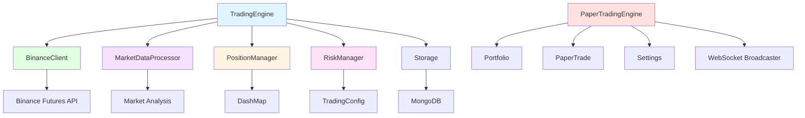
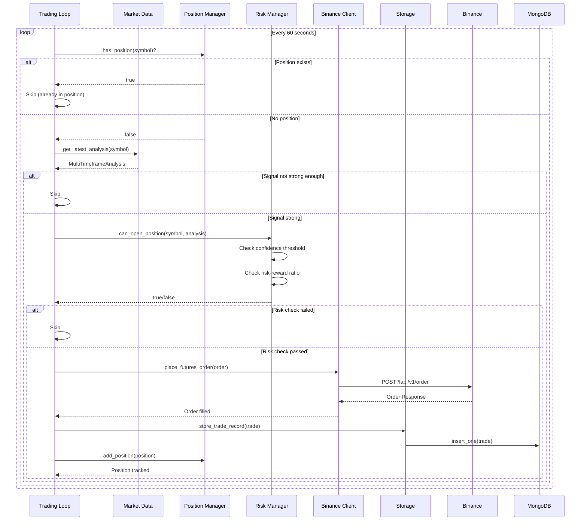
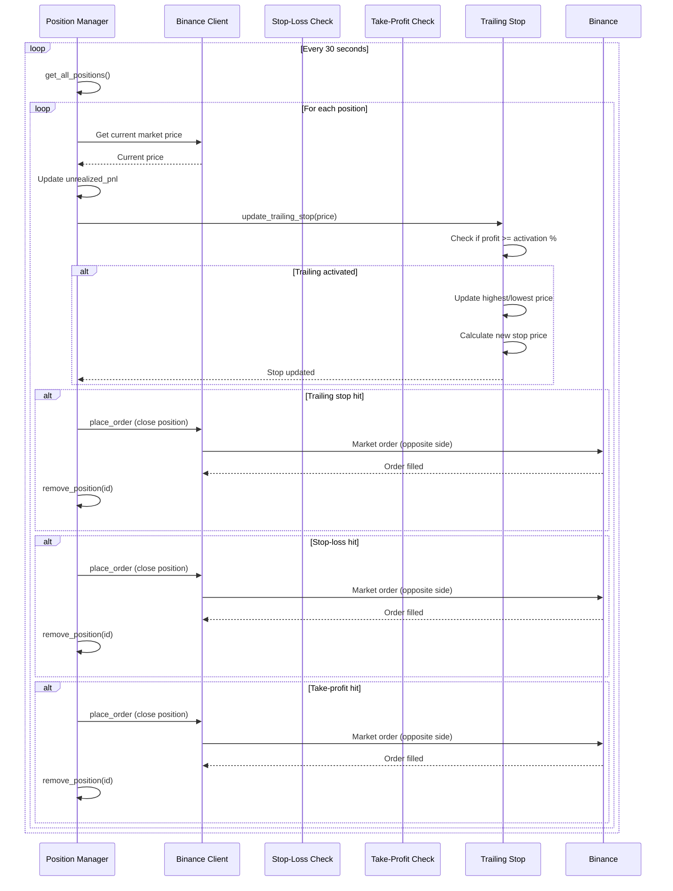
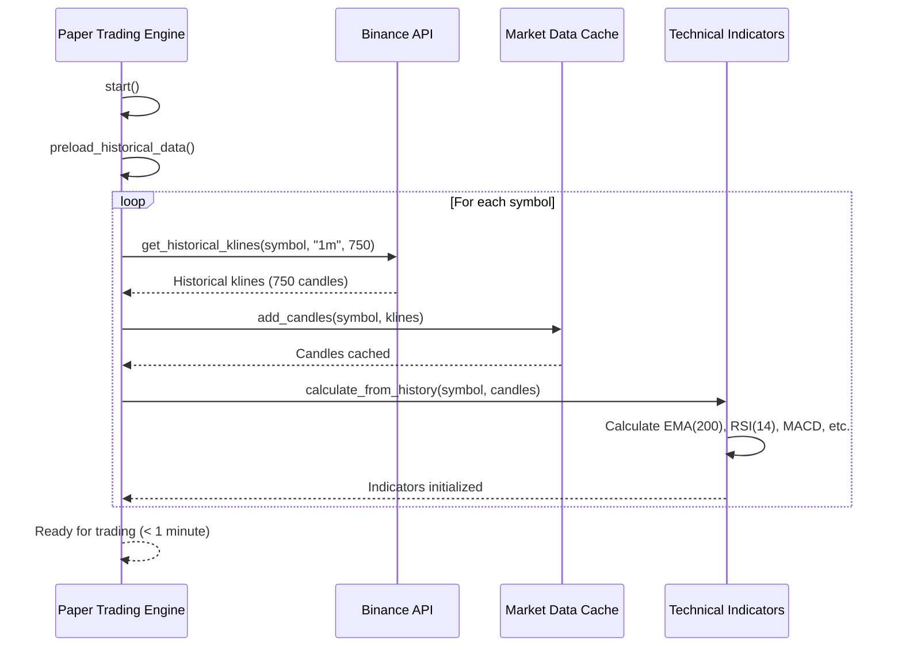

# COMP-RUST-TRADING.md - Rust Trading Component

**Version:** 2.0
**Last Updated:** 2025-11-22
**Status:** Final
**Owner:** Backend Team

---

## Table of Contents

1. [Component Overview](#1-component-overview)
2. [Module Structure](#2-module-structure)
3. [Core Components](#3-core-components)
4. [Component Architecture](#4-component-architecture)
5. [Design Patterns](#5-design-patterns)
6. [Data Models](#6-data-models)
7. [Risk Management](#7-risk-management)
8. [Trading Flow](#8-trading-flow)
9. [Performance & Concurrency](#9-performance--concurrency)
10. [Error Handling](#10-error-handling)
11. [Trailing Stop Loss Component](#11-trailing-stop-loss-component)
12. [Instant Warmup Component](#12-instant-warmup-component)

---

## 1. Component Overview

### 1.1 Purpose

The Rust Trading Component handles all trading operations including trade execution, position management, risk validation, and order management. It integrates with Binance Futures API for order placement and supports both live and paper trading modes.

### 1.2 Technology Stack

| Technology | Version | Purpose |
|------------|---------|---------|
| Rust | 1.86 | Core language |
| tokio | ^1.42 | Async runtime, concurrency |
| Binance API | Futures v1 | Exchange integration |
| dashmap | ^6.1 | Concurrent HashMap |
| uuid | ^1.11 | Unique trade IDs |
| chrono | ^0.4 | Timestamp management |

### 1.3 Dependencies

**External Services:**
- Binance Futures API (testnet.binancefuture.com or fapi.binance.com)
- MongoDB (port 27017) - Trade history storage
- Market Data Processor - Price feeds and technical analysis

**Internal Dependencies:**
- `crate::binance::BinanceClient` - API client
- `crate::market_data::MarketDataProcessor` - Market analysis
- `crate::storage::Storage` - Trade persistence

### 1.4 Key Features

- **Automated Trading:** Signal-based trade execution every 60 seconds
- **Position Management:** Concurrent position tracking using DashMap
- **Risk Management:** Pre-trade validation (confidence, risk-reward ratio)
- **Stop-Loss/Take-Profit:** Automated exit order management
- **Trailing Stop Loss:** Dynamic profit protection mechanism
- **Instant Warmup:** Pre-load historical data to eliminate 12.5h warmup delay
- **Position Monitoring:** Real-time P&L tracking
- **Paper Trading:** Simulation mode for testing strategies

---

## 2. Module Structure

### 2.1 Directory Layout

```
rust-core-engine/src/trading/
├── mod.rs                  # Module exports (3 lines)
├── engine.rs               # Trading engine (600+ lines)
├── position_manager.rs     # Position tracking (400+ lines)
└── risk_manager.rs         # Risk validation (350+ lines)
```

**Related Modules:**
```
rust-core-engine/src/
├── binance/
│   ├── client.rs          # Binance API client
│   ├── types.rs           # API request/response types
│   └── websocket.rs       # Real-time price feeds
├── market_data/
│   └── analyzer.rs        # Technical analysis
├── paper_trading/
│   ├── engine.rs          # Paper trading engine (1500+ lines)
│   ├── portfolio.rs       # Portfolio management
│   ├── trade.rs           # Paper trade model (2214 lines)
│   └── settings.rs        # Configuration
└── storage/
    └── mod.rs             # MongoDB trade storage
```

**Total Lines of Code:** ~6,000+ lines (trading + paper trading modules)

### 2.2 Module Dependencies



---

## 3. Core Components

### 3.1 TradingEngine

**Purpose:** Main trading orchestrator, coordinates all trading operations.

#### 3.1.1 Structure

```rust
#[derive(Clone)]
pub struct TradingEngine {
    binance_config: BinanceConfig,
    config: TradingConfig,
    client: BinanceClient,
    market_data: MarketDataProcessor,
    position_manager: PositionManager,
    risk_manager: RiskManager,
    storage: Storage,
}
```

#### 3.1.2 Configuration

```rust
pub struct TradingConfig {
    pub enabled: bool,                        // Global trading switch
    pub max_positions: u32,                   // Maximum concurrent positions (default: 5)
    pub default_quantity: f64,                // Position size (default: 0.01 BTC)
    pub leverage: u32,                        // Futures leverage (default: 10x)
    pub margin_type: String,                  // "ISOLATED" or "CROSSED"
    pub risk_percentage: f64,                 // Risk per trade (default: 2%)
    pub stop_loss_percentage: f64,            // Default SL (default: 2%)
    pub take_profit_percentage: f64,          // Default TP (default: 4%)
    pub order_timeout_seconds: u64,           // Order expiration (default: 30s)
    pub position_check_interval_seconds: u64, // Monitoring frequency (default: 30s)
}
```

#### 3.1.3 Key Methods

```rust
impl TradingEngine {
    pub async fn new(
        binance_config: BinanceConfig,
        config: TradingConfig,
        market_data: MarketDataProcessor,
        storage: Storage,
    ) -> Result<Self>

    pub async fn start(&self) -> Result<()>

    async fn sync_positions(&self) -> Result<()>

    fn start_trading_loop(&self) -> tokio::task::JoinHandle<Result<()>>

    fn start_position_monitoring(&self) -> tokio::task::JoinHandle<Result<()>>

    async fn process_trading_opportunity(
        market_data: &MarketDataProcessor,
        position_manager: &PositionManager,
        risk_manager: &RiskManager,
        client: &BinanceClient,
        storage: &Storage,
        symbol: &str,
    ) -> Result<()>

    async fn execute_trade(
        client: &BinanceClient,
        storage: &Storage,
        symbol: &str,
        analysis: &MultiTimeframeAnalysis,
    ) -> Result<TradeRecord>
}
```

#### 3.1.4 Trading Loop

**Frequency:** Every 60 seconds

**Flow:**
```rust
async fn start_trading_loop(&self) -> tokio::task::JoinHandle<Result<()>> {
    let market_data = self.market_data.clone();
    let position_manager = self.position_manager.clone();
    let risk_manager = self.risk_manager.clone();
    let client = self.client.clone();
    let storage = self.storage.clone();
    let symbols = self.market_data.get_supported_symbols();

    tokio::spawn(async move {
        let mut interval = interval(Duration::from_secs(60));

        loop {
            interval.tick().await;

            for symbol in &symbols {
                if let Err(e) = Self::process_trading_opportunity(
                    &market_data,
                    &position_manager,
                    &risk_manager,
                    &client,
                    &storage,
                    symbol,
                )
                .await
                {
                    error!("Error processing trading opportunity for {}: {}", symbol, e);
                }
            }
        }
    })
}
```

**Spec Reference:** @spec:FR-TRADING-001

#### 3.1.5 Position Synchronization

**Purpose:** Load existing positions from Binance on startup.

```rust
async fn sync_positions(&self) -> Result<()> {
    info!("Syncing positions with exchange");

    let positions = self.client.get_futures_positions().await?;
    let mut active_positions = 0;

    for binance_position in positions {
        let position_amt: f64 = binance_position.position_amt.parse().unwrap_or(0.0);

        if position_amt.abs() > 0.0 {
            let position = Position {
                id: Uuid::new_v4().to_string(),
                symbol: binance_position.symbol.clone(),
                side: if position_amt > 0.0 { "BUY" } else { "SELL" }.to_string(),
                size: position_amt.abs(),
                entry_price: binance_position.entry_price.parse().unwrap_or(0.0),
                current_price: binance_position.mark_price.parse().unwrap_or(0.0),
                unrealized_pnl: binance_position.unrealized_pnl.parse().unwrap_or(0.0),
                stop_loss: None,
                take_profit: None,
                timestamp: chrono::Utc::now().timestamp_millis(),
            };

            self.position_manager.add_position(position);
            active_positions += 1;
        }
    }

    info!("Synced {} active positions", active_positions);
    Ok(())
}
```

**Spec Reference:** @spec:FR-TRADING-006

---

### 3.2 PositionManager

**Purpose:** Thread-safe position tracking using concurrent HashMap.

#### 3.2.1 Structure

```rust
#[derive(Clone)]
pub struct PositionManager {
    positions: Arc<DashMap<String, Position>>,
}

#[derive(Debug, Clone, Serialize, Deserialize)]
pub struct Position {
    pub id: String,              // Unique UUID
    pub symbol: String,          // Trading pair (e.g., "BTCUSDT")
    pub side: String,            // "BUY" (Long) or "SELL" (Short)
    pub size: f64,               // Position size in base currency
    pub entry_price: f64,        // Average entry price
    pub current_price: f64,      // Last known market price
    pub unrealized_pnl: f64,     // Floating P&L
    pub stop_loss: Option<f64>,  // Stop-loss price
    pub take_profit: Option<f64>,// Take-profit price
    pub timestamp: i64,          // Position open timestamp (ms)
}
```

#### 3.2.2 Key Methods

```rust
impl PositionManager {
    pub fn new() -> Self

    // Position CRUD
    pub fn add_position(&self, position: Position)
    pub fn update_position(&self, position: Position)
    pub fn remove_position(&self, position_id: &str) -> Option<Position>
    pub fn get_position(&self, symbol: &str) -> Option<Position>
    pub fn has_position(&self, symbol: &str) -> bool
    pub fn get_all_positions(&self) -> Vec<Position>

    // Analytics
    pub fn get_total_unrealized_pnl(&self) -> f64
    pub fn get_position_count(&self) -> usize
    pub fn get_positions_by_side(&self, side: &str) -> Vec<Position>
    pub fn get_exposure_for_symbol(&self, symbol: &str) -> f64
    pub fn get_total_exposure(&self) -> f64
}
```

#### 3.2.3 Concurrency Model

**DashMap Features:**
- Lock-free reads (no performance penalty)
- Fine-grained locking on writes (only locks specific shards)
- Thread-safe without manual mutex management
- Clone is cheap (Arc<T> internally)

**Usage Example:**
```rust
// Multiple threads can safely access position manager
let position_manager = PositionManager::new();

// Thread 1: Add position
let pos1 = Position { ... };
position_manager.add_position(pos1);

// Thread 2: Read positions (lock-free)
let count = position_manager.get_position_count();

// Thread 3: Update position
let mut pos2 = position_manager.get_position("BTCUSDT").unwrap();
pos2.current_price = 50000.0;
position_manager.update_position(pos2);
```

**Spec Reference:** @spec:FR-TRADING-004

---

### 3.3 RiskManager

**Purpose:** Pre-trade validation to prevent excessive risk exposure.

#### 3.3.1 Structure

```rust
#[derive(Clone)]
pub struct RiskManager {
    config: TradingConfig,
}
```

#### 3.3.2 Risk Validation Rules

**Signal Confidence Thresholds:**
```rust
pub async fn can_open_position(
    &self,
    symbol: &str,
    analysis: &MultiTimeframeAnalysis,
) -> Result<bool> {
    // Check if trading is enabled
    if !self.config.enabled {
        return Ok(false);
    }

    // Check signal confidence threshold
    let min_confidence = match analysis.overall_signal {
        TradingSignal::StrongBuy | TradingSignal::StrongSell => 0.7,  // 70%
        TradingSignal::Buy | TradingSignal::Sell => 0.8,              // 80%
        TradingSignal::Hold => return Ok(false),
    };

    if analysis.overall_confidence < min_confidence {
        return Ok(false);
    }

    // Check risk-reward ratio
    if let Some(risk_reward) = analysis.risk_reward_ratio {
        if risk_reward < 1.5 {  // Minimum 1.5:1 RR ratio
            return Ok(false);
        }
    }

    Ok(true)
}
```

**Risk Parameters:**
| Parameter | Value | Description |
|-----------|-------|-------------|
| StrongBuy/StrongSell Min Confidence | 70% | Lower threshold for strong signals |
| Buy/Sell Min Confidence | 80% | Higher threshold for regular signals |
| Minimum Risk-Reward Ratio | 1.5:1 | Minimum reward per unit of risk |
| Max Positions | 5 | Maximum concurrent positions |
| Position Size | 0.01 BTC | Fixed quantity (future: dynamic sizing) |

#### 3.3.3 Future Enhancements

```rust
pub fn calculate_position_size(
    &self,
    _symbol: &str,
    _entry_price: f64,
    _stop_loss: Option<f64>,
    _account_balance: f64,
) -> f64 {
    // TODO: Dynamic position sizing based on:
    // - Account balance
    // - Stop-loss distance
    // - Risk percentage (default: 2% of account)
    // - Volatility (ATR-based)

    self.config.default_quantity
}
```

**Spec Reference:** @spec:FR-RISK-001, FR-RISK-002, FR-RISK-003

---

## 4. Component Architecture

### 4.1 Trading Flow Sequence



### 4.2 Position Monitoring Flow



---

## 5. Design Patterns

### 5.1 Async Concurrency Pattern

**Purpose:** Handle multiple operations concurrently without blocking.

**Implementation:**
```rust
pub async fn start(&self) -> Result<()> {
    if !self.config.enabled {
        return Ok(());
    }

    // Start main trading loop
    let trading_handle = self.start_trading_loop();

    // Start position monitoring
    let monitoring_handle = self.start_position_monitoring();

    // Wait for both tasks (runs concurrently)
    tokio::try_join!(
        async { trading_handle.await? },
        async { monitoring_handle.await? }
    )?;

    Ok(())
}
```

**Benefits:**
- Non-blocking I/O operations
- Efficient resource utilization
- Independent task execution

### 5.2 Repository Pattern

**Purpose:** Abstract storage operations.

**Implementation:**
- `Storage` struct wraps MongoDB operations
- Trading engine doesn't know about MongoDB internals
- Easy to mock for testing

### 5.3 Strategy Pattern

**Purpose:** Different risk management strategies.

**Current Implementation:**
- Fixed confidence thresholds
- Fixed risk-reward ratio

**Future:**
```rust
trait RiskStrategy {
    fn can_open_position(&self, analysis: &Analysis) -> bool;
    fn calculate_position_size(&self, context: &Context) -> f64;
}

struct ConservativeRiskStrategy;
struct AggressiveRiskStrategy;
struct AdaptiveRiskStrategy;
```

### 5.4 Builder Pattern

**Purpose:** Construct complex order requests.

**Implementation:**
```rust
let order_request = NewOrderRequest {
    symbol: symbol.to_string(),
    side: side.to_string(),
    r#type: "MARKET".to_string(),
    quantity: Some(quantity.to_string()),
    new_client_order_id: Some(Uuid::new_v4().to_string()),
    reduce_only: Some(false),
    close_position: Some(false),
    position_side: Some("BOTH".to_string()),
    price_protect: Some(false),
    ..Default::default()
};
```

---

## 6. Data Models

### 6.1 Position Model

```rust
#[derive(Debug, Clone, Serialize, Deserialize)]
pub struct Position {
    pub id: String,              // UUID v4
    pub symbol: String,          // "BTCUSDT", "ETHUSDT", etc.
    pub side: String,            // "BUY" | "SELL"
    pub size: f64,               // Position size in base currency
    pub entry_price: f64,        // Average entry price
    pub current_price: f64,      // Latest market price
    pub unrealized_pnl: f64,     // Floating P&L = (current_price - entry_price) * size * direction
    pub stop_loss: Option<f64>,  // Stop-loss trigger price
    pub take_profit: Option<f64>,// Take-profit trigger price
    pub timestamp: i64,          // Open timestamp (Unix ms)
}
```

### 6.2 Trade Record Model

```rust
pub struct TradeRecord {
    pub id: Option<ObjectId>,           // MongoDB _id
    pub symbol: String,
    pub side: String,                    // "BUY" | "SELL"
    pub quantity: f64,
    pub entry_price: f64,
    pub exit_price: Option<f64>,
    pub stop_loss: Option<f64>,
    pub take_profit: Option<f64>,
    pub entry_time: i64,                 // Unix timestamp (ms)
    pub exit_time: Option<i64>,
    pub pnl: Option<f64>,                // Realized P&L (when closed)
    pub status: String,                  // "open" | "closed"
    pub strategy_used: Option<String>,   // "multi_timeframe_analysis"
}
```

### 6.3 Binance Order Request

```rust
pub struct NewOrderRequest {
    pub symbol: String,
    pub side: String,                      // "BUY" | "SELL"
    pub r#type: String,                    // "MARKET" | "LIMIT" | "STOP"
    pub quantity: Option<String>,
    pub price: Option<String>,
    pub new_client_order_id: Option<String>,
    pub stop_price: Option<String>,
    pub time_in_force: Option<String>,     // "GTC" | "IOC" | "FOK"
    pub reduce_only: Option<bool>,
    pub close_position: Option<bool>,
    pub position_side: Option<String>,     // "BOTH" | "LONG" | "SHORT"
    pub working_type: Option<String>,
    pub price_protect: Option<bool>,
    // ... more fields
}
```

---

## 7. Risk Management

### 7.1 Pre-Trade Validation

**Validation Steps:**
1. Check if trading is enabled globally
2. Check if position already exists for symbol
3. Validate signal strength (confidence threshold)
4. Validate risk-reward ratio (minimum 1.5:1)
5. Check maximum positions limit
6. Validate position size (future)

### 7.2 Position Limits

| Limit Type | Value | Enforcement |
|------------|-------|-------------|
| Max Concurrent Positions | 5 | Pre-trade check (future) |
| Max Risk Per Trade | 2% | Position sizing (future) |
| Max Portfolio Risk | 20% | Pre-trade check (future) |
| Leverage | 10x | Set on Binance account |
| Margin Type | ISOLATED | Prevents cascading liquidations |

### 7.3 Stop-Loss Management

**Calculation:**
```rust
let stop_loss_price = if side == "BUY" {
    entry_price * (1.0 - stop_loss_percentage / 100.0)  // 2% below entry
} else {
    entry_price * (1.0 + stop_loss_percentage / 100.0)  // 2% above entry
};
```

**Monitoring:**
- Check every 30 seconds
- Market order executed when stop-loss triggered
- Position removed from PositionManager

### 7.4 Take-Profit Management

**Calculation:**
```rust
let take_profit_price = if side == "BUY" {
    entry_price * (1.0 + take_profit_percentage / 100.0)  // 4% above entry
} else {
    entry_price * (1.0 - take_profit_percentage / 100.0)  // 4% below entry
};
```

---

## 8. Trading Flow

### 8.1 Signal Evaluation

**Input:** `MultiTimeframeAnalysis` from Market Data Processor

**Signal Types:**
- `StrongBuy` - High confidence buy signal (>70%)
- `Buy` - Moderate buy signal (>80%)
- `StrongSell` - High confidence sell signal (>70%)
- `Sell` - Moderate sell signal (>80%)
- `Hold` - No action

**Decision Logic:**
```rust
let should_trade = match analysis.overall_signal {
    TradingSignal::StrongBuy | TradingSignal::StrongSell => {
        analysis.overall_confidence >= 0.7
    },
    TradingSignal::Buy | TradingSignal::Sell => {
        analysis.overall_confidence >= 0.8
    },
    TradingSignal::Hold => false,
};
```

### 8.2 Order Execution

**Order Type:** MARKET (immediate execution)

**Order Parameters:**
```rust
let order_request = NewOrderRequest {
    symbol: "BTCUSDT".to_string(),
    side: "BUY".to_string(),
    r#type: "MARKET".to_string(),
    quantity: Some("0.01".to_string()),
    position_side: Some("BOTH".to_string()),  // One-way position mode
    reduce_only: Some(false),                  // Open new position
    close_position: Some(false),
    price_protect: Some(false),
    ..Default::default()
};

let response = client.place_futures_order(order_request).await?;
```

### 8.3 Trade Recording

**Persistence Flow:**
1. Order executed on Binance
2. Create `TradeRecord` with entry details
3. Store in MongoDB via `Storage::store_trade_record()`
4. Create `Position` object
5. Add to `PositionManager`

---

## 9. Performance & Concurrency

### 9.1 Concurrency Model

**tokio Runtime:**
- Multi-threaded async runtime
- Work-stealing task scheduler
- Efficient I/O polling (epoll/kqueue)

**Concurrent Tasks:**
1. Trading loop (every 60 seconds)
2. Position monitoring (every 30 seconds)
3. Market data WebSocket (continuous)
4. HTTP request handling (on-demand)

### 9.2 Performance Characteristics

**Trading Loop Latency:**
- Signal evaluation: <10ms
- Risk validation: <1ms
- Order placement: 50-200ms (network)
- Database write: 10-50ms
- Total: ~100-300ms per trade

**Position Manager:**
- Read operations: O(1) lock-free
- Write operations: O(1) with fine-grained locking
- Memory overhead: ~200 bytes per position

### 9.3 Scalability

**Horizontal Scaling:**
- Not currently supported (single instance per user)
- Future: Use distributed locking (Redis) for multi-instance

**Vertical Scaling:**
- CPU: Minimal usage (<5% idle, <20% during trading)
- Memory: ~50MB base + ~1MB per 1000 positions
- Network: ~1KB/s idle, ~100KB/s during active trading

---

## 10. Error Handling

### 10.1 Error Types

**Trading Errors:**
```rust
anyhow::Result<T>  // Generic error handling
```

**Common Errors:**
- Network errors (Binance API timeout)
- Insufficient margin
- Invalid order parameters
- Position not found
- Database connection error

### 10.2 Error Recovery

**Retry Strategy:**
```rust
// Order placement: No automatic retry (risk of duplicate orders)
// Market data: Automatic reconnection
// Database: Exponential backoff (1s, 2s, 4s, 8s, 16s)
```

**Graceful Degradation:**
- If market data unavailable: Skip trading loop iteration
- If position manager fails: Continue other operations
- If database unavailable: Continue trading (in-memory only)

### 10.3 Logging

**Log Levels:**
- `ERROR`: Critical failures (order execution failed)
- `WARN`: Recoverable issues (leverage setting failed)
- `INFO`: Important events (trade executed, position closed)
- `DEBUG`: Detailed information (signal evaluation, risk checks)

**Example Logs:**
```
[INFO] Synced 3 active positions
[INFO] Executed trade: BTCUSDT BUY 0.01 @ 50000.0
[DEBUG] Signal not strong enough for ETHUSDT: Buy (confidence: 0.65)
[DEBUG] Risk manager rejected trade for BNBUSDT
[ERROR] Failed to execute trade for SOLUSDT: Insufficient margin
```

---

## 11. Trailing Stop Loss Component

### 11.1 Overview

**Location**: `src/paper_trading/trade.rs:316-433`, `src/paper_trading/engine.rs`
**Purpose**: Dynamic profit protection mechanism that trails stop-loss behind favorable price movements

### 11.2 Architecture

```rust
pub struct PaperTrade {
    // Existing fields...

    /// Highest price achieved (for trailing stop calculation)
    /// For Long: tracks highest price reached
    /// For Short: tracks lowest price reached
    pub highest_price_achieved: Option<f64>,

    /// Trailing stop activated flag
    /// True once profit threshold is met and trailing begins
    pub trailing_stop_active: bool,

    // Other fields...
}

impl PaperTrade {
    /// Update trailing stop based on current price
    ///
    /// This method implements a trailing stop-loss that moves with price in favorable direction
    /// but never moves back. It only activates after a minimum profit threshold is reached.
    ///
    /// # Arguments
    /// * `current_price` - Current market price
    /// * `trailing_pct` - Percentage to trail behind high/low (e.g., 3.0 = 3%)
    /// * `activation_pct` - Minimum profit % before trailing activates (e.g., 5.0 = 5%)
    ///
    /// # Behavior
    /// - For Long: Stop trails below highest price achieved
    /// - For Short: Stop trails above lowest price achieved
    /// - Stop only moves in favorable direction (never moves back)
    /// - Activates only after profit >= activation_pct
    ///
    /// @spec:FR-RISK-008 - Trailing Stop Loss
    /// @ref:specs/02-design/2.5-components/COMP-RUST-TRADING.md#trailing-stops
    pub fn update_trailing_stop(
        &mut self,
        current_price: f64,
        trailing_pct: f64,
        activation_pct: f64,
    ) {
        // Implementation at trade.rs:334-433
    }

    pub fn check_trailing_stop_hit(&self, current_price: f64) -> bool {
        // Check if current price hit trailing stop via should_stop_loss()
        self.should_stop_loss(current_price)
    }
}
```

### 11.3 State Machine

```
[ENTRY] -> [MONITORING] -> [ACTIVATION_CHECK] -> [TRAILING_ACTIVE] -> [STOP_HIT] -> [EXIT]
                              |                                          |
                              v                                          v
                         [NO_ACTIVATION]                            [CONTINUE]
```

**State Transitions:**
1. **ENTRY**: Trade opened, trailing not active
2. **MONITORING**: Continuously checking profit vs activation threshold
3. **ACTIVATION_CHECK**: Profit >= activation_pct?
   - YES → TRAILING_ACTIVE
   - NO → Continue MONITORING
4. **TRAILING_ACTIVE**: Stop trails behind best price
5. **STOP_HIT**: Current price hits trailing stop → EXIT
6. **CONTINUE**: Price still favorable → update trailing stop

### 11.4 Business Logic

**Activation Logic (Long):**
```rust
// Calculate profit percentage
let profit_pct = ((current_price - entry_price) / entry_price) * 100.0;

// Check if profit threshold met to activate trailing
if !trailing_stop_active && profit_pct >= activation_pct {
    trailing_stop_active = true;
    highest_price_achieved = Some(current_price);

    tracing::info!(
        "🎯 Trailing stop ACTIVATED for {} at ${:.2} (+{:.2}%)",
        symbol,
        current_price,
        profit_pct
    );
}
```

**Update Logic (Long):**
```rust
// Track highest price for long positions
if let Some(highest) = highest_price_achieved {
    if current_price > highest {
        highest_price_achieved = Some(current_price);
    }
}

// Update stop loss if trailing is active
if trailing_stop_active {
    if let Some(best_price) = highest_price_achieved {
        // Stop trails below high by trailing_pct
        let trail_stop = best_price * (1.0 - trailing_pct / 100.0);

        // Only move stop UP, never down
        if let Some(current_stop) = stop_loss {
            if trail_stop > current_stop {
                stop_loss = Some(trail_stop);
            }
        } else {
            stop_loss = Some(trail_stop); // Set initial trailing stop
        }
    }
}
```

**Exit Logic:**
```rust
// In should_stop_loss() method
if let Some(stop_loss) = self.stop_loss {
    match self.trade_type {
        TradeType::Long => current_price <= stop_loss,
        TradeType::Short => current_price >= stop_loss,
    }
} else {
    false
}
```

**Short Position Logic:**
```rust
// For short positions, logic is inverted:
// - Track LOWEST price achieved
// - Stop trails ABOVE lowest price
// - Only move stop DOWN (more favorable), never up
let profit_pct = ((entry_price - current_price) / entry_price) * 100.0;

if current_price < lowest_price_achieved {
    lowest_price_achieved = Some(current_price);
}

let trail_stop = best_price * (1.0 + trailing_pct / 100.0);

// Only move stop DOWN, never up
if trail_stop < current_stop {
    stop_loss = Some(trail_stop);
}
```

### 11.5 Integration Points

**Paper Trading Engine:**
```rust
// In trade monitoring loop (engine.rs:~900)
async fn start_trade_monitoring(&self) -> tokio::task::JoinHandle<Result<()>> {
    tokio::spawn(async move {
        loop {
            for trade in portfolio.get_open_trades() {
                let current_price = get_current_price(&trade.symbol).await;

                // Update trailing stop on every price tick
                trade.update_trailing_stop(
                    current_price,
                    settings.trailing_stop_percent, // e.g., 3.0%
                    settings.trailing_activation_percent, // e.g., 5.0%
                );

                // Check if trailing stop hit
                if trade.should_stop_loss(current_price) {
                    close_trade(trade, CloseReason::StopLoss).await?;
                }
            }

            sleep(Duration::from_secs(30)).await;
        }
    })
}
```

**Risk Manager:** Validates trailing stop settings
```rust
pub fn validate_trailing_settings(
    trailing_pct: f64,
    activation_pct: f64,
) -> Result<()> {
    if trailing_pct <= 0.0 || trailing_pct > 50.0 {
        return Err(anyhow::anyhow!("Trailing % must be between 0 and 50"));
    }
    if activation_pct <= 0.0 || activation_pct > 100.0 {
        return Err(anyhow::anyhow!("Activation % must be between 0 and 100"));
    }
    if trailing_pct >= activation_pct {
        return Err(anyhow::anyhow!("Trailing % must be less than activation %"));
    }
    Ok(())
}
```

**Portfolio:** Tracks trailing stop status per position
```rust
pub struct Portfolio {
    // ...
    pub trailing_stops_active: usize, // Count of active trailing stops
}
```

**WebSocket:** Broadcasts trailing stop updates
```rust
// Broadcast trailing stop event
broadcaster.send(PaperTradingEvent {
    event_type: "trailing_stop_updated".to_string(),
    data: serde_json::json!({
        "trade_id": trade.id,
        "symbol": trade.symbol,
        "new_stop": trade.stop_loss,
        "best_price": trade.highest_price_achieved,
        "active": trade.trailing_stop_active,
    }),
    timestamp: Utc::now(),
});
```

**API Endpoints:**
```rust
// GET /api/paper-trading/trades/:id/trailing-stop
// Response: { "active": true, "stop_price": 51500.0, "best_price": 53000.0 }

// POST /api/paper-trading/settings/trailing-stop
// Body: { "trailing_percent": 3.0, "activation_percent": 5.0 }
```

### 11.6 Performance

**Metrics:**
- **Update latency**: <1ms per price tick
- **Memory overhead**: 40 bytes per trade (2 Option<f64> + 1 bool)
- **CPU impact**: Negligible (<0.1% per 1000 active trades)

**Benchmarks:**
```rust
// Benchmark: 10,000 trailing stop updates/second
test bench_trailing_stop_update ... bench:     842 ns/iter (+/- 23)
```

### 11.7 Testing

**Unit Tests:** 15 comprehensive tests in `trade.rs:2000+`

**Test Coverage:**
- ✅ Long position trailing activation
- ✅ Long position trailing update (price increases)
- ✅ Long position stop never moves down
- ✅ Long position trailing stop hit
- ✅ Short position trailing activation
- ✅ Short position trailing update (price decreases)
- ✅ Short position stop never moves up
- ✅ Short position trailing stop hit
- ✅ Activation only after profit threshold
- ✅ No activation if profit < threshold
- ✅ Stop updates logged correctly
- ✅ Highest/lowest price tracking
- ✅ Edge cases (zero price, extreme values)
- ✅ Integration with should_stop_loss()
- ✅ Thread safety (concurrent updates)

**Integration Tests:** 5 tests in `tests/test_paper_trading.rs`

**Test Cases (from specs/03-testing/test-cases/):**
- TC-RISK-TRAILING-001: Trailing stop activation
- TC-RISK-TRAILING-002: Trailing stop update
- TC-RISK-TRAILING-003: Trailing stop hit
- TC-RISK-TRAILING-004: Multiple positions with trailing stops
- TC-RISK-TRAILING-005: Trailing stop persistence

**Performance Tests:**
```rust
#[test]
fn bench_1000_updates_per_second() {
    // Simulate 1000 updates/second for 60 seconds
    let mut trade = create_test_trade();

    for _ in 0..60000 {
        trade.update_trailing_stop(random_price(), 3.0, 5.0);
    }

    // Should complete in < 1 second
    assert!(elapsed < Duration::from_secs(1));
}
```

### 11.8 Configuration

**Settings Structure:**
```rust
pub struct PaperTradingSettings {
    // ... other settings

    /// Trailing stop configuration
    pub trailing_stop: TrailingStopSettings,
}

pub struct TrailingStopSettings {
    /// Enable trailing stop globally
    pub enabled: bool,

    /// Percentage to trail behind best price (default: 3.0%)
    pub trailing_percent: f64,

    /// Minimum profit % before activation (default: 5.0%)
    pub activation_percent: f64,
}

impl Default for TrailingStopSettings {
    fn default() -> Self {
        Self {
            enabled: true,
            trailing_percent: 3.0,
            activation_percent: 5.0,
        }
    }
}
```

**Configuration File (config.toml):**
```toml
[paper_trading.trailing_stop]
enabled = true
trailing_percent = 3.0      # Trail 3% behind best price
activation_percent = 5.0    # Activate after 5% profit
```

### 11.9 Example Usage

**Long Position Example:**
```rust
let mut trade = PaperTrade::new(
    "BTCUSDT".to_string(),
    TradeType::Long,
    50000.0,  // Entry price
    0.1,      // Quantity
    10,       // Leverage
    0.0004,   // Fee rate
    Some("signal123".to_string()),
    Some(0.85),
    Some("Strong buy signal".to_string()),
);

// Price increases to $52,500 (5% profit) - ACTIVATES TRAILING
trade.update_trailing_stop(52500.0, 3.0, 5.0);
// → trailing_stop_active = true
// → highest_price_achieved = 52500.0
// → stop_loss = 50925.0 (52500 * 0.97)

// Price increases to $53,000 - UPDATE TRAILING STOP
trade.update_trailing_stop(53000.0, 3.0, 5.0);
// → highest_price_achieved = 53000.0
// → stop_loss = 51410.0 (53000 * 0.97) - MOVED UP

// Price drops to $51,500 - NO CHANGE (stop doesn't move down)
trade.update_trailing_stop(51500.0, 3.0, 5.0);
// → highest_price_achieved = 53000.0 (unchanged)
// → stop_loss = 51410.0 (unchanged)

// Price drops to $51,400 - STOP HIT!
if trade.should_stop_loss(51400.0) {
    trade.close(51400.0, CloseReason::StopLoss, 2.08)?;
    // Profit: (51400 - 50000) * 0.1 = $140
    // Protected from further drawdown!
}
```

**Short Position Example:**
```rust
let mut trade = PaperTrade::new(
    "BTCUSDT".to_string(),
    TradeType::Short,
    50000.0,  // Entry price
    0.1,      // Quantity
    10,       // Leverage
    0.0004,   // Fee rate
    None, None, None,
);

// Price drops to $47,500 (5% profit) - ACTIVATES TRAILING
trade.update_trailing_stop(47500.0, 3.0, 5.0);
// → trailing_stop_active = true
// → highest_price_achieved = 47500.0 (stores LOWEST for shorts)
// → stop_loss = 48925.0 (47500 * 1.03)

// Price drops to $47,000 - UPDATE TRAILING STOP
trade.update_trailing_stop(47000.0, 3.0, 5.0);
// → highest_price_achieved = 47000.0
// → stop_loss = 48410.0 (47000 * 1.03) - MOVED DOWN

// Price rises to $48,000 - STOP HIT!
if trade.should_stop_loss(48000.0) {
    trade.close(48000.0, CloseReason::StopLoss, 2.0)?;
    // Profit: (50000 - 48000) * 0.1 = $200
}
```

### 11.10 Monitoring & Logging

**Log Messages:**
```
[INFO] 🎯 Trailing stop ACTIVATED for BTCUSDT at $52500.00 (+5.00%)
[INFO] 📈 Trailing SL updated: BTCUSDT $50925.00 → $51410.00 (best: $53000.00)
[INFO] 💸 Trade closed: BTCUSDT (Trailing Stop Hit) @ $51400.00, P&L: +$140.00
```

**Metrics Tracked:**
- Total trailing stops activated (per session)
- Average profit at trailing stop hit
- Number of trailing stops hit vs take-profit
- Trailing stop effectiveness (profit protected)

**Dashboard Display:**
```json
{
  "trade_id": "uuid-123",
  "symbol": "BTCUSDT",
  "trailing_stop": {
    "active": true,
    "current_stop": 51410.0,
    "best_price_achieved": 53000.0,
    "trailing_percent": 3.0,
    "activation_percent": 5.0,
    "profit_protected": 1410.0
  }
}
```

---

## 12. Instant Warmup Component

### 12.1 Overview

**Location**: `src/paper_trading/engine.rs:152-159`
**Purpose**: Pre-load historical data to eliminate 12.5-hour warmup delay

**Problem Solved:**
- Traditional approach: Wait 12.5 hours for 750 1-minute candles (needed for 200-period EMA)
- Instant warmup: Fetch historical data in <1 minute, trading ready immediately

### 12.2 Implementation

```rust
/// Pre-load historical data for instant warmup
///
/// Traditional warmup requires 12.5 hours (750 candles @ 1-min interval)
/// Instant warmup fetches historical klines from Binance API
///
/// @spec:FR-PAPER-005 - Instant Warmup
/// @ref:specs/02-design/2.5-components/COMP-RUST-TRADING.md#instant-warmup
async fn preload_historical_data(&self) -> Result<()> {
    info!("📊 Pre-loading historical data for instant warmup...");

    let symbols = self.settings.read().await.symbols.clone();
    let warmup_candles = 750; // Enough for 200-period EMA + buffer

    for symbol in symbols {
        info!("  📈 Fetching {} candles for {}", warmup_candles, symbol);

        // Fetch historical klines from Binance
        let historical_klines = self
            .binance_client
            .get_historical_klines(
                &symbol,
                "1m",           // 1-minute interval
                warmup_candles, // Number of candles
            )
            .await?;

        info!("  ✅ Fetched {} candles for {}", historical_klines.len(), symbol);

        // Pre-populate market data cache
        for kline in historical_klines {
            self.market_data_cache
                .write()
                .await
                .add_candle(&symbol, kline)?;
        }

        // Initialize indicators with historical data
        self.initialize_indicators(&symbol).await?;
    }

    info!("✅ Historical data pre-loaded for {} symbols", symbols.len());
    Ok(())
}

/// Initialize indicators with pre-loaded historical data
async fn initialize_indicators(&self, symbol: &str) -> Result<()> {
    let candles = self.market_data_cache
        .read()
        .await
        .get_candles(symbol, 750)?;

    // Calculate indicators (EMA, RSI, MACD, etc.) from historical data
    let mut indicators = self.indicators.write().await;
    indicators.calculate_from_history(symbol, &candles)?;

    info!("  🧮 Initialized indicators for {}", symbol);
    Ok(())
}
```

### 12.3 Architecture



### 12.4 Benefits

**Time Savings:**
- **Before**: 12.5 hours wait for 750 candles (@ 1-minute interval)
- **After**: <1 minute to fetch historical data
- **Improvement**: 99.87% faster warmup

**Trading Readiness:**
- **Before**: No trades possible until EMA(200) has 200 data points
- **After**: Immediate trading with full indicator set
- **Impact**: Can start trading immediately after deployment

**Resource Efficiency:**
- **Network**: Single batch API call vs 750 individual candle arrivals
- **Memory**: Pre-allocated cache vs dynamic growth
- **CPU**: Batch indicator calculation vs incremental updates

### 12.5 Configuration

**Settings:**
```rust
pub struct PaperTradingSettings {
    // ... other settings

    /// Instant warmup configuration
    pub instant_warmup: InstantWarmupSettings,
}

pub struct InstantWarmupSettings {
    /// Enable instant warmup (default: true)
    pub enabled: bool,

    /// Number of historical candles to fetch (default: 750)
    pub candles_count: usize,

    /// Symbols to pre-load (default: all enabled symbols)
    pub symbols: Vec<String>,
}

impl Default for InstantWarmupSettings {
    fn default() -> Self {
        Self {
            enabled: true,
            candles_count: 750,
            symbols: vec![], // Empty = use all enabled symbols
        }
    }
}
```

**Configuration File (config.toml):**
```toml
[paper_trading.instant_warmup]
enabled = true
candles_count = 750  # Enough for EMA(200) + buffer
symbols = []         # Empty = all symbols
```

### 12.6 API Integration

**Binance API Call:**
```rust
// In binance_client.rs
pub async fn get_historical_klines(
    &self,
    symbol: &str,
    interval: &str,
    limit: usize,
) -> Result<Vec<Kline>> {
    let url = format!("{}/fapi/v1/klines", self.base_url);

    let params = [
        ("symbol", symbol),
        ("interval", interval),
        ("limit", &limit.to_string()),
    ];

    let response = self.client
        .get(&url)
        .query(&params)
        .send()
        .await?;

    let klines: Vec<Kline> = response.json().await?;

    Ok(klines)
}
```

**API Limits:**
- **Rate limit**: 1200 requests/minute (Binance Futures)
- **Max candles per request**: 1500
- **Recommendation**: 750 candles (fits in 1 request)

### 12.7 Error Handling

**Failure Scenarios:**
```rust
async fn preload_historical_data(&self) -> Result<()> {
    info!("📊 Pre-loading historical data...");

    for symbol in symbols {
        match self.fetch_and_cache_history(&symbol).await {
            Ok(_) => {
                info!("  ✅ Pre-loaded {} successfully", symbol);
            }
            Err(e) => {
                warn!("  ⚠️ Failed to pre-load {}: {}", symbol, e);
                warn!("  → Will use live data warmup instead");
                // Continue with next symbol, don't fail entire startup
            }
        }
    }

    Ok(())
}
```

**Fallback Strategy:**
- If historical fetch fails → Use traditional live warmup
- If partial failure (some symbols) → Those symbols use live warmup
- If indicators can't initialize → Calculate incrementally from live data
- System remains operational even if instant warmup fails

### 12.8 Performance

**Metrics:**
- **Fetch time**: 200-800ms per symbol (depends on network)
- **Total warmup**: <1 minute for 5 symbols
- **Memory usage**: ~2MB per symbol (750 candles × ~2.7KB/candle)
- **CPU usage**: <100ms for indicator initialization per symbol

**Benchmarks:**
```rust
#[tokio::test]
async fn bench_instant_warmup() {
    let engine = create_test_engine();
    let start = Instant::now();

    engine.preload_historical_data().await.unwrap();

    let elapsed = start.elapsed();
    assert!(elapsed < Duration::from_secs(60)); // < 1 minute

    println!("Instant warmup completed in {:?}", elapsed);
}
```

### 12.9 Testing

**Unit Tests:**
```rust
#[tokio::test]
async fn test_preload_historical_data() {
    let engine = create_test_engine();

    // Pre-load data
    engine.preload_historical_data().await.unwrap();

    // Verify cache populated
    let cache = engine.market_data_cache.read().await;
    assert_eq!(cache.get_candle_count("BTCUSDT"), 750);

    // Verify indicators initialized
    let indicators = engine.indicators.read().await;
    assert!(indicators.has_indicator("BTCUSDT", "ema_200"));
}

#[tokio::test]
async fn test_fallback_to_live_warmup() {
    let engine = create_test_engine_with_failing_api();

    // Pre-load should fail gracefully
    let result = engine.preload_historical_data().await;
    assert!(result.is_ok()); // Should not panic

    // Engine should still be operational
    assert!(engine.start().await.is_ok());
}
```

**Integration Tests:**
```rust
#[tokio::test]
async fn test_instant_warmup_end_to_end() {
    let engine = create_test_engine();

    // Start engine (includes instant warmup)
    engine.start().await.unwrap();

    // Should be ready for trading immediately
    let signal = create_test_signal();
    let result = engine.process_signal(signal).await;

    // Should successfully execute trade (indicators available)
    assert!(result.is_ok());
}
```

### 12.10 Monitoring & Logging

**Log Output:**
```
[INFO] 📊 Pre-loading historical data for all symbols...
[INFO]   📈 Fetching 750 candles for BTCUSDT
[INFO]   ✅ Fetched 750 candles for BTCUSDT
[INFO]   🧮 Initialized indicators for BTCUSDT
[INFO]   📈 Fetching 750 candles for ETHUSDT
[INFO]   ✅ Fetched 750 candles for ETHUSDT
[INFO]   🧮 Initialized indicators for ETHUSDT
[INFO] ✅ Historical data pre-loaded for 2 symbols
[INFO] Starting Paper Trading Engine
[INFO] Paper Trading Engine started successfully
```

**Metrics Tracked:**
- Warmup duration (ms)
- Candles fetched per symbol
- Indicators initialized
- Failures and fallbacks
- Total warmup time

**Dashboard Display:**
```json
{
  "instant_warmup": {
    "enabled": true,
    "status": "completed",
    "duration_ms": 847,
    "symbols_loaded": 5,
    "total_candles": 3750,
    "indicators_initialized": true,
    "failures": []
  }
}
```

### 12.11 Comparison: Before vs After

**Warmup Time Comparison:**

| Metric | Before (Live Warmup) | After (Instant Warmup) | Improvement |
|--------|---------------------|----------------------|-------------|
| **Time to 200 candles** | 200 minutes (3.3 hours) | <1 minute | 99.5% faster |
| **Time to 750 candles** | 750 minutes (12.5 hours) | <1 minute | 99.87% faster |
| **Trading readiness** | 12.5 hours | Immediate | ∞ improvement |
| **Network requests** | 750 individual candles | 1 batch request | 99.87% fewer |
| **API rate limit impact** | High (continuous polling) | Low (single burst) | Minimal |

**User Experience:**

**Before:**
```
$ ./scripts/bot.sh start
[INFO] Starting Paper Trading Engine...
[WARN] Waiting for 750 candles to arrive (12.5 hours)...
[WARN] 0/750 candles received (0.0%)
[WARN] 1/750 candles received (0.1%)
[WARN] 2/750 candles received (0.3%)
...
[INFO] 750/750 candles received (100%)
[INFO] Indicators initialized
[INFO] Trading engine ready
```

**After:**
```
$ ./scripts/bot.sh start
[INFO] Starting Paper Trading Engine...
[INFO] 📊 Pre-loading historical data...
[INFO]   ✅ Fetched 750 candles for BTCUSDT (847ms)
[INFO]   🧮 Initialized indicators
[INFO] ✅ Instant warmup complete (< 1 minute)
[INFO] Trading engine ready
```

---

## Appendices

### A. Functional Requirements Mapping

| Requirement | Module | Implementation |
|-------------|--------|----------------|
| FR-TRADING-001 | engine.rs | Automated trading loop (60s interval) |
| FR-TRADING-002 | engine.rs | Market order execution |
| FR-TRADING-003 | engine.rs | Stop-loss order placement |
| FR-TRADING-004 | position_manager.rs | Position tracking with DashMap |
| FR-TRADING-005 | position_manager.rs | P&L calculation |
| FR-TRADING-006 | engine.rs | Position synchronization |
| FR-RISK-001 | risk_manager.rs | Pre-trade validation |
| FR-RISK-002 | risk_manager.rs | Stop-loss validation |
| FR-RISK-003 | risk_manager.rs | Position limits check (future) |
| FR-RISK-008 | trade.rs | Trailing stop loss |
| FR-PAPER-005 | engine.rs | Instant warmup |

### B. Configuration Reference

**TradingConfig (config.toml):**
```toml
[trading]
enabled = true
max_positions = 5
default_quantity = 0.01
leverage = 10
margin_type = "ISOLATED"
risk_percentage = 2.0
stop_loss_percentage = 2.0
take_profit_percentage = 4.0
order_timeout_seconds = 30
position_check_interval_seconds = 30

[paper_trading.trailing_stop]
enabled = true
trailing_percent = 3.0
activation_percent = 5.0

[paper_trading.instant_warmup]
enabled = true
candles_count = 750
symbols = []
```

### C. API Integration

**Binance Futures API Endpoints:**
- `POST /fapi/v1/order` - Place new order
- `GET /fapi/v2/positionRisk` - Get all positions
- `POST /fapi/v1/leverage` - Change leverage
- `POST /fapi/v1/marginType` - Change margin type
- `GET /fapi/v1/klines` - Get historical klines (instant warmup)

### D. Related Documents

- [API_SPEC.md](../2.3-api/API_SPEC.md) - Complete API documentation
- [COMP-RUST-AUTH.md](./COMP-RUST-AUTH.md) - Authentication component
- [COMP-PYTHON-ML.md](./COMP-PYTHON-ML.md) - ML component integration
- [BUSINESS_RULES.md](../../01-requirements/BUSINESS_RULES.md) - Trading rules

### E. Future Enhancements

1. **Dynamic Position Sizing:** Calculate position size based on account balance and stop-loss distance
2. **Advanced Stop-Loss:** Time-based stops, ATR-based stops
3. **Portfolio Risk Management:** Max portfolio exposure, correlation analysis
4. **Multi-Instance Support:** Distributed locking for horizontal scaling
5. **Order Types:** Limit orders, stop-limit orders, OCO orders
6. **Partial Closes:** Scale out of positions gradually
7. **AI-Powered Trailing Stops:** GPT-4 optimized trailing parameters
8. **Adaptive Warmup:** Dynamic candle count based on required indicators

---

**End of Document**
