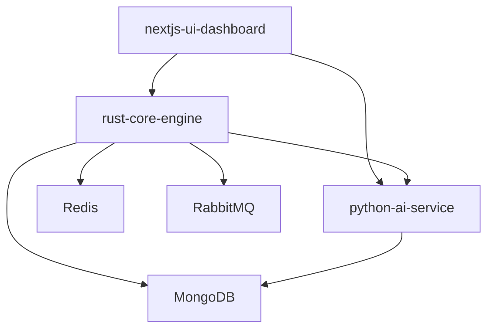

# Docker Configuration Specification

**Document Version:** 1.0.0
**Last Updated:** 2025-10-11
**Status:** Active
**Owner:** DevOps Team

---

## Table of Contents

- [1. Overview](#1-overview)
- [2. Docker Architecture](#2-docker-architecture)
- [3. Service Configurations](#3-service-configurations)
- [4. Multi-Stage Builds](#4-multi-stage-builds)
- [5. Image Optimization](#5-image-optimization)
- [6. Docker Compose Profiles](#6-docker-compose-profiles)
- [7. Volume Management](#7-volume-management)
- [8. Network Configuration](#8-network-configuration)
- [9. Health Checks](#9-health-checks)
- [10. Resource Limits](#10-resource-limits)
- [11. Security Configuration](#11-security-configuration)
- [12. Build Strategies](#12-build-strategies)
- [13. Troubleshooting](#13-troubleshooting)

---

## 1. Overview

### 1.1 Purpose

This document defines the Docker configuration for all services in the Bot Core platform, including container specifications, networking, volumes, and deployment strategies.

### 1.2 Related Documents

- `INFRA-REQUIREMENTS.md` - Infrastructure requirements
- `docker-compose.yml` - Main compose file
- `Dockerfile` files - Service-specific images
- `scripts/bot.sh` - Control script

### 1.3 Docker Version Requirements

**Minimum Versions:**
- Docker Engine: 24.0+
- Docker Compose: 2.20+
- Docker BuildKit: Enabled

**Check Versions:**
```bash
docker --version
docker compose version
docker buildx version
```

---

## 2. Docker Architecture

### 2.1 System Architecture

```
┌────────────────────────────────────────────────────────────┐
│                    Docker Host                              │
├────────────────────────────────────────────────────────────┤
│                                                              │
│  ┌───────────────────────────────────────────────────────┐ │
│  │         Docker Network: bot-network (bridge)           │ │
│  │                  172.20.0.0/16                         │ │
│  │                                                         │ │
│  │  ┌─────────────┐  ┌─────────────┐  ┌─────────────┐  │ │
│  │  │  Frontend   │  │  Rust Core  │  │  Python AI  │  │ │
│  │  │  Container  │  │  Container  │  │  Container  │  │ │
│  │  │             │  │             │  │             │  │ │
│  │  │  :3000      │  │  :8080      │  │  :8000      │  │ │
│  │  └─────┬───────┘  └─────┬───────┘  └─────┬───────┘  │ │
│  │        │                 │                 │          │ │
│  │        └─────────────────┼─────────────────┘          │ │
│  │                          │                             │ │
│  │                  ┌───────▼────────┐                   │ │
│  │                  │   MongoDB      │                   │ │
│  │                  │   Container    │                   │ │
│  │                  │   :27017       │                   │ │
│  │                  └────────────────┘                   │ │
│  └───────────────────────────────────────────────────────┘ │
│                                                              │
│  ┌───────────────────────────────────────────────────────┐ │
│  │            Named Volumes (Persistent)                  │ │
│  │  • redis_data         • kong_data                      │ │
│  │  • rabbitmq_data      • prometheus_data                │ │
│  │  • grafana_data       • rust_target_cache              │ │
│  └───────────────────────────────────────────────────────┘ │
│                                                              │
└────────────────────────────────────────────────────────────┘
```

### 2.2 Service Dependencies



---

## 3. Service Configurations

### 3.1 Frontend Service (Next.js Dashboard)

#### Production Configuration

**Source:** `docker-compose.yml` (lines 188-227)

```yaml
nextjs-ui-dashboard:
  build:
    context: ./nextjs-ui-dashboard
    dockerfile: ${DOCKERFILE:-Dockerfile}
  container_name: nextjs-ui-dashboard
  restart: unless-stopped
  ports:
    - "3000:3000"
  environment:
    - NODE_ENV=${NODE_ENV:-production}
    - VITE_RUST_API_URL=http://rust-core-engine:8080
    - VITE_PYTHON_AI_URL=http://python-ai-service:8000
    - VITE_WS_URL=ws://rust-core-engine:8080/ws
    - VITE_API_TIMEOUT=10000
    - VITE_REFRESH_INTERVAL=5000
    - VITE_ENABLE_REALTIME=true
    - DASHBOARD_SESSION_SECRET=${DASHBOARD_SESSION_SECRET:?Error: DASHBOARD_SESSION_SECRET not set}
    - NODE_OPTIONS="--max-old-space-size=${NODE_MEMORY:-1024}"
  networks:
    - bot-network
  healthcheck:
    test: ["CMD", "curl", "-f", "http://localhost:3000/health"]
    interval: 30s
    timeout: 10s
    retries: 3
    start_period: 30s
  depends_on:
    - rust-core-engine
    - python-ai-service
  deploy:
    resources:
      limits:
        memory: ${FRONTEND_MEMORY_LIMIT:-1G}
        cpus: "${FRONTEND_CPU_LIMIT:-1}"
      reservations:
        memory: ${FRONTEND_MEMORY_RESERVE:-256M}
        cpus: "${FRONTEND_CPU_RESERVE:-0.5}"
  profiles:
    - prod
```

**Key Features:**
- Static build served by Vite preview
- Memory limit: 1GB (configurable)
- Health check on `/health` endpoint
- Depends on backend services

#### Development Configuration

**Source:** `docker-compose.yml` (lines 230-281)

```yaml
nextjs-ui-dashboard-dev:
  build:
    context: ./nextjs-ui-dashboard
    dockerfile: Dockerfile.dev
    target: development
  container_name: nextjs-ui-dashboard-dev
  restart: unless-stopped
  ports:
    - "3000:3000"
    - "24678:24678" # HMR WebSocket port
  environment:
    - NODE_ENV=development
    - VITE_RUST_API_URL=http://localhost:8080
    - VITE_PYTHON_AI_URL=http://localhost:8000
    - VITE_WS_URL=ws://localhost:8080/ws
    - VITE_API_TIMEOUT=10000
    - VITE_REFRESH_INTERVAL=5000
    - VITE_ENABLE_REALTIME=true
    - CHOKIDAR_USEPOLLING=true
    - NODE_OPTIONS="--max-old-space-size=768"
    - HMR_PORT=24678
    - BUN_RUNTIME_TRANSPILER_CACHE_PATH=/tmp/bun-cache
    - BUN_ENABLE_JEMALLOC=true
    - BUN_ENABLE_SMOL=false
  volumes:
    - ./nextjs-ui-dashboard/src:/app/src:delegated
    - ./nextjs-ui-dashboard/public:/app/public:delegated
    - ./nextjs-ui-dashboard/index.html:/app/index.html:ro
    - ./nextjs-ui-dashboard/vite.config.ts:/app/vite.config.ts:ro
    - ./nextjs-ui-dashboard/tailwind.config.ts:/app/tailwind.config.ts:ro
  command: ["bun", "run", "dev", "--", "--host", "0.0.0.0", "--port", "3000"]
  networks:
    - bot-network
  healthcheck:
    test: ["CMD", "curl", "-f", "http://localhost:3000/"]
    interval: 10s
    timeout: 5s
    retries: 3
    start_period: 30s
  depends_on:
    - python-ai-service-dev
    - rust-core-engine-dev
  deploy:
    resources:
      limits:
        memory: 768M
        cpus: "1"
  profiles:
    - dev
```

**Key Features:**
- Hot module replacement (HMR) enabled
- Source code mounted as volumes
- Bun runtime for fast development
- Port 24678 for HMR WebSocket

### 3.2 Rust Core Engine Service

#### Production Configuration

**Source:** `docker-compose.yml` (lines 96-138)

```yaml
rust-core-engine:
  build:
    context: ./rust-core-engine
    dockerfile: ${DOCKERFILE:-Dockerfile}
  container_name: rust-core-engine
  restart: unless-stopped
  ports:
    - "8080:8080"
  environment:
    - RUST_LOG=${RUST_LOG:-info}
    - DATABASE_URL=${DATABASE_URL:?Error: DATABASE_URL not set}
    - PYTHON_AI_SERVICE_URL=http://python-ai-service:8000
    - BINANCE_API_KEY=${BINANCE_API_KEY:?Error: BINANCE_API_KEY not set}
    - BINANCE_SECRET_KEY=${BINANCE_SECRET_KEY:?Error: BINANCE_SECRET_KEY not set}
    - BINANCE_TESTNET=${BINANCE_TESTNET:-true}
    - TRADING_ENABLED=${TRADING_ENABLED:-false}
    - INTER_SERVICE_TOKEN=${INTER_SERVICE_TOKEN:?Error: INTER_SERVICE_TOKEN not set}
    - RUST_API_KEY=${RUST_API_KEY:?Error: RUST_API_KEY not set}
  volumes:
    - ./rust-core-engine/data:/app/data
    - ./rust-core-engine/logs:/app/logs
    - ./rust-core-engine/config.toml:/app/config.toml
  networks:
    - bot-network
  healthcheck:
    test: ["CMD", "curl", "-f", "http://localhost:8080/api/health"]
    interval: 30s
    timeout: 10s
    retries: 3
    start_period: 60s
  depends_on:
    python-ai-service:
      condition: service_healthy
  deploy:
    resources:
      limits:
        memory: ${RUST_MEMORY_LIMIT:-2G}
        cpus: "${RUST_CPU_LIMIT:-2}"
      reservations:
        memory: ${RUST_MEMORY_RESERVE:-1G}
        cpus: "${RUST_CPU_RESERVE:-1}"
  profiles:
    - prod
```

**Key Features:**
- Release build for production
- Health check on `/api/health`
- Waits for Python AI service to be healthy
- Memory limit: 2GB (configurable)

#### Development Configuration

**Source:** `docker-compose.yml` (lines 140-185)

```yaml
rust-core-engine-dev:
  build:
    context: ./rust-core-engine
    dockerfile: Dockerfile.dev
  container_name: rust-core-engine-dev
  restart: unless-stopped
  ports:
    - "8080:8080"
  environment:
    - RUST_LOG=debug
    - RUST_BACKTRACE=1
    - DATABASE_URL=${DATABASE_URL:?Error: DATABASE_URL not set}
    - PYTHON_AI_SERVICE_URL=http://python-ai-service-dev:8000
    - BINANCE_API_KEY=${BINANCE_API_KEY:?Error: BINANCE_API_KEY not set}
    - BINANCE_SECRET_KEY=${BINANCE_SECRET_KEY:?Error: BINANCE_SECRET_KEY not set}
    - BINANCE_TESTNET=${BINANCE_TESTNET:-true}
    - TRADING_ENABLED=${TRADING_ENABLED:-false}
    - INTER_SERVICE_TOKEN=${INTER_SERVICE_TOKEN:?Error: INTER_SERVICE_TOKEN not set}
    - RUST_API_KEY=${RUST_API_KEY:?Error: RUST_API_KEY not set}
  volumes:
    - ./rust-core-engine/src:/app/src
    - ./rust-core-engine/Cargo.toml:/app/Cargo.toml
    - ./rust-core-engine/Cargo.lock:/app/Cargo.lock
    - ./rust-core-engine/config.toml:/app/config.toml
    - ./rust-core-engine/data:/app/data
    - ./rust-core-engine/logs:/app/logs
    - rust_target_cache:/app/target
  networks:
    - bot-network
  healthcheck:
    test: ["CMD", "curl", "-f", "http://localhost:8080/api/health"]
    interval: 10s
    timeout: 5s
    retries: 3
    start_period: 60s
  depends_on:
    python-ai-service-dev:
      condition: service_healthy
  deploy:
    resources:
      limits:
        memory: 1.5G
        cpus: "1.5"
  profiles:
    - dev
```

**Key Features:**
- Debug build with backtrace
- Source code mounted for hot reload
- Target directory cached in named volume
- Faster health checks (10s interval)

### 3.3 Python AI Service

#### Production Configuration

**Source:** `docker-compose.yml` (lines 3-42)

```yaml
python-ai-service:
  build:
    context: ./python-ai-service
    dockerfile: ${DOCKERFILE:-Dockerfile}
  container_name: python-ai-service
  restart: unless-stopped
  ports:
    - "8000:8000"
  environment:
    - PYTHONPATH=/app
    - PYTHONUNBUFFERED=1
    - PYTHONDONTWRITEBYTECODE=1
    - LOG_LEVEL=${LOG_LEVEL:-INFO}
    - INTER_SERVICE_TOKEN=${INTER_SERVICE_TOKEN:?Error: INTER_SERVICE_TOKEN not set}
    - PYTHON_API_KEY=${PYTHON_API_KEY:?Error: PYTHON_API_KEY not set}
    - OPENAI_API_KEY=${OPENAI_API_KEY}
    - DATABASE_URL=${DATABASE_URL:?Error: DATABASE_URL not set}
  volumes:
    - ./python-ai-service/models:/app/models
    - ./python-ai-service/logs:/app/logs
    - ./python-ai-service/data:/app/data
    - ./python-ai-service/config.yaml:/app/config.yaml
  networks:
    - bot-network
  healthcheck:
    test: ["CMD", "curl", "-f", "http://localhost:8000/health"]
    interval: 30s
    timeout: 10s
    retries: 3
    start_period: 60s
  deploy:
    resources:
      limits:
        memory: ${PYTHON_MEMORY_LIMIT:-2G}
        cpus: "${PYTHON_CPU_LIMIT:-2}"
      reservations:
        memory: ${PYTHON_MEMORY_RESERVE:-1G}
        cpus: "${PYTHON_CPU_RESERVE:-1}"
  profiles:
    - prod
```

**Key Features:**
- FastAPI + Uvicorn server
- Models directory mounted for persistence
- Memory limit: 2GB (configurable)
- Health check on `/health`

#### Development Configuration

**Source:** `docker-compose.yml` (lines 45-93)

```yaml
python-ai-service-dev:
  build:
    context: ./python-ai-service
    dockerfile: Dockerfile.dev
    target: development
  container_name: python-ai-service-dev
  restart: unless-stopped
  ports:
    - "8000:8000"
  environment:
    - PYTHONPATH=/app
    - PYTHONUNBUFFERED=1
    - PYTHONDONTWRITEBYTECODE=1
    - LOG_LEVEL=DEBUG
    - FLASK_ENV=development
    - ENABLE_HOT_RELOAD=true
    - OPENAI_API_KEY=${OPENAI_API_KEY}
    - DATABASE_URL=${DATABASE_URL}
  volumes:
    - ./python-ai-service:/app
    - /app/__pycache__
    - /app/models/saved
  command:
    [
      "python",
      "-m",
      "uvicorn",
      "main:app",
      "--host",
      "0.0.0.0",
      "--port",
      "8000",
      "--reload",
    ]
  networks:
    - bot-network
  healthcheck:
    test: ["CMD", "curl", "-f", "http://localhost:8000/health"]
    interval: 10s
    timeout: 5s
    retries: 3
    start_period: 30s
  deploy:
    resources:
      limits:
        memory: 1.5G
        cpus: "1.5"
  profiles:
    - dev
```

**Key Features:**
- Uvicorn auto-reload enabled
- Entire directory mounted (except __pycache__)
- Faster health checks (10s interval)
- Debug logging enabled

### 3.4 Optional Services

#### Redis Cache

**Source:** `docker-compose.yml` (lines 285-301)

```yaml
redis:
  image: redis:7-alpine
  container_name: redis-cache
  restart: unless-stopped
  command: redis-server --appendonly yes --requirepass ${REDIS_PASSWORD:?Error: REDIS_PASSWORD not set}
  volumes:
    - redis_data:/data
  networks:
    - bot-network
  healthcheck:
    test: ["CMD", "redis-cli", "--raw", "incr", "ping"]
    interval: 30s
    timeout: 10s
    retries: 3
    start_period: 30s
  profiles:
    - redis
```

#### RabbitMQ Message Queue

**Source:** `docker-compose.yml` (lines 304-328)

```yaml
rabbitmq:
  image: rabbitmq:3.12-management-alpine
  container_name: rabbitmq
  restart: unless-stopped
  environment:
    - RABBITMQ_DEFAULT_USER=${RABBITMQ_USER:-admin}
    - RABBITMQ_DEFAULT_PASS=${RABBITMQ_PASSWORD:?Error: RABBITMQ_PASSWORD not set}
    - RABBITMQ_DEFAULT_VHOST=bot-core
  ports:
    - "5672:5672"   # AMQP port
    - "15672:15672" # Management UI
  volumes:
    - rabbitmq_data:/var/lib/rabbitmq
    - ./infrastructure/rabbitmq/rabbitmq.conf:/etc/rabbitmq/rabbitmq.conf:ro
    - ./infrastructure/rabbitmq/definitions.json:/etc/rabbitmq/definitions.json:ro
  networks:
    - bot-network
  healthcheck:
    test: ["CMD", "rabbitmq-diagnostics", "ping"]
    interval: 30s
    timeout: 10s
    retries: 3
    start_period: 60s
  profiles:
    - messaging
```

#### Prometheus Monitoring

**Source:** `docker-compose.yml` (lines 407-419)

```yaml
prometheus:
  image: prom/prometheus:latest
  container_name: prometheus
  restart: unless-stopped
  ports:
    - "9090:9090"
  volumes:
    - ./infrastructure/monitoring/prometheus.yml:/etc/prometheus/prometheus.yml
    - prometheus_data:/prometheus
  networks:
    - bot-network
  profiles:
    - monitoring
```

#### Grafana Dashboard

**Source:** `docker-compose.yml` (lines 422-438)

```yaml
grafana:
  image: grafana/grafana:latest
  container_name: grafana
  restart: unless-stopped
  ports:
    - "3001:3000"
  environment:
    - GF_SECURITY_ADMIN_PASSWORD=${GRAFANA_PASSWORD:-admin}
  volumes:
    - grafana_data:/var/lib/grafana
    - ./infrastructure/monitoring/grafana:/etc/grafana/provisioning
  networks:
    - bot-network
  depends_on:
    - prometheus
  profiles:
    - monitoring
```

---

## 4. Multi-Stage Builds

### 4.1 Frontend Dockerfile (Production)

```dockerfile
# Stage 1: Build
FROM node:18-alpine AS builder

WORKDIR /app

# Copy package files
COPY package*.json ./
COPY bun.lockb ./

# Install dependencies
RUN npm install -g bun
RUN bun install --frozen-lockfile

# Copy source code
COPY . .

# Build application
ENV NODE_ENV=production
RUN bun run build

# Stage 2: Production
FROM node:18-alpine AS production

WORKDIR /app

# Copy built assets from builder
COPY --from=builder /app/dist ./dist
COPY --from=builder /app/package*.json ./

# Install production dependencies only
RUN npm install -g serve

# Expose port
EXPOSE 3000

# Health check
HEALTHCHECK --interval=30s --timeout=10s --retries=3 --start-period=30s \
  CMD wget --no-verbose --tries=1 --spider http://localhost:3000/health || exit 1

# Start application
CMD ["serve", "-s", "dist", "-l", "3000"]
```

**Benefits:**
- Smaller final image (only runtime + built assets)
- No build tools in production
- Improved security (fewer attack vectors)

### 4.2 Rust Dockerfile (Production)

```dockerfile
# Stage 1: Build
FROM rust:1.75-alpine AS builder

WORKDIR /app

# Install build dependencies
RUN apk add --no-cache musl-dev openssl-dev

# Copy dependency manifests
COPY Cargo.toml Cargo.lock ./

# Cache dependencies
RUN mkdir src && \
    echo "fn main() {}" > src/main.rs && \
    cargo build --release && \
    rm -rf src

# Copy source code
COPY src ./src

# Build application
RUN cargo build --release

# Stage 2: Production
FROM alpine:latest AS production

WORKDIR /app

# Install runtime dependencies
RUN apk add --no-cache ca-certificates openssl libgcc

# Copy binary from builder
COPY --from=builder /app/target/release/rust-core-engine ./rust-core-engine

# Copy configuration
COPY config.toml ./config.toml

# Expose port
EXPOSE 8080

# Health check
HEALTHCHECK --interval=30s --timeout=10s --retries=3 --start-period=60s \
  CMD wget --no-verbose --tries=1 --spider http://localhost:8080/api/health || exit 1

# Run application
CMD ["./rust-core-engine", "--config", "config.toml"]
```

**Benefits:**
- Alpine base reduces image size to ~20MB
- Cached dependency layer speeds up rebuilds
- Static binary requires minimal runtime

### 4.3 Python Dockerfile (Production)

```dockerfile
# Stage 1: Build
FROM python:3.11-slim AS builder

WORKDIR /app

# Install build dependencies
RUN apt-get update && apt-get install -y \
    gcc \
    g++ \
    && rm -rf /var/lib/apt/lists/*

# Copy requirements
COPY requirements.txt .

# Install dependencies
RUN pip install --no-cache-dir --user -r requirements.txt

# Stage 2: Production
FROM python:3.11-slim AS production

WORKDIR /app

# Copy installed dependencies
COPY --from=builder /root/.local /root/.local

# Copy application code
COPY . .

# Set environment
ENV PYTHONPATH=/app
ENV PYTHONUNBUFFERED=1
ENV PYTHONDONTWRITEBYTECODE=1
ENV PATH=/root/.local/bin:$PATH

# Expose port
EXPOSE 8000

# Health check
HEALTHCHECK --interval=30s --timeout=10s --retries=3 --start-period=60s \
  CMD curl -f http://localhost:8000/health || exit 1

# Run application
CMD ["python", "-m", "uvicorn", "main:app", "--host", "0.0.0.0", "--port", "8000"]
```

**Benefits:**
- Slim base reduces image size
- Build tools not present in production
- User-level pip packages for security

---

## 5. Image Optimization

### 5.1 Layer Caching Strategies

**Best Practices:**
1. Copy dependency files first (package.json, Cargo.toml, requirements.txt)
2. Install dependencies (cached if files unchanged)
3. Copy source code last (changes frequently)

**Example (optimized order):**
```dockerfile
# Good - dependencies cached
COPY package.json package-lock.json ./
RUN npm install
COPY . .

# Bad - dependencies rebuilt every time
COPY . .
RUN npm install
```

### 5.2 Image Size Reduction

**Techniques:**

1. **Use Alpine base images:**
   - `node:18-alpine` instead of `node:18`
   - `python:3.11-slim` instead of `python:3.11`
   - `alpine:latest` for Rust binary

2. **Multi-stage builds:**
   - Build in one stage, run in another
   - Only copy necessary artifacts

3. **Clean up in same layer:**
   ```dockerfile
   RUN apt-get update && \
       apt-get install -y package && \
       rm -rf /var/lib/apt/lists/*
   ```

4. **.dockerignore file:**
   ```
   # Node
   node_modules/
   npm-debug.log
   .npm/

   # Rust
   target/
   .cargo/

   # Python
   __pycache__/
   *.pyc
   .pytest_cache/

   # Git
   .git/
   .gitignore

   # IDE
   .vscode/
   .idea/
   ```

### 5.3 Image Size Comparison

| Service | Base Image | Optimized Size | Unoptimized Size |
|---------|-----------|----------------|------------------|
| Frontend | node:18-alpine | 150MB | 1.2GB |
| Rust Engine | alpine:latest | 25MB | 2.5GB |
| Python AI | python:3.11-slim | 500MB | 1.8GB |

---

## 6. Docker Compose Profiles

### 6.1 Profile Definitions

**Source:** `docker-compose.yml`

```yaml
profiles:
  - prod     # Production services
  - dev      # Development services (hot reload)
  - redis    # Redis cache
  - messaging # RabbitMQ
  - monitoring # Prometheus + Grafana
  - api-gateway # Kong API Gateway
```

### 6.2 Profile Usage

**Start production services:**
```bash
docker compose --profile prod up -d
```

**Start development services:**
```bash
docker compose --profile dev up -d
```

**Start with all features:**
```bash
docker compose \
  --profile prod \
  --profile redis \
  --profile messaging \
  --profile monitoring \
  up -d
```

**Using bot.sh script:**
```bash
# Core services only
./scripts/bot.sh start

# With enterprise features
./scripts/bot.sh start --with-enterprise

# With specific features
./scripts/bot.sh start --with-redis --with-monitoring

# Development mode
./scripts/bot.sh dev
```

---

## 7. Volume Management

### 7.1 Named Volumes

**Source:** `docker-compose.yml` (lines 447-459)

```yaml
volumes:
  redis_data:
    driver: local
  rabbitmq_data:
    driver: local
  kong_data:
    driver: local
  prometheus_data:
    driver: local
  grafana_data:
    driver: local
  rust_target_cache:
    driver: local
```

**Purpose:**
- Persistent storage across container restarts
- Isolated from host filesystem
- Managed by Docker

**Management Commands:**
```bash
# List volumes
docker volume ls

# Inspect volume
docker volume inspect redis_data

# Remove unused volumes
docker volume prune

# Remove specific volume
docker volume rm redis_data

# Backup volume
docker run --rm -v redis_data:/data -v $(pwd):/backup alpine \
  tar czf /backup/redis_data.tar.gz /data
```

### 7.2 Bind Mounts

**Development bind mounts:**
```yaml
# Frontend
./nextjs-ui-dashboard/src:/app/src:delegated

# Rust
./rust-core-engine/src:/app/src

# Python
./python-ai-service:/app
```

**Production bind mounts:**
```yaml
# Configuration files
./rust-core-engine/config.toml:/app/config.toml
./python-ai-service/config.yaml:/app/config.yaml

# Data directories
./python-ai-service/models:/app/models
./rust-core-engine/data:/app/data
```

**Mount Options:**
- `:ro` - Read-only
- `:delegated` - Optimized for host writes, container reads (macOS)
- `:cached` - Optimized for container writes, host reads (macOS)

### 7.3 Volume Backup Strategy

**Automated backup script:**
```bash
#!/bin/bash
# scripts/backup-volumes.sh

BACKUP_DIR="/backups/docker-volumes"
TIMESTAMP=$(date +%Y%m%d_%H%M%S)

for volume in redis_data rabbitmq_data prometheus_data grafana_data; do
  echo "Backing up $volume..."
  docker run --rm \
    -v $volume:/data:ro \
    -v $BACKUP_DIR:/backup \
    alpine \
    tar czf /backup/${volume}_${TIMESTAMP}.tar.gz -C /data .
done

echo "Backup completed: $BACKUP_DIR"
```

---

## 8. Network Configuration

### 8.1 Docker Network

**Source:** `docker-compose.yml` (lines 440-445)

```yaml
networks:
  bot-network:
    driver: bridge
    ipam:
      config:
        - subnet: 172.20.0.0/16
```

**Network Properties:**
- Type: Bridge network
- Subnet: 172.20.0.0/16 (65,534 hosts)
- DNS: Automatic service discovery
- Isolation: Services can only communicate within this network

### 8.2 Service Discovery

**Internal DNS resolution:**
```bash
# From any container in bot-network
curl http://rust-core-engine:8080/api/health
curl http://python-ai-service:8000/health
curl http://nextjs-ui-dashboard:3000/health
```

**Docker DNS naming:**
- Service name: `rust-core-engine`
- Container name: `rust-core-engine` (if specified)
- Hostname: Same as container name

### 8.3 Port Mapping

**Exposed Ports:**
```yaml
# Host:Container
"3000:3000"   # Frontend
"8080:8080"   # Rust API
"8000:8000"   # Python AI
"27017:27017" # MongoDB (if needed)
"6379:6379"   # Redis (optional)
"5672:5672"   # RabbitMQ AMQP (optional)
"15672:15672" # RabbitMQ UI (optional)
"9090:9090"   # Prometheus (optional)
"3001:3000"   # Grafana (optional, port changed to avoid conflict)
```

**Port Conflict Resolution:**
```bash
# Check if port is in use
lsof -i :3000
netstat -tulpn | grep :3000

# Kill process on port
kill -9 $(lsof -t -i :3000)

# Use different host port
ports:
  - "3001:3000"  # Map host 3001 to container 3000
```

### 8.4 Network Troubleshooting

**Inspect network:**
```bash
# List networks
docker network ls

# Inspect network
docker network inspect bot-network

# List containers in network
docker network inspect bot-network --format '{{range .Containers}}{{.Name}} {{end}}'
```

**Test connectivity:**
```bash
# From host to container
curl http://localhost:8080/api/health

# From container to container
docker exec rust-core-engine curl http://python-ai-service:8000/health

# DNS resolution
docker exec rust-core-engine nslookup python-ai-service
```

---

## 9. Health Checks

### 9.1 Health Check Configuration

**Frontend Health Check:**
```yaml
healthcheck:
  test: ["CMD", "curl", "-f", "http://localhost:3000/health"]
  interval: 30s
  timeout: 10s
  retries: 3
  start_period: 30s
```

**Rust Engine Health Check:**
```yaml
healthcheck:
  test: ["CMD", "curl", "-f", "http://localhost:8080/api/health"]
  interval: 30s
  timeout: 10s
  retries: 3
  start_period: 60s
```

**Python AI Health Check:**
```yaml
healthcheck:
  test: ["CMD", "curl", "-f", "http://localhost:8000/health"]
  interval: 30s
  timeout: 10s
  retries: 3
  start_period: 60s
```

### 9.2 Health Check Parameters

| Parameter | Description | Recommended Value |
|-----------|-------------|-------------------|
| `interval` | Time between checks | 30s (production), 10s (dev) |
| `timeout` | Max time for check to complete | 10s |
| `retries` | Failed attempts before unhealthy | 3 |
| `start_period` | Grace period after start | 30-60s |

### 9.3 Health Check Commands

**Check service health:**
```bash
# View health status
docker compose ps

# Inspect container health
docker inspect --format='{{.State.Health.Status}}' rust-core-engine

# View health check logs
docker inspect --format='{{range .State.Health.Log}}{{.Output}}{{end}}' rust-core-engine
```

**Manual health checks:**
```bash
# Frontend
curl -f http://localhost:3000/health

# Rust Engine
curl -f http://localhost:8080/api/health

# Python AI
curl -f http://localhost:8000/health

# All services
make health
```

### 9.4 Dependency Health Checks

**Conditional dependencies:**
```yaml
depends_on:
  python-ai-service:
    condition: service_healthy  # Wait until healthy
```

**Startup order:**
1. Python AI service starts
2. Health check runs every 30s
3. After 3 successful checks, marked healthy
4. Rust Engine starts
5. Frontend starts (depends on both)

---

## 10. Resource Limits

### 10.1 Memory Limits

**Production Limits:**
```yaml
python-ai-service:
  deploy:
    resources:
      limits:
        memory: 2G
      reservations:
        memory: 1G

rust-core-engine:
  deploy:
    resources:
      limits:
        memory: 2G
      reservations:
        memory: 1G

nextjs-ui-dashboard:
  deploy:
    resources:
      limits:
        memory: 1G
      reservations:
        memory: 256M
```

**Memory Optimized Settings (from bot.sh):**
```bash
export PYTHON_MEMORY_LIMIT="1.5G"
export RUST_MEMORY_LIMIT="1G"
export FRONTEND_MEMORY_LIMIT="512M"
```

### 10.2 CPU Limits

**Production Limits:**
```yaml
python-ai-service:
  deploy:
    resources:
      limits:
        cpus: "2"
      reservations:
        cpus: "1"

rust-core-engine:
  deploy:
    resources:
      limits:
        cpus: "2"
      reservations:
        cpus: "1"

nextjs-ui-dashboard:
  deploy:
    resources:
      limits:
        cpus: "1"
      reservations:
        cpus: "0.5"
```

### 10.3 Resource Monitoring

**Monitor resource usage:**
```bash
# Real-time stats
docker stats

# Specific service
docker stats rust-core-engine

# Formatted output
docker stats --format "table {{.Name}}\t{{.MemUsage}}\t{{.MemPerc}}\t{{.CPUPerc}}"

# From bot.sh
./scripts/bot.sh status
```

**Resource alerts:**
- Memory usage > 90%: Warning
- CPU usage > 80% sustained: Warning
- OOM kill detected: Critical

---

## 11. Security Configuration

### 11.1 Secret Management

**Environment variable validation:**
```yaml
environment:
  # Required secrets (will fail if not set)
  - INTER_SERVICE_TOKEN=${INTER_SERVICE_TOKEN:?Error: INTER_SERVICE_TOKEN not set}
  - BINANCE_API_KEY=${BINANCE_API_KEY:?Error: BINANCE_API_KEY not set}
  - DATABASE_URL=${DATABASE_URL:?Error: DATABASE_URL not set}

  # Optional secrets
  - OPENAI_API_KEY=${OPENAI_API_KEY}
```

**Generate secrets:**
```bash
# From Makefile
make generate-secrets

# Manual generation
openssl rand -hex 32  # For tokens
openssl rand -hex 16  # For passwords
```

### 11.2 Container Security

**Security best practices:**
1. Run as non-root user
2. Use read-only root filesystem where possible
3. Drop unnecessary capabilities
4. Limit network access

**Example secure configuration:**
```yaml
python-ai-service:
  security_opt:
    - no-new-privileges:true
  read_only: true
  tmpfs:
    - /tmp
  cap_drop:
    - ALL
  cap_add:
    - NET_BIND_SERVICE
```

### 11.3 Network Security

**Firewall rules:**
- Only expose necessary ports
- Use internal DNS names for service-to-service
- Implement mTLS for production

**Security groups (production):**
```yaml
# ALB → Services
- Source: ALB security group
  Ports: 3000, 8080, 8000

# Services → Database
- Source: Service security group
  Port: 27017

# Services → External APIs
- Destination: 0.0.0.0/0
  Port: 443
```

---

## 12. Build Strategies

### 12.1 Sequential Build (Memory Optimized)

**From Makefile:**
```bash
make build-fast
# Builds services one at a time to avoid OOM
```

**Build script (`scripts/build-services.sh`):**
```bash
#!/bin/bash

echo "Building services sequentially (memory optimized)..."

echo "1/3 Building Python AI Service..."
docker compose build python-ai-service
if [ $? -ne 0 ]; then
  echo "Failed to build Python AI Service"
  exit 1
fi

echo "2/3 Building Rust Core Engine..."
docker compose build rust-core-engine
if [ $? -ne 0 ]; then
  echo "Failed to build Rust Core Engine"
  exit 1
fi

echo "3/3 Building Frontend..."
docker compose build nextjs-ui-dashboard
if [ $? -ne 0 ]; then
  echo "Failed to build Frontend"
  exit 1
fi

echo "All services built successfully!"
```

### 12.2 Parallel Build

**From Makefile:**
```bash
make build
# Builds all services in parallel (requires more memory)
```

**Parallel build command:**
```bash
docker compose build --parallel
```

### 12.3 Clean Build

**From Makefile:**
```bash
make build-clean
# Rebuild without cache
```

**Clean build commands:**
```bash
# Remove all images
docker compose down --rmi all

# Build without cache
docker compose build --no-cache

# Full clean build
make clean-all && make build
```

### 12.4 BuildKit Features

**Enable BuildKit:**
```bash
export DOCKER_BUILDKIT=1
export COMPOSE_DOCKER_CLI_BUILD=1
```

**BuildKit benefits:**
- Parallel stage execution
- Efficient layer caching
- Build-time secrets
- SSH agent forwarding

**Example with secrets:**
```dockerfile
# syntax=docker/dockerfile:1.4
RUN --mount=type=secret,id=api_key \
    API_KEY=$(cat /run/secrets/api_key) && \
    ./configure --api-key=$API_KEY
```

---

## 13. Troubleshooting

### 13.1 Common Issues

#### Issue: Service won't start

**Symptoms:**
- Container exits immediately
- Health check never passes

**Diagnosis:**
```bash
# View logs
docker compose logs python-ai-service

# Inspect container
docker inspect python-ai-service

# Check exit code
docker ps -a
```

**Solutions:**
- Check environment variables
- Verify configuration files
- Check port conflicts
- Review resource limits

#### Issue: Out of Memory (OOM)

**Symptoms:**
- Container killed unexpectedly
- `OOMKilled` status

**Diagnosis:**
```bash
# Check OOM status
docker inspect --format='{{.State.OOMKilled}}' rust-core-engine

# View memory usage
docker stats rust-core-engine
```

**Solutions:**
- Increase memory limit
- Use memory-optimized settings: `./scripts/bot.sh start --memory-optimized`
- Build services sequentially: `make build-fast`

#### Issue: Build failures

**Symptoms:**
- Build process hangs
- Out of disk space
- Download errors

**Diagnosis:**
```bash
# Check disk space
df -h

# View build logs
docker compose build --progress=plain python-ai-service
```

**Solutions:**
```bash
# Clean up
docker system prune -a

# Remove unused images
docker image prune -a

# Remove build cache
docker builder prune

# Full cleanup
make clean-all
```

#### Issue: Network connectivity

**Symptoms:**
- Service can't reach another service
- DNS resolution fails

**Diagnosis:**
```bash
# Test DNS
docker exec rust-core-engine nslookup python-ai-service

# Test connectivity
docker exec rust-core-engine curl http://python-ai-service:8000/health

# Inspect network
docker network inspect bot-network
```

**Solutions:**
```bash
# Recreate network
docker compose down
docker network rm bot-network
docker compose up -d

# Check firewall
# (platform-specific commands)
```

### 13.2 Debugging Commands

**Container inspection:**
```bash
# View container details
docker inspect rust-core-engine

# Enter container shell
docker exec -it rust-core-engine sh

# View container processes
docker top rust-core-engine

# View resource usage
docker stats rust-core-engine
```

**Log analysis:**
```bash
# Follow logs
docker compose logs -f rust-core-engine

# Last 100 lines
docker compose logs --tail=100 rust-core-engine

# Logs since timestamp
docker compose logs --since=2025-10-11T10:00:00 rust-core-engine

# All service logs
docker compose logs -f
```

### 13.3 Performance Tuning

**Docker daemon configuration (`/etc/docker/daemon.json`):**
```json
{
  "log-driver": "json-file",
  "log-opts": {
    "max-size": "10m",
    "max-file": "3"
  },
  "storage-driver": "overlay2",
  "default-ulimits": {
    "nofile": {
      "Name": "nofile",
      "Hard": 64000,
      "Soft": 64000
    }
  }
}
```

**Compose performance:**
```yaml
# Use delegated mounts (macOS)
volumes:
  - ./src:/app/src:delegated

# Reduce health check frequency
healthcheck:
  interval: 60s  # Instead of 10s

# Disable logging for high-volume services
logging:
  driver: none
```

---

## Appendix A: Complete docker-compose.yml

**Location:** `/Users/dungngo97/Documents/bot-core/docker-compose.yml`

See full file for complete configuration.

---

## Appendix B: Docker Commands Reference

### Basic Commands

```bash
# Start services
docker compose up -d

# Stop services
docker compose down

# Restart service
docker compose restart rust-core-engine

# View logs
docker compose logs -f

# Execute command
docker compose exec rust-core-engine sh

# Build services
docker compose build

# Pull images
docker compose pull

# List services
docker compose ps

# View config
docker compose config
```

### Makefile Commands

```bash
# Setup
make setup

# Build
make build         # Parallel build
make build-fast    # Sequential build
make build-clean   # Clean build

# Start/Stop
make start         # Start production
make dev           # Start development
make stop          # Stop all
make restart       # Restart all

# Logs
make logs          # All services
make logs-rust     # Rust only
make logs-python   # Python only
make logs-frontend # Frontend only

# Health
make health        # Check all services

# Clean
make clean         # Remove containers
make clean-all     # Remove everything
```

### bot.sh Commands

```bash
# Start services
./scripts/bot.sh start
./scripts/bot.sh start --memory-optimized
./scripts/bot.sh start --with-enterprise
./scripts/bot.sh start --with-monitoring

# Development
./scripts/bot.sh dev

# Management
./scripts/bot.sh stop
./scripts/bot.sh restart
./scripts/bot.sh status
./scripts/bot.sh logs --service rust-core-engine

# Cleanup
./scripts/bot.sh clean
```

---

## Revision History

| Version | Date | Author | Changes |
|---------|------|--------|---------|
| 1.0.0 | 2025-10-11 | DevOps Team | Initial version |

---

**Document End**
